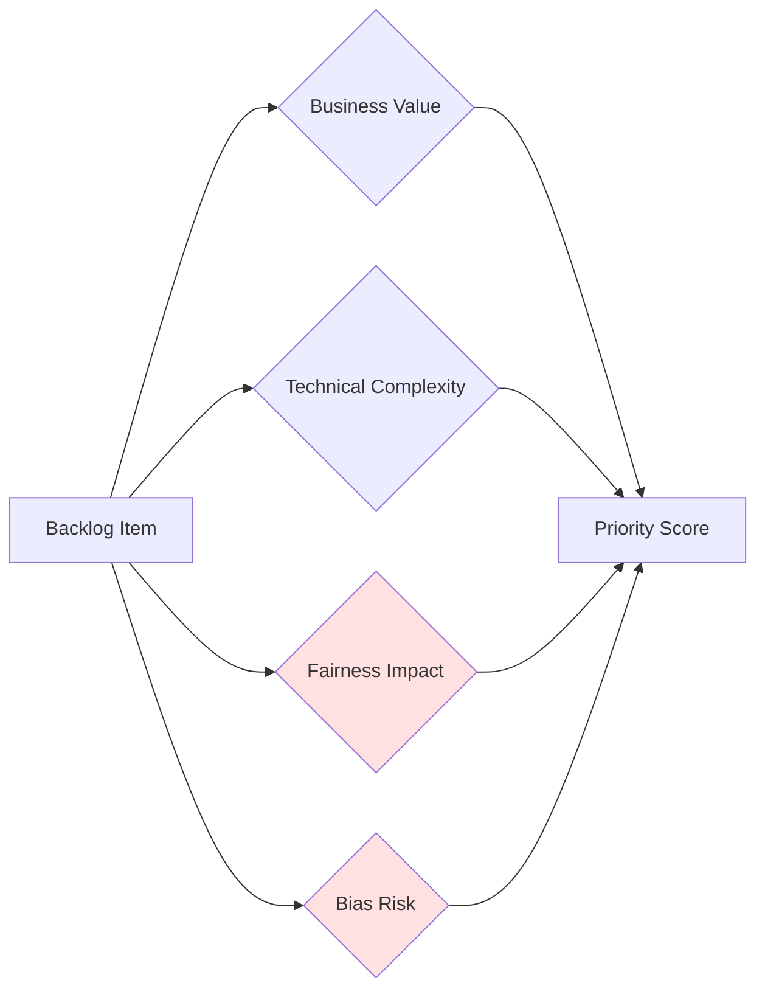

# Fair AI Scrum Toolkit
Team-level integration practices for embedding fairness into agile development.

---

## Executive Brief

### The Core Challenge
Traditional approaches treat fairness as a compliance checklist performed after development, when changes are costly and bias has already embedded itself in production systems. Teams struggle with fairness becoming "everyone's responsibility but no one's job."

### The Transformation
Fair AI Scrum embeds fairness directly into existing agile artifacts and ceremonies, making bias prevention as systematic as functional testing. Fairness requirements become part of the Definition of Done, not a separate process that teams can deprioritize under pressure.

### Critical Leadership Decisions Required

**Decision 1: Resource Commitment**
- Approve 15-30% sprint capacity allocation for fairness work during implementation (decreases to 10-15% at maturity)
- Rationale: Front-loaded investment in fairness infrastructure prevents costly late-stage rework

**Decision 2: Accountability Structure**
- Assign fairness responsibilities across Product Owner, Scrum Master, and Development Team
- Designate Fairness Champion (10-20% capacity) in each team
- Rationale: Distributed accountability prevents fairness from being siloed or ignored

**Decision 3: Success Metrics**
- Define outcome metrics: time to address bias issues, pre-deployment detection rate
- Set realistic fairness thresholds aligned with regulatory requirements and industry benchmarks
- Rationale: What gets measured gets managed

### Expected Outcomes

**Risk Reduction**:
- Bias issues surface earlier in development cycle (reducing rework costs)
- Pre-deployment detection prevents regulatory violations and reputational damage
- Documented trade-offs provide legal defensibility

**Operational Efficiency**:
- Systematic fairness checkpoints prevent expensive post-deployment fixes
- Clear acceptance criteria reduce ambiguity and rework
- Team autonomy increases as fairness practices mature

**Compliance & Reputation**:
- Proactive fairness posture strengthens regulatory relationships
- Transparent processes build stakeholder trust
- Defensible documentation for audits

### Investment Summary

**Initial Investment (Months 1-3)**:
- Team training: 16-24 hours per team member
- Process redesign: 2-3 sprints of higher fairness capacity (25-30%)
- Tooling setup: Automated fairness testing infrastructure

**Ongoing Investment (Months 4+)**:
- Reduced fairness capacity: 10-15% of sprint work
- Continuous monitoring and improvement
- Quarterly fairness audits

**Return**: Prevention of a single high-profile bias incident typically justifies the entire investment through avoided legal costs, remediation expenses, and reputational damage.

---
## Overview

The Fair AI Scrum Toolkit embeds fairness into existing Agile development methodologies, treating fairness as a core requirement rather than a specialized activity. This approach prevents bias from entering through documentation gaps and ensures systematic fairness integration throughout the development lifecycle.

### Core Principle

**Embed, Don't Add**: Modify existing Scrum artifacts and ceremonies to include fairness dimensions rather than creating parallel fairness processes that teams view as overhead.

**Why This Matters**: Parallel fairness processes consistently fail because:
- Teams view them as optional when deadlines pressure increases
- Fairness specialists become bottlenecks rather than enablers
- Separate processes create coordination overhead and delays
- Fairness considerations arrive too late to influence architecture

**The Alternative Approach**: When fairness is embedded in Definition of Done, sprint planning, and daily standups, it becomes non-negotiable—just like functional requirements and security testing.

### Key Success Patterns

Based on pilot implementations with organizations adopting Fair AI Scrum practices, teams report:

- Bias issues surfacing **2-3 sprints earlier** in development (reducing costly late-stage rework)
- **Consistent implementation** of fairness interventions when explicit role responsibilities exist
- **Higher completion rates** for fairness tasks (>90%) when explicitly planned versus ad-hoc approaches
- **Faster resolution** of identified bias issues when fairness checkpoints integrate into daily ceremonies

*Note: These patterns are observed outcomes from pilot teams and early adopters, not universal benchmarks. Your results will vary based on domain complexity, team maturity, and organizational commitment.*

---

## 1. Modified Scrum Artifacts

### 1.1 Fairness-Enhanced User Stories

**Traditional Format**:
```
As a [role], I want [functionality] so that [benefit]
```

**Enhanced Format**:
```
As a [role], I want [functionality] so that [benefit], 
ensuring [fairness goal] across [protected attributes]
```

**Why This Extension Matters**: 
- Generic fairness statements ("ensure the system is fair") provide no actionable guidance
- Specific protected attributes and measurable goals drive concrete implementation decisions
- Explicit requirements prevent fairness from being deprioritized as "nice to have"


#### SAFE Framework

User stories must specify:

- **S**pecific protected attributes (e.g., gender, race, age, disability)
- **A**ctionable fairness definition (e.g., equivalent accuracy, equal opportunity)
- **F**eature integration points (where fairness intersects with functionality)
- **E**xpected outcome measures (quantifiable fairness metrics)


#### Anti-Patterns to Avoid:

- **Too Generic**: "As a user, I want the system to be fair"
- **Too Technical**: "As a developer, I want to implement adversarial debiasing using GAN architecture"
- **Missing Attributes**: "Ensuring fairness across all groups" (which groups?)
- **No Metrics**: "Ensuring equal treatment" (how measured?)

✅ **Good Example**: "Ensuring equivalent loan approval rates (within 5%) across racial groups and gender × age intersections"

---

### 1.2 Fairness-Enhanced Definition of Done (DoD)

The Definition of Done must include specific, measurable fairness conditions that features must satisfy before being considered complete.

**Why Fairness Must Be in DoD**: If fairness criteria are optional or informal, teams will skip them under deadline pressure. DoD requirements are non-negotiable gates.

#### FAIR Framework for Acceptance Criteria

Every high-risk feature must satisfy:

- **F**airness metrics thresholds
- **A**uditing requirements
- **I**ntersectional analysis
- **R**eporting guidelines

#### Quantitative Threshold Guidelines

**For high-risk applications**, at least **80% of fairness acceptance criteria** should include quantitative thresholds:

| Fairness Metric | Typical Threshold | Application Context |
|-----------------|-------------------|---------------------|
| Demographic Parity Difference | ≤0.05 (5%) | General fairness baseline |
| Equal Opportunity Difference | ≤0.03 (3%) | High-stakes decisions (hiring, credit) |
| Equalized Odds (TPR+FPR) | Each ≤0.03 | Criminal justice, medical diagnosis |
| Calibration Error | ≤0.05 per group | Probability-based decisions |
| Intersectional Gap | ≤0.04 (4%) | Multiply-marginalized groups |

---

### 1.3 Fairness Backlog Items

Fairness work must be broken down into concrete, estimable tasks rather than vague directives.

**Why Breakdown Matters**:
- Generic fairness epics get perpetually deferred
- Concrete tasks enable accurate estimation and sprint planning
- Clear ownership prevents diffusion of responsibility

#### Task Breakdown Example

**Epic**: "Ensure fairness in candidate ranking algorithm"

**Broken Down Tasks**:

**Sprint N - Assessment & Planning** (8 points total)
- [ ] Data bias audit: Analyze training data demographics (3 points)
- [ ] Protected attribute identification: Map relevant features (2 points)
- [ ] Fairness metric selection: Choose appropriate metrics (2 points)
- [ ] Baseline measurement: Measure current fairness performance (1 point)

**Sprint N+1 - Intervention Implementation** (13 points total)
- [ ] Implement adversarial debiasing architecture (5 points)
- [ ] Create multi-component loss function (3 points)
- [ ] Develop fairness evaluation framework (3 points)
- [ ] Set up automated fairness testing in CI/CD (2 points)

**Sprint N+2 - Validation & Documentation** (5 points total)
- [ ] Intersectional performance testing (2 points)
- [ ] Create model card with fairness documentation (1 point)
- [ ] Implement fairness monitoring dashboard (2 points)

#### Backlog Prioritization Framework

Extend standard prioritization to include fairness dimensions:


**Prioritization Formula**:
```
Priority Score = (Business Value × 0.4) + (Fairness Impact × 0.3) + 
                 (Bias Risk × 0.2) + (Technical Feasibility × 0.1)
```

**Bias Risk Assessment**:
- **Critical (4)**: High-stakes decision affecting protected groups
- **High (3)**: Direct impact on demographic groups
- **Medium (2)**: Indirect impact through proxies
- **Low (1)**: Minimal demographic implications

---

## 2. Fairness Sprint Planning

### 2.1 Capacity Allocation

Explicitly reserve sprint capacity for fairness work to prevent deprioritization under pressure.

#### Recommended Allocation

| Implementation Phase | Fairness Capacity | Rationale |
|---------------------|-------------------|-----------|
| Initial Implementation (Months 1-3) | 25-30% | Building foundational fairness infrastructure |
| Active Development (Months 4-9) | 15-20% | Ongoing fairness integration and testing |
| Maintenance (Months 10+) | 10-15% | Monitoring, updates, continuous improvement |

**Why These Percentages?**
- **Front-loaded investment**: Fairness infrastructure (testing, evaluation, monitoring) requires upfront work
- **Declining curve**: As processes mature and team expertise grows, fairness requires less incremental effort
- **Never zero**: Continuous monitoring essential; new features always need fairness validation

**Important**: These are starting guidelines. Adjust based on:
- Domain risk level (healthcare/finance higher; general recommendations lower)
- Regulatory scrutiny (heavily regulated industries may need sustained 20-25%)
- Team maturity (experienced teams may need less capacity)

### Capacity Tracking

**Sprint N Planning**

Total Capacity: 40 story points
Fairness Allocation Target: 20% = 8 story points

**Fairness Tasks Planned**:
- Data bias audit: 3 points
- Fairness metric implementation: 3 points
- Intersectional evaluation: 2 points
**Total Fairness Points**: 8 points ✓ (meets 20% target)

**Sprint N Review**:
- Fairness points completed: 7/8 (88% completion)
- Action: Carry forward 1 point to Sprint N+1


### 2.2 Sprint Planning Checklist

#### Sprint Planning Fairness Integration Checklist

**Pre-Planning**
- [ ] Review fairness backlog items from previous sprint
- [ ] Check for new fairness requirements from governance body
- [ ] Review monitoring alerts and incident reports
- [ ] Confirm fairness capacity allocation (target: 15-30%)

**During Planning**
- [ ] All user stories include fairness dimensions (SAFE framework)
- [ ] Fairness acceptance criteria defined (FAIR framework)
- [ ] Intersectional considerations identified for high-risk features
- [ ] Fairness tasks broken down and estimated
- [ ] Dependencies on fairness evaluation tools identified
- [ ] Team capacity for fairness work explicitly allocated

**Story Review Questions**
For each user story, ask:
- Does this story impact different demographic groups differently?
- What protected attributes are relevant to this feature?
- What fairness metric is appropriate for this functionality?
- Are there intersectional considerations we're missing?
- What trade-offs might emerge during implementation?

**Exit Criteria**
- [ ] ≥80% of stories include explicit fairness requirements
- [ ] Fairness capacity allocation meets team target
- [ ] All high-risk stories have intersectional analysis planned
- [ ] Team consensus on fairness priorities for sprint
- [ ] Fairness champion identified and available for sprint

---

## 3. Modified Scrum Ceremonies

### 3.1 Daily Standups

**Standard Questions**:
1. What did I do yesterday?
2. What will I do today?
3. Any blockers?

**Enhanced with Fairness**:
1. What did I do yesterday? (including fairness work)
2. What will I do today? (including fairness work)
3. Any blockers? (including fairness blockers)
4. **Any fairness risks or concerns identified?**

#### Fairness-Specific Prompts

Add these rotating prompts (1-2 per week):

- "Have we tested this feature across demographic groups?"
- "Are we collecting the data needed for fairness evaluation?"
- "Have we considered how this change affects intersectional groups?"
- "Do we need to update our fairness documentation?"

#### Time Management

- Standard standup: 15 minutes
- Fairness discussion: Additional 2-3 minutes
- **Total: 17-18 minutes** (sustainable timeboxing)

**Observed Pattern**: Teams using structured fairness prompts in daily standups report addressing bias issues several days faster on average than teams relying only on end-of-sprint validation, as issues surface while developers are still working in the relevant code.

---

### 3.2 Sprint Reviews

Sprint reviews must explicitly showcase fairness achievements using disaggregated performance reports.

#### Fairness Demonstration Techniques

**1. Disaggregated Performance Tables**
```markdown
| Demographic Group | Accuracy | TPR | FPR | Selection Rate |
|-------------------|----------|-----|-----|----------------|
| Overall           | 84.2%    | 0.82| 0.08| 45.3%          |
| Male              | 84.8%    | 0.84| 0.07| 46.1%          |
| Female            | 83.5%    | 0.80| 0.09| 44.2%          |
| White             | 85.1%    | 0.83| 0.07| 47.2%          |
| Black             | 82.9%    | 0.81| 0.10| 42.8%          |
| Hispanic          | 83.7%    | 0.82| 0.08| 44.5%          |
| **Fairness Gaps** | **2.2%** |**0.04**|**0.03**|**4.4%** |
| **Target**        | **<5%**  |**<0.05**|**<0.05**|**<5%** |
| **Status**        | ✓ Pass   | ✓ Pass | ✓ Pass | ✓ Pass |
```

**2. Counterfactual Demonstrations**

Show how the system responds when only protected attributes change:
```markdown
**Candidate A**: Software Engineer, 5 years experience, BS CS
- Demographic: Male, White, Age 28
- **Predicted Score: 8.4/10**

**Candidate A' (Counterfactual)**: Identical qualifications
- Demographic: Female, Black, Age 28  
- **Predicted Score: 8.3/10** (0.1 difference - within threshold ✓)
```

**3. Intersectional Heat Maps**

Visual representation of performance across demographic intersections:
```markdown
**Intersectional Accuracy Heat Map**

                Male    Female
White           85.2%   84.1%
Black           82.5%   82.1%
Hispanic        83.9%   83.2%
Asian           86.1%   85.3%

Color Scale: Green (>84%), Yellow (82-84%), Red (<82%)
Worst Gap: 4.0% (Asian Male vs. Black Female)
Target: <5% ✓
```

**4. Real-World Impact Scenarios**

Translate metrics into stakeholder-relevant examples:
```markdown
**Impact Analysis: 1000 Candidates Processed**

- Total candidates evaluated: 1000
  - 520 Male, 480 Female
  - 450 White, 250 Black, 200 Hispanic, 100 Asian

- Selected for interview: 453 (45.3%)
  - Male: 46.1% (240/520)
  - Female: 44.2% (213/480)
  - **Gender gap: 1.9 percentage points** ✓ (target <5%)

- **Intersectional Analysis**:
  - Black women: 41.5% selection rate
  - White men: 47.2% selection rate
  - **Gap: 5.7 percentage points** (requires attention)
```

#### Sprint Review Agenda (Modified)
```
1. Product Owner: Sprint goal review (5 min)
2. Team: Functional demo (20 min)
3. **Fairness Lead: Fairness achievements demo** (10 min)
   - Disaggregated performance presentation
   - Counterfactual demonstrations
   - Intersectional analysis highlights
   - Trade-offs and limitations
4. Stakeholder feedback (10 min)
5. Next sprint planning preview (5 min)

Total: 50 minutes
```

---

### 3.3 Sprint Retrospectives

Retrospectives must extract equity learnings that general process reviews often miss.

**Why Fairness-Focused Retrospectives Matter**: Unconscious bias affects development decisions. Structured reflection surfaces patterns the team might otherwise miss.

#### Fairness-Specific Prompts

Use rotating retrospective themes:

**Theme 1: Fairness Process**
- "What fairness practices worked well this sprint?"
- "Where did fairness considerations slow us down unnecessarily?"
- "Where did we rush and compromise fairness?"

**Theme 2: Intersectionality**
- "Did we miss any important demographic intersections?"
- "Who did we forget to consider in our analysis?"
- "What assumptions did we make about 'typical' users?"

**Theme 3: Trade-offs**
- "What fairness-performance trade-offs emerged?"
- "How did we make trade-off decisions?"
- "Were those decisions documented and justified?"

**Theme 4: Learning**
- "What surprised us about fairness this sprint?"
- "What fairness expertise gaps do we have?"
- "What would we do differently next sprint?"

#### Intersectionality Matrix Exercise

Structured exercise to identify blind spots:

**Intersectionality Matrix Exercise** (15 minutes)

Step 1: List protected attributes relevant to your system
  Example: [Gender, Race, Age, Disability, Socioeconomic Status]

Step 2: Create intersection grid
  Gender × Race, Gender × Age, Race × Disability, etc.

Step 3: For each intersection, ask:
  - Did we test performance for this group?
  - 
  - Do we have sufficient data for this group?
  - Are there unique challenges for this group?
  - Did anyone on the team advocate for this group?

Step 4: Identify gaps
  - Which intersections did we neglect?
  - Why did we neglect them?
  - How do we address them next sprint?


#### Retrospective Action Items Template

**Sprint N Retrospective - Fairness Actions**

**What Went Well**:
- Counterfactual testing revealed no gender bias ✓
- Team proactively raised fairness question in standup

**What Needs Improvement**:
- Missed disability intersection in initial analysis
- Fairness documentation delayed until end of sprint

**Action Items**:
1. **Add disability to default intersection list** 
   - Owner: Fairness Champion
   - Due: Before Sprint N+1 planning

2. **Move fairness documentation to mid-sprint checkpoint**
   - Owner: Scrum Master
   - Due: Update sprint template by next Monday

3. **Schedule intersectionality training**
   - Owner: Tech Lead
   - Due: Book session within 2 weeks


### 3.4 Mid-Sprint Checkpoints

Additional verification points detect bias issues earlier, reducing rework costs.

**Why Mid-Sprint Checkpoints Matter**: Fairness issues detected mid-sprint can be addressed immediately while developers are still working in the relevant code. Issues found at sprint review require costly context-switching and rework.

**Cost-Benefit Analysis**: A mid-sprint checkpoint adds 30-60 minutes but can prevent days of rework if issues surface earlier.


#### Data Validation Checkpoint (End of Week 1)

**Data Validation Fairness Checkpoint**

Trigger: After data collection/preparation, before model training

Checklist:
- [ ] Demographic distribution analyzed
- [ ] Protected attribute representation assessed (minimum 100 samples per group)
- [ ] Proxy variables identified and documented
- [ ] Historical bias patterns examined
- [ ] Data collection methodology reviewed for bias
- [ ] Intersectional representation confirmed

Gate Criteria:
- All protected groups have sufficient representation
- Known biases documented in Fairness Decision Record
- Mitigation strategy defined for identified biases

**Decision**: Proceed to training / Collect more data / Adjust approach


#### Model Evaluation Checkpoint (Mid-Sprint)

**Model Evaluation Fairness Checkpoint**

Trigger: After initial model training, before integration

Checklist:
- [ ] Disaggregated performance metrics calculated
- [ ] Fairness metrics meet DoD thresholds
- [ ] Intersectional analysis completed
- [ ] Counterfactual testing performed
- [ ] Protected attribute predictability assessed (DL models: <60%)
- [ ] Trade-offs identified and documented

Gate Criteria:
- All fairness acceptance criteria met OR
- Trade-offs explicitly documented and approved by governance

**Decision**: Proceed to integration / Retrain with fairness constraints / Escalate to governance


**Observed Pattern**: Pilot teams implementing mid-sprint checkpoints report identifying the majority of significant bias issues before deployment, compared to catching issues in production monitoring when remediation is far more expensive.

---

## 4. Intersectionality Integration


### 4.1 Why Intersectionality Matters

Traditional fairness approaches assess protected attributes independently, missing critical disparities at their intersections.

**Example**: A hiring algorithm might show:
- Gender fairness: ✓ (Male 45%, Female 44% selection rate)
- Race fairness: ✓ (White 46%, Black 43% selection rate)

**But intersectional analysis reveals**:
- White men: 47%
- White women: 45%
- Black men: 44%
- **Black women: 38%** ❌ (9 percentage point gap!)

Crenshaw's foundational work emphasizes that discrimination against multiply-marginalized groups cannot be understood by examining separate attributes alone.

### 4.2 Intersectional User Stories

**Standard Story (Insufficient)**:
```
Ensuring equivalent accuracy across gender and race
```

**Intersectional Story (Better)**:
```
Ensuring equivalent accuracy across gender, race, AND their intersections 
(gender × race combinations), with special attention to multiply-marginalized 
groups (e.g., women of color, older women with disabilities)
```
**Why This Matters**: The enhanced story drives teams to:
- Test gender × race combinations, not just gender and race separately
- Prioritize multiply-marginalized groups in analysis
- Collect sufficient data for intersectional validation

#### Complete Example

**Original User Story**:
```
As a recruiting manager, I want candidates ranked by predicted job fit 
so that I can efficiently identify top prospects, ensuring equivalent 
ranking accuracy across gender and race.
```

**Revised with Intersectionality**:
```
As a recruiting manager, I want candidates ranked by predicted job fit 
so that I can efficiently identify top prospects, ensuring equivalent 
ranking accuracy across gender, race, age, disability status, AND their 
intersections (particularly gender × race, age × disability), with 
performance gaps for multiply-marginalized groups (e.g., older women, 
women of color, people with disabilities from underrepresented racial groups) 
not exceeding 4%.
```


### 4.3 Intersectional Definition of Done

Extend DoD to include disaggregated testing across intersectional subgroups:

**Intersectional Analysis Requirements**:
- [ ] Performance reported for top 5 intersections by impact:
      1. Gender × Race
      2. Age × Disability
      3. Gender × Socioeconomic Status
      4. Race × First-Generation Status
      5. Gender × Race × Age (triple intersection sample)

- [ ] Worst-performing intersection identified and analyzed

- [ ] Performance gap relative to best-performing intersection ≤0.04

- [ ] Special review process for multiply-marginalized groups documented

- [ ] Mitigation strategy for intersectional disparities defined

**Why Top 5 Limit?** Testing every possible intersection quickly becomes infeasible. Prioritize intersections based on:
- Historical marginalization patterns
- Sufficient sample sizes (typically >100)
- Stakeholder input from affected communities
- Domain context (healthcare vs. finance have different critical intersections)


### 4.4 Practical Implementation

#### Step 1: Identify Key Intersections

Not all intersections are equally important. Prioritize based on:

1. **Impact Severity**: Historically marginalized combinations
2. **Sample Size**: Sufficient data for reliable analysis (>100 samples)
3. **Stakeholder Input**: Affected communities highlight concerns
4. **Domain Context**: Recruitment vs. lending vs. healthcare have different critical intersections

#### Step 2: Test Disaggregated Performance

#### Step 3: Document Findings


---

## 5. Role Responsibilities

Fairness cannot be siloed to a single specialist. Accountability must distribute across the entire Scrum team.

### 5.1 Product Owner

**Fairness Responsibilities**:
- Define fairness requirements in consultation with stakeholders
- Prioritize fairness backlog items alongside functional features
- Accept/reject stories based on fairness acceptance criteria
- Balance business value with fairness impact in prioritization
- Represent user diversity in backlog grooming

**Key Activities**:
- Stakeholder interviews including affected communities
- Fairness requirement specification
- Trade-off decisions when fairness conflicts with features
- Communication of fairness value to business

**Time Allocation**: 15-20% of PO capacity

**Rationale**: Product Owners already spend 15-20% of time on non-functional requirements (security, performance). Fairness deserves equivalent attention as a quality attribute.

---

### 5.2 Scrum Master

**Fairness Responsibilities**:
- Facilitate fairness integration into ceremonies
- Ensure fairness capacity allocation in sprint planning
- Remove fairness-related blockers
- Coach team on fairness practices
- Track fairness metrics and completion rates

**Key Activities**:
- Timebox fairness discussions in ceremonies
- Maintain fairness backlogs and burndown
- Escalate fairness impediments
- Coordinate with fairness champions

**Time Allocation**: 10-15% of SM capacity

**Rationale**: Scrum Masters already facilitate process adherence. Adding fairness checkpoints is process overhead comparable to quality gates.

---

### 5.3 Development Team

**Fairness Responsibilities**:
- Implement fairness requirements in user stories
- Conduct fairness testing and evaluation
- Document fairness decisions and trade-offs
- Raise fairness concerns proactively
- Participate in fairness retrospectives

**Individual Developer Activities**:
- Write fairness tests alongside unit tests
- Implement architecture-specific fairness interventions
- Create disaggregated performance reports
- Update fairness documentation

**Time Allocation**: 15-30% of developer capacity (varies by implementation phase)

**Rationale**: See Section 2.1 capacity allocation rationale—front-loaded infrastructure work decreases over time as fairness becomes routine.

---

### 5.4 Fairness Champion (Embedded Role)

**Purpose**: Part-time role (10-20% capacity) embedded in each team to provide fairness expertise without creating silos.

**Fairness Champion Responsibilities**:
- Be the team's fairness point of contact
- Review user stories for fairness dimensions
- Facilitate fairness discussions in ceremonies
- Liaise with central Fairness CoE
- Mentor team members on fairness practices
- Maintain team's fairness documentation

**Ideal Candidate**:
- Senior engineer with fairness training
- Strong communication skills
- Trusted by team members
- Passionate about equity

**Why Not a Full-Time Role?** Full-time fairness specialists become bottlenecks and enable the rest of the team to disengage. Part-time embedded champions maintain team ownership while providing expertise.

---

## 6. Measurement and Tracking

"What gets measured gets managed." Without metrics, fairness becomes performative rather than substantive.


### 6.1 Process Metrics

Track implementation quality to ensure fairness practices are actually being executed:

```markdown
**Sprint Fairness Scorecard**

**Sprint**: N
**Team**: Candidate Ranking Team
**Date**: 2024-11-15

| Metric | Target | Actual | Status |
|--------|--------|--------|--------|
| % of stories with fairness requirements | >80% | 87% | ✓ |
| % of DoD with fairness criteria | >90% | 95% | ✓ |
| Fairness capacity allocation | 20% | 22% | ✓ |
| Fairness task completion rate | >90% | 88% | ~ |
| Time to address bias issues | <15 days | 11 days | ✓ |

**Overall Score**: 4.5/5 ⭐⭐⭐⭐☆

**Notes**: 
- Task completion slightly below target due to complexity underestimation
- Action: Improve estimation for fairness tasks next sprint
```

### 6.2 Outcome Metrics

Track real-world fairness improvements, not just process compliance:

```markdown
**Fairness Outcome Metrics**

| Metric | Baseline | Current | Target | Trend |
|--------|----------|---------|--------|-------|
| Demographic parity difference | 0.12 | 0.04 | <0.05 | ↗️ Improving |
| Equal opportunity difference | 0.08 | 0.03 | <0.03 | ✓ Met |
| Intersectional gap (worst) | 0.15 | 0.06 | <0.04 | ↗️ Improving |
| Pre-deployment detection rate | 35% | 76% | >75% | ✓ Met |
| Post-deployment complaints | 24/month | 4/month | <10/month | ✓ Met |
```
**Why Both Process and Outcome Metrics?**
- **Process metrics** ensure the team is doing the work
- **Outcome metrics** prove the work is effective
- Teams can have high process compliance but poor outcomes if interventions are ineffective

### 6.3 Efficiency Metrics

Track process efficiency:

- **Time to address bias issues**: Average days from detection to remediation
- **Bias issues surfaced earlier**: Sprint when bias detected (earlier = better)
- **Rework cost**: Story points spent on fairness rework after initial implementation
- **Team satisfaction**: Survey score on fairness integration process

**Target**: These should improve over time as fairness becomes routine.


## 7. Common Challenges and Solutions

### Challenge 1: Overloading Ceremonies

**Symptom**: Meetings run over time, team fatigue, resistance to fairness discussions

**Root Cause**: Adding new agenda items without removing or streamlining existing ones

**Solution**:
- Maintain timeboxes through focused facilitation
- Rotate fairness discussion topics (don't cover everything every time)
- Use asynchronous communication for detailed fairness analysis
- Embed fairness in existing agenda items rather than adding separate sections

**Example**:
❌ Bad: Add 15-minute "fairness discussion" to every standup
✅ Good: Add single rotating prompt that takes 2 minutes

---

### Challenge 2: Metric Overload

**Symptom**: Teams track too many fairness metrics, losing focus on what matters

**Root Cause**: Attempting to measure everything rather than prioritizing critical metrics

**Solution**:
- Prioritize 3-5 core metrics based on domain and risk
- Use composite scores for executive dashboards
- Detailed metrics available on-demand, not always visible
- Align metrics with DoD and regulatory requirements

**Recommended Core Metrics**:
1. Demographic parity difference (overall fairness baseline)
2. Equal opportunity difference (qualified candidates)
3. Intersectional gap (multiply-marginalized groups)
4. [Domain-specific metric, e.g., calibration for probability-based decisions]

---

### Challenge 3: Unrealistic Fairness Thresholds

**Symptom**: Teams consistently fail fairness gates, leading to demoralization and gate-bypassing

**Root Cause**: Setting aspirational thresholds without considering technical feasibility or baseline performance

**Solution**:
- Set thresholds based on:
  * Regulatory requirements (legal floor—never go below)
  * Industry benchmarks (what's achievable in your domain)
  * Baseline performance (current state—set improvement trajectory)
  * Technical feasibility (perfection often impossible; document trade-offs)
- Use tiered thresholds: Must-have vs. Nice-to-have
- Document trade-offs when perfect fairness is unattainable
- Focus on continuous improvement, not perfection

**Example Tiered Thresholds**:
```markdown
**Demographic Parity Difference**:
- Must-have (gate): ≤0.10 (regulatory floor from 80% rule)
- Target (goal): ≤0.05 (industry best practice)
- Aspirational: ≤0.02 (research frontier, may be unachievable)
```

### Challenge 4: Fairness-Performance Trade-offs

**Symptom**: Improving fairness reduces model accuracy; stakeholder resistance to deployment

**Root Cause**: Fairness and accuracy sometimes conflict, requiring explicit prioritization

**Solution**:
- Make trade-offs explicit through Fairness Decision Records (see Organizational Integration Toolkit)
- Quantify both sides: "2% accuracy loss for 9% fairness improvement"
- Escalate to governance body with clear decision authority (RACI framework)
- Frame fairness as risk management, not just ethics
- Consider legal/regulatory implications of unfair high-performing model

**Decision Framework**:
1. **Regulatory requirement?** → Fairness required, accept performance loss
2. **High business impact?** → Escalate to AI Ethics Committee
3. **Low business impact?** → Prioritize fairness improvement
4. **Committee decides performance priority?** → Document risk acceptance + implement compensating controls (increased monitoring, human review, appeal process)

---

### Challenge 5: Technical Expertise Gaps

**Symptom**: Team unsure how to implement fairness interventions, leading to avoidance

**Root Cause**: Insufficient training on fairness techniques and architecture-specific patterns

**Solution**:
- Invest in fairness training (initial and ongoing)
- Leverage Central Fairness CoE for specialized support (if available)
- Use advanced architecture guidance for technical patterns (separate technical cookbook available)
- Start with simpler interventions (post-processing thresholds) before complex ones (adversarial training)
- Build internal knowledge base of fairness patterns

**Recommended Training Path**:
1. **All team members** (4 hours): Fairness fundamentals, bias types, organizational context
2. **Developers** (8 hours): Fairness metrics, testing, basic interventions
3. **ML Engineers** (16 hours): Architecture-specific interventions, advanced techniques
4. **Fairness Champions** (24 hours): Deep technical training, governance, stakeholder management

---

## 8. Success Indicators

### Strategic Outcome
Fair AI Scrum transforms fairness from reactive compliance (post-deployment audits, incident response) to proactive development practice (bias prevention, systematic validation).

### How to Measure Success

#### Early Indicators (Months 1-3) - Process Adoption

✓ >80% of user stories include explicit fairness requirements  
✓ Fairness capacity consistently allocated in sprint planning  
✓ Team members proactively raise fairness concerns in standups  
✓ Fairness Decision Records created for major decisions  

**Business Value**: Establishes foundation for systematic fairness work; signals organizational commitment

#### Medium-Term Indicators (Months 4-9) - Process Maturity

✓ Bias issues surfaced 2-3 sprints earlier than baseline  
✓ >90% fairness task completion rate  
✓ Disaggregated performance routinely presented in sprint reviews  
✓ Fairness documentation up-to-date and comprehensive  

**Business Value**: Reduces rework costs; builds stakeholder confidence; demonstrates accountability

#### Long-Term Indicators (Months 10+) - Operational Excellence

✓ >75% of bias issues detected pre-deployment  
✓ <15 day average resolution time for fairness issues  
✓ Team operates fairness practices autonomously  
✓ Fairness integrated seamlessly, not viewed as overhead  

**Business Value**: Minimizes regulatory risk; protects brand reputation; enables faster feature deployment with confidence

---


## 9. Next Steps

### For Teams New to Fair AI Scrum

**Week 1-2: Foundation**
1. Review this toolkit with full team (2-hour workshop)
2. Customize user story template for your domain context
3. Define initial fairness capacity allocation (recommend starting with 25%)
4. Identify and assign team fairness champion

**Week 3-4: Pilot**
1. Pilot fairness-enhanced user stories for 1-2 features
2. Add fairness prompts to daily standups
3. Create first Fairness Decision Record (see Organizational Integration Toolkit)
4. Conduct fairness-focused retrospective

**Month 2-3: Scale**
1. Extend fairness requirements to all user stories
2. Implement mid-sprint fairness checkpoints
3. Build automated fairness testing (if ML components exist)
4. Begin measuring process and outcome metrics

**Month 4+: Optimize**
1. Reduce fairness capacity as practices mature
2. Refine thresholds based on baseline performance
3. Share learnings with other teams
4. Contribute to organizational fairness knowledge base


### Related Playbook Components

- **Governance**: Organizational Integration Toolkit - Establish decision authority and escalation paths
- **Technical Details**: Advanced Architecture Cookbook - Implement architecture-specific fairness interventions
- **Templates**: Ready-to-use artifacts for user stories, DoD, FDRs
- **Validation**: Validation Framework - Comprehensive evaluation methodology

---
