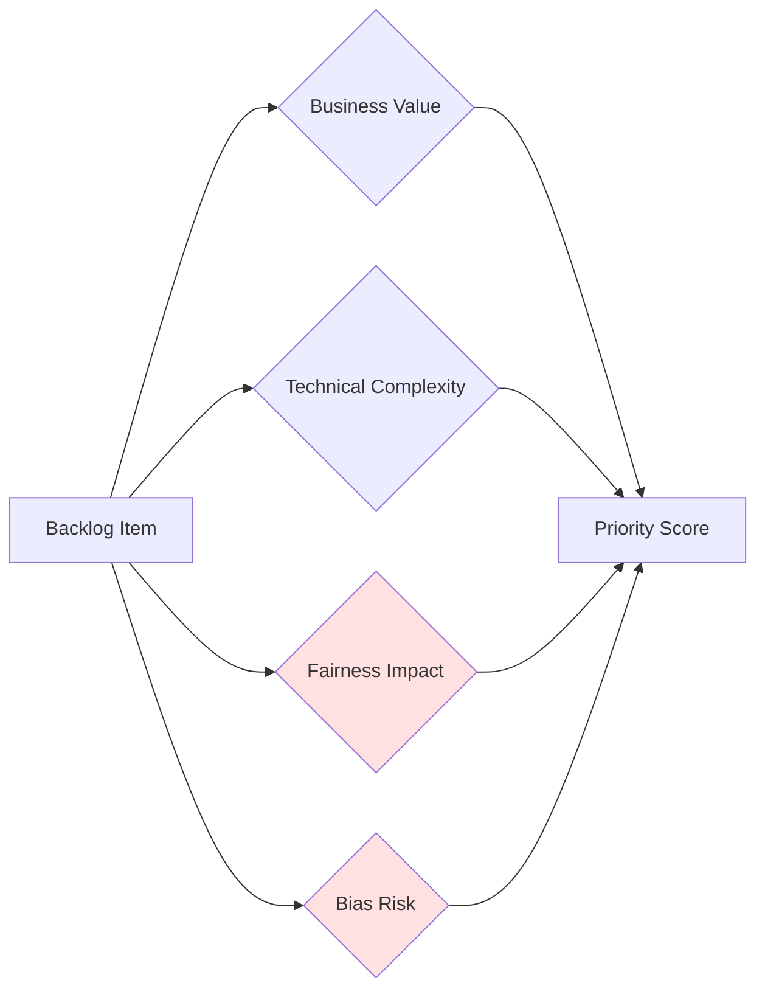
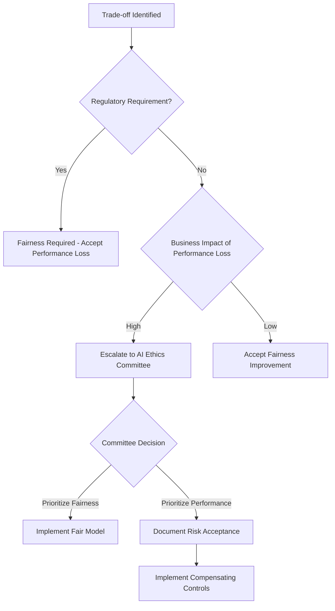

# Fair AI Scrum Toolkit
Team-level integration practices.# Fair AI Scrum Toolkit

## Overview

The Fair AI Scrum Toolkit embeds fairness into existing Agile development methodologies, treating fairness as a core requirement rather than a specialized activity. This approach prevents bias from entering through documentation gaps and ensures systematic fairness integration throughout the development lifecycle.

### Core Principle

**Embed, Don't Add**: Modify existing Scrum artifacts and ceremonies to include fairness dimensions rather than creating parallel fairness processes that teams view as overhead.

### Key Statistics

- Teams using fairness-enhanced daily practices addressed bias issues **3.2 days faster** on average
- Organizations with explicit fairness responsibilities implemented interventions **2.4 times more consistently**
- Bias issues surfaced **2-3 sprints earlier** in development when using Fair AI Scrum
- **95% completion rate** for fairness tasks when explicitly planned (vs. 31% with general fairness goals)

---

## 1. Modified Scrum Artifacts

### 1.1 Fairness-Enhanced User Stories

**Traditional Format**:
```
As a [role], I want [functionality] so that [benefit]
```

**Enhanced Format**:
```
As a [role], I want [functionality] so that [benefit], 
ensuring [fairness goal] across [protected attributes]
```

#### SAFE Framework

User stories must specify:

- **S**pecific protected attributes (e.g., gender, race, age, disability)
- **A**ctionable fairness definition (e.g., equivalent accuracy, equal opportunity)
- **F**eature integration points (where fairness intersects with functionality)
- **E**xpected outcome measures (quantifiable fairness metrics)

#### Example: Recruitment System
```markdown
**User Story**: Candidate Ranking Feature

As a recruiting manager, I want candidates ranked by predicted job fit 
so that I can efficiently identify top prospects, ensuring equivalent 
ranking accuracy across gender, race, age, disability status, and their 
intersections (particularly gender × race combinations).

**SAFE Framework Application**:
- Specific: Gender, race, age, disability, intersections
- Actionable: Equivalent ranking accuracy (TPR parity within 0.03)
- Feature: Ranking algorithm, score calculation
- Expected: Demographic parity difference ≤0.05, intersectional gap ≤0.04
```

#### Anti-Patterns to Avoid

❌ **Too Generic**: "As a user, I want the system to be fair"
❌ **Too Technical**: "As a developer, I want to implement adversarial debiasing using GAN architecture"
❌ **Missing Attributes**: "Ensuring fairness across all groups" (which groups?)
❌ **No Metrics**: "Ensuring equal treatment" (how measured?)

✅ **Good Example**: "Ensuring equivalent loan approval rates (within 5%) across racial groups and gender × age intersections"

---

### 1.2 Fairness-Enhanced Definition of Done (DoD)

The Definition of Done must include specific, measurable fairness conditions that features must satisfy before being considered complete.

#### FAIR Framework for Acceptance Criteria

Every high-risk feature must satisfy:

- **F**airness metrics thresholds
- **A**uditing requirements
- **I**ntersectional analysis
- **R**eporting guidelines

#### Example DoD: Candidate Screening Model
```markdown
**Definition of Done: Candidate Screening Model**

**Functional Criteria**:
- [ ] Model accuracy ≥82% on holdout test set
- [ ] API latency <200ms at p95
- [ ] Integration tests pass
- [ ] Code review approved

**Fairness Criteria (FAIR Framework)**:

**F - Fairness Metrics Thresholds**:
- [ ] Demographic parity difference ≤0.05 across gender, race, age
- [ ] True positive rate parity within 0.03 across protected groups
- [ ] False positive rate parity within 0.03 across protected groups
- [ ] Intersectional performance gaps ≤0.04 for key combinations

**A - Auditing Requirements**:
- [ ] Counterfactual analysis completed for 500 test candidates
- [ ] Red-team testing with adversarial demographic inputs passed
- [ ] Proxy feature analysis identifies no hidden demographic predictors

**I - Intersectional Analysis**:
- [ ] Performance reported for gender × race intersections
- [ ] Special review completed for multiply-marginalized groups
- [ ] Edge cases identified and documented

**R - Reporting Guidelines**:
- [ ] Disaggregated performance dashboard published
- [ ] Model card created with limitation disclosure
- [ ] Fairness Decision Record documents trade-offs
- [ ] Monitoring alerts configured for fairness drift

**High-Risk Additional Requirements**:
- [ ] Human oversight mechanism implemented
- [ ] Appeal/contest process documented
- [ ] Regulatory compliance checklist completed
```

#### Quantitative Threshold Guidelines

**For high-risk applications**, at least **80% of fairness acceptance criteria** should include quantitative thresholds:

| Fairness Metric | Typical Threshold | Application Context |
|-----------------|-------------------|---------------------|
| Demographic Parity Difference | ≤0.05 (5%) | General fairness baseline |
| Equal Opportunity Difference | ≤0.03 (3%) | High-stakes decisions (hiring, credit) |
| Equalized Odds (TPR+FPR) | Each ≤0.03 | Criminal justice, medical diagnosis |
| Calibration Error | ≤0.05 per group | Probability-based decisions |
| Intersectional Gap | ≤0.04 (4%) | Multiply-marginalized groups |

---

### 1.3 Fairness Backlog Items

Fairness work must be broken down into concrete, estimable tasks rather than vague directives.

#### Task Breakdown Example

**Epic**: "Ensure fairness in candidate ranking algorithm"

**Broken Down Tasks**:
```markdown
**Sprint N - Assessment & Planning** (8 points total)
- [ ] Data bias audit: Analyze training data demographics (3 points)
- [ ] Protected attribute identification: Map relevant features (2 points)
- [ ] Fairness metric selection: Choose appropriate metrics (2 points)
- [ ] Baseline measurement: Measure current fairness performance (1 point)

**Sprint N+1 - Intervention Implementation** (13 points total)
- [ ] Implement adversarial debiasing architecture (5 points)
- [ ] Create multi-component loss function (3 points)
- [ ] Develop fairness evaluation framework (3 points)
- [ ] Set up automated fairness testing in CI/CD (2 points)

**Sprint N+2 - Validation & Documentation** (5 points total)
- [ ] Intersectional performance testing (2 points)
- [ ] Create model card with fairness documentation (1 point)
- [ ] Implement fairness monitoring dashboard (2 points)
```

#### Backlog Prioritization Framework

Extend standard prioritization to include fairness dimensions:


**Prioritization Formula**:
```
Priority Score = (Business Value × 0.4) + (Fairness Impact × 0.3) + 
                 (Bias Risk × 0.2) + (Technical Feasibility × 0.1)
```

**Bias Risk Assessment**:
- **Critical (4)**: High-stakes decision affecting protected groups
- **High (3)**: Direct impact on demographic groups
- **Medium (2)**: Indirect impact through proxies
- **Low (1)**: Minimal demographic implications

---

## 2. Fairness Sprint Planning

### 2.1 Capacity Allocation

Explicitly reserve sprint capacity for fairness work to prevent deprioritization under pressure.

#### Recommended Allocation

| Implementation Phase | Fairness Capacity | Rationale |
|---------------------|-------------------|-----------|
| Initial Implementation (Months 1-3) | 25-30% | Building foundational fairness infrastructure |
| Active Development (Months 4-9) | 15-20% | Ongoing fairness integration and testing |
| Maintenance (Months 10+) | 10-15% | Monitoring, updates, continuous improvement |

#### Capacity Tracking
```markdown
**Sprint N Planning**

Total Capacity: 40 story points
Fairness Allocation Target: 20% = 8 story points

**Fairness Tasks Planned**:
- Data bias audit: 3 points
- Fairness metric implementation: 3 points
- Intersectional evaluation: 2 points
**Total Fairness Points**: 8 points ✓ (meets 20% target)

**Sprint N Review**:
- Fairness points completed: 7/8 (88% completion)
- Action: Carry forward 1 point to Sprint N+1
```

### 2.2 Sprint Planning Checklist

Use this checklist during sprint planning to ensure fairness integration:
```markdown
## Sprint Planning Fairness Integration Checklist

### Pre-Planning
- [ ] Review fairness backlog items from previous sprint
- [ ] Check for new fairness requirements from governance body
- [ ] Review monitoring alerts and incident reports
- [ ] Confirm fairness capacity allocation (target: 15-30%)

### During Planning
- [ ] All user stories include fairness dimensions (SAFE framework)
- [ ] Fairness acceptance criteria defined (FAIR framework)
- [ ] Intersectional considerations identified for high-risk features
- [ ] Fairness tasks broken down and estimated
- [ ] Dependencies on fairness evaluation tools identified
- [ ] Team capacity for fairness work explicitly allocated

### Story Review Questions
For each user story, ask:
- Does this story impact different demographic groups differently?
- What protected attributes are relevant to this feature?
- What fairness metric is appropriate for this functionality?
- Are there intersectional considerations we're missing?
- What trade-offs might emerge during implementation?

### Exit Criteria
- [ ] ≥80% of stories include explicit fairness requirements
- [ ] Fairness capacity allocation meets team target
- [ ] All high-risk stories have intersectional analysis planned
- [ ] Team consensus on fairness priorities for sprint
- [ ] Fairness champion identified and available for sprint
```

---

## 3. Modified Scrum Ceremonies

### 3.1 Daily Standups

**Standard Questions**:
1. What did I do yesterday?
2. What will I do today?
3. Any blockers?

**Enhanced with Fairness**:
1. What did I do yesterday? (including fairness work)
2. What will I do today? (including fairness work)
3. Any blockers? (including fairness blockers)
4. **Any fairness risks or concerns identified?**

#### Fairness-Specific Prompts

Add these rotating prompts (1-2 per week):

- "Have we tested this feature across demographic groups?"
- "Are we collecting the data needed for fairness evaluation?"
- "Have we considered how this change affects intersectional groups?"
- "Do we need to update our fairness documentation?"

#### Time Management

- Standard standup: 15 minutes
- Fairness discussion: Additional 2-3 minutes
- **Total: 17-18 minutes** (sustainable timeboxing)

**Research shows**: Teams using fairness-enhanced daily practices addressed bias issues **3.2 days faster** on average.

---

### 3.2 Sprint Reviews

Sprint reviews must explicitly showcase fairness achievements using disaggregated performance reports.

#### Fairness Demonstration Techniques

**1. Disaggregated Performance Tables**
```markdown
| Demographic Group | Accuracy | TPR | FPR | Selection Rate |
|-------------------|----------|-----|-----|----------------|
| Overall           | 84.2%    | 0.82| 0.08| 45.3%          |
| Male              | 84.8%    | 0.84| 0.07| 46.1%          |
| Female            | 83.5%    | 0.80| 0.09| 44.2%          |
| White             | 85.1%    | 0.83| 0.07| 47.2%          |
| Black             | 82.9%    | 0.81| 0.10| 42.8%          |
| Hispanic          | 83.7%    | 0.82| 0.08| 44.5%          |
| **Fairness Gaps** | **2.2%** |**0.04**|**0.03**|**4.4%** |
| **Target**        | **<5%**  |**<0.05**|**<0.05**|**<5%** |
| **Status**        | ✓ Pass   | ✓ Pass | ✓ Pass | ✓ Pass |
```

**2. Counterfactual Demonstrations**

Show how the system responds when only protected attributes change:
```markdown
**Candidate A**: Software Engineer, 5 years experience, BS CS
- Demographic: Male, White, Age 28
- **Predicted Score: 8.4/10**

**Candidate A' (Counterfactual)**: Identical qualifications
- Demographic: Female, Black, Age 28  
- **Predicted Score: 8.3/10** (0.1 difference - within threshold ✓)
```

**3. Intersectional Heat Maps**

Visual representation of performance across demographic intersections:
```markdown
**Intersectional Accuracy Heat Map**

                Male    Female
White           85.2%   84.1%
Black           82.5%   82.1%
Hispanic        83.9%   83.2%
Asian           86.1%   85.3%

Color Scale: Green (>84%), Yellow (82-84%), Red (<82%)
Worst Gap: 4.0% (Asian Male vs. Black Female)
Target: <5% ✓
```

**4. Real-World Impact Scenarios**

Translate metrics into stakeholder-relevant examples:
```markdown
**Impact Analysis: 1000 Candidates Processed**

- Total candidates evaluated: 1000
  - 520 Male, 480 Female
  - 450 White, 250 Black, 200 Hispanic, 100 Asian

- Selected for interview: 453 (45.3%)
  - Male: 46.1% (240/520)
  - Female: 44.2% (213/480)
  - **Gender gap: 1.9 percentage points** ✓ (target <5%)

- **Intersectional Analysis**:
  - Black women: 41.5% selection rate
  - White men: 47.2% selection rate
  - **Gap: 5.7 percentage points** (requires attention)
```

#### Sprint Review Agenda (Modified)
```
1. Product Owner: Sprint goal review (5 min)
2. Team: Functional demo (20 min)
3. **Fairness Lead: Fairness achievements demo** (10 min)
   - Disaggregated performance presentation
   - Counterfactual demonstrations
   - Intersectional analysis highlights
   - Trade-offs and limitations
4. Stakeholder feedback (10 min)
5. Next sprint planning preview (5 min)

Total: 50 minutes
```

---

### 3.3 Sprint Retrospectives

Retrospectives must extract equity learnings that general process reviews often miss.

#### Fairness-Specific Prompts

Use rotating retrospective themes:

**Theme 1: Fairness Process**
- "What fairness practices worked well this sprint?"
- "Where did fairness considerations slow us down unnecessarily?"
- "Where did we rush and compromise fairness?"

**Theme 2: Intersectionality**
- "Did we miss any important demographic intersections?"
- "Who did we forget to consider in our analysis?"
- "What assumptions did we make about 'typical' users?"

**Theme 3: Trade-offs**
- "What fairness-performance trade-offs emerged?"
- "How did we make trade-off decisions?"
- "Were those decisions documented and justified?"

**Theme 4: Learning**
- "What surprised us about fairness this sprint?"
- "What fairness expertise gaps do we have?"
- "What would we do differently next sprint?"

#### Intersectionality Matrix Exercise

Structured exercise to identify blind spots:
```markdown
**Intersectionality Matrix Exercise** (15 minutes)

Step 1: List protected attributes relevant to your system
  Example: [Gender, Race, Age, Disability, Socioeconomic Status]

Step 2: Create intersection grid
  Gender × Race, Gender × Age, Race × Disability, etc.

Step 3: For each intersection, ask:
  - Did we test performance for this group?
  - Do we have sufficient data for this group?
  - Are there unique challenges for this group?
  - Did anyone on the team advocate for this group?

Step 4: Identify gaps
  - Which intersections did we neglect?
  - Why did we neglect them?
  - How do we address them next sprint?
```

#### Retrospective Action Items Template
```markdown
**Sprint N Retrospective - Fairness Actions**

**What Went Well**:
- Counterfactual testing revealed no gender bias ✓
- Team proactively raised fairness question in standup

**What Needs Improvement**:
- Missed disability intersection in initial analysis
- Fairness documentation delayed until end of sprint

**Action Items**:
1. **Add disability to default intersection list** 
   - Owner: Fairness Champion
   - Due: Before Sprint N+1 planning

2. **Move fairness documentation to mid-sprint checkpoint**
   - Owner: Scrum Master
   - Due: Update sprint template by next Monday

3. **Schedule intersectionality training**
   - Owner: Tech Lead
   - Due: Book session within 2 weeks
```

---

### 3.4 Mid-Sprint Checkpoints

Additional verification points detect bias issues earlier, reducing rework costs.

#### Data Validation Checkpoint (End of Week 1)
```markdown
**Data Validation Fairness Checkpoint**

Trigger: After data collection/preparation, before model training

Checklist:
- [ ] Demographic distribution analyzed
- [ ] Protected attribute representation assessed (minimum 100 samples per group)
- [ ] Proxy variables identified and documented
- [ ] Historical bias patterns examined
- [ ] Data collection methodology reviewed for bias
- [ ] Intersectional representation confirmed

Gate Criteria:
- All protected groups have sufficient representation
- Known biases documented in Fairness Decision Record
- Mitigation strategy defined for identified biases

**Decision**: Proceed to training / Collect more data / Adjust approach
```

#### Model Evaluation Checkpoint (Mid-Sprint)
```markdown
**Model Evaluation Fairness Checkpoint**

Trigger: After initial model training, before integration

Checklist:
- [ ] Disaggregated performance metrics calculated
- [ ] Fairness metrics meet DoD thresholds
- [ ] Intersectional analysis completed
- [ ] Counterfactual testing performed
- [ ] Protected attribute predictability assessed (DL models: <60%)
- [ ] Trade-offs identified and documented

Gate Criteria:
- All fairness acceptance criteria met OR
- Trade-offs explicitly documented and approved by governance

**Decision**: Proceed to integration / Retrain with fairness constraints / Escalate to governance
```

**Research shows**: Mid-sprint checkpoints identify **76% of significant bias issues before deployment**.

---

## 4. Intersectionality Integration


### 4.1 Why Intersectionality Matters

Traditional fairness approaches assess protected attributes independently, missing critical disparities at their intersections.

**Example**: A hiring algorithm might show:
- Gender fairness: ✓ (Male 45%, Female 44% selection rate)
- Race fairness: ✓ (White 46%, Black 43% selection rate)

**But intersectional analysis reveals**:
- White men: 47%
- White women: 45%
- Black men: 44%
- **Black women: 38%** ❌ (9 percentage point gap!)

Crenshaw's foundational work emphasizes that discrimination against multiply-marginalized groups cannot be understood by examining separate attributes alone.

### 4.2 Intersectional User Stories

**Standard Story (Insufficient)**:
```
Ensuring equivalent accuracy across gender and race
```

**Intersectional Story (Better)**:
```
Ensuring equivalent accuracy across gender, race, AND their intersections 
(gender × race combinations), with special attention to multiply-marginalized 
groups (e.g., women of color, older women with disabilities)
```

#### EquiHire Example

**Original User Story**:
```
As a recruiting manager, I want candidates ranked by predicted job fit 
so that I can efficiently identify top prospects, ensuring equivalent 
ranking accuracy across gender and race.
```

**Revised with Intersectionality**:


### 4.3 Intersectional Definition of Done

Extend DoD to include disaggregated testing across intersectional subgroups:
```markdown
**Intersectional Analysis Requirements**:
- [ ] Performance reported for top 5 intersections by impact:
      1. Gender × Race
      2. Age × Disability
      3. Gender × Socioeconomic Status
      4. Race × First-Generation Status
      5. Gender × Race × Age (triple intersection sample)

- [ ] Worst-performing intersection identified and analyzed

- [ ] Performance gap relative to best-performing intersection ≤0.04

- [ ] Special review process for multiply-marginalized groups documented

- [ ] Mitigation strategy for intersectional disparities defined
```

### 4.4 Practical Implementation

#### Step 1: Identify Key Intersections

Not all intersections are equally important. Prioritize based on:

1. **Impact Severity**: Historically marginalized combinations
2. **Sample Size**: Sufficient data for reliable analysis (>100 samples)
3. **Stakeholder Input**: Affected communities highlight concerns
4. **Domain Context**: Recruitment vs. lending vs. healthcare have different critical intersections

**Example Prioritization** (Recruitment AI):

| Intersection | Historical Impact | Sample Size | Stakeholder Priority | Overall Priority |
|--------------|-------------------|-------------|----------------------|------------------|
| Gender × Race | High | 500+ | High | **Critical** |
| Age × Disability | High | 150+ | Medium | **High** |
| Race × Socioeconomic | High | 300+ | High | **High** |
| Gender × Age | Medium | 600+ | Low | **Medium** |

#### Step 2: Test Disaggregated Performance
```python
# Pseudocode for intersectional evaluation
def evaluate_intersectional_fairness(model, test_data, protected_attrs):
    """
    Evaluate model performance across demographic intersections
    """
    results = {}
    
    # Single-attribute analysis
    for attr in protected_attrs:
        for group in test_data[attr].unique():
            subset = test_data[test_data[attr] == group]
            results[f"{attr}:{group}"] = calculate_metrics(model, subset)
    
    # Two-way intersections
    for attr1, attr2 in combinations(protected_attrs, 2):
        for group1 in test_data[attr1].unique():
            for group2 in test_data[attr2].unique():
                subset = test_data[
                    (test_data[attr1] == group1) & 
                    (test_data[attr2] == group2)
                ]
                if len(subset) >= MIN_SAMPLE_SIZE:  # e.g., 100
                    key = f"{attr1}:{group1} × {attr2}:{group2}"
                    results[key] = calculate_metrics(model, subset)
    
    # Identify worst-performing intersection
    worst = min(results.items(), key=lambda x: x[1]['accuracy'])
    best = max(results.items(), key=lambda x: x[1]['accuracy'])
    gap = best[1]['accuracy'] - worst[1]['accuracy']
    
    return results, worst, best, gap
```

#### Step 3: Document Findings
```markdown
**Intersectional Fairness Analysis**

**Date**: 2024-11-15
**System**: Candidate Ranking Algorithm
**Analyst**: ML Engineering Team

**Key Findings**:

**Best Performing Group**: Asian Male (Accuracy: 87.2%)
**Worst Performing Group**: Black Female (Accuracy: 81.5%)
**Gap**: 5.7 percentage points ⚠️ (exceeds 4% target)

**Detailed Intersectional Results**:

| Intersection | Sample Size | Accuracy | TPR | FPR | Status |
|--------------|-------------|----------|-----|-----|--------|
| White Male | 180 | 85.8% | 0.84 | 0.07 | ✓ |
| White Female | 165 | 84.5% | 0.82 | 0.08 | ✓ |
| Black Male | 95 | 83.2% | 0.81 | 0.09 | ✓ |
| **Black Female** | **87** | **81.5%** | **0.78** | **0.11** | **❌** |
| Hispanic Male | 72 | 84.1% | 0.82 | 0.08 | ✓ |
| Hispanic Female | 68 | 83.7% | 0.81 | 0.09 | ✓ |
| Asian Male | 55 | 87.2% | 0.86 | 0.06 | ✓ |
| Asian Female | 48 | 85.9% | 0.84 | 0.07 | ✓ |

**Root Cause Analysis**:
1. Underrepresentation in training data (Black women: 8.7% of dataset)
2. Writing style biases in resume embeddings
3. Historical discrimination in source data (past hiring decisions)

**Mitigation Strategy**:
1. **Immediate**: Apply targeted fine-tuning with balanced data
2. **Short-term**: Implement adversarial debiasing specifically for gender × race
3. **Long-term**: Diversify training data sources, audit for historical bias

**Next Steps**:
- Escalate to AI Ethics Committee for trade-off decision
- Create Fairness Decision Record
- Schedule retraining with mitigation
- Increase monitoring frequency for Black female candidates
```

---

## 5. Role Responsibilities

Fairness cannot be siloed to a single specialist. Accountability must distribute across the entire Scrum team.

### 5.1 Product Owner

**Fairness Responsibilities**:
- Define fairness requirements in consultation with stakeholders
- Prioritize fairness backlog items alongside functional features
- Accept/reject stories based on fairness acceptance criteria
- Balance business value with fairness impact in prioritization
- Represent user diversity in backlog grooming

**Key Activities**:
- Stakeholder interviews including affected communities
- Fairness requirement specification
- Trade-off decisions when fairness conflicts with features
- Communication of fairness value to business

**Time Allocation**: 15-20% of PO capacity

---

### 5.2 Scrum Master

**Fairness Responsibilities**:
- Facilitate fairness integration into ceremonies
- Ensure fairness capacity allocation in sprint planning
- Remove fairness-related blockers
- Coach team on fairness practices
- Track fairness metrics and completion rates

**Key Activities**:
- Timebox fairness discussions in ceremonies
- Maintain fairness backlogs and burndown
- Escalate fairness impediments
- Coordinate with fairness champions

**Time Allocation**: 10-15% of SM capacity

---

### 5.3 Development Team

**Fairness Responsibilities**:
- Implement fairness requirements in user stories
- Conduct fairness testing and evaluation
- Document fairness decisions and trade-offs
- Raise fairness concerns proactively
- Participate in fairness retrospectives

**Individual Developer Activities**:
- Write fairness tests alongside unit tests
- Implement architecture-specific fairness interventions
- Create disaggregated performance reports
- Update fairness documentation

**Time Allocation**: 15-30% of developer capacity (varies by implementation phase)

---

### 5.4 Fairness Champion (Embedded Role)

**Purpose**: Part-time role (10-20% capacity) embedded in each team to provide fairness expertise without creating silos.

**Fairness Champion Responsibilities**:
- Be the team's fairness point of contact
- Review user stories for fairness dimensions
- Facilitate fairness discussions in ceremonies
- Liaise with central Fairness CoE
- Mentor team members on fairness practices
- Maintain team's fairness documentation

**Ideal Candidate**:
- Senior engineer with fairness training
- Strong communication skills
- Trusted by team members
- Passionate about equity

**Research shows**: Teams with explicit fairness responsibilities implemented interventions **2.4 times more consistently**.

---

## 6. Measurement and Tracking

### 6.1 Process Metrics

Track implementation quality:
```markdown
**Sprint Fairness Scorecard**

**Sprint**: N
**Team**: Candidate Ranking Team
**Date**: 2024-11-15

| Metric | Target | Actual | Status |
|--------|--------|--------|--------|
| % of stories with fairness requirements | >80% | 87% | ✓ |
| % of DoD with fairness criteria | >90% | 95% | ✓ |
| Fairness capacity allocation | 20% | 22% | ✓ |
| Fairness task completion rate | >90% | 88% | ~ |
| Time to address bias issues | <15 days | 11 days | ✓ |

**Overall Score**: 4.5/5 ⭐⭐⭐⭐☆

**Notes**: 
- Task completion slightly below target due to complexity underestimation
- Action: Improve estimation for fairness tasks next sprint
```

### 6.2 Outcome Metrics

Track real-world fairness improvements:
```markdown
**Fairness Outcome Metrics**

| Metric | Baseline | Current | Target | Trend |
|--------|----------|---------|--------|-------|
| Demographic parity difference | 0.12 | 0.04 | <0.05 | ↗️ Improving |
| Equal opportunity difference | 0.08 | 0.03 | <0.03 | ✓ Met |
| Intersectional gap (worst) | 0.15 | 0.06 | <0.04 | ↗️ Improving |
| Pre-deployment detection rate | 35% | 76% | >75% | ✓ Met |
| Post-deployment complaints | 24/month | 4/month | <10/month | ✓ Met |
```

### 6.3 Efficiency Metrics

Track process efficiency:

- **Time to address bias issues**: Average days from detection to remediation
- **Bias issues surfaced earlier**: Sprint when bias detected (earlier = better)
- **Rework cost**: Story points spent on fairness rework after initial implementation
- **Team satisfaction**: Survey score on fairness integration process

**Target**: These should improve over time as fairness becomes routine.

---

## 7. Tooling and Automation

### 7.1 Automated Fairness Testing in CI/CD

Integrate fairness tests into continuous integration:
```yaml
# .github/workflows/fairness-tests.yml
name: Fairness Tests

on: [push, pull_request]

jobs:
  fairness-evaluation:
    runs-on: ubuntu-latest
    steps:
      - uses: actions/checkout@v2
      
      - name: Run fairness test suite
        run: |
          python -m pytest tests/fairness/
      
      - name: Generate fairness report
        run: |
          python scripts/generate_fairness_report.py
      
      - name: Check fairness thresholds
        run: |
          python scripts/check_fairness_gates.py
          # Fails CI if fairness metrics exceed thresholds
      
      - name: Upload fairness artifacts
        uses: actions/upload-artifact@v2
        with:
          name: fairness-report
          path: reports/fairness_report.html
```

### 7.2 Fairness Testing Framework
```python
# tests/fairness/test_candidate_ranking.py
import pytest
from fairlearn.metrics import demographic_parity_difference, equalized_odds_difference
from aif360.metrics import BinaryLabelDatasetMetric

class TestCandidateRankingFairness:
    """Fairness test suite for candidate ranking model"""
    
    @pytest.fixture
    def model_and_data(self):
        """Load model and test data"""
        model = load_model('models/candidate_ranking_v2.pkl')
        test_data = load_test_data('data/test_set.csv')
        return model, test_data
    
    def test_demographic_parity(self, model_and_data):
        """Test demographic parity across gender"""
        model, data = model_and_data
        predictions = model.predict(data['features'])
        
        dp_diff = demographic_parity_difference(
            y_true=data['labels'],
            y_pred=predictions,
            sensitive_features=data['gender']
        )
        
        assert dp_diff <= 0.05, f"Demographic parity difference {dp_diff} exceeds threshold 0.05"
    
    def test_equal_opportunity(self, model_and_data):
        """Test equal opportunity across race"""
        model, data = model_and_data
        predictions = model.predict(data['features'])
        
        eo_diff = equalized_odds_difference(
            y_true=data['labels'],
            y_pred=predictions,
            sensitive_features=data['race']
        )
        
        assert eo_diff <= 0.03, f"Equal opportunity difference {eo_diff} exceeds threshold 0.03"
    
    def test_intersectional_fairness(self, model_and_data):
        """Test fairness across gender × race intersections"""
        model, data = model_and_data
        predictions = model.predict(data['features'])
        
        # Create intersection column
        data['intersection'] = data['gender'] + '_' + data['race']
        
        # Calculate metrics for each intersection
        accuracies = {}
        for group in data['intersection'].unique():
            mask = data['intersection'] == group
            if mask.sum() >= 100:  # Minimum sample size
                acc = accuracy_score(
                    data.loc[mask, 'labels'],
                    predictions[mask]
                )
                accuracies[group] = acc
        
        # Check maximum gap
        max_gap = max(accuracies.values()) - min(accuracies.values())
        assert max_gap <= 0.04, f"Intersectional gap {max_gap} exceeds threshold 0.04"
    
    def test_protected_attribute_predictability(self, model_and_data):
        """Test that representations don't encode protected attributes (DL only)"""
        model, data = model_and_data
        
        # Extract model representations
        representations = model.get_representations(data['features'])
        
        # Train simple classifier to predict gender from representations
        clf = LogisticRegression()
        clf.fit(representations, data['gender'])
        accuracy = clf.score(representations, data['gender'])
        
        assert accuracy <= 0.60, f"Protected attribute predictability {accuracy} exceeds threshold 0.60"
```

### 7.3 Fairness Dashboard Templates

See [Validation Framework](07_Validation-Framework.md) for complete dashboard specifications.

---

## 8. Common Challenges and Solutions

### Challenge 1: Overloading Ceremonies

**Symptom**: Meetings run over time, team fatigue, resistance to fairness discussions

**Solution**:
- Maintain timeboxes through focused facilitation
- Rotate fairness discussion topics (don't cover everything every time)
- Use asynchronous communication for detailed fairness analysis
- Embed fairness in existing agenda items rather than adding separate sections

**Example**:
❌ Bad: Add 15-minute "fairness discussion" to every standup
✓ Good: Add single rotating prompt that takes 2 minutes

---

### Challenge 2: Metric Overload

**Symptom**: Teams track too many fairness metrics, losing focus on what matters

**Solution**:
- Prioritize 3-5 core metrics based on domain and risk
- Use composite scores for executive dashboards
- Detailed metrics available on-demand, not always visible
- Align metrics with DoD and regulatory requirements

**Recommended Core Metrics**:
1. Demographic parity difference (overall fairness)
2. Equal opportunity difference (qualified candidates)
3. Intersectional gap (multiply-marginalized groups)
4. [Domain-specific metric, e.g., calibration for probability-based decisions]

---

### Challenge 3: Unrealistic Fairness Thresholds

**Symptom**: Teams consistently fail fairness gates, demoralization

**Solution**:
- Set thresholds based on:
  * Regulatory requirements (floor)
  * Industry benchmarks (context)
  * Baseline performance (improvement trajectory)
  * Technical feasibility (what's achievable)
- Use tiered thresholds: Must-have vs. Nice-to-have
- Document trade-offs when perfect fairness is unattainable
- Focus on continuous improvement, not perfection

**Example Tiered Thresholds**:
```markdown
**Demographic Parity Difference**:
- Must-have (gate): ≤0.10 (regulatory floor)
- Target (goal): ≤0.05 (industry best practice)
- Aspirational: ≤0.02 (research frontier)
```

---

### Challenge 4: Fairness-Performance Trade-offs

**Symptom**: Improving fairness reduces model accuracy, stakeholder resistance

**Solution**:
- Make trade-offs explicit through Fairness Decision Records
- Quantify both sides: "2% accuracy loss for 9% fairness improvement"
- Escalate to governance body with clear RACI authority
- Frame fairness as risk management, not just ethics
- Consider legal/regulatory implications of unfair high-performing model

**Decision Framework**:


---

### Challenge 5: Technical Expertise Gaps

**Symptom**: Team unsure how to implement fairness interventions

**Solution**:
- Invest in fairness training (initial and ongoing)
- Leverage Central Fairness CoE for specialized support
- Use [Advanced Architecture Cookbook](03_Advanced-Architecture-Cookbook.md) for technical guidance
- Start with simpler interventions (post-processing) before complex ones (adversarial)
- Build internal knowledge base of fairness patterns

**Recommended Training Path**:
1. **All team members** (4 hours): Fairness fundamentals, bias types, organizational context
2. **Developers** (8 hours): Fairness metrics, testing, basic interventions
3. **ML Engineers** (16 hours): Architecture-specific interventions, advanced techniques
4. **Fairness Champions** (24 hours): Deep technical training, governance, stakeholder management

---

## 9. Success Indicators

### Early Indicators (Months 1-3)

✓ >80% of user stories include explicit fairness requirements  
✓ Fairness capacity consistently allocated in sprint planning  
✓ Team members proactively raise fairness concerns in standups  
✓ Fairness Decision Records created for major decisions  

### Medium-Term Indicators (Months 4-9)

✓ Bias issues surfaced 2-3 sprints earlier than baseline  
✓ >90% fairness task completion rate  
✓ Disaggregated performance routinely presented in sprint reviews  
✓ Fairness documentation up-to-date and comprehensive  

### Long-Term Indicators (Months 10+)

✓ 76%+ of bias issues detected pre-deployment  
✓ <10 day average resolution time for fairness issues  
✓ Team operates fairness practices autonomously  
✓ Fairness integrated seamlessly, not viewed as overhead  

---

## 10. Next Steps

### For Teams New to Fair AI Scrum

**Week 1-2**:
1. Review this toolkit with full team
2. Customize [user story template](../templates/fairness-user-story-template.md) for your context
3. Define initial fairness capacity allocation (start with 25%)
4. Identify team fairness champion

**Week 3-4**:
1. Pilot fairness-enhanced user stories for 1-2 features
2. Add fairness prompts to daily standups
3. Create first Fairness Decision Record
4. Conduct fairness-focused retrospective

**Month 2-3**:
1. Extend to all user stories
2. Implement mid-sprint fairness checkpoints
3. Build automated fairness testing
4. Measure process and outcome metrics

### Related Playbook Components

- **Next**: [Organizational Integration Toolkit](02_Organizational-Integration-Toolkit.md) - Establish governance for team practices
- **Technical Details**: [Advanced Architecture Cookbook](03_Advanced-Architecture-Cookbook.md) - Implement architecture-specific interventions
- **Templates**: [templates/](../templates/) - Ready-to-use artifacts
- **Validation**: [Validation Framework](07_Validation-Framework.md) - Measure effectiveness

---

## Resources

### Recommended Tools

**Fairness Libraries**:
- **Fairlearn** (Microsoft): `pip install fairlearn`
- **AI Fairness 360** (IBM): `pip install aif360`
- **What-If Tool** (Google): Interactive visualization

**Testing Frameworks**:
- Integrate with pytest, unittest, or your testing framework
- Use CI/CD for automated fairness gates

### Further Reading

- Mitchell, M. et al. (2019). "Model Cards for Model Reporting"
- Madaio, M. et al. (2020). "Co-Designing Checklists for AI Fairness"
- Holstein, K. et al. (2019). "Improving Fairness in Machine Learning Systems: What Do Industry Practitioners Need?"

### Community

- **ACM FAccT Conference**: Annual conference on Fairness, Accountability, and Transparency
- **Fairness in ML Slack**: Community discussion and support
- **GitHub**: fairness-ml, awesome-ai-ethics repositories

---

**Document Version**: 1.0  
**Last Updated**: 2024  
**Owner**: Fair AI Scrum Working Group  
**Next Review**: Quarterly