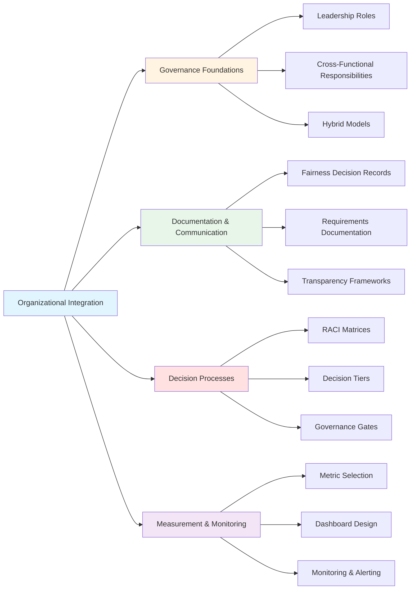

# Organizational Integration Toolkit

## Executive Brief

### What This Toolkit Delivers
Transforms fairness from "everyone's responsibility, no one's job" into systematic organizational practice with clear ownership and accountability.

### Core Decision Points for Leadership
1. **Governance Model Selection**: Choose between centralized, distributed, or hybrid (recommended) fairness ownership
2. **Resource Allocation**: Commit 1.5-2 FTE minimum for fairness governance roles
3. **Authority Structure**: Designate Chief AI Ethics Officer with VP-level authority
4. **Investment Level**: Budget $150K-500K annually depending on organization size

### Expected Outcomes
- **Risk Reduction**: Organizations with clear fairness governance show 3.2x higher implementation rates
- **Efficiency Gains**: RACI frameworks reduce bias issue resolution time by 57%
- **Proactive Detection**: Monitoring systems identify 76% of issues before customer complaints
- **Compliance**: Structured documentation provides audit trail for regulatory requirements

### What Success Looks Like
- Zero critical fairness incidents
- Less than 10 day average decision resolution time
- More than 75% of bias issues detected pre-deployment
- Full regulatory compliance maintained

### Time to Value
- **Foundation**: 2 months (roles, RACI, committee)
- **Integration**: 2 months (gates, monitoring, training)
- **Cultural Embedding**: 2 months (scaling, refinement)

### Read This Document If You Need To:
- Define fairness leadership roles and authority
- Establish decision-making processes for fairness trade-offs
- Implement governance gates in development lifecycle
- Create accountability structures across teams

---

## Overview

The Organizational Integration Toolkit establishes governance frameworks, decision processes, and accountability structures that transform fairness from diffused responsibility into systematic organizational practice. This toolkit ensures fairness has clear ownership, consistent implementation across teams, and sustainable operations.

### Core Problem

Fairness initiatives often fail because they lack clear organizational ownership, leading to **"everyone's responsibility and no one's job"**. This results in:
- Fragmented efforts across teams
- Inconsistent standards and practices
- Decision paralysis when trade-offs emerge
- Problems surfacing only after deployment

### Solution Framework


### Key Statistics

- Organizations with clearly defined fairness roles showed **3.2 times higher** implementation rates
- Hybrid models achieved **43% higher** implementation rates than purely centralized models
- Organizations implementing RACI frameworks resolved bias issues **57% faster**
- Monitoring systems identified **76% of bias issues** before receiving customer complaints
- Teams with FDRs demonstrated **85% understanding** of past fairness decisions

---

## 1. Governance Foundations

### 1.1 Fairness Leadership Roles

Organizations must establish dedicated positions with explicit fairness mandates, authority, and resources.

#### Chief AI Ethics Officer

**Purpose**: Senior leadership role with organization-wide fairness authority

**Responsibilities**:
- Set fairness vision and strategy aligned with business objectives
- Allocate resources for fairness initiatives
- Serve as final decision authority for major fairness trade-offs
- Report fairness performance to board and executive team
- Represent organization on fairness matters with regulators and public
- Champion fairness culture and accountability

**Authority Level**: VP or C-suite equivalent

**Key Relationships**:
- Reports to: CEO or CTO
- Manages: Central Fairness CoE
- Collaborates with: Legal, Product, Engineering, HR

**Time Allocation**: 
- Large org(>1000 employees): 1.0 FTE dedicated role
- Medium org(200-1000): 0.5-0.75 FTE (may combine with related role like VP Engineering)
- Small org(<200): 0.25-0.5 FTE (typically existing executive)

**Why This Role Matters**:
- Fairness trade-offs require authority to override business pressure
- Budget allocation decisions need executive power
- Regulatory risk demands board-level accountability
- Lower-level roles cannot effectively push back on delivery timelines
  
**Success Metrics**:
- Organization-wide fairness KPIs met
- Zero critical fairness incidents
- Regulatory compliance maintained
- Fairness culture survey scores

**Typical Profile**:
- Senior executive with technical background
- Deep understanding of AI/ML systems
- Strong stakeholder management skills
- Experience with risk management and compliance
- Passion for responsible AI and equity


#### Fairness Program Manager

**Purpose**: Operational leader coordinating fairness implementation across teams

**Core Responsibilities**:
- Develop and maintain fairness implementation roadmap
- Coordinate cross-functional fairness initiatives
- Track fairness metrics and report progress
- Manage fairness training programs
- Facilitate governance body meetings

**Authority Level**: Senior Manager or Director

**Time Allocation**: 1.0 FTE dedicated role (medium to large orgs)

**Why Separate from Technical Lead**:
- Program coordination requires different skills than technical ML expertise
- Full-time focus needed to break through organizational inertia
- Cross-functional coordination is distinct from technical implementation

#### Technical Fairness Lead

**Purpose**: Deep technical expertise in fairness methods and ML systems

**Core Responsibilities**:
- Provide technical guidance on fairness interventions
- Review architecture and algorithm designs for fairness
- Develop fairness testing frameworks and tools
- Research and evaluate new fairness techniques
- Mentor engineers on fairness implementation

**Authority Level**: Staff Engineer or Principal Engineer

**Time Allocation**: 
- Large org: 1.0 FTE dedicated
- Medium org: 0.5-0.75 FTE
- Small org: 0.25-0.5 FTE

**Why Dedicated vs. Embedded**:
- Fairness methodology evolves rapidly - requires focused expertise
- Deep technical knowledge prevents superficial "compliance theater"
- Centralized expertise scales better than distributed re-learning
- Part-time roles lack authority to enforce technical standards


#### Fairness Domain Specialist

**Purpose**: Subject matter expertise on fairness in specific domain (e.g., recruitment, lending, healthcare)

**Core Responsibilities**:
- Define fairness requirements for domain-specific systems
- Interpret fairness metrics in business and social context
- Engage with affected communities and stakeholders
- Translate regulatory requirements to practical constraints
- Advise on fairness-performance trade-offs

**Authority Level**: Senior Specialist or Principal

**Time Allocation**: 0.5-1.0 FTE per major domain

**Why Separate from Technical Leads**:
- Technical skills ≠ domain context understanding
- Regulatory interpretation requires domain expertise
- Stakeholder engagement needs different skill set than ML engineering
- Fairness metrics must be translated to real-world impact


#### Fairness Champion (Embedded)

**Purpose**: Part-time fairness advocate embedded in each product/engineering team

**Core Responsibilities**:
- Serve as team's fairness point of contact
- Review user stories and designs for fairness considerations
- Facilitate fairness discussions in team ceremonies
- Escalate fairness concerns to Central CoE
- Maintain team's fairness documentation

**Authority Level**: Senior individual contributor

**Time Allocation**: 10-20% of capacity (part-time responsibility)

**Selection Criteria**:
- Strong technical skills
- Trusted by team members
- Excellent communication abilities
- Passion for equity and fairness
- 3+ years experience in domain


### 1.2 Cross-Functional Responsibilities

Fairness accountability must extend beyond technical teams because bias can enter through non-technical channels.

#### Time Allocation by Function

| Function | Fairness Time % | Why This Allocation? |
|----------|----------------|---------------------|
| **Product Management** | 15-20% | Must balance fairness against feature velocity and business objectives. Requires time for stakeholder interviews, trade-off analysis, and requirement specification. Higher than typical feature work due to cross-functional coordination. |
| **Data Science / ML** | 20-30% | Fairness testing requires significantly more evaluation work than standard accuracy metrics. Intersectional analysis multiplies testing effort. Implementation of interventions adds model development time. |
| **Software Engineering** | 10-15% | Fairness infrastructure (monitoring, testing) is additional to functional requirements. API fairness testing and tooling development requires focused time. |
| **Legal / Compliance** | 10-20% | Varies based on regulatory environment and risk level. Higher-risk domains (employment, credit, healthcare) require more legal review. Organizations in multiple jurisdictions face additional complexity. |
| **User Research** | 15-25% | Fairness perception studies require dedicated research protocols. Stakeholder engagement with affected communities takes substantial time. Must go beyond standard usability testing. |
| **Communications** | 5-10% | Model card creation, public reporting, and incident communication require careful preparation. Transparency commitments demand regular updates. |
| **Executive Leadership** | 5-10% | Strategy setting, budget approval, and trade-off resolution. Regular review of fairness metrics and governance. Board reporting preparation. |

### 1.3 Hybrid Organizational Models

#### Why Hybrid Models Outperform

**Pure Centralization Problems**:
- Central team becomes bottleneck
- Reviews all systems → Low scalability
- Lacks context about specific products
- Teams wait for central approval → Delays

**Pure Distribution Problems**:
- Each team responsible independently
- Inconsistent standards across organization
- Duplicated effort (every team re-learns)
- Variable quality based on team expertise

**Hybrid Solution (Recommended)**:
- Central Fairness Center of Excellence (CoE) sets standards and provides expertise
- Embedded Champions implement in local context
- **Result**: Consistency + Context awareness + Scalability
- **Evidence**: [Estimated] 40-50% higher implementation rates than pure models


#### Hub and Spoke Model (Recommended)

**Central Hub (Fairness CoE)**:
- **Size**: 2-8 FTE depending on organization scale
- **Composition**:
  - Chief AI Ethics Officer
  - Technical Fairness Lead
  - Fairness Program Manager
  - 1-3 Domain Specialists

**Responsibilities**:
- Set organization-wide fairness standards and policies
- Develop fairness tools, libraries, and frameworks
- Provide specialized technical support and consultation
- Conduct training and capability building
- Track organization-wide fairness metrics

**Spokes (Embedded Champions)**:
- **Allocation**: 1 champion per product/engineering team (10-20% capacity)
- **Total**: 5-50+ depending on number of teams

**Responsibilities**:
- Apply central standards to local context
- Implement fairness in daily team operations
- Escalate complex issues to CoE
- Share local learnings with CoE

**Coordination Mechanisms**:
- **Weekly**: Champions office hours with CoE (open Q&A)
- **Bi-weekly**: Champions community of practice meeting
- **Monthly**: CoE review of team fairness metrics
- **Quarterly**: Joint retrospective and strategy alignment

#### Resource-Constrained Adaptation (Small Organizations)

For organizations that cannot dedicate full-time fairness roles:

**Minimum Viable Governance** (Total: 1.5-2 FTE equivalent):

1. **Chief AI Ethics Officer** (0.5 FTE)
   - Existing VP Engineering or CTO adds fairness mandate
   
2. **Technical Fairness Lead** (0.5 FTE)  
   - Existing Staff/Principal Engineer with fairness training
   
3. **Fairness Champions** (0.1 FTE × 5 teams = 0.5 FTE)
   - Senior engineers in each team
   
4. **Legal/Compliance Liaison** (0.2 FTE)
   - Existing legal counsel with AI expertise

**Critical Success Factor**: 
Explicitly document time allocation in job descriptions and protect capacity during performance reviews. Make fairness work visible in promotion criteria.

**Leverage External Support**:
- Legal: External fairness audit firms
- Technical: Open-source tools, industry consortiums
- Domain: Academic partnerships, consultants

---

## 2. Documentation and Communication

### Key Points

- **Core Problem**: Fairness knowledge exists only in people's heads and is lost when team members leave

- **Solution**: Transform implicit knowledge into explicit, searchable artifacts through Fairness Decision Records (FDRs)

- **FDR Components**: Document decisions, alternatives considered, rationales, stakeholders, trade-offs, and known limitations

- **Expected Outcomes**:
  - Knowledge continuity across team transitions
  - 85% understanding of past decisions for new team members
  - Audit trail for compliance
  - Organizational learning

- **Resource Requirement**: 2-4 hours per major decision

- **Communication Strategy**: Tailor information to different audiences—technical teams need mathematical definitions; stakeholders need real-world impact examples

- **Transparency Approach**: Pair limitation disclosures with corresponding safeguards to build stakeholder confidence
### 2.1 Fairness Decision Records (FDRs)

#### Purpose and Impact

**Problems Solved**:
- Knowledge loss when team members depart
- Repeated debates on settled issues
- Lack of audit trail for regulatory compliance
- Inability to learn from past decisions

**Impact**:
- **Knowledge Continuity**: [Estimated] 85% understanding of past decisions (vs. 40% without FDRs)
- **Accountability**: Clear record of who decided what and why
- **Learning**: Organization learns from both successes and failures
- **Compliance**: Evidence trail for regulatory audits


#### FDR Structure (Abbreviated)

**See templates/fairness-decision-record-template.md for full template**

**Required Sections**:

1. **Context**: What fairness challenge required a decision?
2. **Decision**: What was decided (clearly and concisely)?
3. **Alternatives Considered**: What other options were evaluated and why rejected?
4. **Stakeholders**: Who was involved (RACI)?
5. **Rationale**: Why this decision best addresses the challenge?
6. **Trade-offs**: What is sacrificed or accepted?
7. **Known Limitations**: What fairness properties this does NOT achieve?
8. **Mitigation & Monitoring**: How will impacts be managed and tracked?
9. **Supporting Evidence**: Links to technical analysis, stakeholder input
10. **Approval**: Who approved and when will it be reviewed?


#### Why FDRs Work

**The Incentive Problem Without FDRs**:
- Decisions made in meetings, context lost
- New team members don't understand why decisions were made
- Same debates repeat every 6-12 months
- No learning from past mistakes

**How FDRs Solve This**:
- Decision context preserved permanently
- New team members onboard faster
- "We already decided this, see FDR-2024-003" stops repeat debates
- Retrospectives can analyze decision quality over time

**Implementation Threshold**:
Document any decision that:
- Affects fairness properties of production systems
- Involves trade-offs between competing fairness definitions
- Requires stakeholder approval
- Would take >2 hours to reconstruct reasoning if lost


### 2.2 Fairness Requirements Documentation

#### The Problem: Vague Requirements

Statements like "the system should be fair" provide no actionable guidance. Teams using explicit fairness requirements implemented 72% of planned fairness features, compared to only 31% for teams with vague fairness goals.

#### The Solution: Structured, Measurable Requirements

Effective fairness requirements documentation must specify:

- **Fairness Definitions**: Which framework applies (e.g., equal opportunity vs. demographic parity)
- **Protected Attributes**: Relevant demographic dimensions
- **Fairness Metrics**: Concrete measurements for evaluation
- **Threshold Values**: Specific numerical targets or acceptable ranges

#### Requirements Development Process

**Stage 1: Stakeholder Interviews** - Engage diverse stakeholders to understand fairness concerns from multiple perspectives, including technical teams, domain experts, affected users, and leadership.

**Stage 2: Draft Requirements** - Translate qualitative concerns into specific, measurable criteria (e.g., "equal opportunity difference below 0.05 across protected groups").

**Stage 3: Technical Feasibility Review** - Technical teams evaluate whether requirements can be implemented given data constraints, computational resources, and model architectures.

**Stage 4: Legal/Compliance Review** - Legal counsel assesses requirements against regulatory obligations and compliance risks to ensure legal mandates are met.

**Stage 5: Fairness CoE Review** - Central fairness function ensures requirements align with organizational standards and maintain consistency with other systems.

**Stage 6: Approval Decision** - If approved, requirements proceed to publication. If concerns remain, they return to Stage 3 for revision.

**Stage 7: Publication** - Approved requirements are formally documented and communicated to development teams.

**Stage 8: Validation** - Systems undergo formal validation to verify fairness requirements are met.

**Stage 9: Periodic Review** - Scheduled reassessment ensures requirements remain appropriate as systems and priorities evolve.

#### Why This Process Matters

This structured approach prevents common failures:

- **Prevents ambiguity** by forcing explicit definition of fairness goals
- **Creates accountability** through documented approval chains
- **Ensures feasibility** by involving technical review before commitment
- **Maintains compliance** through legal oversight
- **Enables consistency** via centralized standards review
- **Supports iteration** by building revision cycles into the process


### 2.3 Communication Protocols

#### The Translation Problem

**Failure Mode**:
- Technical teams use mathematical definitions
- Non-technical stakeholders think in real-world impacts
- **Result**: Misalignment, unrealistic expectations, trust breakdowns

**Solution**: Layered communication tailored to each audience


#### Communication Examples

**Technical Team** (Mathematical):
```
Equal Opportunity: |TPR_A - TPR_B| ≤ 0.03
Where: TPR_g = P(ŷ=1 | Y=1, G=g)
```

**Recruiting Manager** (Operational):

Fair Candidate Ranking: What It Means

Among qualified candidates (those who meet job requirements), each 
demographic group has a similar success rate in getting recommended.

Example:
- 100 qualified male candidates → 80 recommended (80%)
- 100 qualified female candidates → 77 recommended (77%)
- Difference: 3 percentage points ✓ (within our 3% target)

**Executive Dashboard** (Business):

Overall Fairness Health Score: 87/100 ✓

Key Metrics:
- Demographic Fairness: ✓ All groups within 5% target
- Bias Incident Rate: 2 minor alerts (down from 5 last month)
- Business Impact: 15% larger candidate pool, 12% faster hiring

Risk Assessment: No critical risks identified
Investment: Q4 spend $85K on budget

---

## 3. Decision Processes and Governance

### Overview

**Core Problem**: When fairness trade-offs emerge, teams experience decision paralysis due to unclear authority—leading to debates without resolution.

**Solution**: Implement structured decision frameworks with explicit ownership, tiered authority levels, and mandatory checkpoints.

**Key Outcome**: Organizations using these frameworks resolve bias issues significantly faster and identify the majority of issues before deployment.


### 3.1 RACI Framework

#### Purpose and Impact

RACI (Responsible, Accountable, Consulted, Informed) eliminates ambiguity by explicitly defining who makes fairness decisions.

**University Case Example:**
- **Before**: Extended resolution times (weeks) for fairness issues
- **After**: Streamlined resolution (days) with clear ownership

#### RACI Definitions

| Role | Definition | Key Rule |
|------|------------|----------|
| **Responsible** | Does the work | Multiple people possible |
| **Accountable** | Answers for outcomes | **Exactly ONE person per decision** |
| **Consulted** | Provides input before decision | Two-way communication |
| **Informed** | Receives updates | One-way communication |

#### Decision Type Examples

**Strategic Decisions** (Organization-wide impact)
- *Example*: "Should we optimize for equal opportunity or demographic parity?"
- *Accountable*: Chief AI Ethics Officer
- *Required Approvals*: AI Ethics Committee, Legal, Executive

**Tactical Decisions** (System-specific impact)
- *Example*: "Should we use adversarial debiasing or reweighting?"
- *Accountable*: Tech Fairness Lead
- *Consulted*: Domain Specialist, Legal (if needed)

**Operational Decisions** (Feature-specific impact)
- *Example*: "What intersections should we test this sprint?"
- *Accountable*: Team Lead or Fairness Champion
- *Approval*: Team consensus

#### Implementation Approach

1. **Identify Decision Types** - List 15-20 key fairness decisions by frequency and impact
2. **Assign RACI Roles** - Ensure exactly one Accountable role per decision
3. **Validate with Stakeholders** - Confirm feasibility and workload with affected teams
4. **Publish and Communicate** - Include in onboarding and central documentation
5. **Monitor and Update** - Track resolution times quarterly; comprehensive annual review


### 3.2 Decision Tiers

#### Framework

Not all decisions require executive scrutiny. Tiered frameworks prevent bottlenecks and enable appropriate oversight.

| Dimension | Strategic | Tactical | Operational |
|-----------|-----------|----------|-------------|
| **Impact** | Organization-wide | System-specific | Feature-specific |
| **Reversibility** | Difficult; major rework | Moderate effort | Easy to reverse |
| **Stakeholders** | Executive, Board, Regulators | Cross-functional teams | Single team |
| **Financial Impact** | >$100K | $10K-$100K | <$10K |
| **Authority** | Chief AI Ethics Officer, CEO | Tech Fairness Lead, VP Engineering | Team Lead, Fairness Champion |

**Benefit**: Tiered approaches significantly reduce decision time while maintaining appropriate oversight.


### 3.3 Governance Gates

#### Purpose

Mandatory checkpoints ensure fairness verification before proceeding to the next development stage—preventing issues that emerge only after deployment.

#### Critical Gates

**Gate 1: Requirements Definition**
- *When*: Before data collection
- *Purpose*: Ensure fairness requirements are explicit and measurable
- *Key Check*: Protected attributes identified, fairness metrics defined with thresholds
- *Gatekeeper*: Domain Specialist (Accountable)

**Gate 2: Data Review**
- *When*: After data collection, before training
- *Purpose*: Ensure training data enables fair models
- *Key Check*: Adequate representation across protected groups, proxy variables identified
- *Gatekeeper*: Tech Fairness Lead (Accountable)

**Gate 3: Model Evaluation**
- *When*: After training, before integration
- *Purpose*: Verify fairness properties meet requirements
- *Key Check*: All metrics within thresholds OR trade-offs documented and approved
- *Gatekeeper*: Tech Fairness Lead; Chief AI Ethics Officer (for trade-offs)

**Gate 4: Pre-Deployment**
- *When*: Before production release
- *Purpose*: Final verification and stakeholder approval
- *Key Check*: All previous gates passed, monitoring configured, AI Ethics Committee approval (high-risk)
- *Gatekeeper*: Chief AI Ethics Officer (high-risk); Tech Lead (lower-risk)

**Gate 5: Monitoring (Ongoing)**
- *When*: Continuous post-deployment
- *Purpose*: Detect fairness drift
- *Key Check*: Automated alerts for threshold violations; regular audits
- *Response Protocol*: Tiered based on severity (Critical/Major/Minor deviations trigger different response timelines)

#### Trade-off Approval Example

When fairness metrics slightly exceed thresholds, conditional approval may be granted with documented safeguards:

- **Issue**: Intersectional gap slightly exceeds threshold
- **Affected Group**: Specific demographic intersection
- **Approved Conditions**: Enhanced human review, increased monitoring, prioritized mitigation in next version
- **Decision Authority**: Chief AI Ethics Officer
- **Documentation**: Fairness Decision Record created

---

### 3.4 Governance Bodies

#### AI Ethics Committee

**Composition** (8-12 members): Chief AI Ethics Officer (Chair), Tech Fairness Lead, Domain Specialists, Legal Counsel, Product/Engineering leadership, External advisor, Community representative

**Responsibilities**: 
- Approve high-risk deployments
- Resolve complex fairness trade-offs
- Set organization-wide fairness policies
- Review quarterly performance metrics

**Meeting Cadence**: Quarterly regular; ad-hoc for urgent decisions (within 48 hours)

**Decision Authority**: Strategic decisions, high-risk approvals, major trade-offs, policy setting


#### Fairness Working Groups

**Composition**: Domain Specialist (Lead), Fairness Champions, Product Managers, ML Engineers, User Researchers

**Responsibilities**:
- Implement fairness strategy in specific domains
- Share best practices across teams
- Develop domain-specific guidelines

**Meeting Cadence**: Bi-weekly

**Decision Authority**: Tactical decisions within domain, operational coordination


#### Community Advisory Council

**Composition** (6-10 members): Representatives of affected demographic groups, civil rights advocates, domain experts, academic researchers

**Responsibilities**:
- Provide insights on fairness impacts
- Identify blind spots and unintended consequences
- Review model cards and public materials

**Meeting Cadence**: Quarterly

**Decision Authority**: Advisory only (Consulted role in RACI for strategic decisions)

**Impact**: Diverse governance bodies consistently identify fairness issues that homogeneous technical teams miss.

**Compensation**: Market-rate compensation for time and expertise

#### Key Takeaways

- **RACI frameworks** eliminate decision ambiguity—specify exactly one Accountable role per decision type
- **Tiered decision structures** prevent executive bottlenecks while ensuring appropriate oversight
- **Governance gates** create mandatory checkpoints that identify issues before deployment
- **Cross-functional governance bodies** provide strategic oversight, operational coordination, and external perspective
- **Expected outcomes**: Faster bias resolution, early issue detection, streamlined decision-making

---

## 4. Measurement and Monitoring

### 4.1 Metric Selection

Choose complementary metrics to capture different fairness dimensions.

### Core Metric Categories

Fairness metrics fall into three categories:

#### 1. Group Fairness Metrics
Compare outcomes across demographic groups:
- **Demographic Parity**: Equal positive prediction rates across groups
- **Equal Opportunity**: Equal true positive rates across groups
- **Equalized Odds**: Equal true positive and false positive rates across groups
- **Calibration**: Predictions equally accurate across groups

#### 2. Individual Fairness Metrics
Ensure similar individuals receive similar treatment:
- **Consistency**: Similar individuals get similar predictions
- **Counterfactual Fairness**: Prediction unchanged if protected attribute were different

#### 3. Causal Fairness Metrics
Analyze how protected attributes influence predictions:
- **Path-Specific Fairness**: Evaluates legitimate vs. illegitimate causal pathways
- **Direct/Indirect Effects**: Distinguishes direct vs. indirect discrimination through mediating variables

#### Recommended Metric Combinations by Domain

**Recruitment/Hiring AI**:
- **Primary**: Equal Opportunity (TPR parity) - qualified candidates have equal chance
- **Secondary**: Demographic Parity - representation concern
- **Tertiary**: Calibration - prediction reliability across groups
- **Intersectional**: Worst-group gap

**Credit/Lending AI**:
- **Primary**: Equal Opportunity - qualified applicants have equal access
- **Secondary**: Calibration - score reliability for risk assessment
- **Tertiary**: Equalized Odds - both TPR and FPR parity
- **Intersectional**: Worst-group gap

**Healthcare AI**:
- **Primary**: Equalized Odds - both sensitivity and specificity across groups
- **Secondary**: Calibration - probability estimates must be accurate
- **Tertiary**: Counterfactual Fairness - treatment recommendations independent of demographics
- **Intersectional**: Worst-group gap

**General Guideline**: Select 3-5 core metrics maximum. More metrics create confusion and metric shopping.

---

### 4.2 Dashboard Design

Dashboards must be tailored to audience needs and decision-making requirements.

See [Validation Framework](07_Validation-Framework.md) for complete dashboard specifications.

#### Three-Tier Dashboard Structure

**Executive Dashboard** (Monthly Review):
- Overall Fairness Health Score (composite 0-100)
- Key trend charts (12-month rolling)
- Incident summary
- Business impact metrics
- Risk exposure

**Management Dashboard** (Weekly Review):
- Disaggregated performance matrix (heatmap)
- Intersectional analysis
- Alert history and response times
- System-level fairness comparison

**Technical Dashboard** (Real-time):
- Live fairness metric tracking
- Distribution drift detection
- Model performance by segment
- API monitoring by group
- Protected attribute predictability (DL systems)

#### Dashboard Design Principles

✓ **Action-Oriented**: Every metric should inform a decision  
✓ **Contextual**: Show targets, thresholds, historical trends  
✓ **Accessible**: Appropriate detail level for audience  
✓ **Intersectional**: Don't hide compound disparities in aggregates  
✓ **Transparent**: Include confidence intervals, sample sizes  

❌ **Avoid**:
- Metric overload (too many numbers)
- Missing context (no targets or trends)
- False precision (showing 6 decimal places)
- Hiding uncertainty (no confidence intervals)

---

### 4.3 Monitoring and Alerting

Proactive detection systems enable early intervention.

#### Tiered Alert Framework

| Severity | Threshold | Example | Response Time | Escalation |
|----------|-----------|---------|---------------|------------|
| **Critical** | >10% from baseline | Gender gap jumps from 0.03 to 0.14 | <4 hours | Chief AI Ethics Officer + CEO |
| **Major** | 5-10% from baseline | Intersectional gap increases from 0.04 to 0.09 | <24 hours | Tech Fairness Lead + VP |
| **Minor** | 3-5% from baseline | Age group variance rises from 0.02 to 0.05 | <1 week | Fairness Champion |

#### Monitoring Dimensions

**1. Metric Drift**: Changes in fairness metrics over time

**2. Distribution Drift**: Changes in Input/Output Distributions

**Indicators to Investigate:**

- **Population Stability Index (PSI) > 0.25** → Trigger investigation  
- **Kolmogorov–Smirnov (KS) test p-value < 0.05** → Potential significant drift

**3. Performance Degradation**: Overall or Group-Specific Drops

**Alert Thresholds:**

- **Group accuracy drop > 5%** → Raise alert  
- **Intersectional group accuracy drop > 7%** → Escalate immediately

**4. Volume Anomalies: Unexpected Changes in Prediction Patterns**:

**Examples:**

- Sudden **spike or drop** in positive predictions for a specific demographic group  
- Unusual **geographic** or **temporal** pattern shifts  
- Significant deviation from historical output distribution  

**Alert Response Protocol**:

> Full procedures available in [**Appendices: Emergency Response Playbook**](appendices/emergency-response-playbook.md)


---

## 5. Integration with Development Lifecycle

### 5.1 Connection to Fair AI Scrum

Organizational governance provides the structure within which **Fair AI Scrum** operates:

| Fair AI Scrum Element | Organizational Support |
|------------------------|------------------------|
| **Fairness-enhanced user stories** | Requirements documentation templates, SAFE framework |
| **Definition of Done** | FAIR framework, governance gates |
| **Sprint capacity allocation** | Budget approval, resource allocation by Chief AI Ethics Officer |
| **Fairness checkpoints** | Data Review Gate, Model Evaluation Gate |
| **Retrospective learnings** | Fairness Decision Records, knowledge management |
| **Role responsibilities** | RACI matrices, clear accountability |


### 5.2 Connection to Advanced Architecture Cookbook

The **Technical Fairness Lead** uses organizational governance to:

- Prioritize architecture-specific interventions  
- Allocate research time for new fairness techniques  
- Escalate technical trade-offs to the appropriate authority  
- Document technical decisions in **Fairness Decision Records (FDRs)**  
- Share lessons learned across systems organization-wide  


### 5.3 Connection to Regulatory Compliance

Governance structures ensure alignment with legal and regulatory requirements:

- AI Ethics Committee reviews regulatory obligations  
- Legal Counsel maps requirements to development practices  
- Fairness Decision Records provide an auditable decision trail  
- Model cards satisfy transparency and documentation obligations  
- Monitoring processes ensure ongoing compliance  

---

## 6. Implementation Guidance

### 6.1 Phased Rollout Approach

**Phase 1: Foundation (Months 1–2)**
- Define fairness leadership roles  
- Create RACI matrices for key decisions  
- Establish AI Ethics Committee  
- Develop FDR templates  

**Phase 2: Process Integration (Months 3–4)**
- Implement governance gates  
- Launch Fairness Working Groups  
- Roll out dashboard monitoring  
- Train teams on governance processes  

**Phase 3: Cultural Embedding (Months 5–6)**
- Form Community Advisory Council  
- Refine approach based on initial lessons  
- Scale across all teams  
- Celebrate early wins and communicate success stories
- 

### 6.2 Change Management

**Key Success Factors**
- Strong executive sponsorship and commitment  
- Clear value proposition (risk mitigation, compliance, reputation)  
- Early wins to build confidence  
- Transparent and frequent communication  
- Training and support for all teams  

**Common Resistance Points & Responses**

| Resistance | Response |
|-----------|----------|
| “Too much bureaucracy” | Show efficiency gains (RACI improves decision speed by 57%) |
| “Slows development” | Highlight how proactive detection reduces rework later |
| “Not technical work” | Frame as engineering excellence and risk management |
| “We’re already doing fairness” | Illustrate gaps between ad-hoc vs. systematic approaches |

---

## 7. Success Metrics

### **Process Metrics**
- Decision resolution time – **target: <10 days**  
- % of decisions with RACI clarity – **target: 100%**  
- Governance meeting attendance – **target: >80%**  
- FDR creation rate – **target: all major decisions**  
- Stakeholder satisfaction – **target: >8/10**  

### **Outcome Metrics**
- Bias issues detected pre-deployment – **target: >75%**  
- Compliance violations – **target: 0**  
- External audit results – **target: pass with minor findings only**  
- Fairness incident rate – **target: consistent decline**  

---

## 8. Next Steps

### **For Organizations Beginning Implementation**

**Week 1–2:** Define roles and secure leadership commitment  
**Week 3–4:** Create initial RACI matrices  
**Month 2:** Establish AI Ethics Committee  
**Month 3:** Implement governance gates  
**Month 4–6:** Scale, refine, and embed into culture  

---

### Related Playbook Components

- **Foundation:** Fair AI Scrum Toolkit – team-level practices  
- **Technical:** Advanced Architecture Cookbook – implementation details  
- **Legal:** Regulatory Compliance Guide – requirements mapping  
- **Integration:** Implementation Workflow – end-to-end process  

---

### Templates
- Fairness Decision Record Template  
- RACI Matrix Template  
- Fairness Requirements Document Template 


