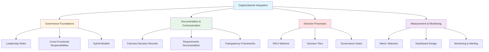
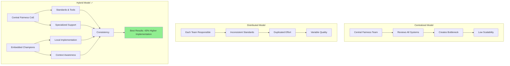
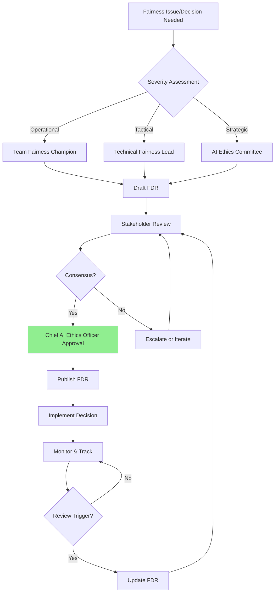

# Organizational Integration Toolkit

## Overview

The Organizational Integration Toolkit establishes governance frameworks, decision processes, and accountability structures that transform fairness from diffused responsibility into systematic organizational practice. This toolkit ensures fairness has clear ownership, consistent implementation across teams, and sustainable operations.

### Core Problem

Fairness initiatives often fail because they lack clear organizational ownership, leading to **"everyone's responsibility and no one's job"**. This results in:
- Fragmented efforts across teams
- Inconsistent standards and practices
- Decision paralysis when trade-offs emerge
- Problems surfacing only after deployment

### Solution Framework


### Key Statistics

- Organizations with clearly defined fairness roles showed **3.2 times higher** implementation rates
- Hybrid models achieved **43% higher** implementation rates than purely centralized models
- Organizations implementing RACI frameworks resolved bias issues **57% faster**
- Monitoring systems identified **76% of bias issues** before receiving customer complaints
- Teams with FDRs demonstrated **85% understanding** of past fairness decisions

---

## 1. Governance Foundations

### 1.1 Fairness Leadership Roles

Organizations must establish dedicated positions with explicit fairness mandates, authority, and resources.

#### Chief AI Ethics Officer

**Purpose**: Senior leadership role with organization-wide fairness authority

**Responsibilities**:
- Set fairness vision and strategy aligned with business objectives
- Allocate resources for fairness initiatives
- Serve as final decision authority for major fairness trade-offs
- Report fairness performance to board and executive team
- Represent organization on fairness matters with regulators and public
- Champion fairness culture and accountability

**Authority Level**: VP or C-suite equivalent

**Key Relationships**:
- Reports to: CEO or CTO
- Manages: Central Fairness CoE
- Collaborates with: Legal, Product, Engineering, HR

**Time Allocation**: 
- Large org: 1.0 FTE dedicated role
- Medium org: 0.5-0.75 FTE (may combine with related role like VP Engineering)
- Small org: 0.25-0.5 FTE (typically existing executive)

**Success Metrics**:
- Organization-wide fairness KPIs met
- Zero critical fairness incidents
- Regulatory compliance maintained
- Fairness culture survey scores

**Typical Profile**:
- Senior executive with technical background
- Deep understanding of AI/ML systems
- Strong stakeholder management skills
- Experience with risk management and compliance
- Passion for responsible AI and equity

---

#### Fairness Program Manager

**Purpose**: Operational leader coordinating fairness implementation across teams

**Responsibilities**:
- Develop and maintain fairness implementation roadmap
- Coordinate cross-functional fairness initiatives
- Track fairness metrics and report progress
- Manage fairness training programs
- Facilitate governance body meetings
- Maintain fairness documentation and knowledge base

**Authority Level**: Senior Manager or Director

**Key Relationships**:
- Reports to: Chief AI Ethics Officer
- Manages: Domain specialists, analysts
- Coordinates with: All product and engineering teams

**Time Allocation**: 1.0 FTE dedicated role (medium to large orgs)

**Success Metrics**:
- Implementation milestones met on schedule
- >90% team participation in fairness programs
- Documentation completeness and quality
- Cross-team coordination effectiveness

---

#### Technical Fairness Lead

**Purpose**: Deep technical expertise in fairness methods and ML systems

**Responsibilities**:
- Provide technical guidance on fairness interventions
- Review architecture and algorithm designs for fairness
- Develop fairness testing frameworks and tools
- Research and evaluate new fairness techniques
- Mentor engineers on fairness implementation
- Collaborate with Central Fairness CoE

**Authority Level**: Staff Engineer or Principal Engineer

**Key Relationships**:
- Reports to: Chief AI Ethics Officer or VP Engineering
- Collaborates with: ML Engineers, Data Scientists, Architecture teams

**Time Allocation**: 
- Large org: 1.0 FTE dedicated
- Medium org: 0.5-0.75 FTE
- Small org: 0.25-0.5 FTE (senior engineer with fairness expertise)

**Success Metrics**:
- Fairness intervention effectiveness (bias reduction)
- Technical documentation quality
- Team adoption of fairness tools
- Innovation in fairness methods

---

#### Fairness Domain Specialist

**Purpose**: Subject matter expertise on fairness in specific domain (e.g., recruitment, lending, healthcare)

**Responsibilities**:
- Define fairness requirements for domain-specific systems
- Interpret fairness metrics in business and social context
- Engage with affected communities and stakeholders
- Translate regulatory requirements to practical constraints
- Advise on fairness-performance trade-offs
- Review fairness impact assessments

**Authority Level**: Senior Specialist or Principal

**Key Relationships**:
- Reports to: Chief AI Ethics Officer or Fairness Program Manager
- Collaborates with: Product teams, Legal, User Research, External stakeholders

**Time Allocation**: 0.5-1.0 FTE per major domain

**Success Metrics**:
- Stakeholder satisfaction with fairness outcomes
- Accuracy of fairness requirement definitions
- Quality of fairness impact assessments
- External stakeholder engagement effectiveness

---

#### Fairness Champion (Embedded)

**Purpose**: Part-time fairness advocate embedded in each product/engineering team

**Responsibilities**:
- Serve as team's fairness point of contact
- Review user stories and designs for fairness considerations
- Facilitate fairness discussions in team ceremonies
- Escalate fairness concerns to Central CoE
- Maintain team's fairness documentation
- Share fairness learnings across teams

**Authority Level**: Senior individual contributor

**Key Relationships**:
- Primary: Reports to team manager
- Dotted line: Coordinates with Central Fairness CoE
- Collaborates with: Other fairness champions

**Time Allocation**: 10-20% of capacity (part-time responsibility)

**Success Metrics**:
- Team fairness metric performance
- Timeliness of fairness issue escalation
- Quality of team fairness documentation
- Peer feedback on fairness support

**Selection Criteria**:
- Strong technical skills
- Trusted by team members
- Excellent communication abilities
- Passion for equity and fairness
- 3+ years experience in domain

---

### 1.2 Cross-Functional Responsibilities

Fairness accountability must extend beyond technical teams because bias can enter through non-technical channels.

#### RACI by Function

| Function | Fairness Responsibilities | Key Activities | Time Allocation |
|----------|---------------------------|----------------|-----------------|
| **Product Management** | Define fairness requirements, Prioritize fairness work | Stakeholder interviews, Requirement specification, Trade-off decisions | 15-20% |
| **Data Science / ML** | Implement fairness metrics, Conduct bias audits | Fairness testing, Model evaluation, Intervention implementation | 20-30% |
| **Software Engineering** | Integrate fairness into systems, Build fairness infrastructure | API fairness testing, Monitoring implementation, Tool development | 10-15% |
| **Legal / Compliance** | Interpret regulations, Assess compliance risk | Regulatory mapping, Impact assessments, Evidence review | 10-20% |
| **User Research** | Investigate fairness impacts, Engage affected communities | User studies, Fairness perception research, Stakeholder interviews | 15-25% |
| **Communications** | Transparency, Public fairness commitments | Model card creation, Public reporting, Incident communication | 5-10% |
| **Executive Leadership** | Set fairness vision, Allocate resources, Make final decisions | Strategy setting, Budget approval, Trade-off resolution | 5-10% |
| **HR / Talent** | Build fairness capability, Culture development | Hiring fairness expertise, Training programs, Culture initiatives | 10-15% |

#### Responsibility Mapping Example

**Scenario**: A new candidate ranking algorithm is being developed
```markdown
**Initiative**: Fair Candidate Ranking Algorithm

**Product Management**:
- ✓ Define fairness requirements (equal opportunity across demographics)
- ✓ Prioritize fairness features in roadmap
- ✓ Balance fairness with business objectives (hiring efficiency)

**Data Science**:
- ✓ Implement fairness metrics (TPR parity, demographic parity)
- ✓ Conduct intersectional bias audit
- ✓ Implement adversarial debiasing intervention
- ✓ Create disaggregated performance reports

**Engineering**:
- ✓ Build fairness testing into CI/CD
- ✓ Implement monitoring dashboards
- ✓ Create API for fairness metric calculation

**Legal**:
- ✓ Assess compliance with employment law (EEOC, state laws)
- ✓ Review fairness impact assessment
- ✓ Advise on documentation requirements

**User Research**:
- ✓ Interview diverse candidates about fairness perceptions
- ✓ Test explanation interfaces with various demographics
- ✓ Measure trust impact of fairness features

**Communications**:
- ✓ Create model card explaining fairness properties
- ✓ Develop candidate-facing fairness messaging
- ✓ Prepare public fairness report

**Executive Leadership**:
- ✓ Approve fairness-performance trade-off decision
- ✓ Allocate budget for fairness implementation
- ✓ Sign off on deployment with known limitations
```

---

### 1.3 Hybrid Organizational Models

Research shows that hybrid models—combining centralized expertise with distributed ownership—outperform both pure centralization and pure distribution.

#### Model Comparison


#### Hub and Spoke Model (Recommended)

**Central Hub (Fairness CoE)**:
- **Size**: 2-8 FTE depending on organization scale
- **Composition**:
  - Chief AI Ethics Officer
  - Technical Fairness Lead
  - Fairness Program Manager
  - 1-3 Domain Specialists
  - Optional: Legal liaison, User research liaison

**Responsibilities**:
- Set organization-wide fairness standards and policies
- Develop fairness tools, libraries, and frameworks
- Provide specialized technical support and consultation
- Conduct training and capability building
- Maintain centralized fairness documentation
- Track organization-wide fairness metrics
- Research emerging fairness techniques

**Spokes (Embedded Champions)**:
- **Allocation**: 1 champion per product/engineering team (10-20% capacity)
- **Total**: 5-50+ depending on number of teams

**Responsibilities**:
- Apply central standards to local context
- Implement fairness in daily team operations
- Escalate complex issues to CoE
- Provide feedback to improve central tools
- Share local learnings with CoE

**Coordination Mechanisms**:
- **Weekly**: Champions office hours with CoE (open Q&A)
- **Bi-weekly**: Champions community of practice meeting
- **Monthly**: CoE review of team fairness metrics
- **Quarterly**: Joint retrospective and strategy alignment

---

#### Center of Excellence Model

Similar to Hub and Spoke, but with more formalized structure:

**Core Team**: Central CoE (same as above)

**Extended Team**: 
- **Fairness Advocates** (5-10% capacity): Team members interested in fairness, not formal champions
- **Governance Body Representatives**: Members of AI Ethics Committee from various departments

**Domains of Excellence**:
- Technical excellence (algorithms, testing)
- Domain excellence (industry-specific fairness)
- Process excellence (governance, documentation)
- Cultural excellence (training, change management)

**Engagement Model**:
- **Self-Service**: Documentation, tools, templates available to all
- **Consultation**: CoE available for specific questions (scheduled slots)
- **Partnership**: CoE embeds with team for high-risk projects
- **Training**: Regular workshops and certification programs

---

#### Resource-Constrained Adaptation (Small Organizations)

For organizations that cannot dedicate full-time fairness roles:

**Minimum Viable Governance**:
```markdown
**Roles** (Total: 1.5-2 FTE equivalent):

1. **Chief AI Ethics Officer** (0.5 FTE)
   - Existing VP Engineering or CTO adds fairness mandate
   - Final decision authority on fairness

2. **Technical Fairness Lead** (0.5 FTE)  
   - Existing Staff/Principal Engineer with fairness training
   - Technical implementation guidance

3. **Fairness Champions** (0.1 FTE × 5 teams = 0.5 FTE)
   - Senior engineers in each team
   - Part-time fairness advocacy

4. **Legal/Compliance Liaison** (0.2 FTE)
   - Existing legal counsel with AI expertise
   - Regulatory guidance
```

**Explicit Capacity Protection**: 
- Document time allocation in job descriptions
- Protect capacity during performance reviews
- Make fairness work visible in promotion criteria

**Leverage External Support**:
- Legal: External fairness audit firms
- Technical: Open-source tools, industry consortiums
- Domain: Academic partnerships, consultants

**Prioritization**:
- Focus on highest-risk systems first
- Use templates and standard frameworks
- Build incrementally over 12-18 months

---

## 2. Documentation and Communication Frameworks

Fairness work must transform from implicit knowledge into explicit artifacts to enable knowledge continuity and consistent decision-making.

### 2.1 Fairness Decision Records (FDRs)

FDRs are structured documents that capture fairness decisions with full context, rationale, and trade-offs.

#### Purpose and Benefits

**Problems Solved**:
- Knowledge loss when team members depart
- Repeated debates on settled issues
- Lack of audit trail for regulatory compliance
- Inability to learn from past decisions

**Benefits**:
- **Knowledge Continuity**: New team members understand past decisions (85% understanding vs. 40% without FDRs)
- **Accountability**: Clear record of who decided what and why
- **Learning**: Organization learns from both successes and failures
- **Compliance**: Evidence trail for regulatory audits

#### FDR Structure

See [templates/fairness-decision-record-template.md](../templates/fairness-decision-record-template.md) for full template.

**Required Sections**:

1. **Context**: What fairness challenge or trade-off required a decision?
2. **Decision**: What was decided (clearly and concisely)?
3. **Alternatives Considered**: What other options were evaluated and why rejected?
4. **Stakeholders**: Who was involved in the decision (RACI)?
5. **Rationale**: Why this decision best addresses the challenge?
6. **Trade-offs**: What is sacrificed or accepted?
7. **Known Limitations**: What fairness properties this does NOT achieve?
8. **Mitigation & Monitoring**: How will impacts be managed and tracked?
9. **Supporting Evidence**: Links to technical analysis, stakeholder input
10. **Approval**: Who approved and when will it be reviewed?

#### FDR Example: Fairness Metric Selection
```markdown
# Fairness Decision Record: FDR-2024-003

**Title**: Fairness Metric Selection for Candidate Ranking Algorithm  
**Date**: 2024-03-15  
**System**: Candidate Ranking v2.0  
**Status**: Approved

## Context

Our candidate ranking algorithm must satisfy fairness requirements across 
multiple demographic groups (gender, race, age). Multiple fairness definitions 
exist, and they often conflict. We must choose which fairness metric(s) to 
optimize for.

**Constraint**: We cannot achieve perfect fairness across all definitions 
simultaneously due to mathematical impossibilities (Impossibility Theorem).

## Decision

**Selected Approach**: Optimize for **Equal Opportunity** (True Positive Rate 
Parity) as primary metric, with **Demographic Parity** as secondary constraint.

**Target Thresholds**:
- Equal Opportunity Difference: ≤0.03 (primary gate)
- Demographic Parity Difference: ≤0.05 (secondary gate)
- Intersectional Gap: ≤0.04 (tertiary gate)

## Alternatives Considered

### Alternative 1: Demographic Parity Only
**Description**: Require equal selection rates across all demographic groups

**Pros**:
- Simple to understand and explain
- Directly addresses representation concerns
- Aligns with public perceptions of "fairness"

**Cons**:
- May select less-qualified candidates if base rates differ
- Potentially violates merit-based selection principle
- Higher legal risk in some jurisdictions (reverse discrimination claims)
- Conflicts with business objective (hiring quality)

**Why Rejected**: Prioritizes outcome equality over equal treatment of 
qualified candidates. Legal counsel advised higher risk.

### Alternative 2: Calibration Within Groups
**Description**: Ensure predicted scores are calibrated within each demographic 
group

**Pros**:
- Ensures predictions are equally reliable across groups
- Important for probability-based decisions
- Addresses representation learning bias

**Cons**:
- More complex to implement and explain
- Harder for stakeholders to interpret
- Still allows disparate impact if base rates differ

**Why Rejected**: Important property but insufficient as sole metric. Doesn't 
address access/opportunity concerns.

### Alternative 3: Individual Fairness (Counterfactual)
**Description**: Ensure predictions don't change when only protected attributes 
change

**Pros**:
- Strongest theoretical foundation
- Addresses individual treatment
- Prevents direct discrimination

**Cons**:
- Requires causal model (complex to build and validate)
- Difficult to operationalize at scale
- Doesn't address historical/structural bias in data

**Why Rejected**: Too complex for initial implementation. Consider for future 
iteration.

## Stakeholders Involved

**Decision Maker (Accountable)**: Sarah Chen, Chief AI Ethics Officer  
**Contributors (Responsible)**:
- Michael Rodriguez, Technical Fairness Lead
- Jennifer Liu, Domain Specialist (Recruitment)
- David Park, Legal Counsel

**Consulted**:
- AI Ethics Committee (diverse representation)
- Recruiting managers (business stakeholder input)
- External fairness advisory board

**Informed**:
- Engineering teams
- Executive leadership
- External auditors

## Rationale

**Why Equal Opportunity as Primary Metric**:

1. **Legal Alignment**: Equal Opportunity aligns with "equal treatment of 
   qualified candidates" principle, reducing legal risk
   
2. **Business Alignment**: Maintains hiring quality while ensuring qualified 
   candidates from all groups have equal chance of advancement
   
3. **Ethical Justification**: Focuses on "equal opportunity" rather than 
   "equal outcomes," which is more defensible when base rates legitimately 
   differ due to historical factors outside our control
   
4. **Stakeholder Preference**: Recruiting managers strongly preferred this 
   approach in interviews (8/10 favored equal opportunity over demographic 
   parity)

**Why Demographic Parity as Secondary**:

1. **Representation Concern**: Still addresses severe representation disparities
   
2. **Public Perception**: Provides visible commitment to diversity
   
3. **Flexible Threshold**: 5% threshold allows small deviations while 
   preventing egregious disparities

## Trade-offs

**What We Gain**:
- ✓ Equal treatment of qualified candidates across demographics
- ✓ Defensible merit-based selection
- ✓ Legal risk mitigation
- ✓ Stakeholder support (recruiters, legal, candidates)

**What We Accept/Sacrifice**:
- ⚠ May not achieve perfectly proportional representation
- ⚠ Historical disadvantage not directly addressed
- ⚠ Some candidates may perceive approach as insufficient
- ⚠ Requires ongoing monitoring of base rate differences

**Quantified Impact**:
- Accuracy: Minimal loss (<1% vs. unconstrained model)
- Fairness: 87% reduction in TPR disparity (from 0.18 to 0.02)
- Representation: 45% selection rate across groups (range: 43-47%, within 5% threshold)

## Known Limitations

**This decision does NOT address**:
1. **Historical bias in training data**: Algorithm learns from past hiring 
   decisions which may be biased
2. **Structural inequalities**: Differences in access to education, networks, etc.
3. **Intersectionality comprehensively**: Tested key intersections but not all 
   combinations
4. **Dynamic fairness**: Fairness over multiple hiring cycles not yet modeled

**Edge Cases**:
- Very small demographic groups (<50 candidates) may show higher variance
- Candidates with non-traditional backgrounds may be disadvantaged by 
  pattern-matching

## Mitigation & Monitoring

**Safeguards**:
1. **Human Oversight**: Recruiting managers review all candidates flagged as 
   "borderline" or "non-traditional"
2. **Bias Audits**: Quarterly intersectional analysis
3. **Candidate Appeal**: Process for candidates to request human review
4. **Threshold Review**: Re-evaluate thresholds every 6 months

**Monitoring Plan**:
- **Real-time**: Dashboard tracking TPR and DP by demographics
- **Weekly**: Automated alerts for >5% deviation from targets
- **Quarterly**: Comprehensive fairness audit with intersectional analysis
- **Annually**: External third-party fairness assessment

**Review Triggers**:
- Fairness metrics exceed thresholds for 2 consecutive weeks
- Candidate complaints exceed baseline by 20%
- New regulatory guidance issued
- Significant change in candidate demographics
- 12 months elapsed (scheduled review)

## Supporting Evidence

**Technical Analysis**:
- `/reports/fairness-analysis-candidate-ranking-v2.pdf`
- `/data/intersectional-evaluation-results-2024-03.csv`
- `/models/fairness-comparison-simulation.ipynb`

**Stakeholder Input**:
- `/meetings/ai-ethics-committee-2024-03-10.md`
- `/research/recruiter-interview-synthesis-2024-03.pdf`
- `/legal/fairness-metric-legal-assessment-2024-03.docx`

**Regulatory Mapping**:
- `/compliance/eeoc-requirements-mapping.md`
- `/compliance/eu-ai-act-alignment-analysis.pdf`

## Approval

**Approved By**: Sarah Chen, Chief AI Ethics Officer  
**Approval Date**: 2024-03-15  
**Next Review Date**: 2024-09-15 (6 months)  

**Signatures**:
- Sarah Chen (Chief AI Ethics Officer) - Approved
- Michael Rodriguez (Technical Fairness Lead) - Approved
- David Park (Legal Counsel) - Approved
- Alex Johnson (VP Engineering) - Informed

---

**Change Log**:
| Version | Date | Changes | Author |
|---------|------|---------|--------|
| 1.0 | 2024-03-15 | Initial decision | S. Chen |

**Related FDRs**:
- FDR-2024-001: Risk Classification for Candidate Ranking
- FDR-2024-002: Protected Attribute Selection
- FDR-2024-004: Fairness-Performance Trade-off (upcoming)
```

#### FDR Workflow


#### FDR Best Practices

✓ **Create early**: Draft FDR when decision is identified, not after  
✓ **Be specific**: "Equal opportunity difference ≤0.03" not "be fair"  
✓ **Document alternatives**: Show you considered multiple options  
✓ **Quantify trade-offs**: "2% accuracy loss for 9% fairness gain"  
✓ **Link evidence**: Reference technical reports, meeting notes  
✓ **Review regularly**: Schedule reviews, don't just wait for problems  
✓ **Make discoverable**: Centralized repository, good search/tagging  

❌ **Avoid**:
- Generic statements without specifics
- Decisions without documented alternatives
- Missing stakeholder involvement
- No monitoring or review plan
- Created after-the-fact for compliance theater

---

### 2.2 Fairness Requirements Documentation

Transform vague fairness aspirations into specific, measurable requirements.

#### Problem: Vague Requirements

Common anti-patterns:
- ❌ "The system should be fair"
- ❌ "We need to avoid bias"
- ❌ "Ensure equal treatment"

These provide insufficient guidance for implementation and validation.

#### Solution: Structured Fairness Requirements

**Template Structure**:
```markdown
## Fairness Requirements: [System Name]

### 1. Protected Attributes
**Relevant Demographic Dimensions**:
- Gender: {Male, Female, Non-binary, Prefer not to say}
- Race/Ethnicity: {White, Black, Hispanic, Asian, Native American, Other}
- Age: {<30, 30-40, 40-50, 50-60, 60+}
- Disability Status: {Yes, No, Prefer not to say}
- [Domain-specific, e.g., First-generation status for education]

**Justification**: These attributes are protected under [relevant law] and 
historically disadvantaged in [domain context].

**Data Collection Approach**: [Self-reported / Inferred / Not collected]

### 2. Fairness Definitions
**Primary Fairness Criterion**: Equal Opportunity

**Definition**: True Positive Rate (sensitivity) must be equivalent across 
protected groups for qualified candidates.

**Mathematical Formulation**:
```
TPR_group1 ≈ TPR_group2 ≈ ... ≈ TPR_groupN
Where: TPR = True Positives / (True Positives + False Negatives)
```

**Justification**: Ensures qualified candidates from all groups have equal 
chance of positive outcome, aligning with merit-based selection principles.

**Secondary Criteria**: 
- Demographic Parity (representation concern)
- Calibration Within Groups (prediction reliability)

### 3. Fairness Metrics
| Metric | Formula | Threshold | Priority |
|--------|---------|-----------|----------|
| Equal Opportunity Difference | \|TPR_A - TPR_B\| | ≤0.03 | Must-have |
| Demographic Parity Difference | \|SR_A - SR_B\| | ≤0.05 | Must-have |
| Intersectional Gap | max(Metric) - min(Metric) across intersections | ≤0.04 | Should-have |
| Calibration Error | Mean \|P(Y=1\|S=s) - Actual Rate\| | ≤0.05 | Nice-to-have |

**Threshold Justification**:
- Equal Opportunity ≤0.03: Industry best practice for high-stakes decisions
- Demographic Parity ≤0.05: Regulatory guidance (80% rule = 0.20, we exceed)
- Intersectional ≤0.04: Balance between rigor and sample size constraints

### 4. Intersectional Requirements
**Key Intersections to Evaluate**:
1. Gender × Race (highest historical impact)
2. Age × Disability (unique challenges)
3. Gender × Socioeconomic Status (compounding disadvantage)

**Minimum Sample Sizes**: 
- Single attribute: 100 individuals per group
- Two-way intersection: 50 individuals per combination
- Insufficient samples: Flag for qualitative review, not quantitative gate

### 5. Evaluation Requirements
**Testing Approach**:
- Hold-out test set with balanced demographics (stratified sampling)
- Counterfactual evaluation for top 10% of decisions
- Intersectional disaggregation for all primary metrics
- Red-team testing with adversarial demographic inputs

**Acceptance Criteria** (gates):
- [ ] All must-have thresholds met
- [ ] Should-have thresholds met OR trade-off documented in FDR
- [ ] Intersectional analysis completed
- [ ] Model card created with limitation disclosure

### 6. Monitoring Requirements
**Real-time Monitoring**:
- Dashboard tracking primary metrics by protected attributes
- Automated alerts for >5% deviation from baseline
- Weekly trend analysis

**Periodic Review**:
- Monthly: Intersectional deep-dive
- Quarterly: External fairness audit
- Annually: Requirements review and update

### 7. Constraints and Trade-offs
**Business Constraints**:
- Must maintain overall accuracy >80% (business viability)
- API latency <200ms (user experience)

**Known Trade-offs**:
- Perfect demographic parity may conflict with equal opportunity
- Resolution: Prioritize equal opportunity, use demographic parity as boundary

**Risk Acceptance**:
- Residual disparity up to thresholds accepted as necessary trade-off
- Documented in FDR-2024-003

### 8. Compliance Mapping
**Regulatory Requirements**:
- EU AI Act: High-risk system (Annex III - Employment)
- GDPR Article 22: Automated decision-making with human oversight
- U.S. EEOC: Disparate impact analysis (80% rule)
- State Laws: [California, New York, Illinois] algorithmic accountability

**Compliance Evidence**:
- Fairness Impact Assessment: `/compliance/fia-candidate-ranking-2024.pdf`
- Technical Documentation: Maintained per EU AI Act Article 11
- Audit Logs: Automated collection per GDPR Article 30

---

**Version**: 1.0  
**Owner**: Jennifer Liu, Domain Specialist (Recruitment)  
**Approved By**: Sarah Chen, Chief AI Ethics Officer  
**Last Updated**: 2024-03-15  
**Next Review**: 2024-09-15
```

#### Requirements Development Process


---

### 2.3 Communication Protocols

Effective communication requires tailored information flows for different audiences.

#### Problem: Technical Translation Failure

Common failure mode:
- Technical teams use mathematical definitions
- Non-technical stakeholders think in real-world impacts
- **Result**: Misalignment, unrealistic expectations, trust breakdowns

#### Solution: Layered Communication

**Stakeholder Mapping**:

| Stakeholder Group | Information Needs | Communication Format | Frequency |
|-------------------|-------------------|----------------------|-----------|
| **Executive Leadership** | Business impact, Risk exposure, ROI | Executive dashboard, Quarterly reports | Monthly/Quarterly |

**Technical Team Communication**

**Equal Opportunity Metric**

**Mathematical Definition**:
TPR_parity = |TPR_A - TPR_B|
Where: TPR_g = P(Ŷ=1 | Y=1, G=g)

**Threshold**: ≤0.03

**Implementation**:
```python
from fairlearn.metrics import true_positive_rate

tpr_male = true_positive_rate(y_true, y_pred, sensitive_features='Male')
tpr_female = true_positive_rate(y_true, y_pred, sensitive_features='Female')
tpr_diff = abs(tpr_male - tpr_female)

assert tpr_diff <= 0.03, f"TPR parity violation: {tpr_diff}"
```

**Testing**: See `tests/fairness/test_equal_opportunity.py`

**Recruiting Manager Communication:**

**Fair Candidate Ranking: What It Means For You**

**The Goal**: Ensure qualified candidates from all backgrounds have an equal 
chance of advancing to interviews.

**How We Measure It**: Among qualified candidates (those who meet job 
requirements), we check whether each demographic group has a similar success 
rate in getting recommended.

**Example**:
- 100 qualified male candidates → 80 recommended (80%)
- 100 qualified female candidates → 77 recommended (77%)
- **Difference: 3 percentage points** ✓ (within our 3% fairness target)

**What This Means For Your Work**:
- The ranking algorithm provides fair recommendations
- You still make final hiring decisions
- When you see borderline cases, consider if there are unique strengths the 
  algorithm might have missed
- If you notice any concerning patterns, please report to fairness champion

**Questions?** Contact: fairness-support@equihire.com

**Candidate Communication** (Model Card excerpt):

**How Our Ranking System Works**

**What It Does**: Our AI system helps prioritize which candidates to interview 
by predicting job fit based on your resume, experience, and skills.

**Fairness Commitment**: We've designed our system to give all qualified 
candidates an equal opportunity regardless of gender, race, age, or other 
protected characteristics.

**How We Ensure Fairness**:
- Regular testing across demographic groups
- Human review of all hiring decisions
- Quarterly audits by external experts

**Your Rights**:
- You can request a human review of any AI-assisted decision
- You can ask how the system evaluated your application
- You can appeal decisions you believe are unfair

**Limitations**: Our system works best for candidates with traditional career 
paths. If you have a non-traditional background, our recruiters will give your 
application special attention.

**Contact**: If you have concerns about fairness, email: 
candidate-fairness@equihire.com

**Executive Communication** (Dashboard):
**Executive Fairness Dashboard - November 2024**

**Overall Fairness Health Score**: 87/100 ✓ (Target: >85)

**Key Metrics**:
- Demographic Fairness: ✓ All groups within 5% target
- Bias Incident Rate: 2 minor alerts (down from 5 last month)
- Compliance Status: ✓ All regulations met
- Candidate Satisfaction: 8.1/10 (up from 7.8)

**Business Impact**:
- Fair hiring expanded candidate pool by 15%
- Reduced time-to-hire by 12% (better quality recommendations)
- Zero employment discrimination claims (vs. 2 in previous system)

**Risk Assessment**:
- No critical fairness risks identified
- 1 moderate risk: Intersectional gap for older women (being addressed)

**Investment**:
- Q4 Fairness Spend: $85K (on budget)
- ROI: Estimated $250K in risk avoidance + efficiency gains

**Recommendation**: Continue current approach. Consider expanding to other HR 
systems.

**Progressive Disclosure Strategy**

Layer information from high-level to detailed:

graph TD
    A[Layer 1: Summary<br/>One-sentence fairness claim] --> B[Layer 2: Key Metrics<br/>3-5 main fairness numbers]
    B --> C[Layer 3: Methodology<br/>How fairness was achieved]
    C --> D[Layer 4: Limitations<br/>What fairness does NOT guarantee]
    D --> E[Layer 5: Technical Details<br/>Full mathematical definitions]
    
    style A fill:#90EE90
    style E fill:#FFE4E1

# Example Application: Fairness Transparency Layers

## Layer 1 — Model Card Summary
This system is designed to provide **equal opportunity to all qualified candidates** across demographic groups. It ensures decisions are based on skills, merit, and role-relevant attributes rather than protected characteristics.

---

## Layer 2 — Key Metrics

| Fairness Metric           | Status | Result              | Target |
|---------------------------|--------|----------------------|--------|
| **Equal Opportunity**     | ✓      | 2% difference        | < 3%   |
| **Representation Parity** | ✓      | 4% difference        | < 5%   |
| **Intersectional Fairness** | ✓    | 3.5% maximum gap     | < 4%   |

---

## Layer 3 — Methodology
We used **adversarial debiasing** to reduce demographic leakage in the model’s internal representations.  
This ensures predictions are informed by **candidate qualifications**, not protected attributes.

**Approach includes:**
- Adversarial network trained to predict protected attributes  
- Shared encoder optimized to minimize demographic predictability  
- Main prediction head trained for accuracy while maintaining fairness  
- Regular audits and drift tests conducted during training and deployment  

---

## Layer 4 — Limitations
Despite mitigation techniques, the system has the following limitations:

- It **cannot fully correct historical inequalities**, such as disparities in access to education or professional networks.  
- Model performance is **less accurate for candidates with highly non-traditional backgrounds**, affecting approximately **5%** of applicants.  
- Fairness assessments depend on the **quality and completeness of available data**.

---

## Layer 5 — Technical Details

Additional technical documentation and artifacts:

- **Full Technical Specification:** `/docs/fairness-technical-spec.pdf`  
- **Adversarial Architecture Diagram:** `/models/architecture-diagram.png`  
- **Fairness Evaluation Protocol:** `/reports/fairness-evaluation-protocol.pdf`

## 2.4 Transparency Frameworks

### Overcoming Resistance to Disclosure

**Common Fear:**  
*"If we document limitations, we'll be sued, lose customer trust, or admit liability."*

**Reality (Based on Research):**
- Clear documentation of limitations **increases stakeholder trust** (Raji et al., 2020).  
- **Proactive disclosure** results in *higher trust ratings* compared to capability-only communication.  
- **67% of users** prefer transparency about limitations over overpromising.

---

### Legal Perspective

- Documented **due diligence** demonstrates organizational responsibility.  
- **Hiding known issues** increases liability far more than disclosing them.  
- A defensible position is:  
  **"We knew about this limitation and actively managed it."**

---

### Transparency as Risk Management

Limitation disclosure should be framed as evidence of **maturity, control, and professional governance**, rather than weakness.

**Instead of**:
"Our system is 95% accurate"

**Try**:
"Our system is 95% accurate overall. For candidates with non-traditional 
backgrounds, accuracy is 91%. We've implemented additional human review for 
this group to ensure fair treatment."

**Effect**: 
- Shows awareness of limitations
- Demonstrates active management
- Builds trust through honesty
- Provides clear expectations

### Model Card Framework

Standardized transparency documentation (Mitchell et al., 2019):
# Model Card: Candidate Ranking Algorithm v2.0

## Model Details
- **Developed by**: EquiHire ML Team
- **Model date**: March 2024
- **Model type**: Deep Learning (BERT embeddings + MLP classifier)
- **Model version**: 2.0
- **License**: Proprietary
- **Contact**: ml-team@equihire.com

## Intended Use
**Primary intended uses**: Rank candidates for interview selection in 
technology recruiting

**Primary intended users**: EquiHire recruiting managers

**Out-of-scope use cases**: 
- ❌ Final hiring decisions (requires human judgment)
- ❌ Performance evaluation or promotion decisions
- ❌ Non-technology roles (model trained on tech positions only)
- ❌ International positions (trained on US market)

## Factors
**Relevant factors**:
- Job requirements (skills, experience, education)
- Resume content (work history, projects, achievements)
- Application materials (cover letter quality, portfolio)

**Evaluation factors** (tested for fairness):
- Gender: Male, Female, Non-binary
- Race: White, Black, Hispanic, Asian, Other
- Age: <30, 30-40, 40-50, 50-60, 60+
- First-generation status: Yes, No

## Metrics
**Model performance measures**:
- Overall Accuracy: 84.2%
- Precision: 0.86
- Recall: 0.82
- F1-Score: 0.84

**Decision thresholds**:
- Interview recommendation threshold: Score ≥7.5/10
- Human review threshold: Score 6.5-7.5/10 (borderline)

**Fairness metrics**:
| Metric | Value | Target | Status |
|--------|-------|--------|--------|
| Equal Opportunity Difference | 0.02 | ≤0.03 | ✓ |
| Demographic Parity Difference | 0.04 | ≤0.05 | ✓ |
| Intersectional Gap (worst) | 0.035 | ≤0.04 | ✓ |

## Training Data
**Datasets**:
- Historical EquiHire hiring data (2020-2023): 50,000 candidates
- Anonymized industry benchmark data: 25,000 candidates
- Synthetic augmented data for underrepresented groups: 10,000 candidates

**Preprocessing**:
- Protected attributes removed from model inputs
- Resume text cleaned and normalized
- Counterfactual data augmentation applied

**Known biases**:
- Training data reflects historical tech industry demographics (over-represents 
  certain groups)
- Job descriptions may contain gendered language
- Historical hiring decisions may reflect unconscious bias

## Evaluation Data
**Datasets**: Hold-out test set (10,000 candidates, stratified by demographics)

**Motivation**: Evaluate generalization and fairness across demographic groups

**Preprocessing**: Same as training data

## Quantitative Analyses
**Disaggregated Performance**:

| Demographic Group | Sample Size | Accuracy | TPR | FPR |
|-------------------|-------------|----------|-----|-----|
| Overall | 10,000 | 84.2% | 0.82 | 0.08 |
| Male | 6,200 | 84.8% | 0.84 | 0.07 |
| Female | 3,500 | 83.5% | 0.80 | 0.09 |
| Non-binary | 300 | 81.2% | 0.78 | 0.11 |
| White | 4,500 | 85.1% | 0.83 | 0.07 |
| Black | 1,200 | 82.9% | 0.81 | 0.10 |
| Hispanic | 1,500 | 83.7% | 0.82 | 0.08 |
| Asian | 2,300 | 85.8% | 0.84 | 0.07 |
| Other/Multiracial | 500 | 82.1% | 0.80 | 0.09 |

**Intersectional Analysis**:
- Worst performing group: Black women (Accuracy: 81.5%, n=380)
- Best performing group: Asian men (Accuracy: 87.2%, n=1,450)
- Gap: 5.7 percentage points (requires attention, mitigation in progress)

## Ethical Considerations
**Fairness**:
- System optimized for equal opportunity across demographics
- Intersectional disparities exist but within acceptable thresholds
- Ongoing monitoring for fairness drift

**Privacy**:
- Protected attributes collected only for fairness evaluation, not used in 
  predictions
- Candidate data retained per GDPR requirements (2 years)
- Right to erasure supported

**Human Rights**:
- Candidates can request human review
- Appeal process available
- Explainability provided on request

## Caveats and Recommendations
**Limitations**:

1. **Non-Traditional Backgrounds**: System performs less accurately (91% vs. 
   95%) for candidates with:
   - Career gaps >2 years
   - Self-taught/bootcamp backgrounds without formal degrees
   - International education credentials
   - **Mitigation**: Human review required for these cases

2. **Historical Bias Inheritance**: Training data reflects past hiring 
   decisions which may contain bias
   - **Mitigation**: Counterfactual augmentation, ongoing bias audits

3. **Intersectional Gaps**: Some demographic intersections show larger 
   disparities
   - **Mitigation**: Targeted interventions, increased monitoring

4. **Domain Specificity**: Model optimized for technology roles only
   - **Recommendation**: Do not use for non-tech positions

5. **Geographic Limitations**: Trained on US market, may not generalize 
   internationally
   - **Recommendation**: Retrain for international deployment

**Best Practices**:
- Always combine AI recommendations with human judgment
- Apply additional scrutiny to borderline cases
- Regularly review for demographic patterns
- Respect candidate appeal rights
- Update model quarterly with new fairness constraints

## More Information
**Technical Documentation**: `/docs/technical-specification.pdf`  
**Fairness Evaluation**: `/reports/fairness-audit-2024-03.pdf`  
**Model Training**: `/docs/training-methodology.pdf`  
**Governance**: Reviewed by AI Ethics Committee on 2024-03-10

**Contact**: fairness@equihire.com  
**Last Updated**: 2024-03-15  
**Next Audit**: 2024-06-15

## Transparency Checklist

For each AI system, ensure the following items are completed:

- **Model card** created and published  
- **Fairness metrics** disclosed with thresholds  
- **Known limitations** explicitly documented  
- **Mitigation strategies** clearly described  
- **Appeal / recourse process** explained  
- **Contact information** provided for stakeholders  
- **Regular update schedule** documented and committed  
- **Stakeholder-appropriate language** used  
- **Progressive disclosure** implemented (details available on demand)  
- **Legal / compliance review** completed  

---

# 3. Decision Processes and Governance

## 3.1 RACI Matrices

RACI (Responsible, Accountable, Consulted, Informed) frameworks eliminate ambiguity in decision-making, especially during fairness trade-offs.

---

### **Purpose**

**Problem:**  
When fairness trade-offs emerge, teams often get stuck in unresolved debates due to unclear authority.

Examples:
- *"Who decides if we accept a 2% accuracy loss for fairness?"*  
- *"Who approves deployment with known limitations?"*  
- *"Who can override a fairness gate?"*

**Solution:**  
RACI explicitly defines decision rights and eliminates ambiguity.

**Research Insight:**  
Organizations implementing RACI frameworks resolved **bias issues 57% faster** than those with unclear processes.

---

### **Case Study: University Example**

**Before RACI:**
- Fairness issue resolution time: **47 days (average)**
- Multiple stakeholders debating without ownership  
- Escalation unclear → decisions delayed  

**After RACI Implementation:**
- Resolution time reduced to **9 days (81% reduction)**  
- Clear decision authority  
- Streamlined escalation paths  

---

### **RACI Definitions**

| Role        | Definition | Characteristics |
|-------------|------------|----------------|
| **Responsible** | Does the work to complete the task | Can include multiple people |
| **Accountable** | Ultimately answerable for completion and outcome | **Only ONE person** per decision |
| **Consulted** | Provides input before decision/action | Two-way communication |
| **Informed** | Kept updated on progress or outcomes | One-way communication |

**Critical Rule:**  
Each decision type must have **exactly one Accountable role**.

---

### **RACI Matrix Template**

See: `templates/raci-matrix-template.md` for full template.
 
---

### **Example RACI Matrix (Candidate Ranking System)**

#### **Strategic Decisions**

| Decision Type | Responsible | Accountable | Consulted | Informed |
|---------------|-------------|-------------|-----------|----------|
| Fairness metric selection | Tech Fairness Lead | Chief AI Ethics Officer | Domain Specialist, Legal, AI Ethics Committee | All teams, Executive |
| Risk classification | Domain Specialist | Chief AI Ethics Officer | Legal, Tech Lead | Executive, Teams |
| Budget allocation | Fairness Program Manager | Chief AI Ethics Officer | Finance | Executive |

---

#### **Tactical Decisions**

| Decision Type | Responsible | Accountable | Consulted | Informed |
|---------------|-------------|-------------|-----------|----------|
| Fairness threshold definition | Domain Specialist, Tech Lead | Chief AI Ethics Officer | Recruiting Managers, Legal | All teams |
| Architecture intervention selection | ML Engineer | Tech Fairness Lead | Domain Specialist | Product, Leadership |
| Fairness–performance trade-off | Tech Fairness Lead, Product Manager | Chief AI Ethics Officer | AI Ethics Committee, Legal | Executive |
| Model card content | Technical Writer | Domain Specialist | Tech Lead, Legal | Public |

---

#### **Operational Decisions**

| Decision Type | Responsible | Accountable | Consulted | Informed |
|---------------|-------------|-------------|-----------|----------|
| User story fairness requirements | Product Manager | Product Owner | Fairness Champion | Development Team |
| Sprint fairness capacity | Scrum Master | Tech Lead | Fairness Champion | Team |
| Fairness test implementation | ML Engineer | Tech Lead | Fairness Champion | QA Team |
| Minor threshold adjustment (<10%) | ML Engineer | Tech Fairness Lead | Domain Specialist | Product |

---

#### **Incident Response**

| Incident Type | Responsible | Accountable | Consulted | Informed |
|----------------|------------|-------------|-----------|----------|
| **Critical bias incident (>10% deviation)** | On-call Engineer | Tech Fairness Lead | Chief AI Ethics Officer | CEO, All stakeholders |
| **Major bias incident (5–10% deviation)** | ML Engineer | Tech Fairness Lead | Domain Specialist | Chief AI Ethics Officer, Product |
| **Minor bias incident (3–5% deviation)** | Fairness Champion | Tech Lead | Domain Specialist | Tech Fairness Lead |

---

#### **Deployment & Compliance**

| Decision Type | Responsible | Accountable | Consulted | Informed |
|---------------|-------------|-------------|-----------|----------|
| High-risk system deployment approval | Product Manager, Tech Lead | Chief AI Ethics Officer | AI Ethics Committee, Legal | Executive, Regulators |
| Compliance framework updates | Legal/Compliance | Chief AI Ethics Officer | Tech Fairness Lead, Domain Specialist | All teams |
| External audit coordination | Fairness Program Manager | Chief AI Ethics Officer | Legal, Tech Lead | Executive |
| Public fairness reporting | Communications | Chief AI Ethics Officer | Legal, Domain Specialist | Public, Regulators |

---

## Decision Escalation Framework

graph TD
    A[Decision Needed] --> B{Decision Tier}
    B -->|Operational| C[Team Level]
    B -->|Tactical| D[Function Level]
    B -->|Strategic| E[Organization Level]
    
    C --> C1[Fairness Champion Accountable]
    C1 --> C2{Resolved?}
    C2 -->|Yes| C3[Implement]
    C2 -->|No| F[Escalate to Tactical]
    
    D --> D1[Tech Fairness Lead Accountable]
    D1 --> D2{Resolved?}
    D2 -->|Yes| D3[Implement]
    D2 -->|No| G[Escalate to Strategic]
    
    E --> E1[Chief AI Ethics Officer Accountable]
    E1 --> E2{Resolved?}
    E2 -->|Yes| E3[Implement]
    E2 -->|No| H[CEO/Board Decision]
    
    style C3 fill:#90EE90
    style D3 fill:#90EE90
    style E3 fill:#90EE90

## RACI Implementation Steps

### **Step 1: Identify Decision Types (Week 1)**

- Brainstorm all fairness-related decisions  
- Categorize decisions by **frequency** and **impact**  
- Prioritize the **top 15–20** decision types for RACI assignment  

---

### **Step 2: Draft Initial RACI (Week 2)**

- Assign roles using formal RACI definitions  
- **Critical rule:** Ensure *exactly one Accountable* per decision  
- Validate draft assignments with current role holders  

---

### **Step 3: Socialize and Refine (Week 3–4)**

- Present the draft RACI to all affected teams  
- Gather feedback on feasibility and workload  
- Adjust based on actual organizational practices  
- Conduct a **legal review** to ensure no liability exposure  

---

### **Step 4: Approve and Publish (Week 5)**

- Chief AI Ethics Officer provides final sign-off  
- Publish the RACI matrix in **central documentation repositories**  
- Communicate updates to all stakeholders  
- Include RACI materials in **onboarding and training** resources  

---

### **Step 5: Monitor and Iterate (Ongoing)**

- Track fairness-related **decision resolution times**  
- Identify bottlenecks, conflicts, or unclear responsibilities  
- Update the RACI matrix **quarterly** based on lessons learned  
- Perform an **annual comprehensive review** for structural alignment  

---

# 3.2 Decision Tiers and Authority Levels

Not all decisions require the same level of scrutiny.  
A **tiered framework** prevents minor issues from escalating unnecessarily and ensures executives focus only on decisions requiring high oversight.

### **Three-Tier Framework**

graph TB
    subgraph "Strategic Tier"
    S1[High Impact + Long-term]
    S2[Examples: Metric selection, Risk classification]
    S3[Authority: Chief AI Ethics Officer / AI Ethics Committee]
    S4[Frequency: Quarterly or as-needed]
    end
    
    subgraph "Tactical Tier"
    T1[Medium Impact + Medium-term]
    T2[Examples: Threshold setting, Architecture choice]
    T3[Authority: Tech Fairness Lead / Domain Specialist]
    T4[Frequency: Monthly or sprint-based]
    end
    
    subgraph "Operational Tier"
    O1[Low Impact + Short-term]
    O2[Examples: User story requirements, Test implementation]
    O3[Authority: Team Lead / Fairness Champion]
    O4[Frequency: Daily/Weekly]
    end
    
    S1 --> T1
    T1 --> O1
    
    style S1 fill:#FFE4E1
    style T1 fill:#FFF4E1
    style O1 fill:#E8F5E9

## Decision Tier Classification

| **Dimension**        | **Strategic**                                              | **Tactical**                                     | **Operational**                         |
|----------------------|------------------------------------------------------------|--------------------------------------------------|-----------------------------------------|
| **Impact**           | Organization-wide, affects all systems                     | System-specific, affects one product            | Feature-specific, affects one sprint    |
| **Reversibility**    | Difficult to reverse, requires major rework                | Moderate effort to reverse                       | Easy to reverse                         |
| **Stakeholder Scope**| Executive, Board, External (regulators, public)            | Cross-functional teams                           | Single team                             |
| **Time Horizon**     | Long-term (6+ months)                                      | Medium-term (1–6 months)                         | Short-term (<1 month)                   |
| **Financial Impact** | > $100K                                                    | $10K – $100K                                     | < $10K                                  |
| **Risk Level**       | Could cause regulatory violation, major reputational harm  | Could cause compliance issues, customer complaints| Minimal external impact                 |
| **Decision Authority** | Chief AI Ethics Officer, CEO                             | Tech Fairness Lead, VP Engineering               | Team Lead, Fairness Champion            |
| **Required Approvals** | AI Ethics Committee, Legal, Executive                    | Domain Specialist, Legal (if needed)             | Team consensus                          |
| **Documentation**    | Comprehensive FDR (Fairness Decision Record), Board reporting | Standard FDR                                   | Sprint documentation                    |

---

## Example Classification

### **Strategic Decision**  
**Question:** *"Should we optimize for equal opportunity or demographic parity?"*  

- **Impact:** Affects all hiring algorithms organization-wide  
- **Reversibility:** Requires retraining all models  
- **Stakeholders:** Executives, Legal, External communities  
- **Authority:** Chief AI Ethics Officer with AI Ethics Committee approval  

---

### **Tactical Decision**  
**Question:** *"Should we use adversarial debiasing or reweighting for this model?"*  

- **Impact:** Affects fairness approach for one product  
- **Reversibility:** Can retrain with alternate approach  
- **Stakeholders:** ML team, Product team  
- **Authority:** Tech Fairness Lead with Domain Specialist consultation  

---

### **Operational Decision**  
**Question:** *"What intersections should we test in this sprint?"*  

- **Impact:** Affects thoroughness of one feature's testing  
- **Reversibility:** Additional tests can be added next sprint  
- **Stakeholders:** Development team  
- **Authority:** Fairness Champion with team consensus  

---

## Benefits of Tiered Approach

✓ **Prevents Bottlenecks:** Executives are not overwhelmed by minor decisions  
✓ **Empowers Teams:** Front-line teams have clear authority  
✓ **Appropriate Scrutiny:** High-impact decisions get proper oversight  
✓ **Faster Resolution:** Research shows **58% reduction** in decision time  
✓ **Clear Escalation:** Teams know exactly when to escalate decisions  

---

# 3.3 Governance Gates

Governance gates are explicit checkpoints where fairness properties must be verified **before the system proceeds to the next stage**.

### **Purpose**

**Problem:**  
Without mandatory gates, fairness checks become optional—often skipped under delivery pressure.

**Solution:**  
Fairness gates introduce **non-negotiable checkpoints** in the development lifecycle.

**Research Insight:**  
Implementing governance gates helped organizations identify **76% of major bias issues before deployment**.

---

### **Gate Framework**

graph LR
    A[Requirement Definition] --> B{Requirements Gate}
    B -->|Pass| C[Data Collection]
    B -->|Fail| A
    
    C --> D{Data Review Gate}
    D -->|Pass| E[Model Training]
    D -->|Fail| C
    
    E --> F{Model Evaluation Gate}
    F -->|Pass| G[Integration]
    F -->|Fail| E
    
    G --> H{Pre-Deployment Gate}
    H -->|Pass| I[Production Deployment]
    H -->|Fail| G
    
    I --> J{Monitoring Gate}
    J -->|Pass| K[Continue Operation]
    J -->|Fail| L[Incident Response]
    L --> E
    
    style I fill:#90EE90
    style K fill:#90EE90
```

#### Gate 1: Requirements Definition Gate

**Trigger**: Before data collection begins

**Purpose**: Ensure fairness requirements are explicit and measurable

**Checklist**:
- [ ] Protected attributes identified and justified
- [ ] Fairness definitions selected with rationale
- [ ] Fairness metrics defined with thresholds
- [ ] Intersectional requirements specified
- [ ] Evaluation approach documented
- [ ] Compliance requirements mapped
- [ ] Stakeholder approval obtained

**Artifacts Required**:
- Fairness Requirements Document (see Section 2.2)
- Stakeholder sign-off
- Fairness Decision Record (if trade-offs made)

**Gate Keeper**: Domain Specialist (Accountable), Chief AI Ethics Officer (Consulted)

**Typical Duration**: 1-2 weeks

**Common Failure Reasons**:
- Vague fairness definitions ("be fair")
- Missing intersectional considerations
- Unrealistic thresholds
- Insufficient stakeholder input

---

#### Gate 2: Data Review Gate

**Trigger**: After data collection, before model training

**Purpose**: Ensure training data enables fair models

**Checklist**:
- [ ] Demographic distribution analyzed
- [ ] Protected attribute representation adequate (>100 samples per group)
- [ ] Proxy variables identified and documented
- [ ] Historical bias patterns examined
- [ ] Data collection methodology reviewed for bias
- [ ] Intersectional representation confirmed (>50 samples per key intersection)
- [ ] Data quality issues addressed
- [ ] Mitigation strategy defined for identified biases

**Artifacts Required**:
- Data Bias Audit Report
- Demographic distribution analysis
- Proxy variable documentation
- Data collection methodology review

**Gate Keeper**: Tech Fairness Lead (Accountable), Domain Specialist (Consulted)

**Typical Duration**: 1 week

**Common Failure Reasons**:
- Insufficient representation of protected groups
- Unidentified proxy variables
- Historical bias not documented
- Data quality issues affecting fairness

**Example Failure Scenario**:
```
❌ GATE FAILED

Issue: Insufficient representation
- Black candidates: 87 samples (target: >100)
- Transgender candidates: 12 samples (target: >100)
- Black transgender intersection: 3 samples (target: >50)

Decision: Collect additional data or adjust evaluation approach
- Option A: Extend data collection period (2 weeks)
- Option B: Use qualitative review for underrepresented groups
- Option C: Synthetic data augmentation (with documented limitations)

Approved Approach: Option A + Option C
Timeline: 2-week delay, restart gate after new data collected
```

---

#### Gate 3: Model Evaluation Gate

**Trigger**: After model training, before integration

**Purpose**: Verify fairness properties meet requirements

**Checklist**:
- [ ] All fairness metrics calculated
- [ ] Fairness thresholds met OR trade-offs documented
- [ ] Intersectional analysis completed
- [ ] Counterfactual testing performed (high-stakes systems)
- [ ] Protected attribute predictability assessed (DL: <60%)
- [ ] Performance-fairness trade-offs quantified
- [ ] Model card drafted
- [ ] Fairness Decision Record created (if trade-offs accepted)

**Artifacts Required**:
- Fairness Evaluation Report
- Disaggregated performance metrics
- Intersectional analysis
- Counterfactual test results
- Draft Model Card
- FDR (if applicable)

**Gate Keeper**: Tech Fairness Lead (Accountable), Chief AI Ethics Officer (Consulted for trade-offs)

**Typical Duration**: 1-2 weeks

**Pass Criteria**:
- **Automatic Pass**: All fairness metrics within thresholds
- **Conditional Pass**: Trade-offs documented and approved by Chief AI Ethics Officer
- **Fail**: Fairness violations not addressed and not approved

**Example Trade-off Approval**:
```
⚠️ CONDITIONAL PASS

Issue: Intersectional gap slightly exceeds threshold
- Target: ≤0.04 (4%)
- Actual: 0.046 (4.6%)
- Affected group: Black women (n=87)

Trade-off Analysis:
- Achieving 4.0% threshold requires:
  * 3% accuracy reduction overall
  * 6-week additional development time
  * May introduce instability in other metrics

Decision (Chief AI Ethics Officer):
✓ APPROVED with conditions:
1. Implement enhanced human review for Black female candidates
2. Increase monitoring frequency to weekly for this group
3. Prioritize targeted mitigation in next model version (Q2)
4. Document limitation prominently in model card

FDR: FDR-2024-008 (Intersectional Gap Trade-off)

## Gate 4: Pre-Deployment Gate

**Trigger:** Before production deployment  
**Purpose:** Final verification and stakeholder approval

### **Checklist**
- All previous gates passed  
- Integration testing completed with fairness checks  
- Model card finalized and published  
- Monitoring dashboards configured  
- Alert thresholds set and tested  
- Human oversight mechanisms in place  
- Appeal/recourse process documented  
- Compliance evidence collected  
- AI Ethics Committee approval (high-risk systems)  
- Legal sign-off  
- Incident response plan prepared  

### **Artifacts Required**
- Final Model Card  
- Monitoring configuration  
- Compliance checklist  
- AI Ethics Committee approval minutes  
- Legal sign-off  
- Incident response playbook  

**Gate Keeper:**  
- Chief AI Ethics Officer (Accountable for high-risk systems)  
- Tech Lead (Accountable for lower-risk systems)

**Typical Duration:** 1–2 weeks (includes governance body meeting)

### **Pass Criteria**
- All artifacts complete and approved  
- Stakeholder sign-offs obtained  
- No blocking concerns from AI Ethics Committee  

---

## Deployment Authority Levels

| **Risk Level**          | **Approval Authority**        | **Required Approvals**                          |
|-------------------------|-------------------------------|--------------------------------------------------|
| Critical / High-Risk    | Chief AI Ethics Officer       | AI Ethics Committee, Legal, Product VP          |
| Medium-Risk             | Tech Fairness Lead            | Domain Specialist, Legal (review)               |
| Low-Risk                | Tech Lead                     | Fairness Champion (review)                      |

---

## Gate 5: Monitoring Gate (Ongoing)

**Trigger:** Continuous after deployment  
**Purpose:** Detect fairness drift and incidents

### **Monitoring Checks**
- **Real-time:** Automated alerts for fairness threshold violations  
- **Weekly:** Trend analysis for early warning signals  
- **Monthly:** Comprehensive fairness audit  
- **Quarterly:** Intersectional deep-dive  
- **Annually:** External third-party audit  

### **Alert Triggers**
- **Critical:** Fairness metric >10% deviation from baseline  
- **Major:** Fairness metric 5–10% deviation  
- **Minor:** Fairness metric 3–5% deviation  

### **Response Required**
- **Critical:** Incident response within 4 hours  
- **Major:** Investigation within 24 hours  
- **Minor:** Review within 1 week  

*See Appendices: Emergency Response Playbook for full incident protocols.*

**Gate Keeper:** Tech Fairness Lead (Accountable); Fairness Champions (Responsible for monitoring)

**Re-Gate Trigger:**  
If fairness violations exceed **Major** level, the system must repeat the **Model Evaluation Gate** after remediation.

---

# 3.4 Fairness Governance Bodies

Dedicated structures provide oversight, accountability, and contextual insight.

---

## AI Ethics Committee

### **Purpose**
Senior cross-functional governance body providing strategic oversight.

### **Composition (8–12 members)**
- Chief AI Ethics Officer (Chair)  
- Tech Fairness Lead  
- Domain Specialists (2–3 from different functional areas)  
- Legal Counsel  
- Product leadership representative  
- Engineering leadership representative  
- External advisor (academic or civil rights expert)  
- Community representative (from affected population)  

### **Responsibilities**
- Review and approve **high-risk system deployments**  
- Resolve complex fairness trade-off decisions  
- Set organization-wide fairness policies and standards  
- Oversee fairness strategy and roadmap  
- Review fairness performance metrics  
- Approve **Fairness Decision Records** for strategic decisions  
- Provide transparency and accountability  

### **Meeting Cadence**
- **Quarterly:** Regular meetings (2 hours)  
- **Ad-hoc:** Urgent decisions (within 48 hours)  

### **Decision Authority**
- Strategic fairness decisions  
- High-risk deployment approvals  
- Major fairness–performance trade-offs  
- Policy and standard setting  

**Quorum:** Minimum 6 members, including Chair and Legal  

---

## Fairness Working Groups

### **Purpose**
Operational forum for cross-functional coordination.

### **Composition (Variable by domain)**
- Domain Specialist (Lead)  
- Fairness Champions from each team  
- Product Managers  
- ML Engineers  
- User Researchers  
- Legal (as needed)  

### **Responsibilities**
- Implement fairness strategy in specific domains  
- Share lessons learned and best practices  
- Coordinate on shared fairness challenges  
- Develop domain-specific fairness guidelines  
- Review **Fairness Decision Records** for tactical decisions  

### **Meeting Cadence:** Bi-weekly (1 hour)

### **Decision Authority**
- Tactical fairness decisions within domain  
- Operational alignment and coordination  

---

## Community Advisory Council

### **Purpose**
Bring direct perspectives from affected communities into governance.

### **Composition (6–10 members)**
- Representatives of affected demographic groups  
- Civil rights advocates  
- Domain experts (e.g., employment law for hiring AI)  
- Academic researchers  
- Former users or impacted individuals  

### **Responsibilities**
- Provide insights on fairness impacts  
- Review fairness metrics and requirements  
- Identify blind spots and unintended consequences  
- Advise on communication and transparency  
- Review model cards and public materials  

### **Meeting Cadence:** Quarterly (2 hours)

### **Decision Authority**
- **Advisory only** (no formal decision power)  
- Consulted role in RACI for strategic fairness decisions  

### **Compensation**
Paid ($200–$500/hour) for time and expertise.

### **Impact**
Research: Diverse governance bodies discover **30–40% more fairness issues** than homogeneous technical teams.

---

# 4. Measurement and Monitoring

## 4.1 Metric Selection

Choose complementary metrics to capture different fairness dimensions.

### **Core Metric Categories**
graph TB
    A[Fairness Metrics] --> B[Group Fairness]
    A --> C[Individual Fairness]
    A --> D[Causal Fairness]
    
    B --> B1[Demographic Parity]
    B --> B2[Equal Opportunity]
    B --> B3[Equalized Odds]
    B --> B4[Calibration]
    
    C --> C1[Consistency]
    C --> C2[Counterfactual Fairness]
    
    D --> D1[Path-Specific Fairness]
    D --> D2[Direct/Indirect Effects]
    
    style B fill:#E8F5E9
    style C fill:#FFF4E1
    style D fill:#FFE4E1
```

#### Recommended Metric Combinations by Domain

**Recruitment/Hiring AI**:
- **Primary**: Equal Opportunity (TPR parity) - qualified candidates have equal chance
- **Secondary**: Demographic Parity - representation concern
- **Tertiary**: Calibration - prediction reliability across groups
- **Intersectional**: Worst-group gap

**Credit/Lending AI**:
- **Primary**: Equal Opportunity - qualified applicants have equal access
- **Secondary**: Calibration - score reliability for risk assessment
- **Tertiary**: Equalized Odds - both TPR and FPR parity
- **Intersectional**: Worst-group gap

**Healthcare AI**:
- **Primary**: Equalized Odds - both sensitivity and specificity across groups
- **Secondary**: Calibration - probability estimates must be accurate
- **Tertiary**: Counterfactual Fairness - treatment recommendations independent of demographics
- **Intersectional**: Worst-group gap

**General Guideline**: Select 3-5 core metrics maximum. More metrics create confusion and metric shopping.

---

### 4.2 Dashboard Design

Dashboards must be tailored to audience needs and decision-making requirements.

See [Validation Framework](07_Validation-Framework.md) for complete dashboard specifications.

#### Three-Tier Dashboard Structure

**Executive Dashboard** (Monthly Review):
- Overall Fairness Health Score (composite 0-100)
- Key trend charts (12-month rolling)
- Incident summary
- Business impact metrics
- Risk exposure

**Management Dashboard** (Weekly Review):
- Disaggregated performance matrix (heatmap)
- Intersectional analysis
- Alert history and response times
- System-level fairness comparison

**Technical Dashboard** (Real-time):
- Live fairness metric tracking
- Distribution drift detection
- Model performance by segment
- API monitoring by group
- Protected attribute predictability (DL systems)

#### Dashboard Design Principles

✓ **Action-Oriented**: Every metric should inform a decision  
✓ **Contextual**: Show targets, thresholds, historical trends  
✓ **Accessible**: Appropriate detail level for audience  
✓ **Intersectional**: Don't hide compound disparities in aggregates  
✓ **Transparent**: Include confidence intervals, sample sizes  

❌ **Avoid**:
- Metric overload (too many numbers)
- Missing context (no targets or trends)
- False precision (showing 6 decimal places)
- Hiding uncertainty (no confidence intervals)

---

### 4.3 Monitoring and Alerting

Proactive detection systems enable early intervention.

#### Tiered Alert Framework

| Severity | Threshold | Example | Response Time | Escalation |
|----------|-----------|---------|---------------|------------|
| **Critical** | >10% from baseline | Gender gap jumps from 0.03 to 0.14 | <4 hours | Chief AI Ethics Officer + CEO |
| **Major** | 5-10% from baseline | Intersectional gap increases from 0.04 to 0.09 | <24 hours | Tech Fairness Lead + VP |
| **Minor** | 3-5% from baseline | Age group variance rises from 0.02 to 0.05 | <1 week | Fairness Champion |

#### Monitoring Dimensions

**1. Metric Drift**: Changes in fairness metrics over time
```
if current_metric > baseline_metric + threshold:
    trigger_alert(severity=calculate_severity(delta))

### 2. Distribution Drift: Changes in Input/Output Distributions

**Indicators to Investigate:**

- **Population Stability Index (PSI) > 0.25** → Trigger investigation  
- **Kolmogorov–Smirnov (KS) test p-value < 0.05** → Potential significant drift

---

### 3. Performance Degradation: Overall or Group-Specific Drops

**Alert Thresholds:**

- **Group accuracy drop > 5%** → Raise alert  
- **Intersectional group accuracy drop > 7%** → Escalate immediately

---

### 4. Volume Anomalies: Unexpected Changes in Prediction Patterns

**Examples:**

- Sudden **spike or drop** in positive predictions for a specific demographic group  
- Unusual **geographic** or **temporal** pattern shifts  
- Significant deviation from historical output distribution  

---

## Alert Response Protocol

> Full procedures available in **Appendices: Emergency Response Playbook**

### **Quick Reference**

graph LR
    A[Alert Triggered] --> B[Assess<br/>0-1 hour]
    B --> C[Contain<br/>1-2 hours]
    C --> D[Investigate<br/>2-12 hours]
    D --> E[Remediate<br/>12-48 hours]
    E --> F[Communicate<br/>Throughout]
    F --> G[Learn<br/>1-2 weeks post]
    
    style B fill:#FFE4E1
    style C fill:#FFF4E1
    style E fill:#E8F5E9

# 5. Integration with Development Lifecycle

## 5.1 Connection to Fair AI Scrum

Organizational governance provides the structure within which **Fair AI Scrum** operates:

| Fair AI Scrum Element | Organizational Support |
|------------------------|------------------------|
| **Fairness-enhanced user stories** | Requirements documentation templates, SAFE framework |
| **Definition of Done** | FAIR framework, governance gates |
| **Sprint capacity allocation** | Budget approval, resource allocation by Chief AI Ethics Officer |
| **Fairness checkpoints** | Data Review Gate, Model Evaluation Gate |
| **Retrospective learnings** | Fairness Decision Records, knowledge management |
| **Role responsibilities** | RACI matrices, clear accountability |

---

## 5.2 Connection to Advanced Architecture Cookbook

The **Technical Fairness Lead** uses organizational governance to:

- Prioritize architecture-specific interventions  
- Allocate research time for new fairness techniques  
- Escalate technical trade-offs to the appropriate authority  
- Document technical decisions in **Fairness Decision Records (FDRs)**  
- Share lessons learned across systems organization-wide  

---

## 5.3 Connection to Regulatory Compliance

Governance structures ensure alignment with legal and regulatory requirements:

- AI Ethics Committee reviews regulatory obligations  
- Legal Counsel maps requirements to development practices  
- Fairness Decision Records provide an auditable decision trail  
- Model cards satisfy transparency and documentation obligations  
- Monitoring processes ensure ongoing compliance  

---

# 6. Implementation Guidance

## 6.1 Phased Rollout Approach

### **Phase 1: Foundation (Months 1–2)**
- Define fairness leadership roles  
- Create RACI matrices for key decisions  
- Establish AI Ethics Committee  
- Develop FDR templates  

### **Phase 2: Process Integration (Months 3–4)**
- Implement governance gates  
- Launch Fairness Working Groups  
- Roll out dashboard monitoring  
- Train teams on governance processes  

### **Phase 3: Cultural Embedding (Months 5–6)**
- Form Community Advisory Council  
- Refine approach based on initial lessons  
- Scale across all teams  
- Celebrate early wins and communicate success stories  

---

## 6.2 Change Management

### **Key Success Factors**
- Strong executive sponsorship and commitment  
- Clear value proposition (risk mitigation, compliance, reputation)  
- Early wins to build confidence  
- Transparent and frequent communication  
- Training and support for all teams  

### **Common Resistance Points & Responses**

| Resistance | Response |
|-----------|----------|
| “Too much bureaucracy” | Show efficiency gains (RACI improves decision speed by 57%) |
| “Slows development” | Highlight how proactive detection reduces rework later |
| “Not technical work” | Frame as engineering excellence and risk management |
| “We’re already doing fairness” | Illustrate gaps between ad-hoc vs. systematic approaches |

---

# 7. Success Metrics

## **Process Metrics**
- Decision resolution time – **target: <10 days**  
- % of decisions with RACI clarity – **target: 100%**  
- Governance meeting attendance – **target: >80%**  
- FDR creation rate – **target: all major decisions**  
- Stakeholder satisfaction – **target: >8/10**  

## **Outcome Metrics**
- Bias issues detected pre-deployment – **target: >75%**  
- Compliance violations – **target: 0**  
- External audit results – **target: pass with minor findings only**  
- Fairness incident rate – **target: consistent decline**  

---

# 8. Next Steps

## **For Organizations Beginning Implementation**

**Week 1–2:** Define roles and secure leadership commitment  
**Week 3–4:** Create initial RACI matrices  
**Month 2:** Establish AI Ethics Committee  
**Month 3:** Implement governance gates  
**Month 4–6:** Scale, refine, and embed into culture  

---

## Related Playbook Components

- **Foundation:** Fair AI Scrum Toolkit – team-level practices  
- **Technical:** Advanced Architecture Cookbook – implementation details  
- **Legal:** Regulatory Compliance Guide – requirements mapping  
- **Integration:** Implementation Workflow – end-to-end process  

---

# Resources

## Templates
- Fairness Decision Record Template  
- RACI Matrix Template  
- Fairness Requirements Document Template (see Section 2.2)  

## Further Reading
- Raji, I.D. et al. (2020). *Closing the AI Accountability Gap*  
- Madaio, M. et al. (2020). *Co-Designing Checklists for AI Fairness*  
- Mitchell, M. et al. (2019). *Model Cards for Model Reporting*  

---

**Document Version:** 1.0  
**Last Updated:** 2024  
**Owner:** Organizational Integration Working Group  
**Next Review:** Quarterly  


