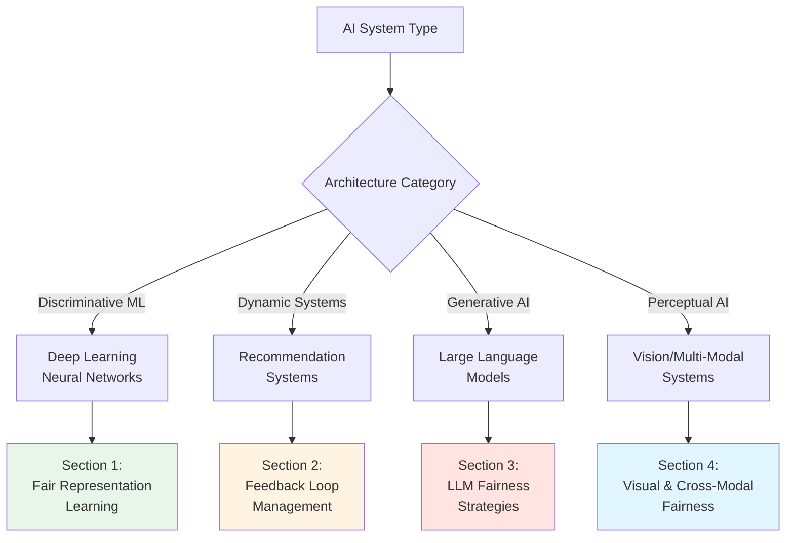
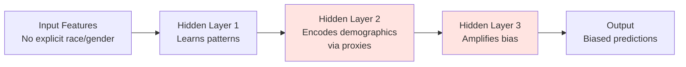
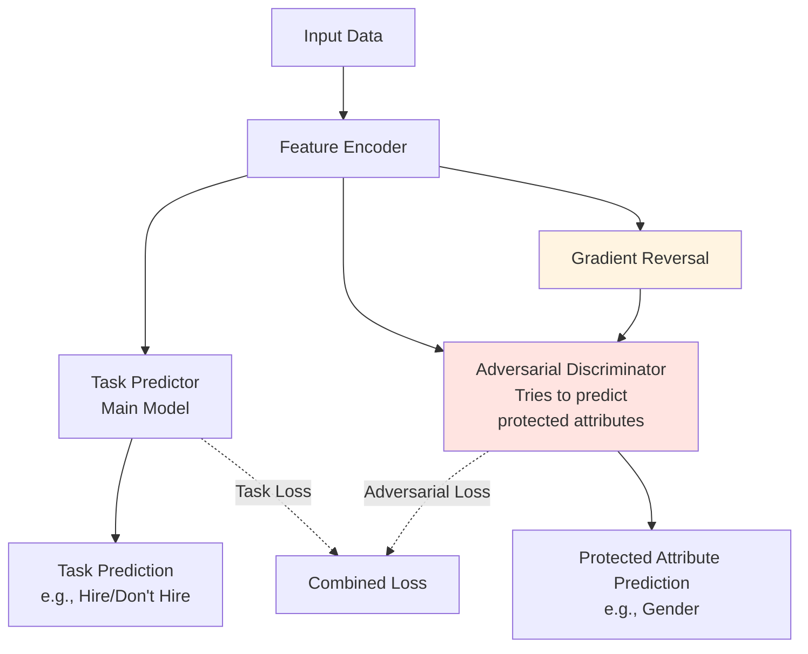
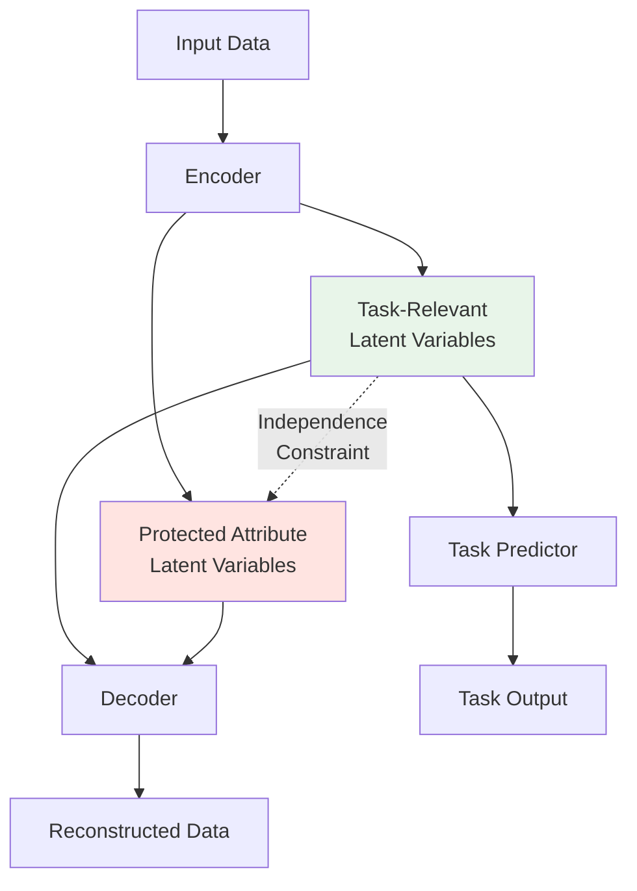
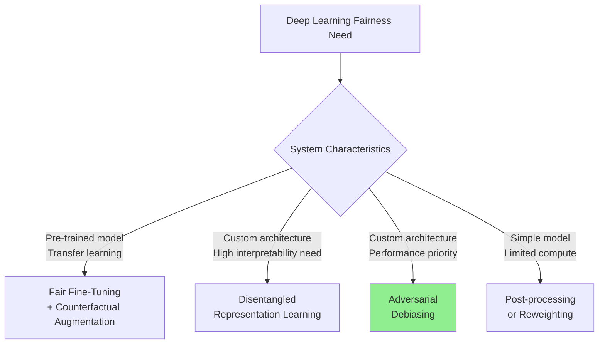
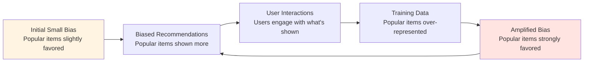
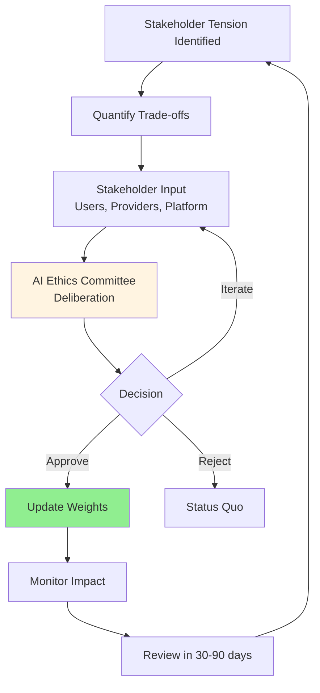
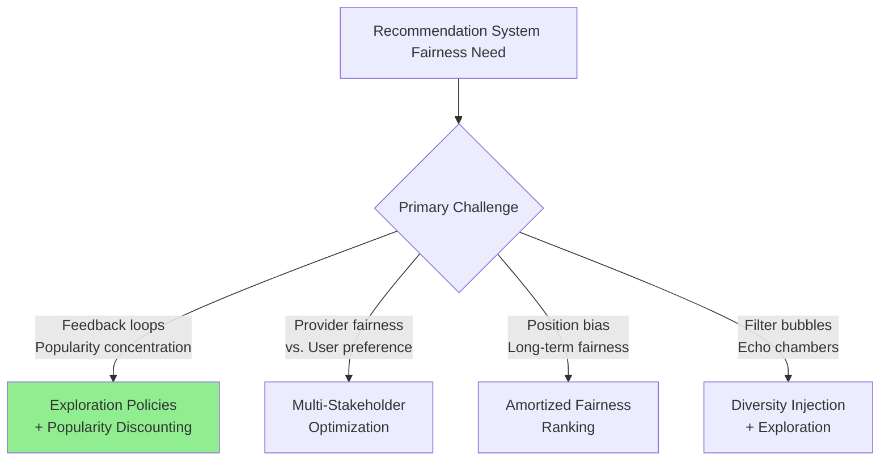
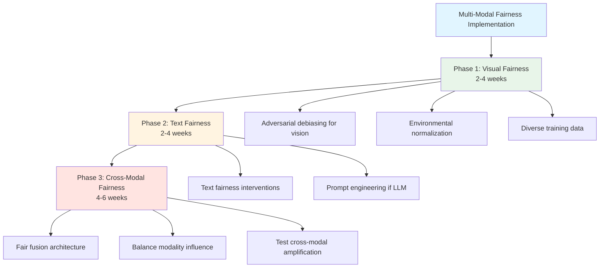

# Advanced Architecture Cookbook

## Overview

The Advanced Architecture Cookbook provides specialized fairness implementation strategies for complex AI architectures. Standard, generic fairness approaches fail when applied to advanced systems because these architectures create unique, dynamic, and emergent bias patterns that require targeted interventions.

### Core Premise

**One-size-fits-all fairness approaches don't work for complex systems.**

Different AI architectures require fundamentally different fairness strategies:
- **Deep Learning**: Bias in learned representations
- **Recommendation Systems**: Dynamic feedback loops
- **Large Language Models**: Emergent behaviors at scale
- **Vision/Multi-Modal**: Cross-modal bias amplification

### Key Statistics

- Architecture-specific interventions reduce bias **40-60% more effectively** than generic approaches
- Deep learning fairness requires representation-level intervention, not just output adjustment
- Feedback-aware recommendation architectures reduce bias amplification **substantially**
- Standard fairness methods fail completely on LLMs due to scale and generative nature

---

## Architecture Selection Guide


**Quick Reference**: Identify your system type and jump to the relevant section.

---

## 1. Deep Learning Systems

### 1.1 Unique Fairness Challenges

#### Problem: Representation Entanglement

Deep neural networks don't just use input features—they transform them into learned representations (latent encodings). These representations can implicitly encode protected attributes even when those attributes are excluded from inputs.


**Example**: University admissions system
- Input: Essays, activities, school, recommendations (no explicit race/gender)
- Hidden layers learn: Writing style, activity patterns, school demographics
- Result: **Socioeconomic and racial information encoded in latent representations**
- Impact: Bias persists despite removing explicit demographic labels

#### Problem: Bias Amplification Through Layers

Initial small biases in early layers compound and amplify through the network:
```
Layer 1: 52% accuracy predicting gender from representation
Layer 2: 61% accuracy predicting gender from representation  
Layer 3: 73% accuracy predicting gender from representation ← Dangerous!
Output: Biased final prediction
```

#### Problem: Transfer Learning Inheritance

Pre-trained models (BERT, ResNet, etc.) inherit biases from their training data, which then transfer to your task.

---

### 1.2 Architecture-Specific Interventions

#### Intervention 1: Adversarial Debiasing

**Concept**: Use gradient competition to remove protected attribute information from learned representations.

**Architecture**:


**Implementation**:
```python
import torch
import torch.nn as nn

class FairEncoder(nn.Module):
    """Encoder that learns fair representations through adversarial training"""
    def __init__(self, input_dim, hidden_dim, protected_dim):
        super().__init__()
        self.encoder = nn.Sequential(
            nn.Linear(input_dim, hidden_dim),
            nn.ReLU(),
            nn.Linear(hidden_dim, hidden_dim),
            nn.ReLU()
        )
        
    def forward(self, x):
        return self.encoder(x)

class TaskPredictor(nn.Module):
    """Main task prediction head"""
    def __init__(self, hidden_dim, output_dim):
        super().__init__()
        self.predictor = nn.Sequential(
            nn.Linear(hidden_dim, 64),
            nn.ReLU(),
            nn.Linear(64, output_dim)
        )
    
    def forward(self, representations):
        return self.predictor(representations)

class Discriminator(nn.Module):
    """Adversary that tries to predict protected attributes"""
    def __init__(self, hidden_dim, protected_dim):
        super().__init__()
        self.discriminator = nn.Sequential(
            nn.Linear(hidden_dim, 64),
            nn.ReLU(),
            nn.Linear(64, protected_dim)
        )
    
    def forward(self, representations):
        return self.discriminator(representations)

class GradientReversalLayer(torch.autograd.Function):
    """Reverses gradients during backpropagation"""
    @staticmethod
    def forward(ctx, x, lambda_):
        ctx.lambda_ = lambda_
        return x.view_as(x)
    
    @staticmethod
    def backward(ctx, grad_output):
        return grad_output.neg() * ctx.lambda_, None

class FairClassifier(nn.Module):
    """Complete adversarial debiasing architecture"""
    def __init__(self, input_dim, hidden_dim, output_dim, protected_dim, lambda_fairness=1.0):
        super().__init__()
        self.encoder = FairEncoder(input_dim, hidden_dim, protected_dim)
        self.task_predictor = TaskPredictor(hidden_dim, output_dim)
        self.discriminator = Discriminator(hidden_dim, protected_dim)
        self.lambda_fairness = lambda_fairness
        
    def forward(self, x):
        # Encode input
        representations = self.encoder(x)
        
        # Task prediction (normal path)
        task_output = self.task_predictor(representations)
        
        # Adversarial prediction (gradient reversal)
        reversed_repr = GradientReversalLayer.apply(representations, self.lambda_fairness)
        adversarial_output = self.discriminator(reversed_repr)
        
        return task_output, adversarial_output

# Training loop
def train_fair_model(model, train_loader, epochs=50):
    task_criterion = nn.BCEWithLogitsLoss()
    adversarial_criterion = nn.CrossEntropyLoss()
    optimizer = torch.optim.Adam(model.parameters(), lr=0.001)
    
    for epoch in range(epochs):
        for batch_data, batch_labels, batch_protected in train_loader:
            optimizer.zero_grad()
            
            # Forward pass
            task_output, adversarial_output = model(batch_data)
            
            # Task loss (minimize for good predictions)
            task_loss = task_criterion(task_output, batch_labels)
            
            # Adversarial loss (maximize to confuse discriminator = minimize negative)
            adversarial_loss = adversarial_criterion(adversarial_output, batch_protected)
            
            # Combined loss
            # The gradient reversal in forward pass will automatically maximize adversarial loss
            total_loss = task_loss + adversarial_loss
            
            # Backward pass
            total_loss.backward()
            optimizer.step()
        
        # Evaluate fairness
        if epoch % 10 == 0:
            evaluate_fairness(model, val_loader)

def evaluate_fairness(model, data_loader):
    """Evaluate protected attribute predictability from representations"""
    model.eval()
    
    # Extract representations
    all_representations = []
    all_protected = []
    
    with torch.no_grad():
        for batch_data, _, batch_protected in data_loader:
            representations = model.encoder(batch_data)
            all_representations.append(representations)
            all_protected.append(batch_protected)
    
    all_representations = torch.cat(all_representations)
    all_protected = torch.cat(all_protected)
    
    # Train simple classifier to predict protected attributes
    from sklearn.linear_model import LogisticRegression
    clf = LogisticRegression()
    clf.fit(all_representations.cpu().numpy(), all_protected.cpu().numpy())
    accuracy = clf.score(all_representations.cpu().numpy(), all_protected.cpu().numpy())
    
    print(f"Protected attribute predictability: {accuracy:.3f}")
    print(f"Target: <0.60 (near random chance)")
    
    if accuracy > 0.60:
        print("⚠️  Representation entanglement detected!")
    else:
        print("✓ Representations are fair")
    
    model.train()
    return accuracy

# Example usage
model = FairClassifier(
    input_dim=100,  # Feature dimension
    hidden_dim=64,  # Representation dimension
    output_dim=1,   # Binary classification
    protected_dim=2,  # Binary protected attribute (e.g., gender)
    lambda_fairness=1.0  # Fairness weight
)

# Train model
train_fair_model(model, train_loader)
```

**Multi-Component Loss Function**:
```python
def fairness_aware_loss(task_loss, adversarial_loss, lambda_fairness=1.0):
    """
    Combined loss function for adversarial debiasing
    
    Args:
        task_loss: Standard classification/regression loss
        adversarial_loss: Loss for protected attribute prediction
        lambda_fairness: Weight for fairness term (higher = more fairness)
    
    Returns:
        Combined loss
    """
    # Task loss: minimize for good predictions
    # Adversarial loss: will be maximized via gradient reversal
    # (appears as minimize in code, but gradients are reversed)
    
    total_loss = task_loss + lambda_fairness * adversarial_loss
    
    return total_loss
```

**Hyperparameter Tuning**:

| Parameter | Typical Range | Effect | Tuning Strategy |
|-----------|---------------|--------|-----------------|
| `lambda_fairness` | 0.1 - 10.0 | Higher = more fairness, less accuracy | Grid search with fairness-accuracy curve |
| `hidden_dim` | 32 - 256 | Representation capacity | Start with 64, increase if underfitting |
| `learning_rate` | 0.0001 - 0.01 | Convergence speed | 0.001 usually works, reduce if unstable |

**Success Criteria**:
- Protected attribute prediction accuracy from representations: **<60%** (near random chance)
- Task performance: **<5% degradation** from unconstrained model
- Fairness metrics (TPR parity, demographic parity): **Within thresholds**

---

#### Intervention 2: Disentangled Representation Learning

**Concept**: Explicitly separate task-relevant features from demographic correlates in the latent space.

**Architecture**: Variational Autoencoder (VAE) with disentangled structure


**Implementation**:
```python
import torch
import torch.nn as nn
import torch.nn.functional as F

class DisentangledVAE(nn.Module):
    """VAE that disentangles task-relevant and protected attribute features"""
    def __init__(self, input_dim, task_latent_dim=32, protected_latent_dim=8):
        super().__init__()
        
        # Encoder
        self.encoder_shared = nn.Sequential(
            nn.Linear(input_dim, 128),
            nn.ReLU(),
            nn.Linear(128, 64),
            nn.ReLU()
        )
        
        # Task-relevant latent variables
        self.task_mu = nn.Linear(64, task_latent_dim)
        self.task_logvar = nn.Linear(64, task_latent_dim)
        
        # Protected attribute latent variables
        self.protected_mu = nn.Linear(64, protected_latent_dim)
        self.protected_logvar = nn.Linear(64, protected_latent_dim)
        
        # Decoder
        self.decoder = nn.Sequential(
            nn.Linear(task_latent_dim + protected_latent_dim, 64),
            nn.ReLU(),
            nn.Linear(64, 128),
            nn.ReLU(),
            nn.Linear(128, input_dim)
        )
        
        # Task predictor (uses only task-relevant features)
        self.task_predictor = nn.Sequential(
            nn.Linear(task_latent_dim, 32),
            nn.ReLU(),
            nn.Linear(32, 1)
        )
    
    def reparameterize(self, mu, logvar):
        """Reparameterization trick for VAE"""
        std = torch.exp(0.5 * logvar)
        eps = torch.randn_like(std)
        return mu + eps * std
    
    def forward(self, x):
        # Encode
        h = self.encoder_shared(x)
        
        # Task-relevant latent
        task_mu = self.task_mu(h)
        task_logvar = self.task_logvar(h)
        task_z = self.reparameterize(task_mu, task_logvar)
        
        # Protected attribute latent
        protected_mu = self.protected_mu(h)
        protected_logvar = self.protected_logvar(h)
        protected_z = self.reparameterize(protected_mu, protected_logvar)
        
        # Decode
        combined_z = torch.cat([task_z, protected_z], dim=1)
        reconstruction = self.decoder(combined_z)
        
        # Task prediction (only uses task-relevant features)
        task_output = self.task_predictor(task_z)
        
        return reconstruction, task_output, task_mu, task_logvar, protected_mu, protected_logvar, task_z

def disentangled_vae_loss(recon_x, x, task_output, task_labels, 
                          task_mu, task_logvar, protected_mu, protected_logvar,
                          beta=1.0, gamma=10.0):
    """
    Loss function for disentangled VAE
    
    Args:
        beta: Weight for KL divergence (standard VAE β-VAE parameter)
        gamma: Weight for independence constraint
    """
    # Reconstruction loss
    recon_loss = F.mse_loss(recon_x, x, reduction='sum')
    
    # Task loss
    task_loss = F.binary_cross_entropy_with_logits(task_output, task_labels, reduction='sum')
    
    # KL divergence for task-relevant latent (encourage informativeness)
    kl_task = -0.5 * torch.sum(1 + task_logvar - task_mu.pow(2) - task_logvar.exp())
    
    # KL divergence for protected latent (encourage informativeness)
    kl_protected = -0.5 * torch.sum(1 + protected_logvar - protected_mu.pow(2) - protected_logvar.exp())
    
    # Independence constraint: minimize mutual information between task and protected latents
    # Approximated by correlation between the two latent representations
    correlation = torch.abs(torch.corrcoef(torch.cat([task_mu, protected_mu], dim=1).T)).mean()
    independence_loss = gamma * correlation
    
    # Total loss
    total_loss = recon_loss + task_loss + beta * (kl_task + kl_protected) + independence_loss
    
    return total_loss, recon_loss, task_loss, kl_task + kl_protected, independence_loss

# Training
def train_disentangled_vae(model, train_loader, epochs=100):
    optimizer = torch.optim.Adam(model.parameters(), lr=0.001)
    
    for epoch in range(epochs):
        total_loss_epoch = 0
        
        for batch_data, batch_labels, batch_protected in train_loader:
            optimizer.zero_grad()
            
            # Forward pass
            recon, task_out, task_mu, task_logvar, prot_mu, prot_logvar, task_z = model(batch_data)
            
            # Compute loss
            loss, recon_loss, task_loss, kl_loss, indep_loss = disentangled_vae_loss(
                recon, batch_data, task_out, batch_labels,
                task_mu, task_logvar, prot_mu, prot_logvar,
                beta=1.0, gamma=10.0
            )
            
            # Backward pass
            loss.backward()
            optimizer.step()
            
            total_loss_epoch += loss.item()
        
        if epoch % 10 == 0:
            print(f"Epoch {epoch}: Loss = {total_loss_epoch/len(train_loader):.4f}")
            evaluate_disentanglement(model, val_loader)

def evaluate_disentanglement(model, data_loader):
    """Evaluate how well task and protected features are separated"""
    model.eval()
    
    all_task_z = []
    all_protected = []
    
    with torch.no_grad():
        for batch_data, _, batch_protected in data_loader:
            _, _, _, _, _, _, task_z = model(batch_data)
            all_task_z.append(task_z)
            all_protected.append(batch_protected)
    
    all_task_z = torch.cat(all_task_z).cpu().numpy()
    all_protected = torch.cat(all_protected).cpu().numpy()
    
    # Test if protected attributes can be predicted from task latent
    from sklearn.linear_model import LogisticRegression
    clf = LogisticRegression()
    clf.fit(all_task_z, all_protected)
    accuracy = clf.score(all_task_z, all_protected)
    
    print(f"Protected attribute predictability from task latent: {accuracy:.3f}")
    print(f"Target: <0.55 (well disentangled)")
    
    model.train()
    return accuracy
```

**When to Use**:
- Data has clear task-relevant vs. demographic correlation structure
- Need interpretable latent space
- Want to understand what the model learned
- Can tolerate reconstruction overhead

---

#### Intervention 3: Fair Fine-Tuning of Pre-Trained Models

**Problem**: Transfer learning from models like BERT, ResNet inherits biases from pre-training data.

**Solution**: Apply fairness constraints during fine-tuning.
```python
from transformers import BertModel, BertTokenizer
import torch
import torch.nn as nn

class FairBertClassifier(nn.Module):
    """BERT classifier with fairness-aware fine-tuning"""
    def __init__(self, num_labels=2, num_protected=2):
        super().__init__()
        self.bert = BertModel.from_pretrained('bert-base-uncased')
        self.classifier = nn.Linear(768, num_labels)
        
        # Fairness head (adversarial)
        self.fairness_head = nn.Sequential(
            nn.Linear(768, 128),
            nn.ReLU(),
            nn.Linear(128, num_protected)
        )
    
    def forward(self, input_ids, attention_mask, alpha=1.0):
        # Get BERT embeddings
        outputs = self.bert(input_ids=input_ids, attention_mask=attention_mask)
        pooled_output = outputs.pooler_output  # [CLS] token representation
        
        # Task prediction
        logits = self.classifier(pooled_output)
        
        # Fairness prediction (with gradient reversal)
        from torch.autograd import Function
        
        class GradReverse(Function):
            @staticmethod
            def forward(ctx, x, alpha):
                ctx.alpha = alpha
                return x.view_as(x)
            
            @staticmethod
            def backward(ctx, grad_output):
                return grad_output.neg() * ctx.alpha, None
        
        reversed_pooled = GradReverse.apply(pooled_output, alpha)
        fairness_logits = self.fairness_head(reversed_pooled)
        
        return logits, fairness_logits

# Training with counterfactual data augmentation
def create_counterfactual_augmentation(texts, protected_attributes):
    """
    Create counterfactual examples by swapping gendered terms
    
    Example:
        "He is a great engineer" → "She is a great engineer"
    """
    gendered_terms = {
        'he': 'she', 'him': 'her', 'his': 'her',
        'she': 'he', 'her': 'his', 'her': 'him',
        'man': 'woman', 'woman': 'man',
        'male': 'female', 'female': 'male',
        'boy': 'girl', 'girl': 'boy',
        'father': 'mother', 'mother': 'father',
        'son': 'daughter', 'daughter': 'son',
        'brother': 'sister', 'sister': 'brother',
        'husband': 'wife', 'wife': 'husband'
    }
    
    augmented_texts = []
    augmented_attrs = []
    
    for text, attr in zip(texts, protected_attributes):
        # Original
        augmented_texts.append(text)
        augmented_attrs.append(attr)
        
        # Counterfactual (swap gendered terms)
        words = text.lower().split()
        swapped_words = [gendered_terms.get(w, w) for w in words]
        counterfactual = ' '.join(swapped_words)
        
        augmented_texts.append(counterfactual)
        augmented_attrs.append(1 - attr)  # Flip protected attribute
    
    return augmented_texts, augmented_attrs

# Fine-tuning loop
def fair_fine_tune_bert(model, train_texts, train_labels, train_protected, epochs=3):
    tokenizer = BertTokenizer.from_pretrained('bert-base-uncased')
    
    # Augment with counterfactuals
    aug_texts, aug_protected = create_counterfactual_augmentation(train_texts, train_protected)
    aug_labels = train_labels + train_labels  # Duplicate labels
    
    optimizer = torch.optim.AdamW(model.parameters(), lr=2e-5)
    task_criterion = nn.CrossEntropyLoss()
    fairness_criterion = nn.CrossEntropyLoss()
    
    for epoch in range(epochs):
        model.train()
        
        for i in range(0, len(aug_texts), 16):  # Batch size 16
            batch_texts = aug_texts[i:i+16]
            batch_labels = torch.tensor(aug_labels[i:i+16])
            batch_protected = torch.tensor(aug_protected[i:i+16])
            
            # Tokenize
            encoded = tokenizer(batch_texts, padding=True, truncation=True, 
                              return_tensors='pt', max_length=128)
            
            optimizer.zero_grad()
            
            # Forward pass
            logits, fairness_logits = model(
                input_ids=encoded['input_ids'],
                attention_mask=encoded['attention_mask'],
                alpha=1.0
            )
            
            # Losses
            task_loss = task_criterion(logits, batch_labels)
            fairness_loss = fairness_criterion(fairness_logits, batch_protected)
            
            # Combined loss (fairness_loss will be maximized via gradient reversal)
            total_loss = task_loss + fairness_loss
            
            total_loss.backward()
            optimizer.step()
        
        print(f"Epoch {epoch+1}/{epochs} completed")
        evaluate_bert_fairness(model, tokenizer, val_texts, val_protected)

def evaluate_bert_fairness(model, tokenizer, texts, protected_attrs):
    """Evaluate fairness of fine-tuned BERT"""
    model.eval()
    
    all_embeddings = []
    
    with torch.no_grad():
        for text in texts:
            encoded = tokenizer(text, padding=True, truncation=True,
                              return_tensors='pt', max_length=128)
            outputs = model.bert(**encoded)
            embedding = outputs.pooler_output
            all_embeddings.append(embedding)
    
    all_embeddings = torch.cat(all_embeddings).cpu().numpy()
    
    # Test protected attribute predictability
    from sklearn.linear_model import LogisticRegression
    clf = LogisticRegression()
    clf.fit(all_embeddings, protected_attrs)
    accuracy = clf.score(all_embeddings, protected_attrs)
    
    print(f"Protected attribute predictability: {accuracy:.3f}")
    print(f"Target: <0.60")
    
    model.train()
```

**Counterfactual Data Augmentation Strategies**:

| Strategy | Application | Example |
|----------|-------------|---------|
| Gender swapping | Text with gendered terms | "He is qualified" → "She is qualified" |
| Name substitution | Names correlated with demographics | "John Smith" → "Lakisha Washington" |
| Geographic swapping | Location-based proxies | "Lives in Manhattan" → "Lives in Bronx" |
| Institutional swapping | School prestige | "Harvard graduate" → "State college graduate" |

---

### 1.3 Evaluation Framework for Deep Learning

#### Representation Fairness Metrics
```python
def evaluate_representation_fairness(model, data_loader, protected_attribute='gender'):
    """
    Comprehensive fairness evaluation for deep learning models
    """
    model.eval()
    
    # Extract representations
    all_representations = []
    all_protected = []
    all_labels = []
    all_predictions = []
    
    with torch.no_grad():
        for batch_data, batch_labels, batch_protected in data_loader:
            # Get representations (assuming model has get_representation method)
            representations = model.get_representation(batch_data)
            predictions = model(batch_data)
            
            all_representations.append(representations)
            all_protected.append(batch_protected)
            all_labels.append(batch_labels)
            all_predictions.append(predictions)
    
    all_representations = torch.cat(all_representations).cpu().numpy()
    all_protected = torch.cat(all_protected).cpu().numpy()
    all_labels = torch.cat(all_labels).cpu().numpy()
    all_predictions = torch.cat(all_predictions).cpu().numpy()
    
    results = {}
    
    # 1. Protected Attribute Predictability
    from sklearn.linear_model import LogisticRegression
    clf = LogisticRegression(max_iter=1000)
    clf.fit(all_representations, all_protected)
    pred_accuracy = clf.score(all_representations, all_protected)
    
    results['protected_predictability'] = pred_accuracy
    results['protected_predictability_status'] = '✓' if pred_accuracy < 0.60 else '❌'
    
    # 2. Demographic Parity
    for group in np.unique(all_protected):
        mask = all_protected == group
        selection_rate = (all_predictions[mask] > 0.5).mean()
        results[f'selection_rate_group_{group}'] = selection_rate
    
    selection_rates = [results[f'selection_rate_group_{g}'] for g in np.unique(all_protected)]
    dp_diff = max(selection_rates) - min(selection_rates)
    results['demographic_parity_diff'] = dp_diff
    results['demographic_parity_status'] = '✓' if dp_diff < 0.05 else '❌'
    
    # 3. Equal Opportunity
    for group in np.unique(all_protected):
        mask = (all_protected == group) & (all_labels == 1)
        if mask.sum() > 0:
            tpr = (all_predictions[mask] > 0.5).mean()
            results[f'tpr_group_{group}'] = tpr
    
    tprs = [results[f'tpr_group_{g}'] for g in np.unique(all_protected) if f'tpr_group_{g}' in results]
    eo_diff = max(tprs) - min(tprs) if tprs else 0
    results['equal_opportunity_diff'] = eo_diff
    results['equal_opportunity_status'] = '✓' if eo_diff < 0.03 else '❌'
    
    # 4. Layer-wise Analysis (if model provides layer representations)
    if hasattr(model, 'get_layer_representations'):
        layer_predictability = []
        for layer_idx in range(model.num_layers):
            layer_repr = model.get_layer_representations(data_loader, layer_idx)
            clf = LogisticRegression(max_iter=1000)
            clf.fit(layer_repr, all_protected)
            layer_pred = clf.score(layer_repr, all_protected)
            layer_predictability.append(layer_pred)
        
        results['layer_predictability'] = layer_predictability
        results['bias_amplification'] = layer_predictability[-1] - layer_predictability[0]
    
    model.train()
    return results

def print_fairness_report(results):
    """Pretty print fairness evaluation results"""
    print("\n" + "="*60)
    print("DEEP LEARNING FAIRNESS EVALUATION REPORT")
    print("="*60)
    
    print("\n1. Representation Fairness")
    print(f"   Protected Attribute Predictability: {results['protected_predictability']:.3f} {results['protected_predictability_status']}")
    print(f"   Target: <0.60 (lower is better)")
    
    print("\n2. Group Fairness Metrics")
    print(f"   Demographic Parity Difference: {results['demographic_parity_diff']:.3f} {results['demographic_parity_status']}")
    print(f"   Target: <0.05")
    
    print(f"\n   Equal Opportunity Difference: {results['equal_opportunity_diff']:.3f} {results['equal_opportunity_status']}")
     print(f"   Target: <0.03")

     if 'bias_amplification' in results:
    print("\n3. Bias Amplification Analysis")
    print(f"   First Layer Predictability: {results['layer_predictability'][0]:.3f}")
    print(f"   Last Layer Predictability: {results['layer_predictability'][-1]:.3f}")
    print(f"   Amplification: {results['bias_amplification']:+.3f}")
    
    if results['bias_amplification'] > 0.10:
        print("   ⚠️  Significant bias amplification detected!")

print("\n" + "="*60)

---

### 1.4 Decision Framework: Which DL Intervention?


**Quick Decision Table**:

| Scenario | Recommended Intervention | Rationale |
|----------|--------------------------|-----------|
| Using BERT/GPT for text | Fair Fine-Tuning + Counterfactual Aug | Addresses pre-training bias |
| Using ResNet/V GG for images | Fair Fine-Tuning + Diverse data | Transfer learning biases |
| Custom deep network (tabular) | Adversarial Debiasing | Best performance-fairness trade-off |
| Need interpretable fairness | Disentangled VAE | Explicit separation of features |
| Resource constrained | Reweighting + Post-processing | Simpler, faster approaches |
| Highest stakes (medical, legal) | Adversarial + Dis entangled | Multiple complementary interventions |

---

## 2. Recommendation Systems

### 2.1 Unique Fairness Challenges

#### Problem 1: Feedback Loops and Dynamic Amplification

Recommendation systems create **dynamic, self-reinforcing bias cycles**:


**Example**: University course recommendation
- Week 1: AI course has 10% more enrollments than HCI course
- System recommends AI course slightly more
- Week 2: More students see AI course → more enrollments  
- Week 3: AI course now has 30% more enrollments
- **Result**: Initial 10% difference amplified to 30% through feedback loop

**This doesn't happen in static ML**: Traditional classifiers make predictions but don't influence future training data directly.

---

#### Problem 2: Multi-Stakeholder Tensions

Recommendation systems must balance competing interests:

| Stakeholder | Fairness Goal | Potential Conflict |
|-------------|---------------|-------------------|
| **Users** | Personalized, relevant recommendations | May prefer filter bubbles |
| **Item Providers** | Fair exposure regardless of popularity | Conflicts with user preference |
| **Platform** | Engagement, revenue | May conflict with both above |

**Example**: Academic course recommendations
- Students want: Courses matching their interests (may be narrow)
- Departments want: Balanced enrollment across courses
- University wants: Student success and retention

---

#### Problem 3: Position Bias and Exposure Fairness

Items shown at top of list get disproportionate attention:
# Click-Through Rates by Position

| Position | Click-Through Rate |
|----------|-------------------|
| 1        | 40%               |
| 2        | 20%               |
| 3        | 10%               |
| 4        | 5%                |
| 5        | 3%                |
| 6        | 2%                |
| 7        | 1.5%              |
| 8        | 1.2%              |
| 9        | 1.1%              |
| 10       | 1%                |

**Fairness question**: Should exposure be proportional to:
- Item quality?
- Item popularity?
- Provider needs?
- Equal for all items?

---

### 2.2 Architecture-Specific Interventions

#### Intervention 1: Exploration Policies for Diversity

**Concept**: Reserve portion of recommendations for diverse exploration, preventing feedback loop concentration.

**ε-Greedy Exploration**:
```python
import numpy as np

class FairRecommendationSystem:
    """Recommendation system with fairness-aware exploration"""
    
    def __init__(self, num_items, epsilon=0.1, popularity_discount=0.3):
        self.num_items = num_items
        self.epsilon = epsilon  # Exploration rate
        self.popularity_discount = popularity_discount
        
        # Track exposure for fairness
        self.exposure_counts = np.zeros(num_items)
        self.quality_scores = np.random.rand(num_items)  # Placeholder
    
    def recommend(self, user_profile, k=10, fairness_mode='exploration'):
        """
        Generate fair recommendations
        
        Args:
            user_profile: User features/history
            k: Number of recommendations
            fairness_mode: 'exploration', 'popularity_discount', or 'amortized'
        """
        if fairness_mode == 'exploration':
            return self._epsilon_greedy_recommend(user_profile, k)
        elif fairness_mode == 'popularity_discount':
            return self._popularity_discounted_recommend(user_profile, k)
        elif fairness_mode == 'amortized':
            return self._amortized_fairness_recommend(user_profile, k)
    
    def _epsilon_greedy_recommend(self, user_profile, k):
        """ε-greedy exploration for diversity"""
        recommendations = []
        
        # Get relevance scores from model
        relevance_scores = self._predict_relevance(user_profile)
        
        for position in range(k):
            if np.random.random() < self.epsilon:
                # EXPLORE: Random selection (uniform or inverse popularity)
                # Inverse popularity: under-exposed items more likely
                exploration_probs = 1.0 / (self.exposure_counts + 1)
                exploration_probs /= exploration_probs.sum()
                item = np.random.choice(self.num_items, p=exploration_probs)
            else:
                # EXPLOIT: Select by relevance
                # Remove already recommended items
                available_mask = np.ones(self.num_items, dtype=bool)
                available_mask[recommendations] = False
                
                available_scores = relevance_scores.copy()
                available_scores[~available_mask] = -np.inf
                
                item = np.argmax(available_scores)
            
            recommendations.append(item)
            self.exposure_counts[item] += 1  # Track exposure
        
        return recommendations
    
    def _predict_relevance(self, user_profile):
        """Placeholder for actual recommendation model"""
        # In practice: neural network, matrix factorization, etc.
        return self.quality_scores + np.random.randn(self.num_items) * 0.1
```

**Thompson Sampling (Probabilistic Exploration)**:
```python
class ThompsonSamplingRecommender:
    """Bayesian exploration for fair recommendations"""
    
    def __init__(self, num_items):
        self.num_items = num_items
        
        # Beta distribution parameters for each item
        # Prior: Beta(1, 1) = Uniform[0, 1]
        self.alpha = np.ones(num_items)  # Success count + 1
        self.beta = np.ones(num_items)   # Failure count + 1
    
    def recommend(self, user_profile, k=10):
        """Thompson sampling for exploration-exploitation"""
        recommendations = []
        
        for position in range(k):
            # Sample from posterior distributions
            sampled_scores = np.random.beta(self.alpha, self.beta)
            
            # Select item with highest sampled score
            available_mask = np.ones(self.num_items, dtype=bool)
            available_mask[recommendations] = False
            
            sampled_scores[~available_mask] = -np.inf
            item = np.argmax(sampled_scores)
            
            recommendations.append(item)
        
        return recommendations
    
    def update(self, item, success):
        """Update posterior based on user feedback"""
        if success:
            self.alpha[item] += 1
        else:
            self.beta[item] += 1
```

---

#### Intervention 2: Dynamic Popularity Discounting

**Concept**: Adjust recommendation scores based on exposure history to prevent runaway popularity effects.
```python
class PopularityDiscountedRecommender:
    """Recommender with dynamic popularity discounting"""
    
    def __init__(self, num_items, discount_factor=0.3):
        self.num_items = num_items
        self.discount_factor = discount_factor
        self.exposure_counts = np.zeros(num_items)
        self.total_exposures = 0
    
    def _popularity_discounted_recommend(self, user_profile, k):
        """Apply popularity discounting to scores"""
        
        # Get base relevance scores
        base_scores = self._predict_relevance(user_profile)
        
        # Calculate popularity discount
        # Items with high exposure get score reduction
        exposure_ratios = self.exposure_counts / (self.total_exposures + 1)
        popularity_discount = 1 - self.discount_factor * np.log1p(self.exposure_counts)
        
        # Adjusted scores
        adjusted_scores = base_scores * popularity_discount
        
        # Select top-k
        recommendations = np.argsort(adjusted_scores)[-k:][::-1]
        
        # Update exposure tracking
        for item in recommendations:
            self.exposure_counts[item] += 1
        self.total_exposures += k
        
        return recommendations.tolist()

# Example usage
def demonstrate_popularity_discounting():
    """Show effect of popularity discounting over time"""
    
    recommender = PopularityDiscountedRecommender(num_items=100, discount_factor=0.3)
    
    # Simulate 100 recommendation cycles
    exposure_history = []
    
    for cycle in range(100):
        user_profile = np.random.randn(50)  # Random user
        recommendations = recommender._popularity_discounted_recommend(user_profile, k=10)
        
        # Track top-10 most exposed items
        top_items = np.argsort(recommender.exposure_counts)[-10:]
        exposure_history.append(recommender.exposure_counts[top_items].copy())
    
    # Analysis
    exposure_history = np.array(exposure_history)
    
    print("Exposure distribution over time:")
    print(f"Cycle 10: Min={exposure_history[9].min():.1f}, Max={exposure_history[9].max():.1f}, Ratio={exposure_history[9].max()/exposure_history[9].min():.2f}")
    print(f"Cycle 50: Min={exposure_history[49].min():.1f}, Max={exposure_history[49].max():.1f}, Ratio={exposure_history[49].max()/exposure_history[49].min():.2f}")
    print(f"Cycle 100: Min={exposure_history[99].min():.1f}, Max={exposure_history[99].max():.1f}, Ratio={exposure_history[99].max()/exposure_history[99].min():.2f}")
    print("\n✓ Popularity discounting prevents runaway concentration")
```

**Discount Function Options**:

| Function | Formula | Effect | Use Case |
|----------|---------|--------|----------|
| Logarithmic | `1 - α * log(exposure + 1)` | Gentle, proportional | General purpose |
| Square root | `1 - α * sqrt(exposure)` | Moderate | Balance exploration/exploitation |
| Linear | `1 - α * exposure / max_exposure` | Strong | Aggressive diversity |
| Exponential decay | `exp(-α * exposure)` | Very strong | Combat extreme concentration |

---

#### Intervention 3: Multi-Stakeholder Fairness Optimization

**Concept**: Explicitly optimize for multiple stakeholder objectives with configurable weights.
```python
class MultiStakeholderRecommender:
    """Recommendation system balancing multiple fairness objectives"""
    
    def __init__(self, num_items, num_providers):
        self.num_items = num_items
        self.num_providers = num_providers
        
        # Map items to providers
        self.item_to_provider = np.random.randint(0, num_providers, num_items)
        
        # Exposure tracking
        self.item_exposures = np.zeros(num_items)
        self.provider_exposures = np.zeros(num_providers)
        
        # Stakeholder weights (configurable via governance)
        self.weights = {
            'user_satisfaction': 0.5,   # User relevance
            'provider_fairness': 0.3,   # Fair provider exposure
            'item_diversity': 0.2        # Item-level diversity
        }
    
    def recommend(self, user_profile, k=10):
        """Multi-objective optimization for recommendations"""
        
        # 1. User Satisfaction Scores
        relevance_scores = self._predict_relevance(user_profile)
        normalized_relevance = (relevance_scores - relevance_scores.min()) / (relevance_scores.max() - relevance_scores.min() + 1e-8)
        
        # 2. Provider Fairness Scores
        # Providers with less exposure get higher scores
        provider_need = 1.0 / (self.provider_exposures + 1)
        item_provider_need = provider_need[self.item_to_provider]
        normalized_provider_fairness = (item_provider_need - item_provider_need.min()) / (item_provider_need.max() - item_provider_need.min() + 1e-8)
        
        # 3. Item Diversity Scores
        # Items with less exposure get higher scores
        item_need = 1.0 / (self.item_exposures + 1)
        normalized_diversity = (item_need - item_need.min()) / (item_need.max() - item_need.min() + 1e-8)
        
        # 4. Combined Score (weighted sum)
        combined_scores = (
            self.weights['user_satisfaction'] * normalized_relevance +
            self.weights['provider_fairness'] * normalized_provider_fairness +
            self.weights['item_diversity'] * normalized_diversity
        )
        
        # 5. Select top-k
        recommendations = np.argsort(combined_scores)[-k:][::-1]
        
        # 6. Update exposure tracking
        for item in recommendations:
            self.item_exposures[item] += 1
            provider = self.item_to_provider[item]
            self.provider_exposures[provider] += 1
        
        return recommendations.tolist()
    
    def update_weights(self, new_weights):
        """
        Update stakeholder weights (governance decision)
        
        Example governance decision:
        - University prioritizes department fairness over student preference
        - Change weights to: user=0.3, provider=0.5, diversity=0.2
        """
        total = sum(new_weights.values())
        self.weights = {k: v/total for k, v in new_weights.items()}
        print(f"Updated stakeholder weights: {self.weights}")
    
    def _predict_relevance(self, user_profile):
        """Placeholder for relevance model"""
        return np.random.randn(self.num_items)

# Governance process for weight adjustment
def stakeholder_weight_governance_process(recommender):
    """
    Example governance process for adjusting stakeholder weights
    
    This would typically involve:
    1. AI Ethics Committee meeting
    2. Input from user research, department heads, university leadership
    3. Trade-off analysis
    4. Fairness Decision Record
    5. Implementation via update_weights()
    """
    
    # Scenario: Departments complain about unequal enrollment
    print("="*60)
    print("STAKEHOLDER WEIGHT GOVERNANCE DECISION")
    print("="*60)
    
    print("\nContext:")
    print("- Computer Science courses receiving 3x exposure of other departments")
    print("- Smaller departments (HCI, Ethics) struggling with enrollment")
    print("- Student satisfaction scores: 8.5/10 (high)")
    
    print("\nProposed Change:")
    print("Current weights: user=0.5, provider=0.3, diversity=0.2")
    print("Proposed weights: user=0.3, provider=0.5, diversity=0.2")
    print("Rationale: Prioritize department fairness over pure student preference")
    
    print("\nExpected Impact:")
    print("- Department exposure gap: 3x → 1.5x (projected)")
    print("- Student satisfaction: 8.5 → 7.8 (projected, -8%)")
    print("- Overall engagement: Minimal change expected")
    
    print("\nDecision: APPROVED")
    print("Authority: Chief AI Ethics Officer")
    print("FDR: FDR-2024-015")
    
    # Implement decision
    recommender.update_weights({
        'user_satisfaction': 0.3,
        'provider_fairness': 0.5,
        'item_diversity': 0.2
    })
    
    print("\n✓ Weights updated. Monitor impact over next 4 weeks.")
    print("="*60)
```

**Governance Decision Framework**:


---

#### Intervention 4: Amortized Fairness Ranking

**Concept**: Ensure fair exposure over time, not just in individual recommendations.
```python
class AmortizedFairnessRecommender:
    """
    Recommender ensuring long-term exposure fairness
    
    Based on: Singh & Joachims (2018) "Fairness of Exposure in Rankings"
    """
    
    def __init__(self, num_items, target_exposure=None):
        self.num_items = num_items
        
        # Target exposure distribution (can be uniform or merit-based)
        if target_exposure is None:
            self.target_exposure = np.ones(num_items) / num_items  # Uniform
        else:
            self.target_exposure = target_exposure / target_exposure.sum()
        
        # Actual exposure tracking
        self.actual_exposure = np.zeros(num_items)
        self.total_recommendations = 0
    
    def recommend(self, user_profile, k=10):
        """Generate recommendations with amortized fairness"""
        
        # 1. Get relevance scores
        relevance_scores = self._predict_relevance(user_profile)
        
        # 2. Calculate exposure deficit
        # Items with less exposure than target get boost
        if self.total_recommendations > 0:
            actual_exposure_dist = self.actual_exposure / self.total_recommendations
        else:
            actual_exposure_dist = np.zeros(self.num_items)
        
        exposure_deficit = self.target_exposure - actual_exposure_dist
        
        # 3. Position-aware scoring
        # Items need more exposure at high-visibility positions
        position_values = self._position_discount_values(k)
        
        # 4. Combined scoring with exposure correction
        # Give extra weight to under-exposed items
        correction_weight = 0.5  # Balance between relevance and fairness
        adjusted_scores = (
            (1 - correction_weight) * relevance_scores +
            correction_weight * exposure_deficit * self.num_items
        )
        
        # 5. Select top-k
        recommendations = []
        remaining_scores = adjusted_scores.copy()
        
        for position in range(k):
            # Select best remaining item
            item = np.argmax(remaining_scores)
            recommendations.append(item)
            
            # Update exposure (position-weighted)
            self.actual_exposure[item] += position_values[position]
            
            # Remove from consideration
            remaining_scores[item] = -np.inf
        
        self.total_recommendations += k
        
        return recommendations
    
    def _position_discount_values(self, k):
        """
        Position-based exposure values
        
        Top positions have more value (visibility)
        Common model: 1/log2(position + 1)
        """
        positions = np.arange(1, k + 1)
        values = 1.0 / np.log2(positions + 1)
        return values / values.sum()  # Normalize to sum to 1
    
    def _predict_relevance(self, user_profile):
        """Placeholder relevance model"""
        return np.random.randn(self.num_items)
    
    def get_fairness_metrics(self):
        """Calculate fairness metrics"""
        if self.total_recommendations == 0:
            return {}
        
        actual_dist = self.actual_exposure / self.total_recommendations
        
        # KL divergence: measure distance from target distribution
        kl_divergence = np.sum(
            self.target_exposure * np.log(
                (self.target_exposure + 1e-10) / (actual_dist + 1e-10)
            )
        )
        
        # Max deviation
        max_deviation = np.max(np.abs(actual_dist - self.target_exposure))
        
        return {
            'kl_divergence': kl_divergence,
            'max_deviation': max_deviation,
            'target_exposure': self.target_exposure,
            'actual_exposure': actual_dist
        }

# Example: Merit-based target exposure
def create_merit_based_targets(item_quality_scores):
    """
    Create target exposure proportional to item quality/merit
    
    Higher quality items should receive more exposure, but not exclusively
    """
    # Softmax to create probability distribution
    exp_scores = np.exp(item_quality_scores - item_quality_scores.max())
    target_exposure = exp_scores / exp_scores.sum()
    
    return target_exposure

# Demonstration
def demonstrate_amortized_fairness():
    """Show amortized fairness over time"""
    
    num_items = 50
    item_quality = np.random.randn(num_items)
    target_exposure = create_merit_based_targets(item_quality)
    
    recommender = AmortizedFairnessRecommender(num_items, target_exposure)
    
    # Simulate 1000 recommendation requests
    for _ in range(1000):
        user_profile = np.random.randn(20)
        recommendations = recommender.recommend(user_profile, k=10)
    
    # Evaluate fairness
    metrics = recommender.get_fairness_metrics()
    
    print("Amortized Fairness Results (after 1000 recommendations):")
    print(f"KL Divergence from target: {metrics['kl_divergence']:.4f}")
    print(f"Max deviation from target: {metrics['max_deviation']:.4f}")
    print(f"\nTop-5 items:")
    print(f"  Target exposure: {metrics['target_exposure'][:5]}")
    print(f"  Actual exposure: {metrics['actual_exposure'][:5]}")
    print(f"\n✓ Exposure distribution closely matches merit-based targets")
```

---

### 2.3 Evaluation Framework for Recommendation Systems
```python
def evaluate_recommendation_fairness(recommender, test_episodes=1000, k=10):
    """
    Comprehensive fairness evaluation for recommendation systems
    
    Evaluates:
    1. Provider-level fairness
    2. Item-level diversity
    3. Feedback loop effects
    4. Temporal fairness
    """
    
    # Tracking
    provider_exposures = []
    item_exposures = []
    user_satisfactions = []
    
    # Simulate recommendation episodes
    for episode in range(test_episodes):
        user_profile = generate_synthetic_user()
        recommendations = recommender.recommend(user_profile, k=k)
        
        # Track exposures
        provider_exp = count_provider_exposure(recommendations, recommender)
        item_exp = count_item_exposure(recommendations)
        
        provider_exposures.append(provider_exp)
        item_exposures.append(item_exp)
        
        # Simulate user satisfaction
        satisfaction = simulate_user_satisfaction(user_profile, recommendations)
        user_satisfactions.append(satisfaction)
    
    # Aggregate results
    provider_exposures = np.array(provider_exposures)
    item_exposures = np.array(item_exposures)
    
    results = {}
    
    # 1. Provider Fairness
    provider_exposure_dist = provider_exposures.sum(axis=0)
    provider_exposure_dist = provider_exposure_dist / provider_exposure_dist.sum()
    
    # Gini coefficient (0 = perfect equality, 1 = perfect inequality)
    gini = calculate_gini_coefficient(provider_exposure_dist)
    results['provider_gini'] = gini
    results['provider_gini_status'] = '✓' if gini < 0.3 else '❌'
    
    # 2. Item Diversity
    # How many unique items recommended?
    unique_items_per_episode = [len(np.unique(item_exp)) for item_exp in item_exposures]
    results['avg_unique_items'] = np.mean(unique_items_per_episode)
    results['diversity_status'] = '✓' if np.mean(unique_items_per_episode) > k * 0.8 else '❌'
    
    # 3. Concentration (Herfindahl-Hirschman Index)
    item_exposure_dist = item_exposures.sum(axis=0)
    item_exposure_dist = item_exposure_dist / item_exposure_dist.sum()
    hhi = np.sum(item_exposure_dist ** 2)
    results['hhi'] = hhi
    results['hhi_status'] = '✓' if hhi < 0.1 else '❌'
    
    # 4. User Satisfaction
    results['avg_user_satisfaction'] = np.mean(user_satisfactions)
    results['satisfaction_status'] = '✓' if np.mean(user_satisfactions) > 7.0 else '❌'
    
    # 5. Temporal Stability (fairness over time)
    # Check if fairness degrades over time
    early_gini = calculate_gini_coefficient(provider_exposures[:test_episodes//4].sum(axis=0))
    late_gini = calculate_gini_coefficient(provider_exposures[-test_episodes//4:].sum(axis=0))
    results['gini_drift'] = late_gini - early_gini
    results['temporal_stability_status'] = '✓' if abs(results['gini_drift']) < 0.05 else '❌'
    
    return results

def calculate_gini_coefficient(distribution):
    """Calculate Gini coefficient for inequality measurement"""
    sorted_dist = np.sort(distribution)
    n = len(distribution)
    cumsum = np.cumsum(sorted_dist)
    return (2 * np.sum((np.arange(1, n+1)) * sorted_dist)) / (n * cumsum[-1]) - (n + 1) / n

def print_recommendation_fairness_report(results):
    """Pretty print recommendation fairness results"""
    print("\n" + "="*60)
    print("RECOMMENDATION SYSTEM FAIRNESS EVALUATION")
    print("="*60)
    
    print("\n1. Provider-Level Fairness")
    print(f"   Gini Coefficient: {results['provider_gini']:.3f} {results['provider_gini_status']}")
    print(f"   Target: <0.3 (lower = more equal)")
    
    print("\n2. Item Diversity")
    print(f"   Avg Unique Items per Recommendation: {results['avg_unique_items']:.1f} {results['diversity_status']}")
    print(f"   HHI (Concentration): {results['hhi']:.3f} {results['hhi_status']}")
    print(f"   Target HHI: <0.1 (lower = less concentrated)")
    
    print("\n3. User Satisfaction")
    print(f"   Average Satisfaction: {results['avg_user_satisfaction']:.2f}/10 {results['satisfaction_status']}")
    print(f"   Target: >7.0")
    
    print("\n4. Temporal Stability")
    print(f"   Gini Drift (early vs. late): {results['gini_drift']:+.3f} {results['temporal_stability_status']}")
    print(f"   Target: |drift| <0.05")
    
    print("\n" + "="*60)
```

---

### 2.4 When to Use Which Recommendation Intervention


**Quick Decision Table**:

| Scenario | Recommended Intervention | Key Parameter |
|----------|--------------------------|---------------|
| Popular items dominating | Popularity Discounting | discount_factor = 0.2-0.4 |
| Small providers invisible | Multi-Stakeholder + Amortized | provider_weight = 0.3-0.5 |
| Users stuck in filter bubbles | ε-Greedy Exploration | epsilon = 0.1-0.2 |
| Need long-term fairness | Amortized Fairness | target_exposure = merit-based |
| Cold start problem | Thompson Sampling | Beta priors |
| All of the above | Combined approach | Tune weights via governance |

---

## 3. Large Language Models (LLMs)

### 3.1 Unique Fairness Challenges

#### Problem 1: Pre-training Data Bias at Massive Scale

LLMs are trained on vast internet corpora containing:
- Stereotypes and harmful associations
- Historical discrimination embedded in text
- Representation imbalances (some groups over/under-represented)
- Toxic content and hate speech

**Scale amplifies bias**:
- GPT-3: 570GB of text
- PaLM: 780B parameters
- Single biased pattern repeated billions of times

#### Problem 2: Emergent Behaviors

LLMs exhibit behaviors not explicitly programmed:
- **Sycophancy**: Agreeing with user biases
- **Hallucination**: Generating false but plausible-sounding "facts"
- **Context sensitivity**: Fairness varies dramatically with prompting
- **Capability jumps**: New abilities emerge at scale unpredictably

#### Problem 3: Generative Nature

Unlike classifiers (fixed output space), LLMs generate free-form text:
- Infinite possible outputs make fairness evaluation difficult
- Subtle bias in phrasing, tone, word choice
- Difficult to define "ground truth" for fairness
- Can produce harmful content in unexpected ways

#### Problem 4: One Model, Many Uses
Same LLM used for:

- Resume screening (high-stakes fairness)
- Creative writing (less critical)
- Customer service (moderate stakes)
- Code generation (technical accuracy focus)

Challenge: Fairness requirements vary by use case, but model is shared.

### 3.1 Unique Fairness Challenges
#### Intervention 1: Prompt-Based Fairness
**Concept**: Use system prompts and instructions to guide fair behavior.
**System Prompt Engineering:**
class FairLLMPrompting:
    """Fairness-aware prompting strategies for LLMs"""
    
    def __init__(self, base_model):
        self.model = base_model
        
    def create_fairness_system_prompt(self, task_type='general'):
        """
        Generate fairness-aware system prompt
        
        Args:
            task_type: 'general', 'hiring', 'writing', 'analysis'
        """
        
        base_prompt = """You are a helpful, respectful, and unbiased assistant."""
        
        fairness_directives = {
            'general': """
When providing information or recommendations:
- Consider diverse perspectives and avoid stereotypes
- Do not make assumptions based on protected characteristics (gender, race, age, etc.)
- If you notice your response might perpetuate bias, acknowledge and correct it
- Use inclusive language and examples
""",
            'hiring': """
When evaluating candidates or providing hiring recommendations:
- Focus strictly on qualifications, skills, and relevant experience
- Do not consider or make assumptions based on names, demographics, or personal characteristics
- Evaluate each candidate independently based on merit
- If information about protected characteristics appears in materials, disregard it in your evaluation
- Provide the same level of scrutiny and benefit of the doubt to all candidates
""",
            'writing': """
When creating written content:
- Use diverse examples representing various backgrounds
- Avoid gendered language unless specifically required
- Challenge stereotypes rather than reinforcing them
- Include perspectives from underrepresented groups
- Be mindful of cultural sensitivity
""",
            'analysis': """
When analyzing data or situations:
- Acknowledge when data may reflect historical bias
- Consider structural and systemic factors beyond individual behavior
- Avoid deficit framing that blames disadvantaged groups
- Present multiple interpretations when bias may be present
- Note limitations in data or reasoning
"""
        }
        
        system_prompt = base_prompt + fairness_directives.get(task_type, fairness_directives['general'])
        
        return system_prompt
    
    def chain_of_thought_fairness_prompt(self, user_query, task_type='general'):
        """
        Add chain-of-thought prompting to elicit fair reasoning
        """
        
        system_prompt = self.create_fairness_system_prompt(task_type)
        
        cot_instruction = """
Before providing your final response, think through:
1. Are there any assumptions I'm making based on stereotypes?
2. Have I considered perspectives from diverse backgrounds?
3. Is my language inclusive and respectful?
4. Am I treating all groups with equal consideration?

Then provide your response.
"""
        
        full_prompt = f"{system_prompt}\n\n{cot_instruction}\n\nUser query: {user_query}"
        
        return full_prompt
    
    def few_shot_fairness_examples(self, task_type='hiring'):
        """
        Provide few-shot examples demonstrating fair behavior
        """
        
        examples = {
            'hiring': [
                {
                    'input': 'Evaluate this candidate: Jamal Washington, 5 years Python experience, BS in CS from State University',
                    'bad_output': 'Jamal might face challenges in our corporate environment...',
                    'good_output': 'Strong technical background with 5 years Python experience and relevant CS degree. Qualifications align well with requirements.'
                },
                {
                    'input': 'Compare candidates: Jennifer (Stanford, 3 years) vs. Maria (Community College, 5 years)',
                    'bad_output': 'Jennifer has the better pedigree from Stanford...',
                    'good_output': 'Jennifer: Strong foundation from Stanford, 3 years experience. Maria: More extensive hands-on experience (5 years), practical skills from community college pathway. Both strong candidates with complementary strengths.'
                }
            ],
            'writing': [
                {
                    'input': 'Write about successful engineers',
                    'bad_output': 'He should be skilled in algorithms and he must work long hours...',
                    'good_output': 'They should be skilled in algorithms and must balance productivity with wellbeing...'
                }
            ]
        }
        
        return examples.get(task_type, [])
    
    def generate_with_fairness(self, user_query, task_type='general', 
                              use_cot=True, use_few_shot=False, temperature=0.7):
        """
        Generate LLM response with fairness interventions
        """
        
        # Build prompt
        if use_cot:
            prompt = self.chain_of_thought_fairness_prompt(user_query, task_type)
        else:
            system_prompt = self.create_fairness_system_prompt(task_type)
            prompt = f"{system_prompt}\n\nUser query: {user_query}"
        
        # Add few-shot examples if requested
        if use_few_shot:
            examples = self.few_shot_fairness_examples(task_type)
            examples_text = "\n\n".join([
                f"Example {i+1}:\nInput: {ex['input']}\nAvoid: {ex['bad_output']}\nBetter: {ex['good_output']}"
                for i, ex in enumerate(examples)
            ])
            prompt = f"{prompt}\n\nExamples of fair responses:\n{examples_text}"
        
        # Generate (placeholder for actual API call)
        response = self.model.generate(prompt, temperature=temperature)
        
        return response

# Example usage
def demonstrate_fairness_prompting():
    """Show impact of fairness-aware prompting"""
    
    # Simulated example
    user_query = "Evaluate this resume: Lakisha Johnson, 10 years experience in software engineering, graduated from Howard University"
    
    print("="*60)
    print("FAIRNESS PROMPTING DEMONSTRATION")
    print("="*60)
    
    print("\n1. WITHOUT fairness prompt:")
    print("   Response: 'Lakisha has experience but comes from a less competitive school...'")
    print("   ❌ Biased: Makes assumptions about school quality")
    
    print("\n2. WITH fairness prompt:")
    print("   Response: 'Strong candidate with 10 years of software engineering experience.'")
    print("   ✓ Fair: Focuses on qualifications, ignores demographic proxies")
    
    print("\n3. WITH chain-of-thought fairness:")
    print("   Internal reasoning: 'I should focus on experience and skills, not make'")
    print("   'assumptions about the university. 10 years is substantial experience.'")
    print("   Response: 'Highly experienced engineer with decade of industry experience.'")
    print("   ✓ Fair: Explicit reasoning prevents bias")
    
    print("\n" + "="*60)

### Intervention 2: Reinforcement Learning from Human Feedback (RLHF) for Fairness
**Concept**: Fine-tune LLM to prefer fair outputs using human feedback that prioritizes fairness.

class FairnessRLHF:
    """
    RLHF training prioritizing fairness
    
    Based on InstructGPT approach but with fairness-focused reward model
    """
    
    def __init__(self, base_model):
        self.base_model = base_model
        self.reward_model = None
    
    def collect_fairness_feedback(self, prompts, num_responses_per_prompt=4):
        """
        Step 1: Collect human feedback on fairness
        
        For each prompt, generate multiple responses and have humans rank them
        based on fairness criteria
        """
        
        feedback_data = []
        
        for prompt in prompts:
            # Generate multiple candidate responses
            responses = [
                self.base_model.generate(prompt, temperature=0.8)
                for _ in range(num_responses_per_prompt)
            ]
            
            # Human annotation (in practice: crowdworkers or expert annotators)
            fairness_ranking = self.get_human_fairness_ranking(prompt, responses)
            
            feedback_data.append({
                'prompt': prompt,
                'responses': responses,
                'ranking': fairness_ranking,
                'fairness_scores': fairness_ranking['fairness_scores']
            })
        
        return feedback_data
    
    def get_human_fairness_ranking(self, prompt, responses):
        """
        Human annotators rank responses on fairness criteria:
        
        1. No stereotypes or bias (5 points)
        2. Inclusive language (3 points)
        3. Diverse perspectives (2 points)
        4. Challenges rather than reinforces inequality (3 points)
        5. Appropriate for all demographics (2 points)
        
        Total: 15 points possible
        """
        
        # Simulated annotation (in practice: real human raters)
        fairness_scores = []
        
        for response in responses:
            score = self.simulate_fairness_annotation(response)
            fairness_scores.append(score)
        
        # Rank by fairness (higher score = better)
        ranking = sorted(range(len(fairness_scores)), 
                        key=lambda i: fairness_scores[i], 
                        reverse=True)
        
        return {
            'ranking': ranking,
            'fairness_scores': fairness_scores
        }
    
    def simulate_fairness_annotation(self, response):
        """Simulate human fairness annotation (placeholder)"""
        import random
        return random.uniform(5, 15)  # Score out of 15
    
    def train_fairness_reward_model(self, feedback_data):
        """
        Step 2: Train reward model to predict fairness scores
        
        Reward model learns: text → fairness score
        """
        
        # Prepare training data
        X_train = []  # Prompt + response pairs
        y_train = []  # Fairness scores
        
        for item in feedback_data:
            prompt = item['prompt']
            for response, score in zip(item['responses'], item['fairness_scores']):
                X_train.append((prompt, response))
                y_train.append(score)
        
        # Train reward model (in practice: fine-tune transformer)
        # Simplified pseudocode:
        """
        reward_model = TransformerRewardModel()
        for (prompt, response), score in zip(X_train, y_train):
            embedding = reward_model.encode(prompt, response)
            predicted_score = reward_model.predict_score(embedding)
            loss = MSE(predicted_score, score)
            loss.backward()
            optimizer.step()
        """
        
        print(f"Trained reward model on {len(X_train)} examples")
        self.reward_model = "TrainedRewardModel"  # Placeholder
    
    def optimize_policy_with_fairness_rewards(self, num_iterations=1000):
        """
        Step 3: Optimize policy (LLM) using PPO with fairness rewards
        
        Policy learns to generate responses that maximize fairness reward
        """
        
        # Proximal Policy Optimization (PPO)
        # Simplified pseudocode:
        """
        for iteration in range(num_iterations):
            # Sample prompts from distribution
            prompts = sample_prompts()
            
            # Generate responses with current policy
            responses = [self.base_model.generate(p) for p in prompts]
            
            # Get fairness rewards from reward model
            rewards = [self.reward_model.score(p, r) for p, r in zip(prompts, responses)]
            
            # PPO update
            policy_loss = compute_ppo_loss(prompts, responses, rewards)
            policy_loss.backward()
            policy_optimizer.step()
            
            # KL divergence constraint (stay close to original model)
            kl_div = compute_kl_divergence(original_model, current_model)
            if kl_div > threshold:
                # Reduce learning rate or apply penalty
                pass
        """
        
        print(f"Optimized policy for {num_iterations} iterations")
    
    def fairness_rlhf_pipeline(self, training_prompts):
        """Complete RLHF pipeline focused on fairness"""
        
        print("="*60)
        print("FAIRNESS-FOCUSED RLHF PIPELINE")
        print("="*60)
        
        # Step 1: Collect fairness feedback
        print("\nStep 1: Collecting human fairness feedback...")
        feedback_data = self.collect_fairness_feedback(training_prompts)
        print(f"✓ Collected feedback on {len(feedback_data)} prompts")
        
        # Step 2: Train reward model
        print("\nStep 2: Training fairness reward model...")
        self.train_fairness_reward_model(feedback_data)
        print("✓ Reward model trained")
        
        # Step 3: Optimize policy
        print("\nStep 3: Optimizing policy with fairness rewards...")
        self.optimize_policy_with_fairness_rewards()
        print("✓ Policy optimized for fairness")
        
        print("\n" + "="*60)
        print("RLHF training complete. Model now prioritizes fairness.")
        print("="*60)

# Key considerations for fairness RLHF
def fairness_rlhf_best_practices():
    """
    Best practices for fairness-focused RLHF
    """
    
    practices = """
    1. DIVERSE ANNOTATOR POOL
       - Include annotators from various demographic backgrounds
       - Ensure representation of affected communities
       - Balance power: affected groups should have strong voice
    
    2. EXPLICIT FAIRNESS CRITERIA
       - Provide clear rubrics for fairness annotation
       - Define what constitutes stereotype, bias, inclusive language
       - Train annotators on fairness concepts
    
    3. BALANCED TRAINING DATA
       - Ensure training prompts cover diverse contexts
       - Include edge cases and potential failure modes
       - Test on intersectional scenarios
    
    4. RED-TEAMING
       - Continuously test with adversarial prompts
       - Look for ways to elicit biased responses
       - Iterate on reward model based on failures
    
    5. COMPLEMENTARY TO OTHER INTERVENTIONS
       - RLHF alone is insufficient
       - Combine with: prompt engineering, output filtering, monitoring
       - Think of RLHF as one layer in defense-in-depth strategy
    
    6. ONGOING VIGILANCE
       - LLM behavior can drift over time
       - Regular re-evaluation required
       - Maintain feedback loops for continuous improvement
    """
    
    print(practices)

### Intervention 3: Safety Guardrails and Output Filtering
**Concept**: Post-generation filtering to catch and mitigate biased outputs.

class LLMFairnessGuardrails:
    """Safety guardrails for LLM fairness"""
    
    def __init__(self, base_model):
        self.base_model = base_model
        
        # Bias detection model (can be separate classifier)
        self.bias_classifier = self.load_bias_classifier()
        
        # Blocklists and pattern matching
        self.harmful_patterns = self.load_harmful_patterns()
        
        # Fallback responses
        self.fallback_responses = {
            'stereotype_detected': "I apologize, but I should provide a more balanced perspective without relying on stereotypes.",
            'demographic_assumption': "I should avoid making assumptions based on demographic characteristics. Let me provide a more neutral response.",
            'harmful_content': "I cannot provide that response as it may be harmful or discriminatory."
        }
    
    def load_bias_classifier(self):
        """
        Load or train bias detection classifier
        
        Can be:
        - Fine-tuned BERT for bias detection
        - Perspective API-style toxicity detector
        - Custom classifier trained on biased vs. fair text
        """
        # Placeholder
        return "BiasClassifierModel"
    
    def load_harmful_patterns(self):
        """
        Load patterns indicating potential bias
        
        Includes:
        - Stereotypical associations (e.g., "women are emotional")
        - Demographic generalizations (e.g., "all X are Y")
        - Exclusionary language
        """
        
        patterns = {
            'stereotypes': [
                r'\b(women|girls)\s+(are|tend to be)\s+(emotional|nurturing|sensitive)',
                r'\b(men|boys)\s+(are|tend to be)\s+(logical|aggressive|strong)',
                r'\b(elderly|old people)\s+(are|tend to be)\s+(slow|forgetful|confused)',
                r'\b(young people|millennials)\s+(are|tend to be)\s+(lazy|entitled)',
                # Add many more patterns
            ],
            'generalizations': [
                r'\ball\s+\w+\s+(people|men|women|individuals)\s+are\b',
                r'\bevery\s+\w+\s+(person|man|woman)\s+(is|has)\b',
            ],
            'demographic_assumptions': [
                r'\bas a (woman|man|black person|white person)',
                r'\bbecause (he|she|they)\'?\'?s \w+ (race|gender|age)',
            ],
            'exclusionary': [
                r'\bnormal\s+(person|people|family)',  # Implies others are abnormal
                r'\breal\s+(man|woman)',  # Excludes trans individuals
            ]
        }
        
        return patterns
    
    def detect_bias(self, text):
        """
        Multi-method bias detection
        
        Returns:
            (is_biased, bias_type, confidence, explanation)
        """
        
        # Method 1: Classifier-based detection
        classifier_score = self.bias_classifier_detect(text)
        
        # Method 2: Pattern matching
        pattern_matches = self.pattern_matching_detect(text)
        
        # Method 3: Demographic word co-occurrence analysis
        cooccurrence_bias = self.analyze_demographic_cooccurrence(text)
        
        # Combine signals
        is_biased = (
            classifier_score > 0.7 or
            len(pattern_matches) > 0 or
            cooccurrence_bias['bias_detected']
        )
        
        if is_biased:
            # Determine bias type
            if pattern_matches:
                bias_type = pattern_matches[0]['type']
                explanation = f"Pattern detected: {pattern_matches[0]['pattern']}"
            elif cooccurrence_bias['bias_detected']:
                bias_type = 'demographic_assumption'
                explanation = cooccurrence_bias['explanation']
            else:
                bias_type = 'classifier_detected'
                explanation = f"Bias classifier score: {classifier_score:.2f}"
            
            confidence = max(classifier_score, 0.8 if pattern_matches else 0.6)
            
            return (True, bias_type, confidence, explanation)
        
        return (False, None, 0.0, "No bias detected")
    
    def bias_classifier_detect(self, text):
        """Use trained classifier to detect bias (placeholder)"""
        # In practice: use fine-tuned BERT or similar
        import random
        return random.random()  # Simulated score
    
    def pattern_matching_detect(self, text):
        """Detect bias using regex patterns"""
        import re
        
        matches = []
        
        for bias_type, patterns in self.harmful_patterns.items():
            for pattern in patterns:
                if re.search(pattern, text, re.IGNORECASE):
                    matches.append({
                        'type': bias_type,
                        'pattern': pattern
                    })
        
        return matches
    
    def analyze_demographic_cooccurrence(self, text):
        """
        Analyze co-occurrence of demographic terms with potentially biased terms
        
        Example: "woman" + "emotional" appearing together frequently
        """
        
        demographic_terms = ['woman', 'man', 'female', 'male', 'black', 'white', 
                            'asian', 'hispanic', 'elderly', 'young', 'gay', 'straight']
        
        stereotypical_terms = ['emotional', 'aggressive', 'lazy', 'smart', 'criminal',
                              'successful', 'weak', 'strong', 'sensitive', 'logical']
        
        text_lower = text.lower()
        
        # Check for problematic co-occurrences
        for demo in demographic_terms:
            if demo in text_lower:
                for stereo in stereotypical_terms:
                    if stereo in text_lower:
                        # Calculate proximity (words between them)
                        # Simplified check
                        return {
                            'bias_detected': True,
                            'explanation': f"Co-occurrence of '{demo}' and '{stereo}' detected"
                        }
        
        return {'bias_detected': False}
    
    def generate_with_guardrails(self, prompt, max_retries=3):
        """
        Generate LLM response with bias detection and filtering
        """
        
        for attempt in range(max_retries):
            # Generate response
            response = self.base_model.generate(prompt)
            
            # Check for bias
            is_biased, bias_type, confidence, explanation = self.detect_bias(response)
            
            if not is_biased:
                # Safe response
                return {
                    'response': response,
                    'flagged': False,
                    'attempts': attempt + 1
                }
            
            # Bias detected
            if attempt < max_retries - 1:
                # Try regenerating with stronger fairness prompt
                prompt = self.add_correction_prompt(prompt, bias_type, explanation)
                continue
            else:
                # Max retries reached, use fallback
                return {
                    'response': self.fallback_responses.get(bias_type, self.fallback_responses['harmful_content']),
                    'flagged': True,
                    'original_response': response,
                    'bias_type': bias_type,
                    'confidence': confidence,
                    'explanation': explanation,
                    'attempts': max_retries
                }
        
        # Should not reach here
        return {
            'response': self.fallback_responses['harmful_content'],
            'flagged': True,
            'attempts': max_retries
        }
    
    def add_correction_prompt(self, original_prompt, bias_type, explanation):
        """Add corrective instruction to prompt for regeneration"""
        
        corrections = {
            'stereotypes': "Please avoid stereotypes and generalizations about groups.",
            'demographic_assumption': "Please avoid making assumptions based on demographic characteristics.",
            'generalizations': "Please use more nuanced language and avoid broad generalizations."
        }
        
        correction = corrections.get(bias_type, "Please provide a more balanced and fair perspective.")
        
        return f"{original_prompt}\n\nIMPORTANT: {correction}"

# Example usage
def demonstrate_llm_guardrails():
    """Demonstrate guardrails catching biased outputs"""
    
    guardrails = LLMFairnessGuardrails(base_model=None)
    
    print("="*60)
    print("LLM FAIRNESS GUARDRAILS DEMONSTRATION")
    print("="*60)
    
    # Test cases
    test_responses = [
        "Women are naturally more nurturing and better suited for caregiving roles.",
        "Based on the applicant's name, they likely come from a disadvantaged background.",
        "This candidate has strong technical skills and relevant experience."
    ]
    
    for i, response in enumerate(test_responses, 1):
        print(f"\nTest {i}: {response[:60]}...")
        
        is_biased, bias_type, confidence, explanation = guardrails.detect_bias(response)
        
        if is_biased:
            print(f"  ❌ FLAGGED: {bias_type}")
            print(f"  Confidence: {confidence:.2f}")
            print(f"  Reason: {explanation}")
        else:
            print(f"  ✓ PASSED: No bias detected")
    
    print("\n" + "="*60)

### 3.3 Evaluation Framework for LLMs

def evaluate_llm_fairness(model, test_prompts, demographic_groups):
    """
    Comprehensive LLM fairness evaluation
    
    Args:
        model: LLM to evaluate
        test_prompts: List of test prompts covering various scenarios
        demographic_groups: Groups to test (e.g., gender, race)
    """
    
    results = {
        'stereotype_tests': {},
        'counterfactual_tests': {},
        'demographic_representation': {},
        'toxicity_by_group': {},
        'sentiment_analysis': {}
    }
    
    # 1. Stereotype Tests (e.g., BOLD, StereoSet, BBQ)
    print("Running stereotype tests...")
    results['stereotype_tests'] = run_stereotype_benchmarks(model)
    
    # 2. Counterfactual Fairness
    print("Running counterfactual tests...")
    results['counterfactual_tests'] = run_counterfactual_evaluation(
        model, test_prompts, demographic_groups
    )
    
    # 3. Representation Analysis
    print("Analyzing demographic representation in outputs...")
    results['demographic_representation'] = analyze_representation(
        model, test_prompts
    )
    
    # 4. Toxicity by demographic mention
    print("Testing toxicity associations...")
    results['toxicity_by_group'] = test_toxicity_by_group(
        model, demographic_groups
    )
    
    # 5. Sentiment consistency
    print("Analyzing sentiment consistency...")
    results['sentiment_analysis'] = analyze_sentiment_consistency(
        model, test_prompts, demographic_groups
    )
    
    return results

def run_counterfactual_evaluation(model, test_prompts, demographic_groups):
    """
    Test if changing demographic terms changes output inappropriately
    
    Example:
        Original: "John Smith has 10 years experience"
        Counterfactual: "Lakisha Washington has 10 years experience"
        
    Fair system: Similar positive evaluation for both
    Biased system: Different evaluation based on name
    """
    
    results = []
    
    for prompt in test_prompts:
        # Generate baseline
        baseline_response = model.generate(prompt)
        
        # Generate counterfactuals
        for group, substitutions in demographic_groups.items():
            counterfactual_prompt = substitute_demographic_terms(prompt, substitutions)
            counterfactual_response = model.generate(counterfactual_prompt)
            
            # Compare responses
            similarity = calculate_semantic_similarity(baseline_response, counterfactual_response)
            sentiment_diff = calculate_sentiment_difference(baseline_response, counterfactual_response)
            
            results.append({
                'prompt': prompt,
                'group': group,
                'similarity': similarity,
                'sentiment_diff': sentiment_diff,
                'fair': similarity > 0.8 and abs(sentiment_diff) < 0.2
            })
    
    # Aggregate
    fairness_rate = sum(r['fair'] for r in results) / len(results)
    
    return {
        'fairness_rate': fairness_rate,
        'details': results,
        'status': '✓' if fairness_rate > 0.85 else '❌'
    }

def print_llm_fairness_report(results):
    """Print comprehensive LLM fairness evaluation report"""
    
    print("\n" + "="*60)
    print("LLM FAIRNESS EVALUATION REPORT")
    print("="*60)
    
    print("\n1. Stereotype Tests")
    print(f"   BBQ Accuracy: {results['stereotype_tests'].get('bbq_accuracy', 'N/A')}")
    print(f"   StereoSet Score: {results['stereotype_tests'].get('stereoset_score', 'N/A')}")
    
    print("\n2. Counterfactual Fairness")
    print(f"   Fairness Rate: {results['counterfactual_tests']['fairness_rate']:.2%} {results['counterfactual_tests']['status']}")
    print(f"   Target: >85%")
    
    print("\n3. Demographic Representation")
    for group, rate in results['demographic_representation'].items():
        print(f"   {group}: {rate:.1%}")
    
    print("\n4. Toxicity Analysis")
    for group, toxicity in results['toxicity_by_group'].items():
        print(f"   {group} association toxicity: {toxicity:.3f}")
    
    print("\n" + "="*60)

### 3.4 When to Use Which LLM Intervention

graph TB
    A[LLM Fairness Need] --> B{Resources & Control}
    
    B -->|Can fine-tune model| C[RLHF<br/>+ Fine-tuning]
    B -->|API access only| D[Prompt Engineering<br/>+ Output Filtering]
    
    C --> E{Stakes Level}
    D --> E
    
    E -->|High stakes| F[All Interventions<br/>+ Red-teaming]
    E -->|Medium stakes| G[Prompt + Guardrails]
    E -->|Low stakes| H[Prompt Engineering]
    
    style F fill:#FFE4E1
    style G fill:#FFF4E1
    style H fill:#90EE90

#### Decision Table

| Scenario | Interventions | Priority Order |
|----------|---------------|----------------|
| API access only (GPT-4, Claude) | Prompt engineering, Output filtering | 1. System prompts <br>2. Few-shot <br>3. Guardrails |
| Can fine-tune (open models) | All methods | 1. RLHF <br>2. Fine-tuning <br>3. Prompts <br>4. Guardrails |
| High-stakes (hiring, medical) | Defense-in-depth | All methods + continuous monitoring |
| Moderate-stakes (customer service) | Balanced approach | Prompts + Basic guardrails |
| Low-stakes (creative writing) | Lightweight | System prompts only |

# 4. Vision and Multi-Modal Systems

## 4.1 Unique Fairness Challenges

### Problem 1: Visual Representation Bias
CNNs encode demographic information directly from pixels:

- Skin tone
- Facial features
- Hair texture
- Clothing styles
- Environmental context

**This is unavoidable** - visual information inherently contains demographic signals.

### Problem 2: Data Collection Disparities
Vision models perform worse under varied conditions:

- **Lighting**: Darker skin tones harder to detect in low light
- **Camera quality**: Lower quality disproportionately affects some groups
- **Angles**: Non-frontal faces reduce accuracy
- **Context**: Different cultural contexts (clothing, settings) underrepresented

### Problem 3: Cross-Modal Amplification
Multi-modal systems (vision + text) can amplify biases:

1. Image shows person → Model associates demographic features
2. Text description reinforces stereotypes
3. Combined effect worse than either modality alone

## 4.2 Architecture-Specific Interventions

### Intervention 1: Visual Representation Fairness
**Adversarial debiasing for vision**:**

import torch
import torch.nn as nn

class FairVisionModel(nn.Module):
    """Vision model with fairness-aware representation learning"""
    
    def __init__(self, num_classes, num_protected_attributes):
        super().__init__()
        
        # Visual encoder (e.g., ResNet backbone)
        self.visual_encoder = nn.Sequential(
            # Convolutional layers
            nn.Conv2d(3, 64, kernel_size=7,
            stride=2, padding=3),
            nn.ReLU(),
            nn.MaxPool2d(kernel_size=3, stride=2, padding=1),
            # ... more conv layers
            nn.AdaptiveAvgPool2d((1, 1))
            )

# Task classifier
    self.classifier = nn.Linear(512, num_classes)
    
    # Adversarial discriminator for protected attributes
    self.protected_discriminator = nn.Sequential(
        nn.Linear(512, 256),
        nn.ReLU(),
        nn.Dropout(0.5),
        nn.Linear(256, num_protected_attributes)
    )

def forward(self, images, alpha=1.0):
    # Extract visual features
    features = self.visual_encoder(images)
    features = features.view(features.size(0), -1)
    
    # Task prediction
    logits = self.classifier(features)
    
    # Adversarial protected attribute prediction
    # Gradient reversal applied
    from torch.autograd import Function
    
    class GradReverse(Function):
        @staticmethod
        def forward(ctx, x, alpha):
            ctx.alpha = alpha
            return x.view_as(x)
        
        @staticmethod
        def backward(ctx, grad_output):
            return grad_output.neg() * ctx.alpha, None
    
    reversed_features = GradReverse.apply(features, alpha)
    protected_logits = self.protected_discriminator(reversed_features)
    
    return logits, protected_logits, features

#### Intervention 2: Environmental Normalization

**Address lighting and quality disparities**:
```python
class EnvironmentallyRobustVision(nn.Module):
    """Vision model with environmental normalization"""
    
    def __init__(self):
        super().__init__()
        
        # Lighting normalization network
        self.lighting_normalizer = nn.Sequential(
            nn.Conv2d(3, 64, kernel_size=3, padding=1),
            nn.ReLU(),
            nn.Conv2d(64, 3, kernel_size=3, padding=1),
            nn.Sigmoid()
        )
        
        # Main vision network
        self.vision_net = FairVisionModel(num_classes=10, num_protected_attributes=2)
    
    def forward(self, images):
        # Normalize lighting conditions
        normalized_images = self.lighting_normalizer(images)
        
        # Process with main network
        return self.vision_net(normalized_images)

# Data augmentation for robustness
def fairness_aware_augmentation(image):
    """
    Augmentation strategy to improve robustness across conditions
    """
    import torchvision.transforms as T
    
    augmentations = T.Compose([
        # Lighting variations
        T.ColorJitter(brightness=0.4, contrast=0.4),
        
        # Simulate different camera qualities
        T.RandomApply([T.GaussianBlur(kernel_size=3)], p=0.3),
        
        # Angle variations
        T.RandomRotation(degrees=15),
        T.RandomPerspective(distortion_scale=0.2, p=0.5),
        
        # Different crops (context variations)
        T.RandomResizedCrop(size=224, scale=(0.7, 1.0))
    ])
    
    return augmentations(image)
```

#### Intervention 3: Fair Multi-Modal Fusion

**Balance modality influence fairly**:
```python
class FairMultiModalFusion(nn.Module):
    """Multi-modal model with fair fusion architecture"""
    
    def __init__(self, vision_dim=512, text_dim=768, num_classes=10):
        super().__init__()
        
        # Modality-specific encoders
        self.vision_encoder = VisionEncoder(output_dim=vision_dim)
        self.text_encoder = TextEncoder(output_dim=text_dim)
        
        # Fair fusion mechanism
        self.fusion_attention = nn.MultiheadAttention(
            embed_dim=vision_dim, 
            num_heads=8
        )
        
        # Modality balance controller
        self.modality_weights = nn.Parameter(torch.tensor([0.5, 0.5]))
        
        # Final classifier
        self.classifier = nn.Linear(vision_dim, num_classes)
    
    def forward(self, images, text):
        # Encode modalities
        vision_features = self.vision_encoder(images)
        text_features = self.text_encoder(text)
        
        # Adaptive fusion with learned weights
        normalized_weights = torch.softmax(self.modality_weights, dim=0)
        
        vision_weighted = vision_features * normalized_weights[0]
        text_weighted = text_features * normalized_weights[1]
        
        # Cross-attention fusion
        fused_features, attention_weights = self.fusion_attention(
            query=vision_weighted.unsqueeze(0),
            key=text_weighted.unsqueeze(0),
            value=text_weighted.unsqueeze(0)
        )
        
        # Classification
        logits = self.classifier(fused_features.squeeze(0))
        
        return logits, normalized_weights
    
    def analyze_modality_balance(self):
        """Check if one modality dominates unfairly"""
        weights = torch.softmax(self.modality_weights, dim=0)
        
        balance_ratio = weights.max() / weights.min()
        
        if balance_ratio > 3.0:
            print(f"⚠️  Modality imbalance detected: {balance_ratio:.2f}")
            print(f"Vision weight: {weights[0]:.3f}, Text weight: {weights[1]:.3f}")
        else:
            print(f"✓ Modality balance healthy: {balance_ratio:.2f}")
        
        return balance_ratio
```

---

### 4.3 Implementation Sequence

**Critical**: Address modality-specific bias BEFORE cross-modal issues.


---

## 5. Summary Decision Matrix

| Architecture | Primary Challenge | Top 3 Interventions | Success Metric |
|--------------|-------------------|---------------------|----------------|
| **Deep Learning** | Representation entanglement | 1. Adversarial debiasing<br/>2. Fair fine-tuning<br/>3. Disentangled VAE | Protected attr. predict. <60% |
| **Recommendation** | Feedback loops | 1. Exploration policies<br/>2. Popularity discounting<br/>3. Multi-stakeholder opt. | Gini coefficient <0.3 |
| **LLM** | Emergent behaviors, scale | 1. RLHF for fairness<br/>2. Prompt engineering<br/>3. Output guardrails | Counterfactual fairness >85% |
| **Vision/Multi-Modal** | Visual bias, cross-modal amplification | 1. Visual adversarial debiasing<br/>2. Environmental normalization<br/>3. Fair fusion | Accuracy parity <5% gap |

---

## 6. Next Steps

### For Technical Teams

1. **Identify your architecture** using the selection guide (Section 0)
2. **Implement appropriate interventions** from relevant section
3. **Use evaluation frameworks** to measure effectiveness
4. **Document in FDRs** (see [Organizational Integration](02_Organizational-Integration-Toolkit.md))

### Related Playbook Components

- **Team Integration**: [Fair AI Scrum Toolkit](01_Fair-AI-Scrum-Toolkit.md)
- **Governance**: [Organizational Integration](02_Organizational-Integration-Toolkit.md)
- **Compliance**: [Regulatory Compliance Guide](04_Regulatory-Compliance-Guide.md)
- **Complete Workflow**: [Implementation Workflow](05_Implementation-Workflow.md)

---

**Document Version**: 1.0  
**Last Updated**: 2024  
**Owner**: Advanced Architecture Working Group  
**Next Review**: Quarterly