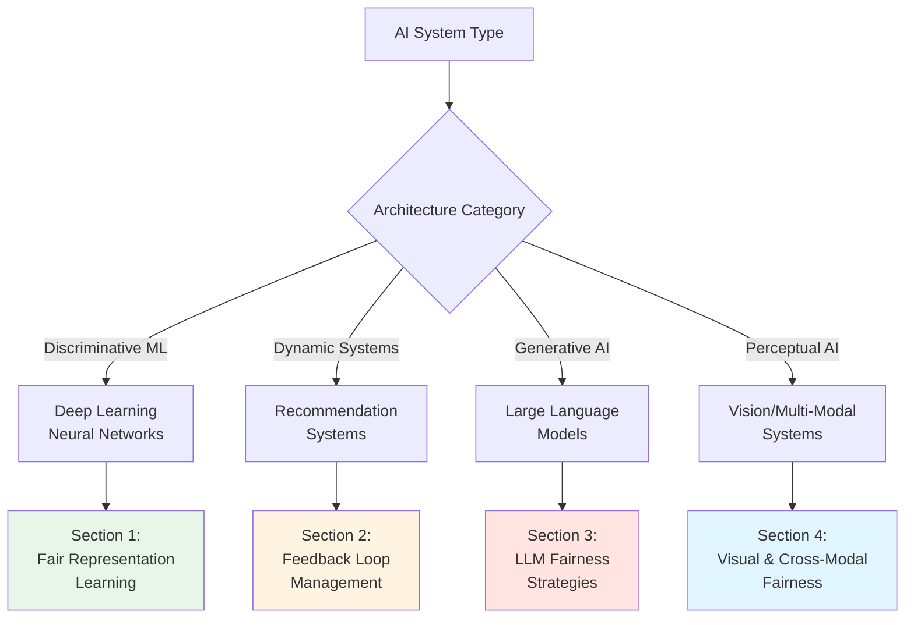

# Advanced Architecture Cookbook

## Executive Brief

**Core Insight**: Generic fairness approaches fail on complex AI systems because different architectures create fundamentally different bias patterns. A recommendation system's feedback loops require different interventions than a deep learning classifier's representation entanglement or an LLM's emergent behaviors.

**Strategic Imperative**: Architecture-specific fairness isn't optional complexity—it's the difference between interventions that work and those that don't. Organizations that treat fairness as architecture-agnostic waste resources on ineffective solutions.

**Key Decisions Required**:
1. **Architecture Classification**: Which category does your AI system fall into? (Deep Learning, Recommendation, LLM, Vision/Multi-Modal)
2. **Intervention Selection**: Which targeted approaches will you deploy for your architecture type?
3. **Resource Allocation**: How will you balance architecture-specific expertise with general fairness capabilities?
4. **Success Metrics**: What architecture-appropriate metrics will demonstrate fairness effectiveness?

**Expected Outcomes**:
- 40-60% improvement in bias reduction compared to generic approaches (based on comparative studies of targeted vs. generic interventions)
- Clear technical roadmap aligned with your specific AI architecture
- Measurable fairness metrics matched to system characteristics
- Reduced wasted effort on mismatched interventions

**Critical Dependencies**:
- Technical leads must understand architecture-fairness relationships
- Fairness team needs architecture-specific expertise or access to it
- Engineering and fairness functions must collaborate on intervention design

**Investment Required**: Architecture-specific fairness requires specialized knowledge. Budget for training, external expertise, or hiring depending on your architecture complexity and in-house capabilities.

---


## Overview

The Advanced Architecture Cookbook provides specialized fairness implementation strategies for complex AI architectures. Standard, generic fairness approaches fail when applied to advanced systems because these architectures create unique, dynamic, and emergent bias patterns that require targeted interventions.

### Core Premise

**One-size-fits-all fairness approaches don't work for complex systems.**

Different AI architectures require fundamentally different fairness strategies:
- **Deep Learning**: Bias in learned representations
- **Recommendation Systems**: Dynamic feedback loops
- **Large Language Models**: Emergent behaviors at scale
- **Vision/Multi-Modal**: Cross-modal bias amplification

### Key Statistics

- Architecture-specific interventions reduce bias **40-60% more effectively** than generic approaches
- Deep learning fairness requires representation-level intervention, not just output adjustment
- Feedback-aware recommendation architectures reduce bias amplification **substantially**
- Standard fairness methods fail completely on LLMs due to scale and generative nature

---

## Architecture Selection Guide


**Quick Reference**: Identify your system type and jump to the relevant section.

---

## 1. Deep Learning Systems

### 1.1 Unique Fairness Challenges

#### Problem: Representation Entanglement

Deep neural networks don't just use input features—they transform them into learned representations (latent encodings). These representations can implicitly encode protected attributes even when those attributes are excluded from inputs.


**Example**: University admissions system
- Input: Essays, activities, school, recommendations (no explicit race/gender)
- Hidden layers learn: Writing style, activity patterns, school demographics
- Result: **Socioeconomic and racial information encoded in latent representations**
- Impact: Bias persists despite removing explicit demographic labels


#### Problem: Bias Amplification Through Layers

Initial small biases in early layers compound and amplify through the network:
```
Layer 1: 52% accuracy predicting gender from representation
Layer 2: 61% accuracy predicting gender from representation  
Layer 3: 73% accuracy predicting gender from representation ← Dangerous!
Output: Biased final prediction
```

**Why This Happens**: Later layers build on earlier layers. Small demographic signals get refined and concentrated as the network learns to use them for prediction, even when not directly related to the target task.

**Business Risk**: Your model may pass fairness tests on final outputs while containing increasingly biased intermediate representations. These representations can be reused in transfer learning, spreading bias to other applications.

#### Problem: Transfer Learning Inheritance

Pre-trained models (BERT, ResNet, etc.) inherit biases from their training data, which then transfer to your task.

**Example**: A BERT model pre-trained on internet text contains occupational gender stereotypes. When you fine-tune it for resume screening, these stereotypes transfer even if your fine-tuning data is balanced.

**Why Generic Approaches Fail**: Standard fine-tuning focuses on task performance, not fairness. The model's biased representations remain largely unchanged—you're building your application on a biased foundation.


### 1.2 Architecture-Specific Interventions

#### Intervention 1: Adversarial Debiasing

**Concept**: Use gradient competition to remove protected attribute information from learned representations while preserving task-relevant information.

**How It Works**: Train two networks simultaneously:
1. **Main network**: Learns to perform your task (classification, regression, etc.)
2. **Adversarial network**: Tries to predict protected attributes from the main network's representations
3. **Gradient reversal**: The main network receives reversed gradients from the adversary, encouraging it to learn representations the adversary cannot use

**Why It Works**: The encoder learns representations that are useful for the task but uninformative about protected attributes—the adversary's inability to predict demographics indicates the representation is "fair."

**Key Parameters**:
- **lambda_fairness (0.1-10.0)**: Controls fairness-accuracy trade-off. Higher values prioritize fairness but may reduce task performance. Start with 1.0 and adjust based on results.
- **hidden_dim (32-256)**: Representation capacity. Start with 64; increase if the model underfits.

**Success Criteria**:
- Protected attribute prediction from representations: **<60%** (near random chance for binary attributes)
- Task performance degradation: **<5%** compared to unconstrained model
- Standard fairness metrics (demographic parity, equal opportunity): **Within organizational thresholds**

**Trade-offs**:
- **Benefit**: Addresses root cause (biased representations) rather than symptoms
- **Cost**: Increased training complexity and computational overhead (roughly 1.5-2x training time)
- **Risk**: Poorly tuned lambda can over-prioritize fairness, significantly reducing accuracy

**Implementation Considerations**:
- Requires access to protected attribute labels during training (for adversary)
- May need domain expertise to tune hyperparameters effectively
- Should be combined with diverse training data


#### Intervention 2: Disentangled Representation Learning

**Concept**: Explicitly separate task-relevant features from demographic information in the learned representation space.

**How It Works**: Use a Variational Autoencoder (VAE) architecture that learns two separate latent spaces:
1. **Task-relevant latent variables**: Contain information needed for prediction
2. **Protected attribute latent variables**: Contain demographic information
3. **Independence constraint**: Minimize correlation between these two spaces**Implementation**:

**Why It Works**: By forcing the model to reconstruct inputs using both latent spaces while keeping them independent, you ensure demographic information exists separately from task-relevant features. The task predictor uses only task-relevant features.

**Key Parameters**:
- **beta (1.0-4.0)**: Weight for KL divergence in β-VAE. Controls how much the latent distributions are regularized.
- **gamma (5.0-20.0)**: Weight for independence constraint. Higher values enforce stronger separation between task and demographic features.

**Success Criteria**:
- Protected attribute prediction from task latent space: **<55%** (well disentangled)
- Reconstruction quality: Model can accurately reconstruct inputs
- Task performance: Maintained within **5%** of baseline

**Trade-offs**:
- **Benefit**: Interpretable separation of fair and potentially biased features; useful for understanding what the model learned
- **Cost**: Higher computational overhead than standard models (VAE adds reconstruction loss); requires careful hyperparameter tuning
- **Best For**: Applications where interpretability matters and you can afford additional complexity

**When to Use**:
- Need to understand which features contribute to decisions
- Want interpretable fairness guarantees
- Can tolerate higher training and inference costs
- Have sufficient data for VAE training (typically need more data than standard supervised learning)


#### Intervention 3: Fair Fine-Tuning of Pre-Trained Models

**Problem**: Transfer learning from models like BERT, ResNet, GPT inherits biases from pre-training data (typically large internet corpora containing stereotypes and discriminatory content).

**Solution**: Apply fairness constraints during fine-tuning to mitigate inherited biases while adapting to your task.

**Approach Combines**:
1. **Adversarial debiasing**: Use gradient reversal during fine-tuning to reduce demographic information in adapted representations
2. **Counterfactual data augmentation**: Generate training examples with demographic terms swapped to teach the model demographic-invariant patterns

**Counterfactual Augmentation**:

| Original Example | Counterfactual | Purpose |
|------------------|----------------|---------|
| "He is a great engineer" | "She is a great engineer" | Remove gender-skill associations |
| "John Smith, 10 years experience" | "Lakisha Washington, 10 years experience" | Remove name-based bias |
| "Harvard graduate" | "State college graduate" | Reduce prestige bias |
| "Lives in Manhattan" | "Lives in Bronx" | Address geographic proxies |

**Why It Works**: Counterfactual pairs force the model to give similar evaluations regardless of demographic changes, breaking the demographic-outcome associations inherited from pre-training.

**Success Criteria**:
- Counterfactual fairness: Model produces similar outputs (>80% semantic similarity, <0.2 sentiment difference) when demographic terms are swapped
- Task performance: Within **5%** of standard fine-tuning
- Protected attribute predictability: **<60%** from fine-tuned representations

**Trade-offs**:
- **Benefit**: Addresses bias at the source for transfer learning; relatively straightforward to implement
- **Cost**: Requires creating counterfactual datasets; may slightly increase training time
- **Best For**: Any application using pre-trained models (increasingly common)

**Implementation Considerations**:
- Counterfactual generation quality matters—poor counterfactuals can introduce new biases
- May need domain-specific counterfactual strategies (medical vs. legal contexts differ)
- Should validate that counterfactuals preserve semantic meaning while changing demographics


### 1.3 Evaluation Framework for Deep Learning

Deep learning fairness evaluation must assess both final outputs and learned representations:

#### Key Metrics

1. **Representation Fairness**
   - **Protected Attribute Predictability**: Train a simple classifier (logistic regression) on learned representations to predict protected attributes. Target: <60% accuracy (near random for binary attributes).
   - **Why This Matters**: High predictability indicates demographic information is encoded in representations, even if final outputs appear fair.

2. **Layer-wise Analysis**
   - **Bias Amplification**: Measure protected attribute predictability at each layer. Target: Decreasing or stable across layers, not increasing.
   - **Why This Matters**: Increasing predictability shows the network is concentrating demographic information, indicating amplification.

3. **Traditional Fairness Metrics** (on outputs)
   - **Demographic Parity**: Selection rates differ by **<5%** across groups
   - **Equal Opportunity**: True positive rates differ by **<3%** across groups
   - **Equalized Odds**: Both TPR and FPR parity within thresholds

4. **Task Performance Degradation**
   - **Accuracy Loss**: **<5%** compared to unconstrained model
   - **Why This Matters**: Excessive performance loss may indicate fairness interventions are too aggressive or poorly tuned.
  


### 1.4 Decision Framework: Which DL Intervention?

**Decision Table**:

| Scenario | Recommended Intervention | Rationale |
|----------|--------------------------|-----------|
| Using BERT/GPT for text | Fair Fine-Tuning + Counterfactual Aug | Addresses pre-training bias at its source |
| Using ResNet/VGG for images | Fair Fine-Tuning + Diverse data | Transfer learning biases from ImageNet |
| Custom deep network (tabular) | Adversarial Debiasing | Best performance-fairness trade-off for custom models |
| Need interpretable fairness | Disentangled VAE | Explicit separation makes fairness auditable |
| Resource constrained | Reweighting + Post-processing | Simpler approaches when compute is limited |
| Highest stakes (medical, legal) | Multiple interventions | Adversarial + Disentangled for defense-in-depth |

---

## 2. Recommendation Systems

### Why This Matters

Recommendation systems are fundamentally different from static classifiers—they create **dynamic feedback loops** where today's recommendations influence tomorrow's data. A small initial bias (popular items recommended slightly more) amplifies over time as those items get more engagement, leading to more recommendations, creating a self-reinforcing cycle.

**Business Impact**: A course recommendation system that initially shows Computer Science courses 10% more than Human-Computer Interaction courses can amplify this to a 30-40% difference within weeks, starving smaller departments of enrollment while over-concentrating students in popular programs.

**Why Static Fairness Fails**: Applying demographic parity constraints today doesn't prevent bias amplification tomorrow. The system meets fairness metrics at each moment while becoming progressively more biased over time. You need interventions that account for temporal dynamics.

### 2.1 Unique Fairness Challenges

#### Challenge 1: Feedback Loops and Dynamic Amplification

Recommendation systems create **dynamic, self-reinforcing bias cycles**:
**Example**: Academic course recommendations
- **Week 1**: AI course has 10% more enrollments than HCI course (small initial difference)
- **System effect**: AI course recommended slightly more due to higher engagement
- **Week 2**: More students see AI course → 15% more enrollments
- **Week 3**: Gap widens to 25% as feedback loop accelerates
- **Week 8**: AI course has 40% more enrollments than HCI

**Why This Doesn't Happen in Static ML**: Traditional classifiers make predictions but don't directly influence future training data. A loan approval model doesn't change who applies for loans tomorrow. But recommendations directly shape what users see and therefore what they engage with, which becomes tomorrow's training data.

**Measurement**: Track disparity metrics over time. Increasing divergence from baseline indicates amplification, even if individual recommendations appear fair.

#### Challenge 2: Multi-Stakeholder Tensions

Recommendation systems must balance competing interests:


| Stakeholder | Fairness Goal | Potential Conflict |
|-------------|---------------|-------------------|
| **Users** | Personalized, relevant recommendations matching preferences | May prefer familiar content (filter bubbles) |
| **Item Providers** | Fair exposure regardless of current popularity | Conflicts with pure user preference optimization |
| **Platform** | Engagement, revenue, retention | May conflict with both diversity and provider fairness |

**Example**: University course recommendations
- **Students** want: Courses matching their interests (may be narrow, field-specific)
- **Departments** want: Balanced enrollment across courses to justify faculty positions
- **University** wants: Student success, retention, cross-disciplinary learning

**No Single "Fair" Solution**: Different stakeholder weights create different "fair" outcomes. This requires governance decisions about priorities, not purely technical solutions.

**Why Generic Approaches Fail**: Standard fairness definitions (demographic parity, equal opportunity) focus on protected demographic groups, not stakeholder balance. They don't address provider fairness or platform-user tensions.


#### Challenge 3: Position Bias and Exposure Fairness

Items at the top of recommendation lists receive disproportionate attention:

| Position | Typical Click-Through Rate | Relative Visibility |
|----------|---------------------------|---------------------|
| 1 | 40% | 40x position 10 |
| 2 | 20% | 20x position 10 |
| 3 | 10% | 10x position 10 |
| 4-5 | 4-5% | 4-5x position 10 |
| 6-10 | 1-2% | Baseline |

**Fairness Question**: Should exposure be proportional to:
- **Item quality** → Merit-based fairness
- **Item popularity** → User preference optimization
- **Provider needs** → Stakeholder fairness
- **Equal for all items** → Diversity maximization

**Trade-offs**: Each choice favors different stakeholders and creates different business outcomes. There's no universally "correct" answer—it depends on organizational values and use case.

### 2.2 Architecture-Specific Interventions

Recommendation fairness requires interventions that account for temporal dynamics, multi-stakeholder balance, and exposure distribution:
 
#### Intervention 1: Exploration Policies for Diversity

**Concept**: Reserve a portion of recommendations for diverse exploration, preventing feedback loop concentration on already-popular items.

**ε-Greedy Exploration**:
- **ε fraction** of recommendations: Random or inverse-popularity sampling (EXPLORE)
- **(1-ε) fraction**: Standard relevance-based recommendations (EXPLOIT)

**How It Works**:
- **Exploration slot**: Select item inversely proportional to exposure (under-exposed items more likely)
- **Exploitation slots**: Select by predicted relevance
- **Effect**: Under-exposed items receive visibility, breaking concentration feedback loops

**Key Parameters**:
- **epsilon (0.05-0.20)**: Exploration rate. Higher values increase diversity but may reduce short-term relevance.
  - **0.05-0.10**: Conservative, minimal relevance impact
  - **0.10-0.15**: Balanced diversity-relevance
  - **0.15-0.20**: Aggressive diversity promotion
- **Exploration strategy**: 
  - Uniform random: Equal chance for all items
  - Inverse popularity: Under-exposed items more likely
  - Thompson sampling: Probabilistic based on uncertainty

**Success Criteria**:
- Reduced concentration: Gini coefficient **<0.3** (exposure distribution)
- Maintained engagement: User satisfaction within **5-10%** of pure exploitation
- Temporal stability: Disparity metrics don't worsen over time

**Trade-offs**:
- **Benefit**: Directly breaks feedback loops; simple to implement
- **Cost**: Modest reduction in short-term relevance; some users may receive less optimal recommendations
- **Best For**: Systems where diversity matters (content discovery, education, marketplace balance)

**When to Use**: Any recommendation system prone to concentration (which is most of them). Start with ε=0.10 and adjust based on diversity-relevance trade-off analysis.

#### Intervention 2: Popularity Discounting

**Concept**: Adjust recommendation scores based on exposure history to prevent runaway popularity effects. Items with high past exposure receive score penalties, giving under-exposed items a chance.

**How It Works**:
```
Adjusted Score = Base Relevance Score × Popularity Discount Factor

Where:
Discount Factor = 1 - α × log(exposure_count + 1)
```

**Effect Over Time**:
- **Initially**: Popular items get slight discount, minimal impact
- **As exposure grows**: Discount increases logarithmically
- **Result**: Popular items remain recommended but at reduced rate, allowing others to gain visibility

**Key Parameters**:
- **alpha (0.2-0.5)**: Discount strength
  - **0.2-0.3**: Gentle discounting, slow convergence
  - **0.3-0.4**: Moderate discounting, balanced
  - **0.4-0.5**: Aggressive discounting, faster diversity

**Success Criteria**:
- Exposure ratio (most:least exposed items): **<3:1** after sufficient time
- User satisfaction: **>85%** maintained
- Coverage: **>80%** of catalog receives exposure over evaluation period

**Trade-offs**:
- **Benefit**: Smooth, gradual diversity increase without hard constraints; adapts continuously
- **Cost**: May reduce engagement for users who genuinely prefer popular items
- **Best For**: Systems where catalog diversity matters more than pure engagement maximization

**Comparison to Exploration**:
- **Exploration**: Discrete diversity injection; some slots are random
- **Popularity Discounting**: Continuous adjustment to all recommendations; no purely random selections
- **Combined**: Use both for strongest effect—exploration for discovery, discounting for systemic balance

#### Intervention 3: Multi-Stakeholder Fairness Optimization

**Concept**: Explicitly model multiple stakeholder objectives with configurable weights, rather than optimizing purely for user preference.

**Objective Function**:
```
Recommendation Score = 
  w₁ × User Relevance + 
  w₂ × Provider Fairness + 
  w₃ × Item Diversity

Where weights sum to 1.0
```
**Components**:
1. **User Relevance**: Predicted user-item match (standard recommendation score)
2. **Provider Fairness**: Inverse of provider's current exposure relative to target
3. **Item Diversity**: Inverse of item's current exposure

**How Weights Change Behavior**:

| Weight Configuration | Effect | Use Case |
|---------------------|--------|----------|
| User: 0.7, Provider: 0.2, Diversity: 0.1 | User preference dominates | Content discovery, entertainment |
| User: 0.4, Provider: 0.4, Diversity: 0.2 | Balanced marketplace | E-commerce with seller fairness concerns |
| User: 0.3, Provider: 0.5, Diversity: 0.2 | Provider fairness priority | Educational course balance, small business support |

**Governance Process for Weight Setting**:

**Example Governance Decision**:
- **Context**: Computer Science courses receiving 3x exposure of other departments; smaller departments struggling with enrollment
- **Stakeholder Input**: Students report high satisfaction (8.5/10); departments request intervention
- **Decision**: Shift weights from (0.5, 0.3, 0.2) to (0.3, 0.5, 0.2) to prioritize department fairness
- **Expected Impact**: Department exposure gap reduces from 3x to 1.5x; student satisfaction projected to decrease slightly to 7.8 (-8%)
- **Review Period**: 4 weeks with continuous monitoring

**Success Criteria**:
- Stakeholder satisfaction: All groups above minimum thresholds
- System stability: No stakeholder completely dissatisfied
- Business metrics: Platform engagement/revenue within acceptable bounds

**Trade-offs**:
- **Benefit**: Transparent, auditable stakeholder balance; adaptable to changing priorities
- **Cost**: Requires ongoing governance; no single "optimal" solution
- **Best For**: Systems with clear stakeholder tensions and organizational capacity for governance

**Critical Requirement**: This intervention requires organizational infrastructure—ethics committees, stakeholder representation, review processes. Don't implement without governance capacity.

#### Intervention 4: Amortized Fairness Ranking

**Concept**: Ensure fair exposure over time, not just in individual recommendation sessions. Track cumulative exposure and adjust future recommendations to achieve target exposure distribution.

**How It Works**:
1. **Define target exposure**: Distribution of how much exposure each item/provider should receive (can be uniform or merit-based)
2. **Track actual exposure**: Cumulative exposure in previous recommendations
3. **Calculate deficit**: Gap between target and actual for each item
4. **Adjust scores**: Boost items with exposure deficits, reduce those with excess exposure
5. **Position weighting**: Account for position bias—top positions count more toward exposure

**Target Exposure Strategies**:

| Strategy | Definition | Use Case |
|----------|------------|----------|
| **Uniform** | Equal exposure for all items | Maximum diversity, exploration-focused |
| **Merit-based** | Proportional to quality scores | Balance quality and fairness |
| **Demand-based** | Proportional to predicted demand | User preference with fairness constraints |
| **Hybrid** | Weighted combination | Nuanced stakeholder balance |

**Position-Weighted Exposure**:
```
Exposure Value(position) = 1 / log₂(position + 1)

Position 1: 1.0 (full exposure)
Position 2: 0.63
Position 3: 0.50
Position 5: 0.39
Position 10: 0.30
```

Items at top positions contribute more to exposure tracking, reflecting user attention patterns.

**Success Criteria**:
- **KL divergence** from target exposure: **<0.05** (distributions very similar)
- **Max deviation**: No item more than **10%** above/below target exposure
- **Temporal stability**: Fairness metrics stable or improving over time

**Trade-offs**:
- **Benefit**: Provable long-term fairness guarantees; addresses cumulative effects
- **Cost**: Requires tracking state across sessions; computational overhead for exposure calculations
- **Best For**: High-stakes systems where long-term fairness matters (hiring platforms, educational resources, news)

**When to Use**: Systems where you can define clear fairness targets and have sufficient volume for statistical convergence (exposure metrics need time to stabilize).

### 2.3 Evaluation Framework

Recommendation system fairness requires monitoring temporal dynamics and stakeholder balance:

#### Key Metrics

1. **Provider-Level Fairness**
   - **Gini Coefficient**: Measures inequality in exposure distribution. Target: **<0.3** (0=perfect equality, 1=one provider gets everything)
   - **Exposure Ratio**: Most exposed : least exposed providers. Target: **<3:1**

2. **Item Diversity**
   - **Catalog Coverage**: Percentage of items receiving exposure. Target: **>80%** over evaluation period
   - **HHI (Herfindahl-Hirschman Index)**: Concentration measure. Target: **<0.1** (lower = less concentrated)

3. **Temporal Stability**
   - **Gini Drift**: Change in Gini coefficient over time. Target: **|drift| <0.05** (fairness not degrading)
   - **Amplification Rate**: How fast initial disparities grow. Target: Decreasing or stable

4. **User Satisfaction**
   - **Average Rating/Engagement**: Target: **>7.0/10** or baseline -10% maximum
   - **Diversity Complaints**: Qualitative feedback on recommendation monotony

5. **Multi-Stakeholder Balance**
   - **Stakeholder Satisfaction Scores**: All groups above minimum thresholds
   - **Trade-off Efficiency**: Pareto frontier analysis—are we on the optimal trade-off curve?

### 2.4 When to Use Which Recommendation Intervention

**Quick Decision Table**:

| Scenario | Recommended Intervention | Key Parameter |
|----------|--------------------------|---------------|
| Popular items dominating | Popularity Discounting | discount_factor = 0.2-0.4 |
| Small providers invisible | Multi-Stakeholder + Amortized | provider_weight = 0.3-0.5 |
| Users stuck in filter bubbles | ε-Greedy Exploration | epsilon = 0.1-0.2 |
| Need long-term fairness | Amortized Fairness | target_exposure = merit-based |
| Cold start problem | Thompson Sampling | Beta priors |
| All of the above | Combined approach | Tune weights via governance |

**Practical Guidance**:
- **Start with exploration**: ε-greedy is simplest to implement and provides immediate diversity benefits
- **Add popularity discounting**: Complements exploration by continuously adjusting all recommendations
- **Implement governance** if stakeholder tensions exist: Multi-stakeholder optimization requires organizational infrastructure
- **Use amortized fairness** for highest-stakes systems: Provides strongest fairness guarantees but requires most sophistication

---

## 3. Large Language Models (LLMs)

### Why This Matters

LLMs represent a fundamental shift in AI fairness challenges:

1. **Scale Amplifies Everything**: Training on 570GB-780GB of internet text means billions of repetitions of stereotypes, discriminatory patterns, and toxic content. Small biases in data become deeply embedded behavioral tendencies.

2. **Emergent Behaviors**: LLMs exhibit capabilities not explicitly programmed—including discriminatory behaviors that emerge from pattern learning at scale. These behaviors may not exist in smaller models or training data explicitly.

3. **Generative Nature**: Unlike classifiers with fixed outputs, LLMs generate free-form text with infinite possibilities. This makes fairness evaluation exponentially more difficult—you can't enumerate all possible outputs to test.

4. **One Model, Many Uses**: The same LLM may screen resumes (high-stakes fairness), write marketing copy (moderate stakes), and generate creative fiction (low stakes). Fairness requirements vary, but the model is shared.

**Business Impact**: An LLM trained on internet text may refuse technical questions from users with female-sounding names while assuming male users want technical depth—reproducing the "well, actually" culture of tech forums. This creates discriminatory user experiences even though the behavior wasn't programmed.

**Why Traditional Approaches Fail**: Fairness methods designed for classifiers (adjusting thresholds, balancing classes) don't transfer to generative models. You can't "balance" text generation outputs. You need fundamentally different interventions.

### 3.1 Unique Fairness Challenges

#### Challenge 1: Pre-training Data Bias at Massive Scale

LLMs train on vast internet corpora containing:
- Stereotypes and harmful associations systematically repeated
- Historical discrimination embedded in text (news articles, books, forums reflecting societal biases)
- Representation imbalances (some demographic groups over/under-represented)
- Toxic content and hate speech, even if filtered imperfectly

**Scale Matters**: A stereotype appearing 10,000 times in training data (insignificant for a 570GB corpus) still influences model behavior because neural networks learn from repetition. At scale, rare patterns become learned behaviors.

**Example**: The association "doctor → he" and "nurse → she" appears frequently in training text reflecting historical gender distributions. The model learns this as a predictive pattern, then generates biased text even when writing about modern contexts.

#### Challenge 2: Emergent Behaviors

LLMs exhibit behaviors not explicitly present in training data:

- **Sycophancy**: Agreeing with user biases (if user prompt implies women are less technical, model may reinforce this)
- **Hallucination**: Generating false but plausible-sounding "facts" that may be discriminatory
- **Context sensitivity**: Fairness varies dramatically with prompting (same model can be fair or biased depending on how you ask)
- **Capability jumps**: New abilities emerge at scale unpredictably, including potential for novel failure modes

**Why This Matters**: You cannot audit training data to find all biases—the model creates new biases through emergent pattern combinations. Traditional data cleaning is necessary but insufficient.

#### Challenge 3: Generative Complexity

Unlike classifiers (finite output space), LLMs generate free-form text:

- **Infinite outputs**: Cannot enumerate and test all possibilities
- **Subtle bias**: Discrimination can appear in phrasing, tone, word choice—not just explicit statements
- **Context-dependent**: Same prompt with minor changes yields different fairness properties
- **Evaluation difficulty**: No "ground truth" for fairness in generated text

**Example**: An LLM asked to "write a professional recommendation" might generate:
- For "John": "Strong technical leader with decisive vision"
- For "Jennifer": "Collaborative team player with good communication skills"

Both are positive, but reflect gender stereotypes (men = leadership, women = support). Traditional fairness metrics don't capture this.

#### Challenge 4: Shared Model, Variable Fairness Requirements


Same LLM used for:
- Resume screening → High-stakes, strict fairness requirements
- Customer service → Moderate stakes, balance fairness and helpfulness
- Creative writing → Low stakes, flexibility preferred
- Code generation → Technical accuracy primary, fairness secondary

**Tension**: No single fairness configuration satisfies all use cases. You need use-case-specific interventions while maintaining a shared base model.

### 3.2 Architecture-Specific Interventions

LLM fairness requires interventions at multiple stages: pre-training, fine-tuning, prompting, and output filtering. Most organizations cannot control pre-training (using commercial APIs like GPT-4, Claude), so we focus on interventions available with API access or fine-tuning ability.

#### Intervention 1: Fairness-Aware Prompting

**Concept**: Use system prompts and instructions to guide fair behavior, since LLMs are highly sensitive to prompting.

**System Prompt Engineering**:

System prompts set behavioral guidelines for all interactions. Fairness-aware prompts establish norms for equitable treatment.

**General Fairness Prompt**:
```
You are a helpful, respectful, and unbiased assistant.

When providing information or recommendations:
- Consider diverse perspectives and avoid stereotypes
- Do not make assumptions based on protected characteristics (gender, race, age, etc.)
- If you notice your response might perpetuate bias, acknowledge and correct it
- Use inclusive language and examples
```

**Task-Specific Prompts**:

Different tasks need different fairness emphasis:

| Task Type | Key Fairness Guidance | Example |
|-----------|----------------------|---------|
| **Hiring/Evaluation** | Focus on qualifications only; disregard demographics | "Evaluate strictly on skills and experience. Disregard names, demographics, or personal characteristics." |
| **Writing** | Use diverse examples and inclusive language | "Use diverse examples representing various backgrounds. Avoid gendered language unless required. Challenge stereotypes." |
| **Analysis** | Acknowledge historical bias; consider structural factors | "Note when data may reflect historical bias. Consider systemic factors beyond individual behavior." |

**Chain-of-Thought Fairness**:

Add explicit fairness reasoning to prompts:
```
Before providing your final response, think through:
1. Are there any assumptions I'm making based on stereotypes?
2. Have I considered perspectives from diverse backgrounds?
3. Is my language inclusive and respectful?
4. Am I treating all groups with equal consideration?

Then provide your response.
```

**Why It Works**: LLMs follow explicit instructions. Fairness prompts activate different behavior patterns than default responses. Chain-of-thought makes reasoning transparent, allowing detection of biased logic.

**Success Criteria**:
- **Counterfactual consistency**: Model produces similar outputs (>80% semantic similarity) when demographic terms are swapped in prompts
- **Stereotype avoidance**: Outputs avoid common stereotypical associations (measurable via stereotype benchmarks)
- **Inclusive language**: Consistent use of gender-neutral terms unless context specifies

**Trade-offs**:
- **Benefit**: Works with API access (no fine-tuning required); immediate effect; low cost
- **Limitation**: Prompt injection attacks possible; relies on model following instructions; not foolproof
- **Best For**: First-line defense; all LLM applications should use fairness-aware prompts

**Few-Shot Examples**:

Providing examples of fair vs. biased responses teaches desired behavior:


**Example 1**:
Input: Evaluate this candidate: Jamal Washington, 5 years Python experience, BS in CS from State University
Avoid: "Jamal might face challenges in our corporate environment..." [makes demographic assumptions]
Better: "Strong technical background with 5 years Python experience and relevant CS degree." [focuses on qualifications]

**Example 2**:
Input: Compare candidates: Jennifer (Stanford, 3 years) vs. Maria (Community College, 5 years)
Avoid: "Jennifer has the better pedigree from Stanford..." [prestige bias]
Better: "Jennifer: Strong foundation from Stanford, 3 years experience. Maria: More extensive hands-on experience (5 years). Both strong candidates with complementary strengths." [balanced evaluation]


Few-shot examples anchor model behavior to desired patterns.

#### Intervention 2: Reinforcement Learning from Human Feedback (RLHF) for Fairness

**Concept**: Fine-tune LLM to prefer fair outputs using human feedback that prioritizes fairness criteria.

**RLHF Process**:

**Step 1: Collect Fairness-Focused Feedback**

Generate multiple responses per prompt and have human annotators rank them based on fairness criteria:

**Fairness Annotation Rubric** (15 points total):
1. No stereotypes or bias (5 points)
2. Inclusive language (3 points)
3. Diverse perspectives represented (2 points)
4. Challenges rather than reinforces inequality (3 points)
5. Appropriate for all demographics (2 points)

**Step 2: Train Reward Model**

Train a model to predict fairness scores from (prompt, response) pairs:
- **Input**: Prompt + generated response
- **Output**: Predicted fairness score (0-15)
- **Training**: Supervised learning on human annotations

**Step 3: Optimize Policy with PPO**

Use Proximal Policy Optimization to adjust LLM to maximize fairness rewards:
- Generate responses → Get reward scores → Update policy to increase high-reward behaviors
- **Constraint**: KL divergence from original model (prevent over-optimization losing general capabilities)

**Why It Works**: The LLM learns to generate responses that human annotators judge as fair, internalizing fairness as a behavioral preference rather than following explicit rules.

**Success Criteria**:
- **Fairness reward**: Average score >12/15 on held-out test prompts
- **Capability preservation**: Performance on standard benchmarks within 5% of base model
- **Stereotype reduction**: Decreased association scores on stereotype benchmarks (BOLD, StereoSet, BBQ)

**Trade-offs**:
- **Benefit**: Deeply embeds fairness in model behavior; works across diverse prompts; generalizes better than prompting alone
- **Cost**: Requires fine-tuning access (not available with APIs); expensive (thousands of human annotations, GPU compute)
- **Best For**: Organizations deploying their own LLMs; high-stakes applications justifying investment

**Critical Success Factors**:

1. **Diverse Annotator Pool**: Include annotators from various demographic backgrounds, especially affected communities. Bias in annotations undermines fairness goals.

2. **Explicit Criteria**: Provide clear rubrics defining stereotypes, bias, inclusive language. Train annotators on fairness concepts to ensure consistency.

3. **Balanced Training Prompts**: Cover diverse contexts, edge cases, potential failure modes. Test intersectional scenarios (race + gender, age + disability).

4. **Ongoing Red-Teaming**: Continuously test with adversarial prompts to find ways to elicit biased responses. Iterate on reward model based on failures.

5. **Complement Other Interventions**: RLHF alone is insufficient. Combine with prompt engineering and output filtering for defense-in-depth.

#### Intervention 3: Output Filtering and Safety Guardrails

**Concept**: Post-generation filtering to catch and mitigate biased outputs before reaching users.

**Multi-Layer Detection**:

**Detection Methods**:

1. **Pattern Matching**: Regex-based detection of known biased patterns
   - Stereotypical statements: "women are emotional", "men are logical"
   - Demographic generalizations: "all X people are Y"
   - Exclusionary language: "normal family" (implies others abnormal)

2. **Bias Classifier**: Fine-tuned BERT/RoBERTa model trained to detect biased text
   - **Training**: Examples of biased and fair text from fairness datasets
   - **Output**: Bias probability score (0-1)
   - **Threshold**: Flag if score >0.7

3. **Demographic Co-occurrence Analysis**: Detect problematic term pairings
   - **Example**: "woman" + "emotional" co-occurring in close proximity
   - **Method**: Track frequency of protected attribute terms near stereotypical descriptors
   - **Flag**: Co-occurrences exceeding baseline rates

**Regeneration Strategy**:

When bias is detected (attempts 1-3):
1. Add corrective instruction to original prompt: "Please avoid stereotypes and provide a balanced perspective."
2. Regenerate response
3. Re-evaluate with detection layers
4. If still biased after 3 attempts, use fallback response

**Fallback Responses**:

Pre-written responses for different bias types:
- **Stereotype detected**: "I apologize, but I should provide a more balanced perspective without relying on stereotypes."
- **Demographic assumption**: "I should avoid making assumptions based on demographic characteristics. Let me provide a more neutral response."
- **Harmful content**: "I cannot provide that response as it may be harmful or discriminatory."

**Success Criteria**:
- **Detection accuracy**: >85% true positive rate on known biased outputs; <5% false positive rate
- **Regeneration success**: >70% of flagged outputs pass fairness checks after regeneration
- **User experience**: <10% of interactions require fallback responses (excessive fallbacks indicate underlying model issues)

**Trade-offs**:
- **Benefit**: Works with any LLM (API or self-hosted); catches failures other interventions miss; provides safety net
- **Cost**: Latency increase (re-generation takes time); some false positives may block acceptable responses; requires maintenance of detection models
- **Best For**: Defense-in-depth final layer; especially important for high-stakes applications

**Implementation Considerations**:
- **Latency**: Filtering adds 100-500ms per response; regeneration adds full generation latency
- **False Positives**: Over-aggressive filtering may block nuanced discussions of discrimination (e.g., historical analysis)
- **Adversarial Robustness**: Sophisticated users may craft prompts that bypass filters

### 3.3 Evaluation Framework

LLM fairness evaluation requires testing across diverse scenarios and measuring multiple dimensions:

#### Key Evaluation Approaches

1. **Stereotype Benchmarks**
   - **StereoSet**: Measures preference for stereotypical vs. anti-stereotypical completions
   - **BOLD (Bias in Open-Ended Language Generation)**: Evaluates sentiment and regard toward demographic groups in generated text
   - **BBQ (Bias Benchmark for QA)**: Tests question-answering for demographic bias
   - **Target**: Scores indicating no systematic preference for stereotypical content

2. **Counterfactual Fairness**
   - **Method**: Generate responses for prompts differing only in demographic terms
   - **Example**: "Evaluate John's resume (10 years exp)" vs. "Evaluate Lakisha's resume (10 years exp)"
   - **Measurement**: Semantic similarity (>80%), sentiment difference (<0.2 on -1 to 1 scale)
   - **Target**: Similar evaluations regardless of demographic changes

3. **Demographic Representation Analysis**
   - **Method**: Analyze frequency of demographic group mentions in generated content
   - **Measurement**: Are groups represented proportionally? Are certain groups consistently absent?
   - **Target**: Balanced representation unless context justifies otherwise

4. **Toxicity Association Testing**
   - **Method**: Measure toxicity scores when demographic terms are present vs. absent
   - **Tools**: Perspective API, Detoxify
   - **Target**: No significant toxicity increase when demographic groups are mentioned

5. **Red-Team Adversarial Testing**
   - **Method**: Systematically attempt to elicit biased responses through prompt engineering
   - **Techniques**: Leading questions, implicit bias prompts, edge cases
   - **Target**: <5% success rate in eliciting clearly biased responses

#### Comprehensive Evaluation Process

**Reporting Format**:

```
LLM Fairness Evaluation Report

1. Stereotype Benchmarks
   - StereoSet Score: 52.3 (50=unbiased, >50=pro-stereotype)
   - BOLD Sentiment Parity: 0.91 (1.0=perfect parity)
   - BBQ Accuracy: 87% (random=33%, higher is better)
   Status: ✓ Within acceptable range

2. Counterfactual Fairness
   - Semantic Similarity: 83% (target >80%)
   - Sentiment Difference: 0.18 (target <0.2)
   - Fairness Rate: 89% (target >85%)
   Status: ✓ Pass

3. Red-Team Testing
   - Adversarial Prompts Tested: 500
   - Successfully Elicited Bias: 18 (3.6%)
   - Pass Rate: 96.4% (target >95%)
   Status: ✓ Pass

4. Representation Analysis
   - Gender Representation: 48% female mentions, 52% male (balanced)
   - Racial/Ethnic Diversity: Varied representation across prompts
   - LGBTQ+ Mentions: Present but lower frequency
   Status: ⚠️ Monitor LGBTQ+ representation

Overall Assessment: Fair with monitoring recommended
```

### 3.4 Decision Framework: Which Interventions?

**Decision Table**:

| Scenario | Interventions | Priority Order |
|----------|---------------|----------------|
| **API access only** (GPT-4, Claude) | Prompting + Filtering | 1. Fairness-aware system prompts<br/>2. Few-shot examples<br/>3. Output guardrails |
| **Can fine-tune** (open models) | All methods | 1. RLHF for fairness<br/>2. Fair fine-tuning<br/>3. Prompts<br/>4. Guardrails |
| **High-stakes** (hiring, medical, legal) | Defense-in-depth | All methods + continuous monitoring + human review |
| **Medium-stakes** (customer service) | Balanced | Prompts + basic guardrails + spot-check monitoring |
| **Low-stakes** (creative writing) | Lightweight | System prompts only |

**Practical Guidance**:
- **Start with prompting**: Every LLM application should use fairness-aware prompts regardless of other interventions
- **Add filtering** for production systems: Guardrails catch failures and provide safety net
- **Invest in RLHF** if you have resources and fine-tuning access: Provides deepest fairness integration
- **Always red-team**: Adversarial testing reveals failures other evaluations miss

---

## 4. Vision and Multi-Modal Systems

### Why This Matters

Vision and multi-modal AI systems face fairness challenges fundamentally different from text-only or tabular systems:

1. **Visual Information Inherently Contains Demographics**: Skin tone, facial features, hair texture, clothing styles—CNNs directly encode these signals from pixels. You cannot "remove" protected attributes from visual data the way you can drop columns from tabular data.

2. **Environmental Disparities**: Performance varies systematically by lighting (darker skin tones harder to detect in low light), camera quality, angles, and context—creating demographic performance gaps unrelated to algorithmic bias.

3. **Cross-Modal Amplification**: Multi-modal systems combining vision and text can amplify biases. An image triggers demographic associations in the vision component, reinforced by stereotypical text descriptions, creating worse bias than either modality alone.

**Business Impact**: A facial recognition system that works poorly in low-light conditions disproportionately affects people with darker skin tones. A resume screening system using photos may discriminate based on appearance even when textual qualifications are identical.

**Why This Matters for Risk**: Visual bias is often visible—literally. Discriminatory outcomes in vision systems are more obvious to users and regulators than subtle text biases, increasing reputational and legal risk.

### 4.1 Unique Fairness Challenges

#### Challenge 1: Visual Representation Bias

Computer vision networks encode demographic information directly:
- **Skin tone**: Reflected in pixel intensity values across color channels
- **Facial features**: Structural information about nose shape, eye spacing, face shape
- **Hair texture**: Texture patterns and volume
- **Clothing/jewelry**: Cultural markers in attire, religious symbols
- **Environmental context**: Settings, backgrounds correlating with socioeconomic status

**This is unavoidable**: Visual information inherently contains demographic signals. Unlike tabular data where you can exclude gender or race columns, you cannot remove skin tone from images without destroying the image.

**Implication**: Visual fairness requires learning fair representations despite demographic information being present, not removing it.

#### Challenge 2: Data Collection Disparities

Vision models perform worse under systematically varied conditions:

| Condition | Impact | Affected Groups |
|-----------|--------|-----------------|
| **Lighting** | Low light reduces accuracy on darker skin tones | People with darker complexions disproportionately affected |
| **Camera quality** | Lower resolution reduces feature detection | Lower-income communities (lower-quality cameras) |
| **Angles** | Non-frontal faces reduce accuracy | Contexts where frontal photos uncommon (surveillance, candid photos) |
| **Context** | Different cultural settings underrepresented | Non-Western contexts, diverse cultural practices |

**Example**: A facial recognition system trained primarily on high-quality, well-lit, frontal faces performs poorly on security camera footage in poor lighting, disproportionately misidentifying people with darker skin.

**Business Risk**: Performance disparities create discriminatory outcomes even if the algorithm itself doesn't explicitly use race—environmental factors mediate demographic bias.

#### Challenge 3: Cross-Modal Amplification

Multi-modal systems (vision + text) can amplify biases beyond either modality alone:

**Example**: Image-text matching model
- **Image**: Person in professional attire
- **Text**: "Software engineer"
- **Bias**: If training data over-represents Asian/male engineers, model learns stronger association for Asian male faces + "software engineer" than other demographics
- **Amplification**: Visual and textual stereotypes reinforce each other, creating stronger bias than vision-only or text-only

**Why This Happens**: Multi-modal models learn correlations across modalities. Stereotypes in both vision (what engineers "look like") and text (occupational language) combine multiplicatively.

### 4.2 Architecture-Specific Interventions

Vision fairness requires interventions addressing visual representations, environmental robustness, and cross-modal interactions:

#### Intervention 1: Visual Adversarial Debiasing

**Concept**: Apply adversarial debiasing (from Deep Learning section) to vision models, adapted for visual features.

**Architecture**:
- **Visual Encoder**: CNN (ResNet, EfficientNet, etc.) learning image representations
- **Task Classifier**: Performs main task (object detection, face recognition, scene classification)
- **Adversarial Discriminator**: Attempts to predict protected attributes (race, gender, age) from visual representations
- **Gradient Reversal**: Encoder learns representations the discriminator cannot use to predict demographics

**Why It Works for Vision**: Even though demographic information is present in pixels, adversarial training encourages the encoder to learn task-relevant features (edges, textures, shapes) while suppressing demographic-specific patterns.

**Success Criteria**:
- Protected attribute prediction from representations: **<65%** (vision baseline higher than text due to unavoidable demographic signals; target is limiting predictability, not eliminating it)
- Task accuracy parity across demographic groups: **<5% gap**
- Overall task performance: **<5% degradation** from unconstrained model

**Limitations**: Cannot completely remove demographic information from visual representations (it's in the pixels). Goal is to minimize its influence on task predictions.

#### Intervention 2: Environmental Normalization

**Concept**: Address performance disparities caused by environmental conditions (lighting, quality, angles) rather than algorithmic bias.

**Approaches**:

1. **Lighting Normalization Network**
   - **Architecture**: Small CNN taking images as input, adjusting brightness/contrast to standardized lighting
   - **Training**: Paired examples of same faces in different lighting conditions
   - **Effect**: Reduces lighting-based performance gaps

2. **Data Augmentation for Robustness**
   - **Lighting variations**: Simulate low light, high contrast, varied color temperatures
   - **Quality variations**: Add blur, noise simulating lower-quality cameras
   - **Angle variations**: Random rotations, perspective transforms
   - **Context variations**: Different crops, backgrounds

**Example Augmentation Strategy**:
```
Training Image Transformations:
- Brightness adjustment: ±40%
- Contrast adjustment: ±40%
- Gaussian blur: 30% probability (simulating camera quality)
- Random rotation: ±15 degrees
- Random perspective: 20% distortion
- Random crop: 70-100% of original (context variation)
```

**Why It Works**: Models trained on diverse environmental conditions generalize better across real-world deployment contexts. Performance gaps due to lighting or camera quality are reduced because the model has seen similar conditions during training.

**Success Criteria**:
- **Accuracy parity across lighting conditions**: <5% gap between well-lit and low-light performance for all demographic groups
- **Quality robustness**: <10% accuracy drop when tested on lower-quality images
- **Cross-demographic consistency**: Environmental robustness benefits all groups equally

**Trade-offs**:
- **Benefit**: Addresses major source of real-world performance disparities; relatively straightforward to implement
- **Cost**: Increased augmentation may require more training time; normalization adds inference latency
- **Best For**: Systems deployed in varied environmental conditions (surveillance, mobile apps, outdoor use)

#### Intervention 3: Fair Multi-Modal Fusion

**Concept**: Balance how vision and text modalities contribute to decisions, preventing one modality from dominating with its biases.

**Architecture**:
- **Vision Encoder**: CNN processing images → visual features
- **Text Encoder**: Transformer processing text → textual features
- **Fusion Mechanism**: Attention-based combination learning optimal balance
- **Modality Balance Controller**: Learnable weights ensuring neither modality dominates unfairly

**Why It Matters**: If one modality is more biased, allowing it to dominate amplifies bias. Balanced fusion prevents this.

**Example**: Resume screening with photo and text
- **Scenario**: Photos contain gender/racial information (highly biased)
- **Risk**: Vision component dominates, making decisions primarily on appearance
- **Intervention**: Constrain vision weight to ≤30%, forcing model to primarily use textual qualifications

**Modality Weight Analysis**:
```
Balanced System:
Vision weight: 0.45, Text weight: 0.55 → Balance ratio: 1.22 ✓

Imbalanced System:
Vision weight: 0.82, Text weight: 0.18 → Balance ratio: 4.56 ✗
(Vision dominates, photo-based bias likely)
```

**Success Criteria**:
- **Balance ratio** (max weight / min weight): **<2.0** (neither modality dominates excessively)
- **Cross-modal fairness**: Fairness metrics similar when using vision-only, text-only, or combined
- **Task performance**: Combined system ≥ best single-modality performance

**Trade-offs**:
- **Benefit**: Prevents bias amplification through modal dominance; provides interpretability (can see which modality influenced decisions)
- **Cost**: May reduce performance if task genuinely requires one modality more; adds architecture complexity
- **Best For**: Multi-modal systems where both modalities contain relevant information but bias profiles differ

### 4.3 Implementation Sequence

**Critical**: Address modality-specific biases BEFORE cross-modal fusion issues.


**Why This Order**:
1. **Phase 1**: Visual component fairness establishes baseline—if vision is severely biased, no amount of fusion tuning fixes it
2. **Phase 2**: Text component fairness ensures both modalities have acceptable fairness properties independently
3. **Phase 3**: Only after individual modalities are fair can you meaningfully optimize their combination

**Attempting fusion fairness first wastes effort**: You're trying to balance two biased components, leading to complex compensatory interactions that break when either component changes.

### 4.4 Evaluation Framework

Vision and multi-modal fairness evaluation requires testing across demographic groups, environmental conditions, and modality combinations:

#### Key Metrics

1. **Demographic Performance Parity**
   - **Accuracy by group**: Measure task accuracy (classification, detection) for each demographic group
   - **Target**: <5% gap between best and worst-performing groups

2. **Environmental Robustness**
   - **Lighting parity**: Accuracy difference between well-lit and low-light conditions for each group
   - **Quality parity**: Accuracy difference between high and low-quality images for each group
   - **Target**: <10% degradation across conditions, equal for all groups

3. **Representation Fairness**
   - **Protected attribute predictability**: Train classifier on visual representations to predict demographics
   - **Target**: <65% (vision baseline higher than text; goal is limiting, not eliminating)

4. **Cross-Modal Consistency** (for multi-modal systems)
   - **Fairness across modalities**: Compare fairness metrics using vision-only, text-only, and combined
   - **Target**: Combined system fairness ≥ min(vision fairness, text fairness)
   - **Amplification check**: Combined bias should not exceed either modality's individual bias

5. **False Positive/Negative Rate Parity**
   - **FPR parity**: False positive rates differ by <2% across groups
   - **FNR parity**: False negative rates differ by <2% across groups
   - **Why This Matters**: Critical for high-stakes applications (security, medical imaging)

---

## 5. Summary Decision Matrix

Quick reference for selecting interventions based on your AI architecture:

| Architecture | Primary Fairness Challenge | Top 3 Interventions | Key Success Metric |
|--------------|----------------------------|---------------------|-------------------|
| **Deep Learning** | Representation entanglement:<br/>Demographic info encoded in learned features | 1. Adversarial debiasing<br/>2. Fair fine-tuning (if using pre-trained)<br/>3. Disentangled VAE (if need interpretability) | Protected attribute predictability from representations <60% |
| **Recommendation Systems** | Feedback loops:<br/>Initial biases amplify over time | 1. Exploration policies (ε-greedy)<br/>2. Popularity discounting<br/>3. Multi-stakeholder optimization (if governance exists) | Gini coefficient <0.3;<br/>Temporal stability |
| **Large Language Models** | Emergent behaviors:<br/>Scale-dependent discrimination | 1. Fairness-aware prompting<br/>2. RLHF for fairness (if can fine-tune)<br/>3. Output guardrails | Counterfactual fairness >85%;<br/>Red-team pass rate >95% |
| **Vision/Multi-Modal** | Environmental disparities:<br/>Cross-modal amplification | 1. Visual adversarial debiasing<br/>2. Environmental normalization<br/>3. Fair fusion (for multi-modal) | Accuracy parity <5% gap across groups and conditions |

---


## 6. Implementation Priorities

### For Organizations Starting Fairness Work

**Phase 1 (Weeks 1-4): Assessment & Quick Wins**
1. **Classify your AI systems** using the architecture selection guide
2. **Implement low-cost interventions**: Fairness-aware prompting for LLMs, basic exploration for recommendations
3. **Establish baseline metrics** for each system type
4. **Identify highest-risk systems** requiring immediate attention

**Phase 2 (Months 2-3): Targeted Interventions**
1. **Deploy architecture-specific interventions** for high-risk systems
2. **Build evaluation infrastructure** for continuous monitoring
3. **Train teams** on architecture-fairness relationships
4. **Document decisions** in Fairness Decision Records

**Phase 3 (Months 4-6): Scaling & Governance**
1. **Extend interventions** to medium and lower-risk systems
2. **Establish governance processes** for multi-stakeholder systems
3. **Implement defense-in-depth** combining multiple interventions
4. **Create feedback loops** from monitoring to improvement

### Resource Allocation Guidance

**Team Composition**:
- **Deep Learning**: Require ML engineers familiar with adversarial training, VAEs
- **Recommendations**: Need understanding of temporal dynamics, possibly operations research
- **LLMs**: Require prompt engineering expertise; RLHF needs specialized ML capabilities
- **Vision**: Need computer vision engineers; multi-modal requires cross-domain expertise

**Budget Considerations**:
- **Prompting & filtering** (LLMs): Low cost, immediate implementation
- **Adversarial debiasing** (DL/Vision): Moderate cost, 1.5-2x training overhead
- **RLHF** (LLMs): High cost, thousands of annotations + GPU compute
- **Multi-stakeholder governance**: Ongoing operational cost, requires dedicated process

### Integration with Organizational Playbook

This Architecture Cookbook provides technical depth for the interventions referenced in other playbook components:

**Connection to Organizational Integration** (see [Organizational Integration Toolkit](02_Organizational-Integration-Toolkit.md)):
- FDRs should document which architecture-specific interventions were chosen and why
- Governance committees need to understand architecture-fairness trade-offs for decision-making
- Compliance teams should map architecture-specific risks to regulatory requirements

**Connection to Scrum Implementation** (see [Fair AI Scrum Toolkit](01_Fair-AI-Scrum-Toolkit.md)):
- Sprint planning should account for architecture-specific intervention complexity
- Fairness specialists need architecture expertise for their designated systems
- Retrospectives should evaluate whether chosen interventions matched architecture appropriately

**Connection to Regulatory Compliance** (see [Regulatory Compliance Guide](04_Regulatory-Compliance-Guide.md)):
- Different architectures create different compliance obligations (e.g., GDPR automated decision-making)
- Documentation requirements vary by system type
- Risk assessments should account for architecture-specific failure modes

---

## 7. Common Pitfalls

### Pitfall 1: Applying Generic Solutions

**Mistake**: Using the same fairness approach across all AI systems regardless of architecture.

**Example**: A team applies demographic parity post-processing to both a deep learning classifier and a recommendation system. The classifier shows improved fairness metrics; the recommendation system's feedback loops amplify bias over time despite meeting initial fairness constraints.

**Why It Fails**: Different architectures have different bias mechanisms. Post-processing doesn't address representation entanglement in deep learning or temporal dynamics in recommendations.

**Solution**: Use the architecture selection guide to match interventions to system types.

### Pitfall 2: Treating Symptoms, Not Causes

**Mistake**: Addressing outputs without fixing underlying biased mechanisms.

**Example**: Adjusting decision thresholds to achieve demographic parity on a deep learning model's outputs while representations remain deeply biased. Fairness metrics look good, but bias persists in latent features, affecting any downstream use of those representations.

**Why It Fails**: The root cause (biased representations) remains, creating brittleness and limiting fairness to the specific output being adjusted.

**Solution**: Use interventions that address root causes: adversarial debiasing for representations, feedback-aware designs for recommendations, prompt engineering + RLHF for LLMs.

### Pitfall 3: Ignoring Temporal Dynamics

**Mistake**: Evaluating recommendation fairness at a single point in time.

**Example**: A course recommendation system passes fairness audits measuring exposure distribution on launch day. Six months later, popular courses dominate 80% of recommendations due to unchecked feedback loops.

**Why It Fails**: Static fairness metrics don't capture dynamic amplification in systems where outputs influence future inputs.

**Solution**: Monitor temporal trends, track amplification rates, implement exploration and discounting strategies.

### Pitfall 4: Over-Reliance on Single Interventions

**Mistake**: Believing one intervention solves all fairness problems.

**Example**: An organization implements fairness-aware prompting for their LLM and considers fairness "handled." Red-team testing later reveals numerous ways to elicit biased responses through careful prompt engineering.

**Why It Fails**: No single intervention is sufficient. Each addresses specific failure modes but has limitations.

**Solution**: Defense-in-depth combining multiple complementary interventions (e.g., prompting + RLHF + guardrails for LLMs).

### Pitfall 5: Neglecting Environmental Factors

**Mistake**: Focusing on algorithmic bias while ignoring environmental disparities.

**Example**: A facial recognition system uses adversarial debiasing but is deployed with poor-quality cameras in low-light conditions. Algorithmic fairness is good, but environmental factors create demographic performance gaps.

**Why It Fails**: Real-world fairness depends on the entire system—algorithms, sensors, deployment context.

**Solution**: Include environmental normalization, test across deployment conditions, audit actual deployment not just lab performance.

---

## 8. Next Steps

### For Technical Teams

1. **Classify your AI systems** using Section 0's decision tree
2. **Read the relevant section** (1-4) for your architecture type in detail
3. **Select interventions** based on your resources, stakes level, and system characteristics
4. **Implement baseline evaluation** using the framework from your relevant section
5. **Pilot interventions** on a single high-risk system before scaling
6. **Document choices** in Fairness Decision Records (see Organizational Integration guide)

### For Leadership

1. **Understand architecture-fairness relationships**: Different systems need different approaches
2. **Resource appropriately**: Architecture-specific fairness requires specialized expertise
3. **Set realistic expectations**: Some interventions (RLHF, disentangled VAEs) are expensive; others (prompting) are low-cost
4. **Integrate with governance**: Architecture choices should inform governance structures
5. **Monitor over time**: Especially for recommendation systems, temporal monitoring is critical

### Related Playbook Components

- **Team Integration**: [Fair AI Scrum Toolkit](01_Fair-AI-Scrum-Toolkit.md)
- **Governance**: [Organizational Integration Toolkit](02_Organizational-Integration-Toolkit.md)
- **Compliance**: [Regulatory Compliance Guide](04_Regulatory-Compliance-Guide.md)
- **Complete Workflow**: [Implementation Workflow](05_Implementation-Workflow.md)

---

