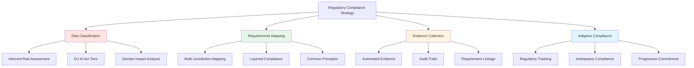
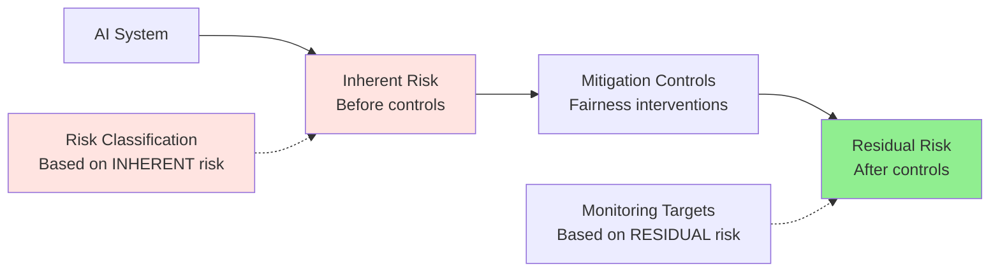
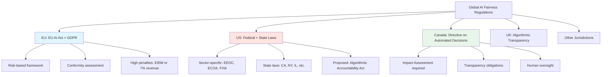
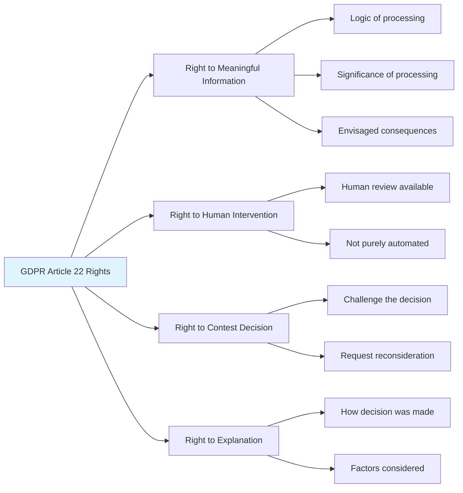
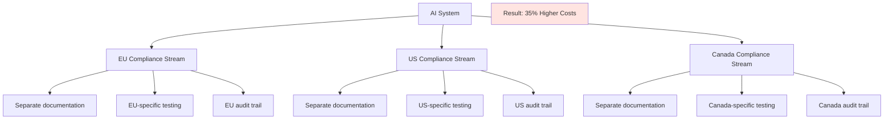
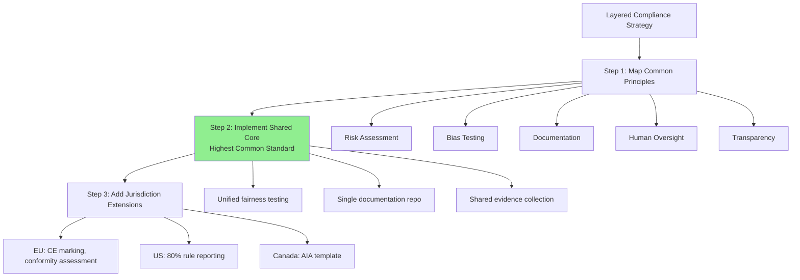

# Regulatory Compliance Guide

## Overview

The Regulatory Compliance Guide maps abstract legal requirements to concrete development practices and evidence collection strategies. This guide transforms compliance from a late-stage legal checkpoint into an integrated development consideration, reducing costs and ensuring systematic adherence to fairness regulations.

### Core Challenge

AI fairness regulation is:
- **Diverse**: Different frameworks across jurisdictions (EU, US, Canada, etc.)
- **Evolving**: Rules changing rapidly, guidance becoming law
- **Abstract**: High-level principles require translation to technical practices
- **Fragmented**: Treating each jurisdiction separately explodes costs

### Solution Framework


### Key Statistics

- Unified compliance approach reduces costs by **47%** vs. jurisdiction-by-jurisdiction
- Organizations treating regulations separately face **35% higher** compliance costs
- Anticipatory compliance saves **62%** on regulatory adjustment costs vs. reactive
- **42%** of high-risk systems inappropriately classified when using residual vs. inherent risk

---

## 1. Risk Classification Framework

### 1.1 Why Risk Classification Matters

Risk classification determines the compliance burden. Getting it wrong leads to:
- **Under-classification**: Insufficient safeguards, regulatory violations, reputational damage
- **Over-classification**: Unnecessary compliance overhead, wasted resources

### 1.2 Distinguishing Inherent vs. Residual Risk

**Critical Distinction**:


**Definitions**:

| Risk Type | Definition | Examples | Used For |
|-----------|------------|----------|----------|
| **Inherent Risk** | Potential harm **before** any mitigating controls | Domain (employment), Autonomy (minimal oversight), Impact (life opportunities) | **Risk Classification** (determines obligations) |
| **Residual Risk** | Remaining risk **after** controls applied | Post-mitigation fairness metrics, monitoring results | **Risk Management** (target for acceptable levels) |

**Common Mistake**: Using fairness performance (a control effectiveness measure) to reduce risk classification.

**Example**:
```
❌ WRONG:
"Our admissions system has excellent fairness metrics (TPR parity 0.02), 
so we classify it as medium-risk instead of high-risk."

✓ CORRECT:
"Our admissions system is high-risk due to domain (education, Annex III) 
and autonomy (substantial automated decision-making). Excellent fairness 
metrics demonstrate effective risk management, reducing residual risk to 
acceptable levels."
```

**Consequence of Confusion**: Research shows **42%** of high-risk systems inappropriately classified as medium/low when conflating inherent and residual risk.

---

### 1.3 Multi-Dimensional Risk Assessment
```python
class RiskClassificationFramework:
    """
    Comprehensive risk classification for AI systems
    
    Based on: EU AI Act, NIST AI RMF, ISO/IEC standards
    """
    
    def __init__(self):
        # Risk dimensions and scoring
        self.dimensions = {
            'domain_impact': {
                'critical_services': 5,  # Healthcare, emergency, critical infrastructure
                'high_stakes': 4,         # Employment, education, credit, law enforcement
                'significant': 3,         # Housing, insurance, social services
                'moderate': 2,            # Marketing, recommendations
                'low': 1                  # Entertainment, gaming
            },
            'decision_impact': {
                'life_altering': 5,       # Affects life opportunities, freedoms
                'major_consequences': 4,  # Significant personal/financial impact
                'moderate_impact': 3,     # Notable but limited impact
                'minor_impact': 2,        # Easily reversible decisions
                'negligible': 1           # No significant impact
            },
            'autonomy_level': {
                'full_automation': 5,     # No human review
                'high_automation': 4,     # Human review on exception only
                'moderate_automation': 3, # Human review for subset
                'human_in_loop': 2,       # Human makes final decisions
                'human_on_loop': 1        # Human oversight, can override
            },
            'scale': {
                'massive': 5,             # Millions of decisions/year
                'large': 4,               # Hundreds of thousands
                'medium': 3,              # Tens of thousands
                'small': 2,               # Thousands
                'limited': 1              # Hundreds or fewer
            },
            'reversibility': {
                'irreversible': 5,        # Cannot be undone
                'very_difficult': 4,      # Extremely costly/difficult to reverse
                'difficult': 3,           # Significant effort to reverse
                'moderate': 2,            # Can be reversed with some effort
                'easy': 1                 # Easily reversible
            }
        }
        
        # EU AI Act explicit classifications
        self.eu_high_risk_domains = [
            'employment',
            'education',
            'credit_scoring',
            'law_enforcement',
            'migration_asylum',
            'justice_administration',
            'essential_services_access',
            'biometric_identification'
        ]
    
    def classify_system(self, system_info):
        """
        Classify AI system risk level
        
        Args:
            system_info: Dict with keys matching self.dimensions
        
        Returns:
            classification: 'unacceptable', 'high', 'limited', 'minimal'
            score: Numerical risk score
            rationale: Explanation of classification
        """
        
        # Calculate dimensional scores
        scores = {}
        for dimension, value in system_info.items():
            if dimension in self.dimensions:
                scores[dimension] = self.dimensions[dimension].get(value, 0)
        
        # Weighted composite score
        weights = {
            'domain_impact': 0.35,
            'decision_impact': 0.30,
            'autonomy_level': 0.20,
            'scale': 0.10,
            'reversibility': 0.05
        }
        
        composite_score = sum(
            scores.get(dim, 0) * weight 
            for dim, weight in weights.items()
        )
        
        # Classification tiers
        if composite_score >= 4.5:
            classification = 'critical_high_risk'
            tier = 'Tier 1'
        elif composite_score >= 3.5:
            classification = 'high_risk'
            tier = 'Tier 2'
        elif composite_score >= 2.5:
            classification = 'moderate_risk'
            tier = 'Tier 3'
        elif composite_score >= 1.5:
            classification = 'limited_risk'
            tier = 'Tier 4'
        else:
            classification = 'minimal_risk'
            tier = 'Tier 5'
        
        # EU AI Act override
        eu_override = False
        if system_info.get('domain') in self.eu_high_risk_domains:
            if classification not in ['critical_high_risk', 'high_risk']:
                eu_override = True
                classification = 'high_risk'
                tier = 'Tier 2 (EU AI Act Annex III)'
        
        # Generate rationale
        rationale = self._generate_rationale(system_info, scores, composite_score, eu_override)
        
        return {
            'classification': classification,
            'tier': tier,
            'score': composite_score,
            'dimensional_scores': scores,
            'rationale': rationale,
            'eu_override': eu_override
        }
    
    def _generate_rationale(self, system_info, scores, composite_score, eu_override):
        """Generate human-readable classification rationale"""
        
        rationale = []
        
        # Highest risk factors
        sorted_scores = sorted(scores.items(), key=lambda x: x[1], reverse=True)
        
        rationale.append(f"Composite Risk Score: {composite_score:.2f}/5.0")
        rationale.append("\nKey Risk Factors:")
        
        for dimension, score in sorted_scores[:3]:
            if score >= 4:
                rationale.append(f"  • {dimension.replace('_', ' ').title()}: {score}/5 (High)")
            elif score >= 3:
                rationale.append(f"  • {dimension.replace('_', ' ').title()}: {score}/5 (Moderate)")
        
        if eu_override:
            rationale.append("\n⚠️  EU AI Act Override Applied")
            rationale.append(f"  Domain '{system_info.get('domain')}' explicitly listed in Annex III")
            rationale.append("  Classification: High-Risk (regardless of composite score)")
        
        return "\n".join(rationale)

# Example usage
def demonstrate_risk_classification():
    """Demonstrate risk classification for university admissions system"""
    
    classifier = RiskClassificationFramework()
    
    # University admissions system
    admissions_system = {
        'domain': 'education',
        'domain_impact': 'high_stakes',
        'decision_impact': 'life_altering',
        'autonomy_level': 'high_automation',
        'scale': 'large',
        'reversibility': 'very_difficult'
    }
    
    result = classifier.classify_system(admissions_system)
    
    print("="*60)
    print("RISK CLASSIFICATION: UNIVERSITY ADMISSIONS SYSTEM")
    print("="*60)
    print(f"\nClassification: {result['classification'].upper()}")
    print(f"Tier: {result['tier']}")
    print(f"\n{result['rationale']}")
    
    print("\n" + "="*60)
    print("COMPLIANCE IMPLICATIONS")
    print("="*60)
    
    if result['classification'] in ['critical_high_risk', 'high_risk']:
        print("\nHigh-Risk System Requirements:")
        print("  ✓ Risk management system (EU AI Act Article 9)")
        print("  ✓ Data governance and bias examination (Article 10)")
        print("  ✓ Technical documentation (Article 11)")
        print("  ✓ Record-keeping and logging (Article 12)")
        print("  ✓ Transparency and information provision (Article 13)")
        print("  ✓ Human oversight (Article 14)")
        print("  ✓ Accuracy, robustness, cybersecurity (Article 15)")
        print("  ✓ GDPR Article 22 compliance (automated decisions)")
        print("  ✓ Conformity assessment required")
    
    print("\n" + "="*60)
```

---

### 1.4 EU AI Act Risk Classification

The EU AI Act establishes a risk-based framework with four tiers:

```mermaid
graph TB
    A[EU AI Act Risk Tiers] --> B[Unacceptable Risk<br/>PROHIBITED]
    A --> C[High Risk<br/>Annex III]
    A --> D[Limited Risk<br/>Transparency]
    A --> E[Minimal Risk<br/>Voluntary]
    
    B --> B1[Social scoring by governments]
    B --> B2[Subliminal manipulation]
    B --> B3[Exploitation of vulnerabilities]
    B --> B4[Real-time biometric ID in public]
    
    C --> C1[Employment & HR]
    C --> C2[Education & training]
    C --> C3[Credit scoring]
    C --> C4[Law enforcement]
    C --> C5[Essential services access]
    
    D --> D1[Chatbots must disclose AI]
    D --> D2[Deepfakes must be labeled]
    D --> D3[Emotion recognition disclosure]
    
    E --> E1[Spam filters]
    E --> E2[Video games]
    E --> E3[Entertainment]
    
    style B fill:#8B0000
    style C fill:#FFE4E1
    style D fill:#FFF4E1
    style E fill:#90EE90
```


**High-Risk Systems (Annex III)** - Explicit list includes:

| Domain | Examples | Why High-Risk |
|--------|----------|---------------|
| **Employment** | Recruitment, promotion, termination, task allocation | Affects livelihood and career |
| **Education** | Admissions, assessment, proctoring | Affects educational opportunities |
| **Credit/Financial** | Credit scoring, loan approval, insurance pricing | Financial well-being impact |
| **Law Enforcement** | Risk assessment, polygraph alternatives, evidence analysis | Liberty and justice implications |
| **Essential Services** | Access to healthcare, utilities, social benefits | Basic needs access |
| **Migration** | Visa applications, border control, asylum | Fundamental rights |

**Example Classification**:
```markdown
**System**: University Admissions AI

**Classification**: HIGH-RISK ✓

**Basis**:
1. Explicit listing in Annex III (Education - Admissions)
2. Inherent characteristics:
   - Domain: Education (high-stakes)
   - Impact: Life-altering (educational access)
   - Autonomy: Substantial (screening phase)

**Result**: Full high-risk obligations apply regardless of fairness performance
```

---

## 2. Regulatory Landscape Overview

### 2.1 Major Frameworks


---

### 2.2 EU AI Act (Risk-Based Framework)

**Scope**: Applies to providers and deployers of AI systems in EU, or affecting EU persons.

**Key Requirements for High-Risk Systems**:

| Article | Requirement | Implementation |
|---------|-------------|----------------|
| **Article 9** | Risk Management System | Identify, evaluate, mitigate risks throughout lifecycle |
| **Article 10** | Data Governance | Data quality, bias examination, representative datasets |
| **Article 11** | Technical Documentation | Design, development, performance documentation |
| **Article 12** | Record-Keeping | Automatic logging of events, decisions |
| **Article 13** | Transparency | Information to deployers and users |
| **Article 14** | Human Oversight | Human-in-loop or on-loop, override capability |
| **Article 15** | Accuracy & Robustness | Appropriate accuracy levels, resilience to errors |
| **Article 16** | Cybersecurity | Protection against threats |

**Timeline**:
- **2024**: Prohibited practices (Unacceptable risk)
- **2025**: General provisions, governance structure
- **2026**: High-risk systems obligations (most relevant for fairness)
- **2027**: Full enforcement

**Penalties**:
- Prohibited AI: Up to €35M or 7% global revenue
- Other violations: Up to €15M or 3% global revenue
- Incorrect information: Up to €7.5M or 1.5% global revenue

---

### 2.3 GDPR Article 22 (Automated Decision-Making)

**Scope**: Automated decisions that significantly affect individuals.

**Key Rights**:


**Compliance Requirements**:

| Requirement | Implementation Example |
|-------------|----------------------|
| **Meaningful Information** | Model card explaining system logic and factors |
| **Human Intervention** | Recruiting manager reviews AI recommendations before final decision |
| **Right to Contest** | Appeal process allowing candidates to request human review |
| **Explanation** | SHAP/LIME explanations showing factors influencing individual decisions |

---

### 2.4 U.S. Regulatory Landscape

**Federal Level**:

| Law | Scope | Fairness Implications |
|-----|-------|----------------------|
| **EEOC Guidelines** | Employment discrimination | Prohibits disparate impact (80% rule) |
| **ECOA** | Credit decisions | Equal access to credit regardless of protected class |
| **Fair Housing Act** | Housing decisions | Prohibits discrimination in housing |
| **ADA** | Disability accommodation | Algorithmic systems must accommodate disabilities |

**State Level** (Examples):

| State | Law | Key Provisions |
|-------|-----|----------------|
| **California** | AB 1008, AB 2013 | Automated employment decision transparency |
| **New York** | NYC Local Law 144 | Bias audits for hiring algorithms |
| **Illinois** | AI Video Interview Act | Consent, disclosure for video AI analysis |
| **Colorado** | AI Act (proposed) | Impact assessments, appeal rights |

**Emerging Federal**: Algorithmic Accountability Act (proposed)
- Annual impact assessments for high-risk systems
- Documentation of data, model, validation
- Public summary reports

---

### 2.5 Canadian Directive on Automated Decision-Making

**Scope**: Federal government use of automated systems.

**Algorithmic Impact Assessment (AIA)**:

Risk-based approach with 4 levels:

| Level | Impact Score | Requirements |
|-------|--------------|--------------|
| **Level I** | Low (0-9) | Basic transparency |
| **Level II** | Medium (10-29) | Quality assurance, explanation |
| **Level III** | High (30-59) | Peer review, training, monitoring, explanation |
| **Level IV** | Very High (60-100) | All above + published AIA, legal review |

**Key Elements**:
- Transparency: Publication of results
- Human oversight: Required for high-impact
- Recourse: Appeal mechanisms
- Training: Staff must understand limitations

**Influence**: While government-focused, influences private sector standards.

---

## 3. Unified Compliance Strategy

### 3.1 The Problem: Regulatory Fragmentation

**Without Unified Approach**:


**Consequences**:
- **35% higher compliance costs** (redundant work)
- Inconsistent implementation
- Conflicting requirements
- Difficult to maintain

---

### 3.2 Layered Compliance Architecture

**Solution**: Build common core, add jurisdiction-specific extensions.


**Example: Testing Frequency Conflict**
```markdown
**Scenario**: 
- EU AI Act: Bias testing every 6 months (minimum)
- US State Law: Bias testing quarterly (every 3 months)
- Canadian Directive: Annual review

**Fragmented Approach** (❌):
- Separate testing schedules for each jurisdiction
- Different test suites
- Multiple reports

**Unified Approach** (✓):
- **Shared Core**: Quarterly bias testing (highest standard = US requirement)
- **Result**: Satisfies EU (exceeds 6-month), US (meets quarterly), Canada (exceeds annual)
- **Efficiency**: Single testing process, unified evidence
- **Extensions**: US-specific 80% rule calculation, EU-specific conformity format
```

---

### 3.3 Common Principles Across Frameworks

| Principle | EU AI Act | GDPR Art. 22 | US Laws | Canada Directive |
|-----------|-----------|--------------|---------|------------------|
| **Risk Assessment** | Article 9 | Implicit | EEOC guidance | AIA required |
| **Fairness Testing** | Article 10, 15 | Implicit | Disparate impact | Impact assessment |
| **Documentation** | Article 11 | Article 30 | Varies by law | AIA documentation |
| **Human Oversight** | Article 14 | Right to intervention | Varies | Required (Level III+) |
| **Transparency** | Article 13 | Meaningful information | Varies by state | Publication required |
| **Appeal/Recourse** | Implicit | Right to contest | Varies | Recourse required |
| **Monitoring** | Article 12 | Implicit | EEOC guidance | Ongoing monitoring |

---

### 3.4 Implementation Framework
```python
class UnifiedComplianceFramework:
    """
    Unified compliance implementation across jurisdictions
    """
    
    def __init__(self, deployment_jurisdictions):
        self.jurisdictions = deployment_jurisdictions
        self.requirements = self._consolidate_requirements()
    
    def _consolidate_requirements(self):
        """Create consolidated requirements inventory"""
        
        all_requirements = []
        
        # EU Requirements
        if 'EU' in self.jurisdictions:
            all_requirements.extend(self._get_eu_requirements())
        
        # US Requirements
        if 'US' in self.jurisdictions:
            all_requirements.extend(self._get_us_requirements())
        
        # Canada Requirements
        if 'Canada' in self.jurisdictions:
            all_requirements.extend(self._get_canada_requirements())
        
        # Consolidate and identify common vs. unique
        return self._identify_common_and_unique(all_requirements)
    
    def _identify_common_and_unique(self, requirements):
        """Separate common principles from jurisdiction-specific"""
        
        # Count occurrences
        requirement_counts = {}
        for req in requirements:
            key = req['principle']
            if key not in requirement_counts:
                requirement_counts[key] = {
                    'count': 0,
                    'jurisdictions': [],
                    'details': []
                }
            requirement_counts[key]['count'] += 1
            requirement_counts[key]['jurisdictions'].append(req['jurisdiction'])
            requirement_counts[key]['details'].append(req['specific_requirement'])
        
        common_requirements = []
        unique_requirements = []
        
        for principle, info in requirement_counts.items():
            if info['count'] >= 2:  # Appears in 2+ jurisdictions
                # Common principle - implement to highest standard
                highest_standard = self._select_highest_standard(info['details'])
                common_requirements.append({
                    'principle': principle,
                    'standard': highest_standard,
                    'jurisdictions': info['jurisdictions']
                })
            else:
                # Jurisdiction-specific
                unique_requirements.append({
                    'principle': principle,
                    'jurisdiction': info['jurisdictions'][0],
                    'requirement': info['details'][0]
                })
        
        return {
            'common': common_requirements,
            'unique': unique_requirements
        }
    
    def _select_highest_standard(self, requirements):
        """Select most stringent requirement from options"""
        
        # Example: Testing frequency
        # [{'frequency': 'quarterly'}, {'frequency': 'semi-annual'}]
        # -> Select 'quarterly' (more frequent)
        
        # Simplified logic (in practice: complex comparison)
        return max(requirements, key=lambda x: self._stringency_score(x))
    
    def _stringency_score(self, requirement):
        """Assign stringency score for comparison"""
        
        # Placeholder scoring logic
        stringency_map = {
            'quarterly': 4,
            'semi-annual': 3,
            'annual': 2,
            'as-needed': 1
        }
        
        # Extract relevant dimension and score
        if 'frequency' in requirement:
            return stringency_map.get(requirement['frequency'], 0)
        
        return 0
    
    def _get_eu_requirements(self):
        """EU AI Act + GDPR requirements"""
        return [
            {'principle': 'risk_management', 'jurisdiction': 'EU', 'specific_requirement': {'standard': 'ISO 31000-based'}},
            {'principle': 'bias_testing', 'jurisdiction': 'EU', 'specific_requirement': {'frequency': 'semi-annual'}},
            {'principle': 'documentation', 'jurisdiction': 'EU', 'specific_requirement': {'depth': 'comprehensive'}},
            {'principle': 'human_oversight', 'jurisdiction': 'EU', 'specific_requirement': {'type': 'mandatory'}},
            {'principle': 'transparency', 'jurisdiction': 'EU', 'specific_requirement': {'disclosure': 'detailed'}},
            {'principle': 'conformity_assessment', 'jurisdiction': 'EU', 'specific_requirement': {'required': True}},
        ]
    
    def _get_us_requirements(self):
        """US federal and state requirements"""
        return [
            {'principle': 'disparate_impact', 'jurisdiction': 'US', 'specific_requirement': {'threshold': '80% rule'}},
            {'principle': 'bias_testing', 'jurisdiction': 'US', 'specific_requirement': {'frequency': 'quarterly'}},
            {'principle': 'transparency', 'jurisdiction': 'US', 'specific_requirement': {'disclosure': 'varies_by_state'}},
            {'principle': 'documentation', 'jurisdiction': 'US', 'specific_requirement': {'depth': 'moderate'}},
        ]
    
    def _get_canada_requirements(self):
        """Canadian Directive requirements"""
        return [
            {'principle': 'impact_assessment', 'jurisdiction': 'Canada', 'specific_requirement': {'aia_required': True}},
            {'principle': 'bias_testing', 'jurisdiction': 'Canada', 'specific_requirement': {'frequency': 'annual'}},
            {'principle': 'transparency', 'jurisdiction': 'Canada', 'specific_requirement': {'publication': 'required'}},
            {'principle': 'human_oversight', 'jurisdiction': 'Canada', 'specific_requirement': {'type': 'risk-based'}},
        ]
    
    def generate_compliance_plan(self):
        """Generate implementation plan"""
        
        plan = {
            'common_core': [],
            'jurisdiction_extensions': []
        }
        
        print("="*60)
        print("UNIFIED COMPLIANCE PLAN")
        print("="*60)
        
        print("\n1. COMMON CORE (Implement Once, Highest Standard)")
        print("-" * 60)
        
        for req in self.requirements['common']:
            print(f"\n{req['principle'].replace('_', ' ').title()}")
            print(f"  Jurisdictions: {', '.join(req['jurisdictions'])}")
            print(f"  Standard: {req['standard']}")
            plan['common_core'].append(req)
        
        print("\n\n2. JURISDICTION-SPECIFIC EXTENSIONS")
        print("-" * 60)
        
        for req in self.requirements['unique']:
            print(f"\n{req['principle'].replace('_', ' ').title()}")
            print(f"  Jurisdiction: {req['jurisdiction']}")
            print(f"  Requirement: {req['requirement']}")
            plan['jurisdiction_extensions'].append(req)
        
        print("\n" + "="*60)
        print(f"Total Requirements: {len(self.requirements['common']) + len(self.requirements['unique'])}")
        print(f"Common Core: {len(self.requirements['common'])}")
        print(f"Extensions: {len(self.requirements['unique'])}")
        print(f"\nEfficiency Gain: ~{self._calculate_efficiency_gain()}%")
        print("="*60)
        
        return plan
    
    def _calculate_efficiency_gain(self):
        """Estimate efficiency gain from unified approach"""
        
        num_common = len(self.requirements['common'])
        num_unique = len(self.requirements['unique'])
        num_jurisdictions = len(self.jurisdictions)
        
        # Without unification: implement each requirement separately per jurisdiction
        fragmented_work = num_common * num_jurisdictions + num_unique
        
        # With unification: implement common once, unique separately
        unified_work = num_common + num_unique
        
        efficiency_gain = ((fragmented_work - unified_work) / fragmented_work) * 100
        
        return int(efficiency_gain)

# Example usage
def demonstrate_unified_compliance():
    """Demonstrate unified compliance for multi-jurisdiction deployment"""
    
    framework = UnifiedComplianceFramework(
        deployment_jurisdictions=['EU', 'US', 'Canada']
    )
    
    plan = framework.generate_compliance_plan()
```

---

## 4. Evidence Collection and Audit Trails

### 4.1 Principles of Effective Evidence Collection

**Goal**: Demonstrate compliance with minimal burden on developers.

**Key Principles**:

1. **Requirement-Driven**: Every piece of evidence must link to specific regulatory provision
2. **Design-Focused**: Capture fairness decisions and rationales, not just final implementation
3. **Automated**: Leverage CI/CD, logging, monitoring to auto-generate evidence
4. **Organized**: Central repository, searchable, version-controlled
5. **Audit-Ready**: Can compile compliance package in <5 days
   
class ComplianceEvidenceMapper:
    """
    Map regulatory requirements to evidence artifacts
    """
    
    def __init__(self):
        self.evidence_map = self._create_evidence_map()
    
    def _create_evidence_map(self):
        """
        Map each regulatory requirement to required evidence
        """
        
        return {
            'EU_AI_Act_Article_9': {
                'requirement': 'Risk Management System',
                'evidence_artifacts': [
                    {
                        'artifact': 'Risk Assessment Document',
                        'location': '/compliance/risk-assessment.pdf',
                        'auto_generated': False,
                        'update_frequency': 'Quarterly'
                    },
                    {
                        'artifact': 'Risk Mitigation Plan',
                        'location': '/compliance/mitigation-plan.md',
                        'auto_generated': False,
                        'update_frequency': 'When risks change'
                    },
                    {
                        'artifact': 'Fairness Decision Records',
                        'location': '/fdr/*.md',
                        'auto_generated': False,
                        'update_frequency': 'Per decision'
                    }
                ]
            },
            'EU_AI_Act_Article_10': {
                'requirement': 'Data Governance and Bias Examination',
                'evidence_artifacts': [
                    {
                        'artifact': 'Data Bias Audit Report',
                        'location': '/reports/data-bias-audit-{date}.pdf',
                        'auto_generated': True,
                        'update_frequency': 'Semi-annual',
                        'generator': 'scripts/generate_data_audit.py'
                    },
                    {
                        'artifact': 'Demographic Distribution Analysis',
                        'location': '/reports/demographic-analysis-{date}.html',
                        'auto_generated': True,
                        'update_frequency': 'Quarterly',
                        'generator': 'pipeline/fairness_dashboard.py'
                    },
                    {
                        'artifact': 'Proxy Variable Documentation',
                        'location': '/docs/proxy-variables.md',
                        'auto_generated': False,
                        'update_frequency': 'When data changes'
                    }
                ]
            },
            'EU_AI_Act_Article_11': {
                'requirement': 'Technical Documentation',
                'evidence_artifacts': [
                    {
                        'artifact': 'System Architecture Documentation',
                        'location': '/docs/architecture.md',
                        'auto_generated': False,
                        'update_frequency': 'Major versions'
                    },
                    {
                        'artifact': 'Model Cards',
                        'location': '/model-cards/*.md',
                        'auto_generated': 'Semi',
                        'update_frequency': 'Per model version',
                        'generator': 'templates/model-card-template.md'
                    },
                    {
                        'artifact': 'Training Documentation',
                        'location': '/docs/training-methodology.md',
                        'auto_generated': False,
                        'update_frequency': 'Major changes'
                    }
                ]
            },
            'EU_AI_Act_Article_12': {
                'requirement': 'Record-Keeping and Logging',
                'evidence_artifacts': [
                    {
                        'artifact': 'Prediction Logs',
                        'location': '/logs/predictions/*.log',
                        'auto_generated': True,
                        'update_frequency': 'Real-time',
                        'generator': 'Automatic (application logging)'
                    },
                    {
                        'artifact': 'Fairness Metric Logs',
                        'location': '/logs/fairness-metrics/*.json',
                        'auto_generated': True,
                        'update_frequency': 'Daily',
                        'generator': 'monitoring/collect_metrics.py'
                    },
                    {
                        'artifact': 'Incident Response Records',
                        'location': '/incidents/*.md',
                        'auto_generated': False,
                        'update_frequency': 'Per incident'
                    }
                ]
            },
            'EU_AI_Act_Article_13': {
                'requirement': 'Transparency and Information',
                'evidence_artifacts': [
                    {
                        'artifact': 'Public Model Card',
                        'location': '/public/model-card.md',
                        'auto_generated': 'Semi',
                        'update_frequency': 'Major versions'
                    },
                    {
                        'artifact': 'User-Facing Documentation',
                        'location': '/public/fairness-info.html',
                        'auto_generated': False,
                        'update_frequency': 'As needed'
                    }
                ]
            },
            'EU_AI_Act_Article_14': {
                'requirement': 'Human Oversight',
                'evidence_artifacts': [
                    {
                        'artifact': 'Human Oversight Protocol',
                        'location': '/docs/human-oversight-protocol.md',
                        'auto_generated': False,
                        'update_frequency': 'Annually or when changed'
                    },
                    {
                        'artifact': 'Human Review Logs',
                        'location': '/logs/human-reviews/*.log',
                        'auto_generated': True,
                        'update_frequency': 'Real-time'
                    }
                ]
            },
            'GDPR_Article_22': {
                'requirement': 'Automated Decision-Making Rights',
                'evidence_artifacts': [
                    {
                        'artifact': 'Explanation Generation Logs',
                        'location': '/logs/explanations/*.json',
                        'auto_generated': True,
                        'update_frequency': 'Per request'
                    },
                    {
                        'artifact': 'Appeal Process Documentation',
                        'location': '/docs/appeal-process.md',
                        'auto_generated': False,
                        'update_frequency': 'Annually'
                    },
                    {
                        'artifact': 'Appeal Case Records',
                        'location': '/records/appeals/*.md',
                        'auto_generated': False,
                        'update_frequency': 'Per appeal'
                    }
                ]
            },
            'US_EEOC_80_Rule': {
                'requirement': 'Disparate Impact Analysis',
                'evidence_artifacts': [
                    {
                        'artifact': '80% Rule Calculation Report',
                        'location': '/reports/disparate-impact-{date}.pdf',
                        'auto_generated': True,
                        'update_frequency': 'Quarterly',
                        'generator': 'scripts/calculate_disparate_impact.py'
                    }
                ]
            },
            'Canada_AIA': {
                'requirement': 'Algorithmic Impact Assessment',
                'evidence_artifacts': [
                    {
                        'artifact': 'Completed AIA Questionnaire',
                        'location': '/compliance/aia-assessment.pdf',
                        'auto_generated': 'Semi',
                        'update_frequency': 'Annually',
                        'generator': 'Based on Treasury Board template'
                    },
                    {
                        'artifact': 'Public AIA Summary',
                        'location': '/public/aia-summary.html',
                        'auto_generated': False,
                        'update_frequency': 'When AIA updated'
                    }
                ]
            }
        }
    
    def generate_evidence_checklist(self, applicable_requirements):
        """Generate checklist of required evidence"""
        
        checklist = []
        
        for req_id in applicable_requirements:
            if req_id in self.evidence_map:
                req_info = self.evidence_map[req_id]
                for artifact in req_info['evidence_artifacts']:
                    checklist.append({
                        'requirement': req_info['requirement'],
                        'requirement_id': req_id,
                        'artifact_name': artifact['artifact'],
                        'location': artifact['location'],
                        'auto_generated': artifact['auto_generated'],
                        'update_frequency': artifact['update_frequency'],
                        'generator': artifact.get('generator', 'Manual')
                    })
        
        return checklist
    
    def audit_evidence_completeness(self, applicable_requirements):
        """Check if all required evidence exists"""
        
        import os
        import glob
        
        checklist = self.generate_evidence_checklist(applicable_requirements)
        
        results = []
        
        for item in checklist:
            location = item['location']
            
            # Handle wildcards
            if '*' in location:
                files = glob.glob(location)
                exists = len(files) > 0
                file_count = len(files)
            else:
                exists = os.path.exists(location)
                file_count = 1 if exists else 0
            
            results.append({
                **item,
                'exists': exists,
                'file_count': file_count
            })
        
        return results

# Example usage
def demonstrate_evidence_mapping():
    """Demonstrate evidence collection for high-risk system"""
    
    mapper = ComplianceEvidenceMapper()
    
    # High-risk admissions system in EU + US
    applicable_requirements = [
        'EU_AI_Act_Article_9',
        'EU_AI_Act_Article_10',
        'EU_AI_Act_Article_11',
        'EU_AI_Act_Article_12',
        'EU_AI_Act_Article_13',
        'EU_AI_Act_Article_14',
        'GDPR_Article_22',
        'US_EEOC_80_Rule'
    ]
    
    checklist = mapper.generate_evidence_checklist(applicable_requirements)
    
    print("="*80)
    print("COMPLIANCE EVIDENCE CHECKLIST")
    print("="*80)
    
    # Group by requirement
    by_requirement = {}
    for item in checklist:
        req = item['requirement']
        if req not in by_requirement:
            by_requirement[req] = []
        by_requirement[req].append(item)
    
    for req, artifacts in by_requirement.items():
        print(f"\n{req}")
        print("-" * 80)
        
        for artifact in artifacts:
            auto_indicator = "🤖" if artifact['auto_generated'] == True else "✍️"
            print(f"  {auto_indicator} {artifact['artifact_name']}")
            print(f"     Location: {artifact['location']}")
            print(f"     Update: {artifact['update_frequency']}")
            if artifact['generator'] != 'Manual':
                print(f"     Generator: {artifact['generator']}")
            print()
    
    # Summary
    total = len(checklist)
    automated = sum(1 for item in checklist if item['auto_generated'] == True)
    manual = total - automated
    
    print("="*80)
    print(f"Total Evidence Artifacts: {total}")
    print(f"  Automated: {automated} ({automated/total*100:.1f}%)")
    print(f"  Manual: {manual} ({manual/total*100:.1f}%)")
    print("="*80)

### 4.3 Automated Evidence Generation
**CI/CD Integration**:
# .github/workflows/compliance-evidence.yml
name: Compliance Evidence Generation

on:
  schedule:
    - cron: '0 0 * * 0'  # Weekly
  workflow_dispatch:  # Manual trigger

jobs:
  generate-compliance-evidence:
    runs-on: ubuntu-latest
    
    steps:
      - uses: actions/checkout@v2
      
      - name: Generate Data Bias Audit
        run: |
          python scripts/generate_data_audit.py \
            --output reports/data-bias-audit-$(date +%Y-%m-%d).pdf
      
      - name: Calculate Fairness Metrics
        run: |
          python scripts/calculate_fairness_metrics.py \
            --output reports/fairness-metrics-$(date +%Y-%m-%d).json
      
      - name: Generate 80% Rule Report
        run: |
          python scripts/calculate_disparate_impact.py \
            --output reports/disparate-impact-$(date +%Y-%m-%d).pdf
      
      - name: Update Model Card
        run: |
          python scripts/update_model_card.py \
            --template templates/model-card-template.md \
            --output model-cards/candidate-ranking-v2.md
      
      - name: Commit Evidence
        run: |
          git config user.name "Compliance Bot"
          git config user.email "compliance@equihire.com"
          git add reports/ model-cards/
          git commit -m "Auto-generate compliance evidence $(date +%Y-%m-%d)"
          git push
      
      - name: Notify Compliance Team
        run: |
          echo "Compliance evidence generated and committed"
          # Send notification (Slack, email, etc.)

## 5. Adaptive Compliance Strategy
### 5.1 The Challenge: Rapidly Evolving Regulations
**Problem**: AI fairness regulation is not static.

graph LR
    A[2023: Guidance & Proposals] --> B[2024: Some Laws Pass]
    B --> C[2025: More Enforcement Begins]
    C --> D[2026-2027: Full Enforcement]
    D --> E[2028+: Evolution & Expansion]
    
    style A fill:#E8F5E9
    style E fill:#FFE4E1

### **What’s guidance today may be law tomorrow.**

---

## **5.2 Anticipatory vs. Reactive Compliance**

A comparison of two approaches organizations use when responding to evolving regulatory expectations.

| **Approach**      | **Description**                                   | **Cost**                         | **Risk** |
|-------------------|---------------------------------------------------|----------------------------------|----------|
| **Reactive**      | Wait for final rules, then comply                 | Appears cheaper upfront          | 62% higher adjustment costs, significant rework, potential violations |
| **Anticipatory**  | Track trends, implement ahead of requirements     | Higher initial investment        | 62% lower adjustment costs, no rework, early mover advantage |

**Research:** Organizations implementing anticipatory compliance saved **62%** on regulatory adjustment costs.

---

## **5.3 Progressive Commitment Strategy**

A method for gradually increasing alignment with emerging regulatory expectations by sequencing actions in stages—allowing organizations to build capability, reduce risk, and distribute investment over time.

graph TD
    A[Monitor Regulatory Landscape] --> B{Likelihood Assessment}
    
    B -->|Highly Likely<br/>Imminent| C[Full Implementation]
    B -->|Probable<br/>Next 12-24 months| D[Flexible Implementation<br/>Preparedness]
    B -->|Possible<br/>Exploratory| E[Monitoring Only]
    
    C --> C1[Commit resources]
    C --> C2[Full compliance build]
    
    D --> D1[Architecture for adaptability]
    D --> D2[Preparation without full commitment]
    
    E --> E1[Industry association participation]
    E --> E2[Regulatory tracking]
    
    style C fill:#FFE4E1
    style D fill:#FFF4E1
    style E fill:#E8F5E9

**Example Application**:
**Scenario**: Three US states considering algorithmic accountability laws requiring explainability features not currently implemented.

**Likelihood Assessment**:
- State A: Bill advanced to governor, passage highly likely (90%)
- State B: Committee approval, moderate likelihood (60%)
- State C: Introduced, early stage, uncertain (30%)

**Strategy**:

**State A (Highly Likely)**:
- ✓ Begin implementation immediately
- ✓ Allocate $200K budget
- ✓ 6-month timeline
- **Rationale**: Avoid compliance gap and expensive post-hoc rework

**State B (Probable)**:
- ✓ Prepare implementation plans (cost, timeline estimates)
- ✓ Build system with compliance adaptability in mind
- ✓ Begin development when passage appears imminent in key deployment states
- **Rationale**: Balance risk of premature investment vs. rework

**State C (Possible)**:
- Monitor legislative progress
- Participate in industry comment periods
- No active development yet
- **Rationale**: Too uncertain to commit resources

**Decision Checkpoint**: Review quarterly as likelihood changes

### 5.4 Regulatory Tracking System

class RegulatoryTrackingSystem:
    """
    System for tracking and responding to regulatory evolution
    """
    
    def __init__(self):
        self.tracked_regulations = []
        self.risk_thresholds = {
            'high': 0.7,      # 70% likelihood
            'medium': 0.4,    # 40% likelihood
            'low': 0.2        # 20% likelihood
        }
    
    def add_regulation(self, regulation_info):
        """Track new or proposed regulation"""
        
        self.tracked_regulations.append({
            'id': regulation_info['id'],
            'name': regulation_info['name'],
            'jurisdiction': regulation_info['jurisdiction'],
            'status': regulation_info['status'],  # 'proposed', 'committee', 'passed', 'enforced'
            'likelihood': regulation_info['likelihood'],  # 0.0 to 1.0
            'impact': regulation_info['impact'],  # 'high', 'medium', 'low'
            'effective_date': regulation_info.get('effective_date'),
            'requirements': regulation_info['requirements'],
            'monitoring_since': regulation_info.get('monitoring_since', 'now'),
            'last_updated': 'now'
        })
    
    def assess_action_needed(self, regulation_id):
        """Determine if action is needed based on likelihood and impact"""
        
        reg = next((r for r in self.tracked_regulations if r['id'] == regulation_id), None)
        
        if not reg:
            return None
        
        likelihood = reg['likelihood']
        impact = reg['impact']
        
        # Decision matrix
        if likelihood >= self.risk_thresholds['high']:
            if impact == 'high':
                action = 'IMPLEMENT_NOW'
                priority = 'Critical'
            else:
                action = 'PREPARE_IMPLEMENTATION'
                priority = 'High'
        elif likelihood >= self.risk_thresholds['medium']:
            if impact == 'high':
                action = 'PREPARE_IMPLEMENTATION'
                priority = 'High'
            else:
                action = 'MONITOR_CLOSELY'
                priority = 'Medium'
        else:
            action = 'MONITOR'
            priority = 'Low'
        
        return {
            'regulation': reg['name'],
            'action': action,
            'priority': priority,
            'rationale': self._generate_rationale(reg, action)
        }
    
    def _generate_rationale(self, reg, action):
        """Generate explanation for recommended action"""
        
        rationale = []
        
        rationale.append(f"Likelihood: {reg['likelihood']*100:.0f}%")
        rationale.append(f"Impact: {reg['impact'].title()}")
        rationale.append(f"Status: {reg['status'].title()}")
        
        if reg.get('effective_date'):
            rationale.append(f"Effective Date: {reg['effective_date']}")
        
        if action == 'IMPLEMENT_NOW':
            rationale.append("High likelihood and impact warrant immediate action to avoid compliance gap")
        elif action == 'PREPARE_IMPLEMENTATION':
            rationale.append("Prepare plans and begin development when passage appears imminent")
        elif action == 'MONITOR_CLOSELY':
            rationale.append("Track developments closely, update likelihood quarterly")
        else:
            rationale.append("Continue monitoring through industry associations")
        
        return '\n'.join(rationale)
    
    def generate_quarterly_report(self):
        """Generate quarterly regulatory landscape report"""
        
        print("="*80)
        print("QUARTERLY REGULATORY LANDSCAPE REPORT")
        print("="*80)
        
        # Group by action needed
        by_action = {
            'IMPLEMENT_NOW': [],
            'PREPARE_IMPLEMENTATION': [],
            'MONITOR_CLOSELY': [],
            'MONITOR': []
        }
        
        for reg in self.tracked_regulations:
            assessment = self.assess_action_needed(reg['id'])
            if assessment:
                by_action[assessment['action']].append({
                    'regulation': reg,
                    'assessment': assessment
                })
        
        # Print by priority
        for action in ['IMPLEMENT_NOW', 'PREPARE_IMPLEMENTATION', 'MONITOR_CLOSELY', 'MONITOR']:
            if by_action[action]:
                print(f"\n{action.replace('_', ' ')}")
                print("-" * 80)
                
                for item in by_action[action]:
                    reg = item['regulation']
                    assessment = item['assessment']
                    
                    print(f"\n{reg['name']} ({reg['jurisdiction']})")
                    print(f"  Priority: {assessment['priority']}")
                    print(f"  {assessment['rationale']}")
                    print(f"\n  Requirements:")
                    for req in reg['requirements'][:3]:  # Show top 3
                        print(f"    • {req}")
                    print()
        
        print("="*80)

# Example usage
def demonstrate_adaptive_compliance():
    """Demonstrate adaptive compliance tracking"""
    
    tracker = RegulatoryTrackingSystem()
    
    # Add proposed regulations
    tracker.add_regulation({
        'id': 'US_NY_LL144',
        'name': 'NYC Local Law 144 (Hiring Algorithm Audits)',
        'jurisdiction': 'New York City, US',
        'status': 'enforced',
        'likelihood': 1.0,  # Already law
        'impact': 'high',
        'effective_date': '2023-07-05',
        'requirements': [
            'Annual bias audit by independent auditor',
            'Publication of audit results',
            'Notification to candidates about AI use'
        ]
    })
    
    tracker.add_regulation({
        'id': 'US_Federal_AAA',
        'name': 'Algorithmic Accountability Act (Proposed)',
        'jurisdiction': 'Federal US',
        'status': 'proposed',
        'likelihood': 0.6,  # Moderate likelihood
        'impact': 'high',
        'effective_date': 'TBD (likely 2025-2026 if passed)',
        'requirements': [
            'Impact assessments for high-risk systems',
            'Documentation of data, model, validation',
            'Public summary reports',
            'Ongoing monitoring'
        ]
    })
    
    tracker.add_regulation({
        'id': 'US_CA_Future',
        'name': 'California AI Transparency Act (Exploratory)',
        'jurisdiction': 'California, US',
        'status': 'exploratory',
        'likelihood': 0.3,  # Uncertain
        'impact': 'medium',
        'effective_date': 'TBD',
        'requirements': [
            'Disclosure of AI use in employment decisions',
            'Explainability requirements',
            'Appeal mechanisms'
        ]
    })
    
    # Generate report
    tracker.generate_quarterly_report()

## **6. Compliance Workflow Integration**

---

### **6.1 Integration with Development Lifecycle**
Compliance must be integrated into each stage, not bolted on at the end.

graph TD
    A[Development Stage] --> B[Compliance Activity]
    
    A1[Requirements] --> B1[Map regulatory obligations<br/>Define compliance criteria]
    A2[Design] --> B2[Compliance by design<br/>Architecture review]
    A3[Implementation] --> B3[Automated evidence collection<br/>Fairness testing]
    A4[Testing] --> B4[Compliance validation<br/>Audit preparation]
    A5[Deployment] --> B5[Conformity assessment<br/>Regulatory notification]
    A6[Operations] --> B6[Ongoing monitoring<br/>Periodic audits]
    
    style B1 fill:#E8F5E9
    style B2 fill:#E8F5E9
    style B3 fill:#E8F5E9
    style B4 fill:#E8F5E9
    style B5 fill:#E8F5E9
    style B6 fill:#E8F5E9

## **6.2 Connection to Other Playbook Components**

| **Component**               | **Compliance Integration**                                                                                  |
|-----------------------------|---------------------------------------------------------------------------------------------------------------|
| **Fair AI Scrum**           | Definition of Done includes compliance criteria; Sprint planning allocates compliance capacity               |
| **Organizational Integration** | Governance gates enforce compliance checkpoints; FDRs (Formal Decision Records) provide audit trail       |
| **Advanced Architecture**   | Technical interventions satisfy fairness requirements; Evaluation frameworks generate compliance evidence    |

---

## **7. Next Steps**  
### **For Organizations Implementing Compliance**

---

### **Week 1–2: Risk Classification**
- Use the framework to classify all AI systems  
- Identify high-risk systems requiring full compliance

### **Week 3–4: Requirements Mapping**
- Map applicable regulations to your jurisdictions  
- Identify common principles vs. unique requirements  
- Create consolidated requirements inventory

### **Month 2: Evidence Mapping**
- Map each requirement to evidence artifacts  
- Identify what can be automated  
- Set up evidence collection infrastructure

### **Month 3+: Ongoing**
- Implement unified compliance core  
- Add jurisdiction-specific extensions  
- Quarterly regulatory tracking  
- Annual comprehensive review

---

## **Related Playbook Components**
- **Team Practices:** Fair AI Scrum Toolkit  
- **Governance:** Organizational Integration Toolkit  
- **Technical:** Advanced Architecture Cookbook  
- **Complete Workflow:** Implementation Workflow

---

## **Resources**

### **Regulatory Resources**

**EU:**
- EU AI Act full text: https://eur-lex.europa.eu/  
- GDPR Article 22 guidance: https://edpb.europa.eu/

**US:**
- EEOC guidance: https://www.eeoc.gov/laws/guidance/  
- State law tracker: (various legal databases)

**Canada:**
- Algorithmic Impact Assessment: https://www.canada.ca/ => Algorithmic Impact Assessment tool

---

## **Further Reading**
- European Commission (2021). *Proposal for AI Act*  
- NIST (2023). *AI Risk Management Framework*  
- Raji et al. (2020). *Closing the AI Accountability Gap*

---

## **Document Version**
- **Version:** 1.0  
- **Last Updated:** 2024  
- **Owner:** Regulatory Compliance Working Group  
- **Next Review:** Quarterly (regulations evolving rapidly)

