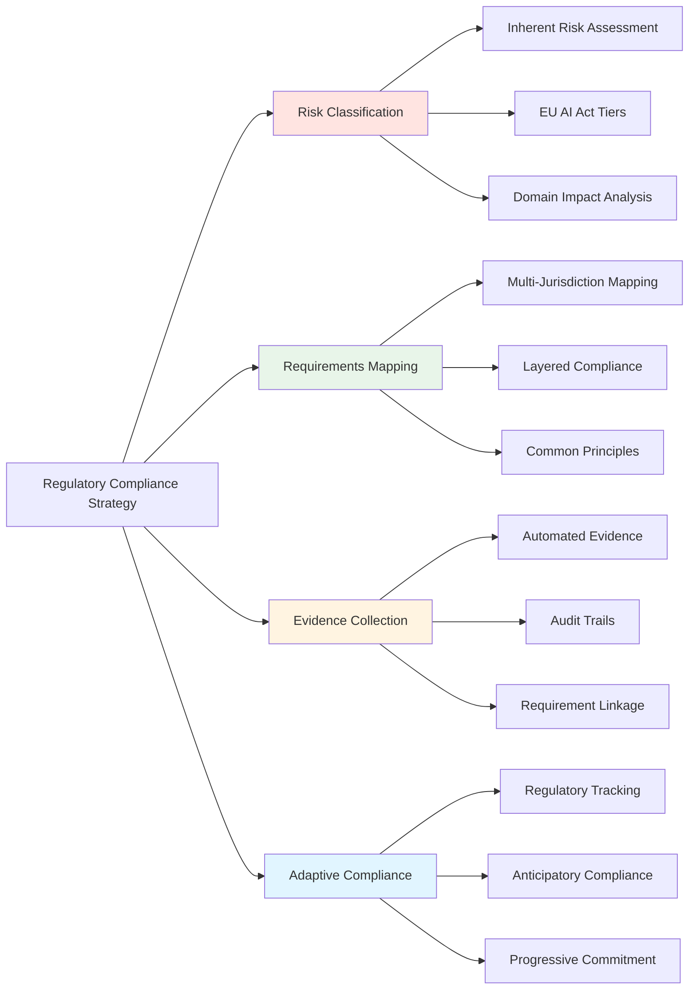

# Regulatory Compliance Guide
## Executive Brief

### The Core Challenge

AI fairness regulation represents one of the most complex compliance landscapes organizations face today. The EU AI Act, GDPR Article 22, US employment discrimination laws, and emerging state regulations each impose overlapping yet distinct requirements. Organizations attempting to satisfy each jurisdiction separately face compliance costs 35% higher than necessary, risk missing critical obligations through fragmented approaches, and struggle to adapt as regulations evolve rapidly.

### The Strategic Transformation

This guide transforms compliance from a reactive legal checkpoint into a strategic capability. By implementing a unified compliance architecture that captures common principles across jurisdictions while handling jurisdiction-specific extensions separately, organizations achieve:

- **Cost reduction**: 47% lower compliance costs versus jurisdiction-by-jurisdiction approaches
- **Risk mitigation**: Systematic identification of obligations prevents gaps that lead to penalties up to €35M or 7% of global revenue
- **Adaptive capability**: Anticipatory compliance reduces regulatory adjustment costs by 62% compared to reactive approaches
- **Competitive advantage**: Early compliance positions organizations as trustworthy market leaders

### Required Executive Decisions

**Decision 1: Risk Classification Approach**
- **Choice**: Classify systems based on inherent risk (domain, autonomy, impact) versus residual risk (post-mitigation performance)
- **Implication**: Research shows 42% of high-risk systems get misclassified when using residual risk, leading to insufficient safeguards and regulatory violations
- **Recommendation**: Use inherent risk for classification; use residual risk for monitoring targets

**Decision 2: Compliance Architecture**
- **Choice**: Jurisdiction-by-jurisdiction implementation versus unified core with extensions
- **Implication**: Separate implementations cost 35% more and create maintenance burdens; unified approaches require upfront coordination but yield sustained efficiency
- **Recommendation**: Invest in unified compliance architecture for any organization operating in 2+ major jurisdictions

**Decision 3: Regulatory Evolution Strategy**
- **Choice**: React to finalized regulations versus anticipate emerging requirements
- **Implication**: Reactive organizations spend 62% more on adjustment costs and face rushed compliance efforts; anticipatory organizations distribute investment and avoid gaps
- **Recommendation**: Implement progressive commitment strategy that phases investment based on regulatory likelihood

### Success Metrics

**Operational Efficiency**
- Time to compile audit package: <5 days (baseline: 3-4 weeks)
- Automated evidence generation: >60% of compliance artifacts
- Compliance overhead: <15% of development capacity for high-risk systems

**Risk Management**
- Zero high-risk systems misclassified
- 100% coverage of applicable requirements
- Regulatory change response time: <30 days for high-likelihood developments

**Strategic Positioning**
- Time-to-market advantage: 4-6 months ahead of reactive competitors
- Regulatory violation incidents: Zero
- Stakeholder confidence score: >85% (measured through governance reviews)

## Why This Matters

Organizations face a perfect storm of regulatory complexity in AI fairness:

**Regulatory Fragmentation**: The EU AI Act classifies systems by risk tiers and mandates conformity assessments. GDPR Article 22 grants rights to explanation and human intervention. US federal laws (EEOC, ECOA, FHA) prohibit disparate impact. US states (New York, California, Illinois) add transparency and audit requirements. Canada requires algorithmic impact assessments. Each framework uses different terminology, thresholds, and evidence requirements.

**Rapid Evolution**: What exists as guidance today becomes law tomorrow. The EU AI Act transitions from proposal (2021) to full enforcement (2026-2027) in just five years. US states introduce dozens of AI accountability bills annually. Organizations that wait for finalized regulations face expensive retrofitting and potential compliance gaps.

**High Stakes**: Penalties under the EU AI Act reach €35M or 7% of global revenue for prohibited AI practices. US employment discrimination lawsuits cost companies millions in settlements plus reputational damage. Beyond financial penalties, non-compliance destroys stakeholder trust and can bar market access in regulated jurisdictions.

**Strategic Opportunity**: Organizations that build adaptive compliance capabilities gain competitive advantages. They enter markets faster (no compliance delays), command customer trust (demonstrated commitment to fairness), and attract talent (ethical AI leadership). Early movers establish industry best practices and influence regulatory development through substantive participation.

### Solution Framework

### Key Statistics

- Unified compliance approach reduces costs by **47%** vs. jurisdiction-by-jurisdiction
- Organizations treating regulations separately face **35% higher** compliance costs
- Anticipatory compliance saves **62%** on regulatory adjustment costs vs. reactive
- **42%** of high-risk systems inappropriately classified when using residual vs. inherent risk

---

## 1. Risk Classification Framework

### Why This Matters

Risk classification determines your entire compliance burden. High-risk systems under the EU AI Act face comprehensive obligations: risk management systems, data governance, technical documentation, record-keeping, transparency disclosures, human oversight, and conformity assessments. Medium and low-risk systems face lighter requirements. Getting classification wrong leads to two failure modes:

**Under-classification**: You implement insufficient safeguards, violate regulations unknowingly, and face penalties plus forced system withdrawal. Research shows 42% of organizations make this error when they confuse inherent risk with residual risk.

**Over-classification**: You impose unnecessary compliance overhead, waste resources on procedures you don't need, and slow development velocity without risk reduction benefits.

The financial impact is significant. A high-risk employment system might require $500K-$1M annually in compliance activities (audits, documentation, monitoring). A low-risk system might require $50K-$100K. Misclassification by one tier means either a 10x cost error or a regulatory violation.

### The Critical Distinction: Inherent vs. Residual Risk

The most common and consequential error in risk classification is confusing inherent risk with residual risk:

**Inherent Risk**: The potential for harm that exists *before* any mitigating controls are applied. This reflects the fundamental characteristics of the system:
- **Domain**: What decisions does it make? (employment, education, credit, law enforcement = high stakes)
- **Autonomy**: How much human oversight exists? (fully automated = higher risk)
- **Impact**: What consequences follow from decisions? (life-altering, reversible, minor)
- **Scale**: How many people are affected? (millions versus hundreds)
- **Reversibility**: Can adverse decisions be easily corrected?

**Residual Risk**: The remaining potential for harm *after* mitigating controls are applied. This reflects how well your fairness interventions work:
- Post-mitigation fairness metrics (demographic parity, equalized odds)
- Monitoring results showing bias levels
- Explanation quality and coverage
- Human review effectiveness

**Use inherent risk for classification. Use residual risk for monitoring targets.**

**Why This Matters**: Regulators care about *what could go wrong* in your domain, not whether you've built a good system. A university admissions AI operates in a high-stakes domain (education access is life-altering) with high autonomy (screens thousands of applicants with limited human review) affecting vulnerable populations (young people at critical life juncture). These inherent characteristics make it high-risk regardless of whether you've achieved excellent fairness metrics.

Conflating inherent and residual risk leads organizations to argue: "Our admissions system has demographic parity within 2%, so it's medium-risk." This is incorrect. Excellent fairness performance demonstrates *effective risk management* for a high-risk system, not reclassification to lower risk. The EU AI Act explicitly lists education in Annex III regardless of performance.

**Example**:

**Scenario**: University develops an AI admissions screening system

**Incorrect Classification**:
> "Our system achieves 98% demographic parity and 95% equalized odds. These excellent fairness metrics mean we can classify it as medium-risk instead of high-risk, avoiding the full compliance burden."

**Result**: Regulatory violation. The system is high-risk due to domain (education, Annex III) and autonomy (substantial automated screening). Auditors will identify the misclassification and require full high-risk compliance plus penalties for the gap period.

**Correct Classification**:
> "Our system is high-risk due to inherent characteristics: education domain (Annex III), life-altering impact (educational access), high autonomy (screens 50,000+ applications), difficult reversibility (admission cycles are annual). Our excellent fairness metrics (98% demographic parity, 95% equalized odds) demonstrate effective risk management, reducing *residual risk* to acceptable levels while maintaining appropriate high-risk classification."

**Result**: Compliance with regulatory requirements. Auditors see proper classification plus strong evidence of risk mitigation. The organization demonstrates both regulatory understanding and technical competence.

### Multi-Dimensional Risk Assessment

Risk classification requires evaluating multiple dimensions systematically:

**Domain Impact** (35% weight in composite scoring)
- Critical services: Healthcare diagnosis, emergency response, critical infrastructure (Score: 5/5)
- High stakes: Employment, education, credit, law enforcement (Score: 4/5)
- Significant: Housing, insurance, social services (Score: 3/5)
- Moderate: Marketing, recommendations (Score: 2/5)
- Low: Entertainment, gaming (Score: 1/5)

**Decision Impact** (30% weight)
- Life-altering: Affects fundamental rights, life opportunities, freedoms (Score: 5/5)
- Major consequences: Significant personal or financial impact (Score: 4/5)
- Moderate impact: Notable but limited impact (Score: 3/5)
- Minor impact: Easily reversible decisions (Score: 2/5)
- Negligible: No significant impact (Score: 1/5)

**Autonomy Level** (20% weight)
- Full automation: No human review, system makes final decisions (Score: 5/5)
- High automation: Human review only for exceptions or appeals (Score: 4/5)
- Moderate automation: Human review for substantial subset of decisions (Score: 3/5)
- Human-in-loop: Human makes final decisions using AI input (Score: 2/5)
- Human-on-loop: Human oversight with override capability (Score: 1/5)

**Scale** (10% weight)
- Massive: Millions of decisions annually (Score: 5/5)
- Large: Hundreds of thousands (Score: 4/5)
- Medium: Tens of thousands (Score: 3/5)
- Small: Thousands (Score: 2/5)
- Limited: Hundreds or fewer (Score: 1/5)

**Reversibility** (5% weight)
- Irreversible: Cannot be undone or extremely costly (Score: 5/5)
- Very difficult: Significant barriers to reversal (Score: 4/5)
- Difficult: Substantial effort required (Score: 3/5)
- Moderate: Can be reversed with reasonable effort (Score: 2/5)
- Easy: Easily and quickly reversible (Score: 1/5)

**Composite Score Classification**:
- **4.5-5.0**: Critical High-Risk (Tier 1) - Full high-risk obligations plus enhanced monitoring
- **3.5-4.4**: High-Risk (Tier 2) - Full high-risk obligations per EU AI Act Article 8-15
- **2.5-3.4**: Moderate Risk (Tier 3) - Enhanced documentation and monitoring
- **1.5-2.4**: Limited Risk (Tier 4) - Transparency obligations
- **0.0-1.4**: Minimal Risk (Tier 5) - Voluntary best practices

**EU AI Act Override**: Systems in EU AI Act Annex III domains (employment, education, credit, law enforcement, essential services, migration) automatically classify as high-risk regardless of composite score. This override reflects regulatory determination that certain domains warrant full obligations due to societal importance.

**Example Classification: University Admissions System**

**Dimensional Assessment**:
- Domain Impact: High stakes (education) = 4/5
- Decision Impact: Life-altering (educational access affects career trajectory) = 5/5
- Autonomy Level: High automation (screens 50,000+ applications, human review only for borderline cases) = 4/5
- Scale: Large (50,000 decisions annually) = 4/5
- Reversibility: Very difficult (annual admission cycle, capacity constraints) = 4/5

**Composite Score**: (4×0.35) + (5×0.30) + (4×0.20) + (4×0.10) + (4×0.05) = 4.3

**Base Classification**: High-Risk (Tier 2) based on composite score

**EU Override**: Education domain listed in Annex III → High-Risk classification confirmed

**Result**: Full high-risk obligations apply
- Risk management system (Article 9)
- Data governance and bias examination (Article 10)
- Technical documentation (Article 11)
- Record-keeping and logging (Article 12)
- Transparency and information provision (Article 13)
- Human oversight (Article 14)
- Accuracy, robustness, cybersecurity (Article 15)
- Conformity assessment required before market placement

**Compliance Implications**:
- Estimated annual compliance cost: $500K-$800K
- Documentation requirements: 15-20 distinct artifacts
- Audit frequency: Annual independent audits required
- Human oversight: Mandatory human review mechanism with override capability
- Incident response: Formal process for investigating and responding to fairness concerns

### EU AI Act Risk Tiers

The EU AI Act establishes a four-tier risk framework:

**Unacceptable Risk (Prohibited)**
These AI practices are banned outright:
- Social scoring by governments (evaluating citizens based on behavior)
- Subliminal manipulation causing harm
- Exploitation of vulnerabilities (age, disability)
- Real-time remote biometric identification in public spaces (limited law enforcement exceptions)

**High Risk (Annex III - Comprehensive Obligations)**
Systems in these domains face full compliance requirements:

| Domain | Examples | Why High-Risk |
|--------|----------|---------------|
| Employment & HR | Recruitment, screening, promotion, performance evaluation, termination, task allocation | Affects livelihood, career trajectory, economic security |
| Education & Training | Admissions, assessment, grading, proctoring, educational access determination | Affects educational opportunities and future prospects |
| Credit & Financial Services | Credit scoring, loan approval, insurance pricing, financial service access | Financial well-being and economic participation |
| Law Enforcement | Risk assessment, polygraph alternatives, crime prediction, evidence analysis | Liberty, justice, and fundamental rights implications |
| Essential Services | Healthcare access, utility access, social benefit eligibility | Basic needs and social safety net |
| Migration & Border Control | Visa applications, asylum processing, border control | Freedom of movement and asylum rights |

**Why This Explicit List Matters**: Organizations cannot argue their way out of high-risk classification for Annex III systems. A recruitment AI is high-risk whether it processes 100 or 100,000 candidates, whether it has 95% accuracy or 99%, whether it screens resumes or video interviews. The domain determination is final.

**Limited Risk (Transparency Requirements)**
Systems that interact with humans must disclose AI use:
- Chatbots must identify themselves as non-human
- Emotion recognition systems must inform users
- Deepfakes must be clearly labeled

**Minimal Risk (Voluntary Codes of Conduct)**
Most AI systems fall here:
- Spam filters, video games, entertainment recommendations
- AI-enabled video games, inventory optimization, logistics routing
- No mandatory requirements, voluntary best practices encouraged

**Timeline for Compliance**:
- **August 2024**: Prohibited practices ban takes effect
- **August 2025**: General provisions and governance structures required
- **August 2026**: High-risk system obligations take effect (most relevant for fairness)
- **August 2027**: Full enforcement, all provisions in effect

**Penalties**:
The EU AI Act imposes tiered penalties based on violation severity:
- Prohibited AI practices: Up to €35M or 7% of global annual revenue, whichever is higher
- High-risk violations: Up to €15M or 3% of global annual revenue
- Incorrect information to authorities: Up to €7.5M or 1.5% of global annual revenue

For context, a company with $10B annual revenue faces maximum penalties of $700M (prohibited AI), $300M (high-risk violations), or $150M (information violations). These penalties are *per violation*, and multiple violations can be stacked.

---

## 2. Regulatory Landscape Overview

### Why This Matters

AI fairness regulation is not monolithic. The EU emphasizes risk-based frameworks with comprehensive documentation. US law fragments across federal anti-discrimination statutes and state-specific transparency requirements. Canada focuses on government systems with impact assessments. Each framework uses different terminology, thresholds, and evidence requirements.

Organizations must navigate this fragmented landscape while avoiding two failure modes:
**Regulatory Arbitrage (Race to Bottom)**: Implementing only the minimum requirements of the most lenient jurisdiction. This strategy fails because: (1) you still face the strictest jurisdiction's requirements when you operate there, (2) stakeholders expect consistent standards globally, (3) regulations rapidly evolve toward stricter requirements, and (4) reputational damage from lax practices affects all markets.

**Separate Implementation (Fragmentation)**: Building jurisdiction-specific compliance programs in isolation. This strategy costs 35% more due to redundant work, creates inconsistent implementations that confuse stakeholders, and makes regulatory changes expensive to accommodate.

The strategic approach is unified compliance: identify common principles, implement to the highest standard, add jurisdiction-specific extensions only where truly unique.

### EU AI Act: Risk-Based Framework

**Scope**: The EU AI Act applies to:
- Providers placing AI systems on the EU market (regardless of where the provider is located)
- Deployers of AI systems located in the EU
- Providers and deployers outside the EU where the AI output is used in the EU
- *In practice*: If your AI affects EU persons, you're covered

**Key Articles for High-Risk Systems**:

**Article 9 - Risk Management System**
- **Requirement**: Establish a continuous risk management process throughout the AI system lifecycle
- **What this means**: You must identify potential fairness risks before deployment, evaluate their likelihood and severity, implement mitigation measures, test effectiveness, and update as circumstances change
- **Evidence needed**: Risk assessment documents, mitigation plans, testing results, update logs

**Article 10 - Data Governance**
- **Requirement**: Ensure training, validation, and testing data are relevant, representative, and free of errors. Examine for possible biases.
- **What this means**: Document data sources, assess demographic representation, identify proxy variables for protected attributes, implement bias detection procedures, maintain data quality standards
- **Evidence needed**: Data quality reports, demographic distribution analysis, proxy variable documentation, bias audit results

**Article 11 - Technical Documentation**
- **Requirement**: Maintain comprehensive documentation of system design, development, and performance
- **What this means**: Document architecture decisions, model selection rationale, training procedures, validation methodologies, performance characteristics, and fairness interventions
- **Evidence needed**: Architecture documentation, model cards, training methodology documentation, validation reports

**Article 12 - Record-Keeping and Logging**
- **Requirement**: Automatically log system operations to enable traceability
- **What this means**: Log predictions, input data (where appropriate), confidence scores, fairness metrics, and system behavior for post-hoc investigation
- **Evidence needed**: Logging infrastructure, log retention policies, log analysis capabilities

**Article 13 - Transparency and Information**
- **Requirement**: Provide clear information to deployers and users about system capabilities, limitations, and appropriate use
- **What this means**: Publish model cards, user documentation explaining fairness considerations, guidance on appropriate human oversight, and known limitations
- **Evidence needed**: Public model cards, user-facing documentation, training materials for operators

**Article 14 - Human Oversight**
- **Requirement**: Design systems to allow effective human oversight, including the ability to intervene and override
- **What this means**: Implement human review interfaces, establish review protocols, enable override mechanisms, train human reviewers, monitor override patterns
- **Evidence needed**: Human oversight protocols, training records, override logs, effectiveness assessments

**Article 15 - Accuracy, Robustness, and Cybersecurity**
- **Requirement**: Ensure appropriate levels of accuracy and robustness, with resilience to errors
- **What this means**: Set accuracy targets appropriate to the risk level, test across demographic groups, implement input validation, monitor performance degradation, establish incident response procedures
- **Evidence needed**: Accuracy benchmarks, subgroup performance analysis, robustness testing results, security assessments

**Conformity Assessment**:
High-risk systems require conformity assessment before market placement. This involves:
- Internal assessment by the provider (most systems)
- Third-party assessment by notified body (biometric systems, critical infrastructure)
- CE marking upon successful assessment
- Registration in EU database

**Timeline and Penalties**: See EU AI Act Risk Tiers section above.

### GDPR Article 22: Automated Decision-Making Rights

**Scope**: Article 22 applies to automated decisions that produce legal effects or similarly significantly affect individuals. This covers most high-stakes AI systems (employment, credit, education) even if not fully automated.

**Key Rights Granted**:

**Right to Meaningful Information**
- Individuals must receive information about:
  - The logic involved in automated processing
  - The significance and envisaged consequences
  - Categories of data used
- **Implementation**: Publish model cards explaining factors considered, decision logic, and typical outcomes

**Right to Human Intervention**
- Individuals can request human review of automated decisions
- The review must be meaningful (not rubber-stamping)
- Reviewers must have authority to change decisions
- **Implementation**: Establish review protocols with trained reviewers who can access explanations and override system recommendations

**Right to Contest**
- Individuals can challenge automated decisions
- Organizations must provide accessible appeal mechanisms
- Appeals must receive timely responses with explanations
- **Implementation**: Appeal forms, investigation procedures, response time standards (e.g., 15 business days)

**Right to Explanation**
- While not explicit in GDPR text, interpretations grant individuals the right to understand why they received specific automated decisions
- Explanations must be specific to the individual case (not generic system descriptions)
- **Implementation**: SHAP, LIME, or similar techniques generating individual-level explanations; human-readable explanation templates

**Interaction with EU AI Act**: Article 22 rights complement EU AI Act requirements. High-risk systems must satisfy both frameworks. In practice, implementing EU AI Act Article 13 (transparency) and Article 14 (human oversight) substantially addresses Article 22 obligations.

### US Regulatory Landscape

**Federal Anti-Discrimination Laws**:

**Equal Employment Opportunity Commission (EEOC)**
- **Scope**: Prohibits employment discrimination based on race, color, religion, sex, national origin, age, disability, genetic information
- **Key Standard**: 80% Rule (Four-Fifths Rule) - A selection rate for protected groups less than 80% of the highest rate is evidence of adverse impact
- **What this means**: If 50% of white applicants pass your AI screening but only 35% of Black applicants pass, that's a 70% ratio—failing the 80% rule and triggering disparate impact investigation
- **AI Application**: Any employment algorithm (screening, assessment, performance evaluation, promotion) must satisfy the 80% rule across protected groups
- **Enforcement**: EEOC can investigate complaints, sue for pattern/practice discrimination, and order remedies including back pay and policy changes

**Equal Credit Opportunity Act (ECOA) & Regulation B**
- **Scope**: Prohibits credit discrimination based on race, color, religion, national origin, sex, marital status, age, or public assistance receipt
- **Key Requirements**: 
  - Adverse action notices explaining specific reasons for denial
  - Prohibition on using protected attributes or close proxies
  - Record retention (25 months for applications, 12 months for inquiries)
- **AI Application**: Credit scoring algorithms must not use prohibited attributes; must provide specific reasons for denials
- **Enforcement**: CFPB enforces with civil penalties up to $1M per day for violations

**Fair Housing Act (FHA)**
- **Scope**: Prohibits housing discrimination based on race, color, national origin, religion, sex, familial status, disability
- **Key Standard**: Disparate impact test similar to employment context
- **AI Application**: Rental screening algorithms, property valuations, mortgage lending AI all covered
- **Enforcement**: HUD investigates complaints; DOJ can prosecute

**Americans with Disabilities Act (ADA)**
- **Scope**: Prohibits disability discrimination in employment, public accommodations, and services
- **Key Requirement**: Reasonable accommodations for qualified individuals with disabilities
- **AI Application**: Employment algorithms must accommodate disabilities (e.g., alternative interview formats for video analysis AI); web-based AI interfaces must be accessible
- **Enforcement**: EEOC (employment), DOJ (public accommodations)

**State-Level Regulations** (Selected Examples):

**New York City Local Law 144 (2023)**
- Requires annual bias audits by independent auditors for hiring and promotion algorithms
- Audits must examine disparate impact across race and sex
- Results must be publicly published
- Candidates must receive notice of AI use
- Penalties: Up to $1,500 per violation (can be per candidate)

**California AB 1008 & AB 2013**
- Requires transparency about AI use in employment decisions
- Grants employees right to request reasons for automated employment decisions
- Enforcement through Labor Commissioner

**Illinois AI Video Interview Act**
- Requires consent before using AI to analyze video interviews
- Must explain how AI works and what characteristics it evaluates
- Must allow applicant to opt out of AI analysis
- Must limit sharing of videos

**Colorado (Proposed AI Act)**
- Would require algorithmic impact assessments for high-risk systems
- Grant right to explanation and appeal for automated decisions
- Enforcement through Attorney General

**Emerging Federal: Algorithmic Accountability Act (Proposed)**
- Would require impact assessments for high-risk AI systems
- Documentation of data, model, validation procedures
- Public summary reports
- Ongoing monitoring requirements
- Currently in committee; passage likelihood ~60% in next 2-3 years

**Why Fragmentation Matters**: A company operating in New York, California, and Illinois must simultaneously comply with NYC's audit requirements, California's transparency obligations, and Illinois's consent procedures—plus federal anti-discrimination laws. Without unified approach, compliance costs escalate rapidly.

### Canadian Directive on Automated Decision-Making

**Scope**: Currently applies to Canadian federal government institutions making automated decisions. However, it influences private sector standards and may extend to regulated industries.

**Algorithmic Impact Assessment (AIA)**:

The Directive uses a risk-based approach with four levels determined by an impact assessment questionnaire:

**Level I (Low Impact, Score 0-9)**
- Basic transparency requirements
- Minimal documentation
- Example: Spam filters, basic recommendations

**Level II (Medium Impact, Score 10-29)**
- Quality assurance testing required
- Explanation capability for decisions
- Regular review of system performance
- Example: Document triage, workflow automation

**Level III (High Impact, Score 30-59)**
- All Level II requirements plus:
- Peer review by qualified expert
- Training for staff on limitations and appropriate use
- Continuous monitoring of outcomes
- Explanation mechanisms for affected individuals
- Example: Benefit eligibility, license applications

**Level IV (Very High Impact, Score 60-100)**
- All Level III requirements plus:
- Published AIA results
- Legal services review
- Deputy head accountability
- Human-in-the-loop for all decisions
- Example: Immigration decisions, parole recommendations

**AIA Dimensions** (Factors determining impact score):
- Rights and freedoms implications
- Health and safety implications
- Economic implications
- Sustainability of ecosystem (reversibility, scale, duration)

**Key Elements**:

**Transparency**: Level III and IV systems require publication of:
- Plain language description of system
- Factors and criteria considered
- How individuals can request review
- Performance results and impact assessment findings

**Human Oversight**: Level IV requires human-in-the-loop (human makes final decision after reviewing AI recommendation). Level III requires human-on-the-loop (human can intervene and override).

**Recourse**: All levels must provide mechanism for individuals to challenge decisions and request human review.

**Training**: Staff using Level III and IV systems must understand system limitations, bias risks, and appropriate use.

**Influence on Private Sector**: While not directly binding, the AIA framework influences:
- Procurement requirements (vendors selling to government must comply)
- Industry best practices
- Provincial regulations (some provinces considering similar frameworks)
- Voluntary adoption by organizations seeking to demonstrate responsible AI

**Strategic Consideration**: Organizations operating in Canada or selling to Canadian government should implement AIA-compatible practices even if not directly regulated, as compliance demonstrates responsible AI commitment and positions for future regulatory expansion.

---

## 3. Unified Compliance Strategy

### Why This Matters

The fragmented regulatory landscape creates a critical strategic choice: implement each jurisdiction's requirements separately, or build a unified compliance architecture?

**Cost of Fragmentation**: Research shows organizations implementing jurisdiction-specific compliance programs separately face 35% higher costs. This occurs because:
- **Redundant work**: Each jurisdiction requires risk assessments, bias testing, documentation, monitoring—but separate implementations mean doing each activity multiple times
- **Inconsistent implementations**: Different teams interpret requirements differently, creating contradictory practices that confuse stakeholders
- **Maintenance burden**: Every regulatory change requires updates across multiple parallel implementations
- **Scaling impossibility**: Adding a new jurisdiction means building yet another parallel system

**Benefits of Unification**: Organizations implementing unified compliance architectures achieve:
- **47% lower total compliance costs** compared to fragmented approaches
- **Faster regulatory response**: Single implementation means changes propagate once
- **Consistent stakeholder experience**: Uniform practices across markets
- **Scalability**: Adding jurisdictions requires only marginal extensions

The key insight: most regulatory frameworks share common principles despite different terminology and thresholds. By implementing to the highest common standard and adding jurisdiction-specific extensions only where truly unique, you satisfy multiple frameworks simultaneously.

### Layered Compliance Architecture

The unified compliance strategy follows a three-step approach:

**Step 1: Map Common Principles**

Survey all applicable regulations and identify shared requirements using common language:

| Common Principle | EU AI Act | GDPR Article 22 | US Federal | US State Laws | Canadian AIA |
|------------------|-----------|-----------------|------------|---------------|--------------|
| Risk Assessment | Article 9 (Required) | Implicit in processing | EEOC guidance | Varies | AIA required (Explicit) |
| Fairness Testing | Articles 10, 15 | Implicit in non-discrimination | Disparate impact testing | NYC LL144 audits | Impact assessment component |
| Documentation | Article 11 | Article 30 records | Varies by law | Varies by state | AIA documentation |
| Human Oversight | Article 14 (Mandatory) | Right to intervention | Varies | Varies | Level III/IV required |
| Transparency | Article 13 | Meaningful information | Varies | CA transparency | Publication required (Level III+) |
| Appeal/Recourse | Implicit | Right to contest | Varies | Some states | Recourse required (All levels) |
| Monitoring | Article 12 logging | Implicit in accountability | EEOC guidance | Some states | Ongoing monitoring |

**Observation**: All frameworks require some form of risk assessment, fairness testing, transparency, and appeal mechanisms. The *depth* and *formality* vary, but the core concepts exist across jurisdictions.

**Step 2: Implement Shared Core to Highest Standard**

Rather than implementing each jurisdiction's requirements separately, identify the most stringent version of each common principle and implement that once:

**Example: Testing Frequency**
- EU AI Act: Bias testing every 6 months minimum (semi-annual)
- US State Laws: NYC Local Law 144 requires annual audits; some proposals suggest quarterly
- Canadian Directive: Annual review for Level III/IV

**Fragmented Approach**: 
- EU team conducts semi-annual testing
- US team conducts quarterly testing for NYC systems, annual for others
- Canada team conducts annual testing
- Result: Multiple testing schedules, different test suites, redundant analysis

**Unified Approach**:
- **Shared Core**: Implement quarterly bias testing for all high-risk systems (highest standard = quarterly frequency)
- **Result**: Satisfies EU requirement (quarterly exceeds semi-annual), US requirement (meets quarterly), Canadian requirement (quarterly exceeds annual)
- **Efficiency**: Single testing schedule, unified test suite, consolidated reporting
- **Extensions**: Format reports per jurisdiction's specific templates (EU conformity format, NYC public disclosure format, AIA summary format)

**Example: Documentation Depth**
- EU AI Act Article 11: Comprehensive technical documentation
- US Federal: Moderate documentation (sufficient to investigate complaints)
- Canadian AIA: Detailed documentation for Level IV

**Unified Approach**:
- **Shared Core**: Implement comprehensive documentation meeting EU Article 11 standards (highest requirement)
- **Result**: Satisfies EU requirement, exceeds US requirement, satisfies Canadian Level IV requirement
- **Extensions**: Extract subsets for jurisdiction-specific filings (e.g., US complaint responses pull from comprehensive docs; Canadian AIA summary extracts relevant sections)

**Step 3: Add Jurisdiction-Specific Extensions**

After implementing the shared core, add extensions only for requirements truly unique to specific jurisdictions:

**Unique to EU**:
- Conformity assessment and CE marking process
- Registration in EU database for high-risk systems
- Specific format requirements for technical documentation

**Unique to US**:
- 80% rule calculations and reporting (specific threshold)
- State-specific public disclosure formats (NYC)
- Video interview consent procedures (Illinois)

**Unique to Canada**:
- AIA questionnaire format (Treasury Board template)
- Public AIA summary publication (specific content requirements)

**Implementation Strategy**: Build these extensions as thin layers on top of the shared core. For example:
- **Core**: Quarterly fairness testing produces comprehensive fairness metrics (demographic parity, equalized odds, predictive parity, calibration, individual fairness)
- **EU Extension**: Format results as conformity documentation
- **US Extension**: Extract demographic parity and equalized odds, calculate 80% rule ratios, format for NYC public disclosure
- **Canada Extension**: Extract key metrics, summarize in AIA template, publish summary

### Why This Works: Common Principles Across Frameworks

Despite different terminology and legal traditions, fairness regulations converge on shared principles:

**Principle 1: Risk-Proportionate Obligations**
All frameworks impose stricter requirements on higher-risk systems. EU's risk tiers, Canada's AIA levels, and US sector-specific laws all recognize that employment, credit, and education AI warrant more scrutiny than entertainment recommendations.

**Principle 2: Bias Detection and Mitigation**
All frameworks require some form of bias testing. EU Article 10 mandates data bias examination. US law requires disparate impact analysis. Canada requires impact assessment across demographic groups. The metrics and thresholds vary, but the core requirement (test for bias) is universal.

**Principle 3: Transparency**
All frameworks grant stakeholders information rights. EU Article 13 requires transparency to users. GDPR Article 22 grants meaningful information rights. US state laws require disclosure of AI use. Canada requires publication of AIA results. The level of detail varies, but the principle (disclose how AI affects people) is common.

**Principle 4: Human Agency**
All frameworks preserve human decision-making authority. EU Article 14 mandates human oversight. GDPR Article 22 grants right to human intervention. Canada requires human-in-the-loop for high-impact systems. US ADA requires reasonable accommodations. The implementation varies, but the principle (humans must be able to intervene) is shared.

**Principle 5: Accountability and Recourse**
All frameworks provide mechanisms to challenge AI decisions. GDPR Article 22 grants right to contest. Canada requires recourse mechanisms. US laws provide complaint processes. The procedures vary, but the principle (individuals can challenge adverse decisions) is universal.

**Strategic Implication**: By implementing these five principles to high standards, you satisfy core requirements across jurisdictions. The remaining work is formatting outputs per jurisdiction-specific templates—a much smaller burden than reimplementing everything separately.

### Efficiency Gains from Unified Approach

**Quantifying the Benefit**:

Consider an organization deploying high-risk employment AI in EU, US (multiple states), and Canada:

**Fragmented Approach**:
- EU compliance program: $500K annually (risk management, documentation, conformity assessment, monitoring)
- US federal compliance: $200K annually (disparate impact testing, documentation, complaint response)
- US state compliance (NY, CA, IL): $150K annually (state-specific audits, transparency, consent)
- Canada compliance: $150K annually (AIA, monitoring, recourse)
- **Total**: $1M annually
- **Maintenance**: Each regulatory change requires updates to 4 parallel systems

**Unified Approach**:
- Shared core (highest standards): $550K annually (comprehensive risk management, documentation, testing, monitoring to EU/Canada Level IV standards)
- EU extensions: $50K annually (conformity formatting, CE marking, registration)
- US federal extensions: $30K annually (80% rule reporting, complaint response formatting)
- US state extensions: $40K annually (state-specific formats, public disclosures)
- Canada extensions: $60K annually (AIA template completion, public summary)
- **Total**: $730K annually (27% reduction)
- **Maintenance**: Each regulatory change requires updating shared core once, then minimal extension updates

**Additional Benefits Not Captured in Direct Cost**:
- **Consistency**: Unified implementation means no contradictions confusing stakeholders
- **Scalability**: Adding a new jurisdiction (e.g., UK) requires only extensions, not full reimplementation
- **Institutional knowledge**: Team develops unified expertise rather than jurisdiction-specific silos
- **Regulatory influence**: Organizations with unified approaches can engage regulators as informed participants in policy development

---

## 4. Evidence Collection and Audit Trails

### Why This Matters

Compliance is demonstrated through evidence, not assertions. When auditors, regulators, or plaintiffs examine your AI system, they will not accept "we follow best practices" or "our engineers are trained in fairness." They will request specific artifacts proving each regulatory requirement was satisfied.

Organizations without systematic evidence collection face three failure modes:

**Failure Mode 1: Scrambling During Audits**
Without evidence systems, compliance verification becomes a crisis. Teams spend weeks frantically assembling documentation, reconstructing past decisions from memory, and filling gaps in logs. This process typically takes 3-4 weeks of focused effort, diverting resources from development and creating stress.

**Goal**: Audit-ready in <5 days. All required evidence exists in organized repository, searchable and version-controlled.

**Failure Mode 2: Unfalsifiable Claims**
Documentation without evidence is unfalsifiable. Claims like "we considered fairness in design" or "we tested for bias" lack substantiation. Auditors rightly question what "considered fairness" means, what specific tests were run, what results showed, and what actions followed.

**Goal**: Every claim links to specific evidence artifact. "We tested for bias" becomes "Quarterly bias audit report (2024-Q2) shows demographic parity 0.96 (target >0.80), equalized odds 0.92 (target >0.85), with SHAP analysis identifying three features contributing to gaps (see Appendix B)."

**Failure Mode 3: Missing Compliance Gaps**
Without requirement-to-evidence mapping, organizations don't know what they don't know. They might extensively document model training but completely miss human oversight protocols. They might test accuracy thoroughly but never examine calibration across subgroups.

**Goal**: Comprehensive coverage. Map each regulatory requirement to specific evidence artifacts, audit completeness regularly, and address gaps systematically.

### Principles of Effective Evidence Collection

**Principle 1: Requirement-Driven**
Every evidence artifact must link to specific regulatory provisions. If you cannot explain what requirement an artifact satisfies, it's unnecessary documentation. Conversely, every requirement must map to evidence artifacts.

**Implementation**: Create requirement-to-evidence mapping (see below) showing which artifacts satisfy which regulatory provisions. Review mapping when regulations change.

**Principle 2: Design-Focused**
Capture *why* decisions were made, not just *what* was implemented. Fairness Decision Records (FDRs) documenting tradeoff analysis, constraint prioritization, and stakeholder input demonstrate thoughtful decision-making. Implementation code alone does not.

**Why This Matters**: Auditors assess *process quality*, not just outcomes. A system with moderate fairness performance but excellent decision documentation demonstrates responsible development. A system with good performance but no decision record suggests luck rather than deliberate design.

**Principle 3: Automated**
Manual evidence collection fails under sustained operation. Target >60% of evidence artifacts generated automatically through CI/CD pipelines, logging infrastructure, and monitoring systems.

**Examples**:
- Prediction logs: Automatic (application logging infrastructure)
- Fairness metric calculations: Automatic (CI/CD pipeline runs quarterly tests)
- Data distribution analysis: Automatic (monitoring dashboard aggregates daily)
- Risk assessment documents: Manual (but templates reduce effort)
- Fairness Decision Records: Manual (captures human reasoning)

**Principle 4: Organized**
Evidence must be findable. Central repository with consistent structure, searchable, version-controlled, and access-controlled.

**Principle 5: Audit-Ready**
Structure evidence so compliance packages can be assembled quickly. When auditor requests "all documentation related to human oversight," you should compile it in hours, not days.

**Implementation**: Maintain requirement-to-evidence mapping showing which files satisfy which obligations. Tag artifacts with applicable requirements.

### Mapping Requirements to Evidence

For each regulatory requirement, identify specific evidence artifacts that demonstrate compliance:

**Example: EU AI Act Article 9 (Risk Management System)**

**Requirement**: "High-risk AI systems shall be designed and developed in such a way that they achieve, in light of their intended purpose, an appropriate level of accuracy, robustness and cybersecurity, and perform consistently in those respects throughout their lifecycle."

**Evidence Artifacts**:
1. **Risk Assessment Document** (Manual, Updated: Quarterly)
   - Content: Inherent risk classification, potential fairness harms identified, likelihood and severity ratings
   
2. **Risk Mitigation Plan** (Manual, Updated: When risks change)
   - Content: Specific interventions for each identified risk, responsible parties, success criteria

3. **Fairness Decision Records** (Manual, Per Decision)
   - Content: Documented tradeoff analyses, constraint prioritizations, stakeholder input for major fairness decisions

4. **Quarterly Risk Review** (Manual, Quarterly)
   - Content: Updated risk landscape, effectiveness of mitigations, new risks identified

**Example: EU AI Act Article 10 (Data Governance and Bias Examination)**

**Requirement**: "Training, validation and testing data sets shall be relevant, representative, free of errors and complete. They shall have the appropriate statistical properties, including, where applicable, as regards the persons or groups of persons on which the high-risk AI system is intended to be used."

**Evidence Artifacts**:
1. **Data Bias Audit Report** (Automated, Semi-annual)
   - Content: Demographic representation analysis, comparison to population statistics, identified gaps

2. **Demographic Distribution Analysis** (Automated, Quarterly)
   - Content: Interactive dashboard showing demographic breakdowns across all stages (training data, predictions, outcomes)

3. **Proxy Variable Documentation** (Manual, When data changes)
   - Content: Identified proxy variables for protected attributes, correlation analysis, mitigation strategies

4. **Data Quality Monitoring** (Automated, Daily)
   - Content: Daily logs of data quality checks (completeness, consistency, freshness)

**Example: GDPR Article 22 (Automated Decision-Making Rights)**

**Requirement**: "The data subject shall have the right not to be subject to a decision based solely on automated processing, including profiling, which produces legal effects concerning him or her or similarly significantly affects him or her."

**Evidence Artifacts**:
1. **Explanation Generation Logs** (Automated, Per Request)
   - Generator: Automatic (explanation service)
   - Content: Logs of generated explanations (SHAP values, top factors, confidence scores) for each request

2. **Appeal Process Documentation** (Manual, Updated: Annually)
   - Content: Documented procedures for individuals to request human review, challenge decisions

3. **Appeal Case Records** (Manual, Per Appeal)
   - Content: Each appeal case documented (original decision, grounds for appeal, review process, outcome, rationale)

4. **Human Review Logs** (Automated, Real-time)
   - Content: Logs of human reviews (reviewer ID, timestamp, original AI decision, human decision, override reason if different)

**Example: US EEOC 80% Rule (Disparate Impact)**

**Requirement**: "A selection rate for any race, sex, or ethnic group which is less than four-fifths (or eighty percent) of the rate for the group with the highest rate will generally be regarded by the Federal enforcement agencies as evidence of adverse impact."

**Evidence Artifacts**:
1. **80% Rule Calculation Report** (Automated, Quarterly)
   - Content: Selection rates by protected group, 80% rule ratios, pass/fail determination, contextual analysis if below threshold

2. **Subgroup Performance Analysis** (Automated, Quarterly)
   - Content: Detailed performance metrics (accuracy, precision, recall, false positive/negative rates) broken down by protected groups

### Automating Evidence Generation

**Strategy**: Integrate evidence generation into CI/CD pipelines, monitoring infrastructure, and operational workflows.

**CI/CD Pipeline Integration**:
- **Trigger**: Weekly or on-demand
- **Activities**: 
  - Run fairness test suite
  - Generate bias audit report
  - Calculate disparate impact ratios
  - Update model cards with latest metrics
  - Commit artifacts to compliance repository
- **Benefit**: Evidence generation becomes routine, not crisis-driven

**Monitoring Infrastructure Integration**:
- **Trigger**: Real-time or daily
- **Activities**:
  - Log predictions with demographic indicators (hashed/anonymized if necessary)
  - Aggregate fairness metrics daily
  - Update fairness dashboard
  - Generate alerts when metrics drift
- **Benefit**: Continuous evidence creation, early detection of issues

**Operational Workflow Integration**:
- **Trigger**: Human interactions (explanations, appeals, overrides)
- **Activities**:
  - Log explanation requests and generated explanations
  - Log appeal submissions and outcomes
  - Log human overrides with rationales
- **Benefit**: Creates evidence through normal operations, no additional burden

**Target**: >60% of compliance evidence auto-generated. This leaves human effort for high-value activities like risk assessment, decision documentation, and strategic analysis.

---

## 5. Adaptive Compliance Strategy

### Why This Matters

AI fairness regulation is not static—it's rapidly evolving. What exists as voluntary guidance today may become mandatory law within 18-24 months. Organizations face a strategic choice about how to respond:

**Reactive Approach**: Wait for final regulations, then comply
- **Apparent Advantage**: Avoid investing in requirements that might not materialize
- **Hidden Costs**: 
  - Expensive retrofitting when regulations finalize (62% higher adjustment costs)
  - Compliance gaps during transition periods (regulatory violations, penalties)
  - Rushed implementations (quality problems, technical debt)
  - Lost early mover advantages (competitors demonstrate trustworthiness first)

**Anticipatory Approach**: Track regulatory trends and implement ahead of requirements
- **Apparent Disadvantage**: Investment in requirements that might not materialize or might change
- **Benefits**: 
  - 62% lower adjustment costs when regulations finalize (phased implementation, no crisis)
  - No compliance gaps (continuous adherence as requirements evolve)
  - Early mover advantages (market leadership, stakeholder trust)
  - Regulatory influence (substantive participation in policy development)

**Research Finding**: Organizations implementing anticipatory compliance save 62% on regulatory adjustment costs compared to reactive approaches. This occurs because anticipatory organizations:
- Distribute implementation costs over time (no crisis spending)
- Build adaptive architectures (easy to adjust as requirements change)
- Develop institutional knowledge (team understands regulatory logic)
- Avoid retrofitting costs (no need to rearchitect deployed systems)

### The Progressive Commitment Strategy

Rather than binary "implement now" vs. "wait," apply a risk-based approach to regulatory evolution:

**Likelihood Assessment**: Evaluate probability that proposed regulation will become law

**High Likelihood (>70%)**:
- Indicators: Bill passed committee, strong political support, similar laws in other jurisdictions, industry consensus
- Action: Full implementation now
- Rationale: Avoid compliance gap and expensive post-hoc rework

**Moderate Likelihood (40-70%)**:
- Indicators: Bill introduced, some political support, mixed industry response, uncertain passage
- Action: Flexible preparation (architecture for adaptability, implementation plans ready, begin development when passage appears imminent)
- Rationale: Balance risk of premature investment vs. rework

**Low Likelihood (10-40%)**:
- Indicators: Exploratory discussions, early draft, weak political support, strong opposition
- Action: Monitoring only (track developments, participate in comment periods, no active development)
- Rationale: Too uncertain to commit resources

**Very Low Likelihood (<10%)**:
- Indicators: Informal discussions, conceptual proposals, no legislative vehicle
- Action: Awareness only
- Rationale: Not worth active tracking time

**Decision Checkpoints**: Review quarterly as likelihood changes. When moderate-likelihood regulations cross threshold to high-likelihood, activate implementation.

**Example Application**:

**Scenario**: Three US states considering algorithmic accountability laws requiring model explainability features not currently implemented.

**State A Assessment**:
- Bill Status: Passed legislature, awaiting governor signature
- Governor Position: Publicly supportive
- Effective Date: 6 months after signature
- Likelihood: 90% (High)
- **Decision**: Begin full implementation immediately
- **Budget**: Allocate $200K
- **Timeline**: 6 months (target completion before effective date)
- **Rationale**: Virtual certainty of passage, short timeline to compliance, high cost of post-hoc rework

**State B Assessment**:
- Bill Status: Passed committee, floor vote pending
- Political Environment: Mixed support, amendments proposed
- Similar Laws: Passed in 2 other states, suggesting momentum
- Likelihood: 60% (Moderate)
- **Decision**: Prepare implementation plan (cost estimates, timeline, technical approach) but don't begin full development. Ensure architecture accommodates explainability features. Trigger implementation when floor vote succeeds or when deployment to State B becomes business priority.
- **Budget**: Allocate $30K for planning
- **Rationale**: Significant possibility, but premature full investment risks wasted effort if bill fails or changes substantially

**State C Assessment**:
- Bill Status: Introduced, referred to committee, no hearing scheduled
- Political Environment: Strong industry opposition, weak political support
- Likelihood: 30% (Low)
- **Decision**: Monitor legislative progress, participate in industry comment periods, but no development work
- **Budget**: $5K for monitoring (industry association membership, legal tracking)
- **Rationale**: Too uncertain to commit development resources; maintain awareness in case likelihood increases

**Quarterly Review**: Reassess likelihood for all three states. If State B bill advances, upgrade to high likelihood and begin implementation. If State C bill gains momentum, upgrade to moderate likelihood and begin planning.

### Regulatory Tracking System

Effective adaptive compliance requires systematic tracking of regulatory developments:

**Information Sources**:
- **Primary Sources**: Legislative tracking services (GovTrack, state legislature websites), regulatory agency proceedings (EU AI Office, NIST, CFPB, EEOC)
- **Secondary Sources**: Industry associations (Partnership on AI, BSA, IEEE), legal analysis (law firm alerts), academic research (AI policy scholars)
- **Peer Intelligence**: Compliance working groups, industry consortia, regulatory sandboxes

**Tracking Dimensions**:
- **Status**: Exploratory → Proposed → Committee → Passed → Enforced
- **Likelihood**: Probability assessment (0-100%) based on political support, industry response, precedent
- **Impact**: High/Medium/Low based on how significantly it affects your systems
- **Effective Date**: When compliance required (critical for timeline planning)
- **Requirements**: Specific obligations imposed
- **Jurisdictions**: Geographic/sector scope

**Decision Framework**:

| Likelihood | Impact | Action | Priority | Example |
|------------|--------|--------|----------|---------|
| High (>70%) | High | Implement Now | Critical | NYC LL144 (passed, enforced) |
| High (>70%) | Medium | Prepare Implementation | High | State law likely to pass |
| Moderate (40-70%) | High | Prepare Implementation | High | Federal AAA (moderate chance) |
| Moderate (40-70%) | Medium | Monitor Closely | Medium | State bill in committee |
| Low (10-40%) | High | Monitor Closely | Medium | Early-stage proposal |
| Low (10-40%) | Medium | Monitor | Low | Exploratory discussions |

**Quarterly Reporting**:
Generate quarterly regulatory landscape report for leadership:
- **Implement Now**: Regulations requiring immediate action (high likelihood + high impact)
- **Prepare Implementation**: Regulations warranting preparation (high/moderate likelihood + high impact)
- **Monitor Closely**: Regulations requiring close tracking (uncertain but potentially significant)
- **Monitor**: Regulations for awareness only (low likelihood or low impact)

**Integration with Planning**:
- Incorporate "Implement Now" items into quarterly/annual planning
- Allocate budget for "Prepare Implementation" items (10-20% of full implementation cost)
- Track "Monitor Closely" items for potential activation
- Review "Monitor" items annually for changed circumstances

### Anticipating Regulatory Convergence

**Trend Analysis**: Regulations across jurisdictions converge on common themes:
- **Transparency**: Nearly universal requirement to disclose AI use and provide information about system logic
- **Human Oversight**: Strong trend toward mandatory human review for high-stakes decisions
- **Bias Testing**: Increasingly required across jurisdictions (EU Article 10, NYC LL144, Canadian AIA)
- **Documentation**: Universal expectation of documented development processes
- **Recourse**: Growing requirement for appeal mechanisms

**Strategic Implication**: Implementing these common themes to high standards positions organizations ahead of regulatory curve. When new jurisdictions introduce requirements, they typically align with these themes—meaning organizations with strong existing practices need only marginal adjustments rather than wholesale changes.

**Example**: An organization implementing comprehensive fairness testing in 2022 (ahead of requirements) needed only minor adjustments when NYC LL144 took effect in 2023. Organizations waiting until 2023 faced rushed implementations, vendor selection challenges, and compliance uncertainty.

---

## 6. Compliance Workflow Integration

### Why This Matters

Compliance cannot be "bolted on" at deployment—it must integrate into each development stage. Organizations treating compliance as a late-stage gate face:
- **Rework Costs**: Discovering compliance issues in production requires expensive system redesign
- **Delayed Launches**: Compliance reviews block deployments when issues found late
- **Quality Problems**: Rushed compliance implementations introduce technical debt
- **Team Friction**: Developers resent compliance as obstacle rather than integral part of work

Integrated compliance means:
- **Design Stage**: Compliance considerations shape architecture decisions
- **Development Stage**: Evidence generation happens automatically through normal development workflows
- **Testing Stage**: Compliance validation occurs alongside functional testing
- **Deployment Stage**: Compliance readiness gates deployment, but findings should be minimal (issues caught earlier)
- **Operations Stage**: Ongoing monitoring provides continuous compliance evidence

### Development Lifecycle Integration

**Requirements Stage**:
- **Activity**: Map regulatory obligations to system requirements
- **Deliverable**: Compliance criteria documented in requirements specification
- **Example**: "System must achieve 80% rule compliance across all protected groups (EEOC requirement)" becomes a formal requirement alongside functional requirements

**Design Stage**:
- **Activity**: Architecture review for compliance-by-design
- **Deliverable**: Architecture documentation showing how design accommodates compliance requirements (e.g., logging infrastructure for Article 12, explanation service for Article 22, human review interface for Article 14)
- **Example**: Design includes structured logging of predictions with demographic indicators, explanation generation service, and human review workflow—all planned from inception, not retrofitted

**Implementation Stage**:
- **Activity**: Automated evidence collection through CI/CD, fairness testing in development workflow
- **Deliverable**: Code commits include compliance evidence artifacts (test results, updated model cards, FDRs for significant decisions)
- **Example**: Pull request includes fairness test results showing no regression; merging triggers model card update

**Testing Stage**:
- **Activity**: Compliance validation alongside functional testing, audit readiness check
- **Deliverable**: Comprehensive test results including fairness metrics, evidence completeness audit
- **Example**: Pre-deployment checklist includes "fairness metrics within targets," "80% rule satisfied," "model card updated," "human oversight protocol documented"

**Deployment Stage**:
- **Activity**: Conformity assessment (EU), regulatory notification if required
- **Deliverable**: Deployment approval based on compliance readiness
- **Example**: Deployment gate requires sign-off that all compliance evidence exists and metrics meet targets

**Operations Stage**:
- **Activity**: Ongoing monitoring, periodic audits, incident response
- **Deliverable**: Continuous compliance evidence (monitoring logs, periodic reports, incident investigation records)
- **Example**: Quarterly bias audits generate reports automatically; annual comprehensive review by compliance team

### Connection to Other Playbook Components

**Fair AI Scrum (Team Practices)**:
- **Definition of Done**: Includes compliance criteria (e.g., "fairness tests pass," "FDR documented for fairness decisions," "model card updated")
- **Sprint Planning**: Allocates capacity for compliance work (25-30% of sprint capacity for high-risk systems)
- **Sprint Review**: Demonstrates compliance evidence alongside functional features
- **Integration**: Compliance becomes routine part of sprint work, not separate track

**Organizational Integration (Governance)**:
- **Governance Gates**: Enforce compliance checkpoints (e.g., design review includes compliance architecture assessment, deployment review includes compliance readiness check)
- **Fairness Decision Records (FDRs)**: Provide audit trail of significant fairness decisions, required evidence for Article 9 risk management
- **Stakeholder Reviews**: Include compliance status in quarterly business reviews
- **Integration**: Governance processes ensure compliance discipline without creating bureaucracy

**Advanced Architecture (Technical Implementation)**:
- **Fairness Interventions**: Technical controls (preprocessing, in-processing, post-processing) satisfy Article 10 bias mitigation requirements
- **Evaluation Frameworks**: Generate compliance evidence (fairness metrics, subgroup performance analysis, calibration assessment)
- **Monitoring Infrastructure**: Produces Article 12 logs and ongoing compliance evidence
- **Integration**: Technical design directly produces compliance artifacts, no separate compliance system

### Compliance Capacity Allocation

High-risk systems require sustained compliance investment:

**Development Phase**:
- Sprint capacity allocation: 25-30% for high-risk systems
- Activities: Compliance architecture implementation, automated evidence generation setup, fairness testing integration, documentation

**Operations Phase**:
- Ongoing allocation: 15-20% of team capacity
- Activities: Quarterly bias audits, evidence maintenance, regulatory tracking, incident investigation, annual comprehensive reviews

**Why This Level**: Research on organizations with mature compliance practices shows 25-30% development allocation and 15-20% operations allocation achieve sustained compliance without crisis interventions. Organizations allocating less face recurring compliance debt and periodic scrambles.

---

## 7. Implementation Roadmap

### Weeks 1-2: Risk Classification
- Inventory all AI systems in organization
- Apply multi-dimensional risk framework to each system
- Classify as Critical High-Risk, High-Risk, Moderate Risk, Limited Risk, or Minimal Risk
- Identify which EU AI Act Annex III domains apply
- **Deliverable**: Risk classification register showing all systems with risk tier and rationale

### Weeks 3-4: Requirements Mapping
- Identify all applicable jurisdictions (EU, US federal, US states, Canada, etc.)
- Map regulatory requirements for each jurisdiction
- Identify common principles vs. jurisdiction-specific requirements
- Create consolidated requirements inventory
- **Deliverable**: Requirements mapping document showing unified compliance requirements

### Month 2: Evidence Mapping
- For each regulatory requirement, identify required evidence artifacts
- Determine what can be automated vs. requires manual work
- Set up evidence collection infrastructure (CI/CD integration, logging, monitoring)
- Create compliance repository structure
- **Deliverable**: Evidence mapping document and initial compliance repository

### Month 3: Unified Core Implementation
- Implement shared compliance core to highest standard (risk management, fairness testing, documentation, monitoring, transparency, human oversight)
- Build automated evidence generation pipelines
- Integrate compliance into development workflow
- **Deliverable**: Operational compliance system generating evidence automatically

### Month 4+: Extensions and Operations
- Add jurisdiction-specific extensions (EU conformity assessment, US 80% rule reporting, Canada AIA)
- Establish quarterly regulatory tracking and review process
- Conduct annual comprehensive compliance review
- **Deliverable**: Full compliance capability covering all jurisdictions

### Success Criteria
- Audit-ready in <5 days (can compile complete compliance package rapidly)
- >60% evidence auto-generated (minimal manual compliance burden)
- Zero high-risk systems misclassified
- 100% coverage of applicable requirements
- Regulatory change response time <30 days

---

## Related Playbook Components

**Team Practices**: Fair AI Scrum Toolkit
- How compliance integrates into sprint workflows
- Definition of Done including compliance criteria
- Capacity allocation for compliance work

**Governance**: Organizational Integration Toolkit
- Fairness Decision Records (FDRs) providing compliance audit trail
- Governance gates enforcing compliance checkpoints
- Stakeholder review processes including compliance status

**Technical**: Advanced Architecture Cookbook
- Fairness interventions satisfying bias mitigation requirements
- Evaluation frameworks generating compliance evidence
- Monitoring infrastructure producing regulatory logs

**Complete Workflow**: Implementation Workflow
- End-to-end view of compliance integration across organization
- Coordination between technical, governance, and compliance functions

---

## Key Takeaways

1. **Use inherent risk for classification, residual risk for targets**: The most consequential compliance error is misclassifying systems based on post-mitigation performance rather than inherent domain characteristics.

2. **Unified compliance saves 47% over fragmented approaches**: Implement common principles once to highest standard, add jurisdiction-specific extensions only where truly unique.

3. **Anticipatory compliance saves 62% on adjustment costs**: Track regulatory evolution and implement progressively based on likelihood rather than waiting for finalized rules.

4. **Target >60% automated evidence generation**: Integrate evidence collection into CI/CD, monitoring, and operational workflows to reduce manual compliance burden.

5. **Compliance is strategic capability, not legal burden**: Organizations with mature compliance practices achieve faster time-to-market, stronger stakeholder trust, and competitive differentiation.

---

### **Resources**

#### **Regulatory Resources**

**EU:**
- EU AI Act full text: https://eur-lex.europa.eu/  
- GDPR Article 22 guidance: https://edpb.europa.eu/

**US:**
- EEOC guidance: https://www.eeoc.gov/laws/guidance/  
- State law tracker: (various legal databases)

**Canada:**
- Algorithmic Impact Assessment: https://www.canada.ca/ => Algorithmic Impact Assessment tool

---

#### **Further Reading**
- European Commission (2021). *Proposal for AI Act*  
- NIST (2023). *AI Risk Management Framework*  
- Raji et al. (2020). *Closing the AI Accountability Gap*
