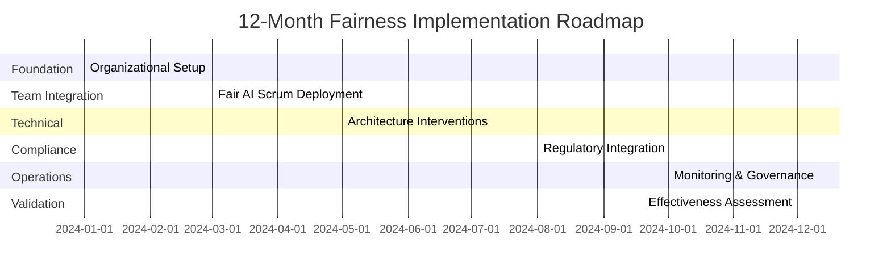

# Implementation Workflow

## Executive Brief

### Core Transformation

Implementing organizational fairness transforms three fundamental aspects of AI development:

**Decision Authority**: Fairness decisions move from implicit (resolved through technical debate or ignored) to explicit (clear ownership, documented rationale, governance oversight).

**Development Rhythm**: Teams shift from "fairness as afterthought" to "fairness as acceptance criteria"—integrated into every sprint through modified user stories and definition of done.

**Accountability Structure**: Organizations establish measurable fairness obligations with clear ownership, moving from aspirational commitments to auditable evidence.

### Required Executive Decisions

You must resolve five strategic questions before implementation:

1. **Investment Level**: Will you implement to minimum regulatory compliance, industry standard, or market leadership? Each requires different resource allocation.

2. **Decision Authority**: Who has final authority on fairness-performance trade-offs? This person needs sufficient organizational power to override short-term business pressure.

3. **Capacity Allocation**: Will you protect dedicated fairness capacity (15-20% of development time) or treat it as discretionary work subject to business pressure?

4. **Scope Timing**: Will you implement across all systems simultaneously or phase by risk tier? Simultaneous implementation demonstrates commitment but risks execution quality.

5. **Compliance Strategy**: Will you implement to the highest applicable standard (simplifies governance but increases cost) or maintain jurisdiction-specific variations (reduces cost but increases complexity)?

### Expected Outcomes

Organizations that successfully complete implementation typically observe:

**Process Changes** (6-9 months):
- Fairness requirements appear in 80%+ of user stories (vs. <10% baseline)
- Teams detect potential bias issues 2-3 sprints earlier than previously
- Time to resolve fairness issues decreases by 50-60%
- Decision paralysis on fairness questions largely eliminated

**Technical Outcomes** (9-12 months):
- Measurable improvement in fairness metrics for deployed systems
- Reduction in post-deployment fairness complaints
- Increased capability to implement sophisticated fairness interventions
- Reusable fairness components across organization

**Business Impact** (12-18 months):
- Reduced compliance costs through unified approach
- Improved audit outcomes with organized evidence
- Market differentiation through demonstrated fairness commitment
- Reduced legal exposure from fairness failures

**Cultural Shift** (18-24 months):
- Fairness considerations become automatic rather than prompted
- Teams proactively identify fairness risks
- Organizational pride in fairness capabilities
- External recognition as fairness leader

### Investment Required

Resource requirements vary by organization size and implementation ambition:

**Small Organization (50-200 employees)**:
- 1.5-2.0 FTE dedicated fairness roles
- External consulting: 200-400 hours for specialized interventions
- Training investment: $50-100K
- Tools and infrastructure: $20-50K
- Total Year 1: $200-400K

**Medium Organization (200-1000 employees)**:
- 3-4 FTE dedicated fairness roles
- External consulting: 400-600 hours
- Training investment: $150-250K
- Tools and infrastructure: $75-150K
- Total Year 1: $500-900K

**Large Organization (>1000 employees)**:
- 6-8 FTE dedicated fairness roles
- External consulting: 600-1000 hours
- Training investment: $400-800K
- Tools and infrastructure: $200-400K
- Total Year 1: $1.2-2.5M

### Risk Considerations

Three failure modes account for most unsuccessful implementations:

**Executive Commitment Erosion**: Initial enthusiasm fades when fairness conflicts with short-term business goals. Mitigation: Establish objective metrics visible to board, create external accountability through public commitments or audits.

**Capacity Protection Failure**: Fairness work consistently deprioritized under delivery pressure. Mitigation: Make fairness capacity non-negotiable in planning, track and report capacity usage to executives monthly.

**Governance Paralysis**: Decision frameworks exist but decisions still slow or inconsistent. Mitigation: Establish and enforce strict decision timelines, escalate blocked decisions to executive sponsor weekly.

---

## Implementation Overview

---

## 12-Month Implementation Journey

### Month 1-2: Foundation

**Strategic Activities**:
- Classify all AI systems by risk level and implementation priority
- Establish governance structure: Who makes which fairness decisions
- Secure resource commitments for full 12-month implementation
- Select pilot system for initial implementation

**Key Decision**: Confirm implementation scope and resource allocation. This is the last natural stopping point before substantial investment.

**Executive Engagement**: Initial announcement, resource approval, pilot selection input.

### Month 3-4: Team Integration Pilot

**Strategic Activities**:
- Deploy modified development practices (Fair AI Scrum) with one team
- Test fairness-enhanced workflows in real sprint cycles
- Identify process refinements before broader rollout
- Build proof point for skeptical teams

**Key Decision**: Assess pilot results and determine rollout approach to remaining teams.

**Why This Takes Time**: Cultural change requires repeated practice. Teams need 6-8 sprints to internalize new practices and see benefits.

**Executive Engagement**: Pilot team briefing, mid-pilot check-in, pilot results review.

### Month 5-7: Technical Implementation

**Strategic Activities**:
- Deploy architecture-specific fairness interventions
- Build reusable fairness components (libraries, tools, templates)
- Develop organizational capability for sophisticated interventions
- Address technical debt in high-priority systems

**Key Decision**: Resolve fairness-performance trade-offs for each system. Some interventions improve fairness at accuracy cost—how much is acceptable?

**Why Technical Depth Matters**: Generic fairness approaches fail. Deep learning systems need different interventions than recommendation systems or LLMs. Building this expertise takes time but creates durable capability.

**Executive Engagement**: Trade-off review and approval, resource adjustment if technical complexity exceeds estimates.

### Month 8-9: Compliance Integration

**Strategic Activities**:
- Map regulatory requirements to implemented practices
- Automate compliance evidence collection
- Create audit-ready documentation package
- Establish ongoing compliance processes

**Key Decision**: Confirm compliance strategy (unified vs. jurisdiction-specific) based on actual implementation experience.

**Why Automation Matters**: Manual compliance evidence collection is expensive and error-prone. Automated collection from existing systems and processes costs 60-70% less while improving reliability.

**Executive Engagement**: Compliance strategy confirmation, external audit preparation approval.

### Month 10-11: Operational Activation

**Strategic Activities**:
- Deploy monitoring dashboards and alert systems
- Activate governance bodies (regular meeting cadence)
- Establish user feedback and appeal mechanisms
- Implement continuous improvement processes

**Key Decision**: Finalize alert thresholds and response protocols. Too sensitive creates alert fatigue, too lenient misses real issues.

**Why Monitoring Is Non-Negotiable**: Without continuous monitoring, fairness degrades invisibly through model drift, data distribution shifts, and feedback loops. Manual spot-checks catch <30% of meaningful degradation.

**Executive Engagement**: Governance body participation begins, dashboard review.

### Month 12: Validation and Year 2 Planning

**Strategic Activities**:
- Measure outcomes against initial objectives
- Conduct external fairness audit
- Synthesize learnings and improvement opportunities
- Define Year 2 priorities and resource needs

**Key Decision**: Year 2 resource allocation and strategic priorities.

**Executive Engagement**: Results presentation to board, Year 2 approval, organizational announcement.

---

## Implementation Components

### Component 1: Governance Structure

**Purpose**: Eliminate decision paralysis through clear authority and documented rationale.

**Core Elements**:
- **Decision Authority Matrix**: Specifies who makes which fairness decisions (e.g., metric selection, trade-off approval, high-risk deployment authorization)
- **AI Ethics Committee**: Senior cross-functional body for high-stakes decisions and strategic oversight
- **Fairness Decision Records**: Documentation of significant fairness decisions including alternatives considered and rationale for choice

**Most Common Failure**: Creating governance structure without real authority. If the AI Ethics Committee can be overridden by business pressure, it's theater not governance.

**Success Indicator**: Average time from fairness question to resolved decision <10 days (vs. 30-60 days without clear governance).

**Why RACI Matrices Matter**: Organizations waste enormous time re-litigating who should make decisions. A RACI matrix (Responsible, Accountable, Consulted, Informed) eliminates this waste by establishing clear decision authority once, then referring to it repeatedly. The key insight: exactly one person should be Accountable for each decision type—never "shared accountability."

**Why Fairness Decision Records Matter**: Fairness decisions involve complex trade-offs with no objectively "right" answer. Recording the decision rationale serves three purposes: (1) prevents re-litigating the same decision repeatedly, (2) creates accountability for the quality of reasoning, (3) builds organizational knowledge about what works.

### Component 2: Fair AI Scrum

**Purpose**: Integrate fairness into development rhythm rather than treating it as separate compliance activity.

**Core Modifications**:
- **Enhanced User Stories**: Add fairness acceptance criteria using SAFE framework (Specific protected attributes, Actionable fairness definition, Feature integration points, Expected outcome measures)
- **Fairness-Aware Definition of Done**: Include fairness metric thresholds alongside functional requirements
- **Mid-Sprint Fairness Checkpoint**: Dedicated 1-hour session to evaluate fairness before features complete
- **Capacity Allocation**: Reserve 15-20% of sprint capacity for fairness work

**Most Common Failure**: Teams write fairness requirements but then deprioritize them under delivery pressure. Protection: Make fairness part of Definition of Done—incomplete fairness means feature is incomplete.

**Success Indicator**: 80%+ of user stories include explicit fairness requirements (vs. <10% baseline).

**Why 15-20% Capacity Matters**: This is not overhead—it reflects the actual work required to build fair systems. Organizations that don't protect this capacity experience chronic fairness debt: unfair systems requiring expensive post-deployment remediation. The percentage is based on: (1) fairness testing typically requires 15-20% of standard testing time, (2) fairness interventions add 10-15% to implementation time, (3) fairness documentation adds 5-10% to overall effort.

**Why Mid-Sprint Checkpoints Matter**: Catching fairness issues mid-sprint allows correction before code review. Catching them post-deployment requires 10-15x more time to fix due to deployment complexity, stakeholder coordination, and potential retraining requirements.

### Component 3: Architecture-Specific Interventions

**Purpose**: Deploy fairness techniques matched to system architecture rather than generic approaches.

**Key Insight**: Fairness interventions must address root causes specific to each architecture:

**Deep Learning Systems**: Biased representations encode protected attributes even when not explicit features. Solution: Adversarial debiasing or fair fine-tuning to create representations that preserve task-relevant information while removing protected attribute predictability.

**Recommendation Systems**: Feedback loops amplify initial popularity biases. Solution: Exploration policies and popularity discounting to prevent runaway effects.

**Large Language Models**: Pre-trained models inherit societal biases from training data. Solution: Fairness-aware prompting, output guardrails, and continuous monitoring.

**Vision Systems**: Performance varies across demographics and environmental conditions. Solution: Demographically balanced training data, environmental robustness techniques, and fair representation learning.

**Most Common Failure**: Applying generic post-processing to all systems. This addresses symptoms but not root causes, resulting in fragile fairness that degrades quickly.

**Success Indicator**: System-specific fairness metrics meet thresholds consistently, not just at initial deployment.

**Trade-offs in Technique Selection**:

**Reweighting vs. Adversarial Debiasing**: Reweighting (adjusting training example importance) is simpler and more stable but only addresses label bias, not representation bias. Adversarial debiasing addresses deeper representation issues but requires more expertise and careful tuning. For shallow models or systems with primarily label bias, reweighting is sufficient. For deep learning systems with representation entanglement, adversarial approaches are often necessary.

**Pre-processing vs. In-processing vs. Post-processing**: Pre-processing (data correction) is easiest to implement and understand but can't address biases learned during training. In-processing (fairness-aware training) addresses root causes but requires model retraining. Post-processing (output adjustment) preserves model performance but treats symptoms not causes. Strategy: Use in-processing for high-risk systems where you control training, post-processing for vendor models or lower-risk systems where retraining is impractical.

### Component 4: Regulatory Compliance

**Purpose**: Create efficient compliance apparatus serving multiple regulatory frameworks simultaneously.

**Core Strategy**: Implement to highest applicable standard rather than maintaining separate implementations per jurisdiction. This increases initial cost but dramatically reduces ongoing compliance burden.

**Rationale**: Regulatory requirements share common principles (risk assessment, bias testing, documentation, transparency, human oversight). Differences are primarily in specificity and evidence format. Implementing comprehensively once costs less than maintaining multiple variations.

**Most Common Failure**: Treating compliance as documentation exercise rather than evidence of actual practice. Auditors increasingly demand evidence of implemented controls, not just completed paperwork.

**Success Indicator**: Time to compile audit package <5 days (vs. 20-30 days with manual evidence collection).

**Evidence Automation Strategy**: Modern compliance evidence should generate automatically from existing systems:
- Fairness metrics: From monitoring systems (continuous collection)
- Bias testing: From CI/CD pipelines (every deployment)
- Human oversight: From review logs (transactional capture)
- Incident response: From ticketing systems (standard operation)

Manual evidence collection is expensive, error-prone, and often outdated by audit time. Automated collection costs 60-70% less while providing real-time compliance status.

### Component 5: Continuous Monitoring

**Purpose**: Detect fairness degradation before it causes harm.

**Three-Tier Dashboard System**:

**Executive Dashboard** (monthly review): High-level fairness health, trends, incidents, and business impact. Purpose: Strategic oversight and early warning of systemic issues.

**Management Dashboard** (weekly review): System-level fairness comparison, disaggregated performance, alert history. Purpose: Resource allocation and cross-team coordination.

**Technical Dashboard** (real-time): Live fairness metrics, distribution drift, API performance by demographic group. Purpose: Operational monitoring and rapid response.

**Why Three Tiers Matter**: Different stakeholders need different information at different cadences. Executives need strategic signal without operational noise. Technical teams need real-time detail. A single dashboard serves no audience well.

**Alert Threshold Philosophy**: Critical alerts (>10% degradation from baseline) require immediate response because they indicate potential systematic discrimination. Major alerts (5-10% degradation) require investigation within 24 hours because they may indicate emerging problems. Minor alerts (3-5% degradation) trigger review within a week because they may represent normal variance or early warning.

These thresholds balance two risks: alert fatigue from excessive sensitivity vs. missing meaningful degradation from insufficient sensitivity. Thresholds should be calibrated to organizational risk tolerance and historical patterns.

**Why Continuous Monitoring Is Non-Negotiable**: Fairness degrades invisibly through three mechanisms: (1) model drift as world changes, (2) data distribution shifts in production, (3) feedback loops that amplify initial biases. Manual quarterly audits catch perhaps 30% of meaningful degradation. Continuous monitoring catches 80%+ and enables rapid response.

**Key Integration Points**:

1. **Governance → Team Practices**: RACI matrices define who makes fairness decisions within teams
2. **Team Practices → Technical Implementation**: Fair AI Scrum defines requirements that guide technical interventions
3. **Technical Implementation → Compliance**: Architecture-specific interventions generate evidence for regulatory requirements
4. **All → Monitoring**: Continuous monitoring validates that governance, practices, and technical interventions are effective

---

## Critical Success Factors

Based on implementation experience across organizations, five factors most strongly predict success:

### 1. Sustained Executive Commitment (35% of variance)

**What This Means**: Executive sponsor remains actively engaged throughout 12-month implementation, protects resources during budget pressure, prioritizes fairness in trade-off decisions, and publicly communicates importance.

**Why It Matters**: Fairness implementation requires sustained investment that only pays off over 12-18 months. Without executive protection, fairness work gets deprioritized during quarterly pressures.

**Failure Pattern**: Strong kickoff, then gradual deprioritization as business urgency conflicts with fairness timelines.

**Mitigation**: Establish objective metrics visible to board, create external accountability through public commitments or scheduled audits, quarterly executive reviews with prepared materials.

### 2. Clear Decision Authority (25% of variance)

**What This Means**: RACI matrices eliminate paralysis, one accountable person per decision type, fast escalation paths, governance bodies actually making decisions.

**Why It Matters**: Fairness decisions involve complex trade-offs with no objectively right answer. Without clear authority, teams endlessly debate or avoid deciding.

**Failure Pattern**: Governance structure exists but decisions still take 30-60 days or vary inconsistently.

**Mitigation**: Establish and enforce strict decision timelines (10 days maximum), escalate blocked decisions to executive sponsor weekly, document decisions in Fairness Decision Records to prevent re-litigation.

### 3. Embedded vs. Siloed (20% of variance)

**What This Means**: Fairness integrated into existing workflows (user stories, Definition of Done, CI/CD) rather than parallel process or separate "fairness team."

**Why It Matters**: Parallel processes create handoff delays, knowledge barriers, and accountability diffusion. Embedded practices make fairness automatic.

**Failure Pattern**: "Fairness team" does all fairness work, creating bottleneck and preventing capability building in product teams.

**Mitigation**: Hybrid model with central expertise (Fairness CoE) providing guidance, tools, and escalation support, but fairness work executed by product teams with embedded champions.

### 4. Technical Rigor (15% of variance)

**What This Means**: Architecture-specific interventions addressing root causes, evidence-based evaluation, documented trade-offs, measurable outcomes.

**Why It Matters**: Generic approaches produce fragile fairness that degrades quickly. Rigorous approaches create durable fairness properties.

**Failure Pattern**: Applying same technique to all systems regardless of architecture, accepting fairness "improvements" without rigorous evaluation, undocumented trade-offs leading to re-litigation.

**Mitigation**: Match interventions to architecture (see Component 3), require evidence for all fairness claims, document all trade-offs in Fairness Decision Records, measure outcomes not just process.

### 5. Continuous Adaptation (5% of variance)

**What This Means**: Monitoring and feedback loops operational, learning from incidents, process improvements based on team feedback, regulatory tracking.

**Why It Matters**: Initial implementation won't be perfect. Organizations that adapt based on experience improve continuously; those that don't stagnate.

**Failure Pattern**: Implementing process rigidly without adjusting based on team feedback, ignoring monitoring signals, missing regulatory changes.

**Mitigation**: Monthly organizational retrospectives, quarterly process reviews, ongoing regulatory tracking, systematic learning from incidents.

---
## Common Pitfalls

### Pitfall 1: "Fairness Theater"

**Symptoms**: Teams complete fairness checklists without meaningful engagement, documentation exists but doesn't reflect actual decisions, process compliance without outcome improvement.

**Why This Happens**: Organizations focus on demonstrating compliance rather than achieving fairness. Creates appearance of rigor without substance.

**Cost**: Wasted investment in ineffective processes, continued fairness risk, eventual credibility loss when problems surface.

**Prevention**: Focus on outcome metrics (actual bias reduction) not just process metrics, include qualitative stakeholder feedback on meaningfulness, governance challenges substance not just completion, celebrate real impact not paperwork.

### Pitfall 2: Governance Overhead

**Symptoms**: Excessive meetings slow development unacceptably, documentation burden demoralizes teams, fairness work viewed as bureaucracy not value.

**Why This Happens**: Organizations add fairness processes without removing or streamlining anything else. Total process burden becomes unsustainable.

**Cost**: Team burnout, quality degradation as corners get cut, eventual abandonment of fairness practices.

**Prevention**: Maintain strict ceremony timeboxes, automate evidence collection (don't manually recreate), use tiered decision authority (not everything needs committee review), target <20% fairness capacity after initial implementation phase.

### Pitfall 3: Underestimating Complexity

**Symptoms**: Initial timeline overrun, frustrated teams encountering unanticipated technical challenges, incomplete implementation after planned timeframe.

**Why This Happens**: Organizations underestimate both technical complexity (especially for sophisticated interventions like adversarial debiasing) and organizational change difficulty.

**Cost**: Rushed implementation with poor quality, team demoralization, partial implementation that doesn't achieve objectives.

**Prevention**: Phased rollout with pilot before scaling, 20% time buffer in plans, external expertise for complex interventions, adjust timeline based on pilot learnings rather than pushing forward.

### Pitfall 4: Losing Momentum

**Symptoms**: Strong start then gradual deprioritization, implementation stalls after Stage 2-3, incomplete rollout to all teams.

**Why This Happens**: Initial enthusiasm fades, business urgency shifts attention, lack of visible progress markers.

**Cost**: Wasted investment in partial implementation, continued fairness risk in non-covered systems, organizational cynicism about future initiatives.

**Prevention**: Quarterly executive reviews maintain visibility, quick wins and success stories maintain energy, connect to business impact not just compliance, external commitments (audit, certification) create accountability.

### Pitfall 5: One-Size-Fits-All

**Symptoms**: Rigid processes that don't adapt to team contexts, resistance from teams feeling constrained, poor fit between prescribed process and actual work.

**Why This Happens**: Organizations create standardized processes without room for adaptation to different team contexts, technical stacks, or risk levels.

**Cost**: Team resistance undermines implementation, inefficient processes waste time, inability to leverage team innovations.

**Prevention**: Mandatory core practices with optional advanced practices, team customization encouraged within guidelines, different approaches for different architectures, systematic learning from team innovations.

---

## Validation Approach

### Measuring Implementation Success

Validate implementation through three types of evidence:

**Process Metrics** (Measure adoption):
- Percentage of user stories with explicit fairness requirements
- Percentage of Definition of Done including fairness criteria
- Average time from fairness question to resolved decision
- Team capacity allocated to fairness work
- Training completion rates

Target: 80%+ of teams consistently following core practices by month 9.

**Outcome Metrics** (Measure impact):
- Percentage of bias issues detected pre-deployment vs. post-deployment
- Fairness metric performance across deployed systems
- Time to resolve identified fairness issues
- Post-deployment fairness complaints
- Critical fairness incidents in production

Target: 75%+ of bias issues detected pre-deployment by month 12 (vs. <25% baseline).

**Stakeholder Satisfaction** (Measure sustainability):
- Team surveys on clarity, usefulness, and overhead
- Stakeholder interviews with technical staff, product managers, executives
- External audit results

Target: Average satisfaction >7/10 across all stakeholder groups.

### External Validation

Engage external fairness auditor at month 11-12 to provide independent assessment of:
- Technical implementation quality
- Governance effectiveness
- Documentation completeness
- Regulatory compliance readiness

External validation serves two purposes: (1) credibility with stakeholders and regulators, (2) identification of blind spots internal assessment might miss.

Expected outcome: Pass external audit with minor findings only. Major findings indicate implementation gaps requiring remediation before claiming organizational fairness maturity.

---

## Year 2 and Beyond

### Typical Year 2 Priorities

Organizations completing Year 1 implementation typically focus Year 2 on:

**Scale to Remaining Systems**: Extend implementation to lower-priority systems not covered in Year 1, new systems entering development, acquired systems requiring integration.

**Deepen Technical Capabilities**: Implement more sophisticated interventions (e.g., causal fairness), address emerging architectures (new LLM versions, multi-modal systems), build additional reusable components.

**Mature Governance**: Increase decision efficiency while maintaining quality, reduce executive time required for routine decisions, improve stakeholder engagement effectiveness.

**Compliance Evolution**: Adapt to new regulatory requirements, expand to additional jurisdictions, achieve fairness certifications if valuable for market positioning.

**Build Market Position**: Contribute to open source fairness tools, present at conferences, publish transparency reports, establish reputation as fairness leader.

### Long-Term Maturity

Organizations reaching fairness maturity (typically 24-36 months) demonstrate:

**Automatic Fairness Consideration**: Teams proactively identify fairness risks without prompting, fairness becomes "how we build" not "what we must check."

**Efficient Governance**: Routine decisions resolved in <5 days, only truly novel situations require extended deliberation, low administrative overhead.

**Technical Excellence**: Organizational capability to implement any fairness intervention appropriate to problem, reusable components dramatically reduce implementation time.

**Market Recognition**: External stakeholders recognize organization as fairness leader, attracting talent and customers who value fairness, premium market positioning.

**Continuous Innovation**: Organization contributes new techniques to field, not just consuming existing knowledge, thought leadership in fairness community.

---

## Decision Framework for Executives

### Go/No-Go Decision (Before Implementation)

Implement if:
- ✓ You deploy AI in regulated domains (employment, lending, housing, healthcare, etc.)
- ✓ You face realistic litigation risk from discriminatory AI
- ✓ Your market includes customers who demand fairness accountability
- ✓ You can commit resources for full 12-month implementation
- ✓ You can protect fairness capacity from quarterly business pressure

Defer or scale down if:
- ✗ Your AI systems have minimal discrimination risk
- ✗ You lack executive commitment for sustained investment
- ✗ Your organization is too unstable for 12-month initiative
- ✗ You have more urgent existential priorities

Consider: Partial implementation (compliance-focused) if you need regulatory defensibility but lack capacity for full cultural transformation.

### Resource Allocation Decision (Month 1)

Confirm resource level appropriate to implementation ambition:

**Minimum Compliance**: Focus on high-risk systems only, basic governance, manual evidence collection. Resources: 1-1.5 FTE, 6-month timeline, $150-300K. Outcome: Regulatory defensibility, minimal culture change.

**Industry Standard**: Implement across high and medium-risk systems, operational governance, semi-automated evidence. Resources: 2-4 FTE, 12-month timeline, $400-900K. Outcome: Competitive parity, moderate culture shift.

**Market Leadership**: Comprehensive implementation, sophisticated governance, full automation, external validation. Resources: 4-8 FTE, 18-month timeline, $1-2.5M. Outcome: Market differentiation, deep culture transformation.

Most organizations choose Industry Standard, providing regulatory compliance with reasonable investment while building authentic capability.

### Trade-off Approval (Ongoing)

For each fairness-performance trade-off requiring executive approval:

**Decision Factors**:
- Magnitude: How much performance loss? (e.g., 2% accuracy decrease)
- Fairness Gain: How much fairness improvement? (e.g., demographic parity gap from 0.12 to 0.03)
- Regulatory Requirement: Is fairness legally required regardless of performance?
- Business Impact: Does performance loss materially harm business value?
- Alternatives: Have all reasonable alternatives been explored?

**Decision Framework**:
- Small performance loss (<3%) for substantial fairness gain (>5 percentage points): Generally approve
- Large performance loss (>5%) for small fairness gain (<2 percentage points): Generally reject, explore alternatives
- Performance loss that eliminates business viability: Cannot approve, must find alternative approach or abandon system
- Regulatory compliance at any reasonable performance cost: Must approve

Document all decisions in Fairness Decision Records with explicit rationale for accountability and learning.

### Year 2 Continuation Decision (Month 12)

Continue investment if:
- ✓ Year 1 achieved >70% of target metrics
- ✓ Teams report process is valuable, not purely overhead
- ✓ External audit passed with minor findings only
- ✓ Business realizes value (compliance efficiency, market access, risk reduction)

Scale down if:
- ✗ Year 1 achieved <50% of target metrics
- ✗ Teams report high frustration with low value
- ✗ External audit revealed major systematic gaps
- ✗ Business priorities shifted fundamentally

Investigate if results between 50-70%: Likely indicates execution challenges (inadequate resources, insufficient executive support, technical complexity underestimation) rather than flawed approach.

---

## Conclusion

Organizational fairness implementation succeeds when executives:

1. Make clear strategic decisions about scope, resources, and authority
2. Protect investment through inevitable quarterly pressures
3. Hold organization accountable for both process and outcomes
4. Adjust approach based on evidence rather than assumptions

The 12-month implementation journey transforms how organizations build AI systems. Teams shift from discovering fairness problems post-deployment (expensive, embarrassing, sometimes catastrophic) to preventing them through systematic practices (efficient, defensible, culturally embedded).

Success requires sustained commitment, clear governance, and technical rigor. But organizations completing implementation build durable competitive advantages: regulatory compliance, market differentiation, reduced risk exposure, and organizational capability that compounds over time.

The choice is not whether to address fairness—regulatory and market forces make this inevitable. The choice is whether to implement systematically (efficient, comprehensive, culturally embedded) or reactively (expensive, fragmented, perpetually behind).

---

## Related Playbook Components

- **Team Practices**: [Fair AI Scrum Toolkit](01_Fair-AI-Scrum-Toolkit.md)
- **Governance**: [Organizational Integration Toolkit](02_Organizational-Integration-Toolkit.md)
- **Technical**: [Advanced Architecture Cookbook](03_Advanced-Architecture-Cookbook.md)
- **Compliance**: [Regulatory Compliance Guide](04_Regulatory-Compliance-Guide.md)
- **Case Study**: [EquiHire Implementation](06_Case-Study-EquiHire.md) - See practical example
- **Validation**: [Validation Framework](07_Validation-Framework.md) - Measure effectiveness

## Resources

### Implementation Support

**Templates**:
- [User Story Template](templates/fairness-user-story-template.md)
- [FDR Template](templates/fairness-decision-record-template.md)
- [RACI Matrix Template](templates/raci-matrix-template.md)
- [Sprint Planning Checklist](templates/sprint-planning-checklist.md)

---

