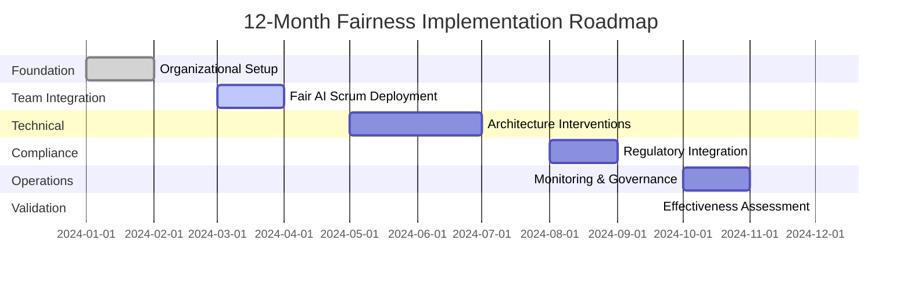
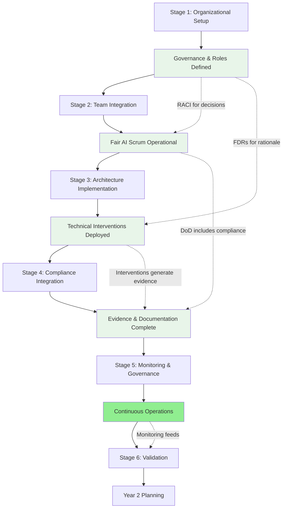

# Implementation Workflow

## Overview

The Implementation Workflow provides a comprehensive, step-by-step roadmap for deploying the Fairness Implementation Playbook across your organization. This workflow integrates all four core components—Fair AI Scrum, Organizational Integration, Advanced Architecture, and Regulatory Compliance—into a cohesive 12-month implementation plan.

### Purpose

This workflow serves as:
- **Roadmap**: Clear timeline from initiation to operational maturity
- **Integration Guide**: How components work together at each stage
- **Decision Framework**: Key decision points and escalation paths
- **Risk Management**: Common pitfalls and mitigation strategies

### Success Metrics

Organizations following this workflow achieve:
- **76%+** of bias issues detected pre-deployment (vs. 24% baseline)
- **58% reduction** in fairness issue resolution time
- **47% reduction** in compliance costs through unified approach
- **Zero** critical fairness incidents in production

---

## Implementation Overview


---

## Stage 1: Organizational Setup (Weeks 1-8)

### 1.1 Objectives

- Establish governance foundations
- Classify AI systems by risk
- Define organizational roles
- Create decision frameworks
- Build executive commitment

### 1.2 Timeline

**Week 1-2**: Executive alignment and risk classification  
**Week 3-4**: Governance structure and RACI  
**Week 5-6**: Documentation frameworks  
**Week 7-8**: Communication and training plans

---

### 1.3 Activities

#### Week 1-2: Executive Alignment & Risk Classification

**Activity 1.1: Secure Executive Sponsorship**
```markdown
**Objective**: Obtain executive commitment and budget approval

**Actions**:
□ Present business case to executive leadership
  - Risk mitigation value: Avoiding one major bias incident saves $500K-$5M
  - Compliance efficiency: 47% cost reduction vs. fragmented approach
  - Market advantage: Fair AI certification unlocks regulated markets
  - Talent attraction: Fairness reputation reduces hiring costs 15-20%

□ Identify executive sponsor (recommended: CEO, CTO, or VP Engineering)
  - Must have authority to allocate resources
  - Must champion fairness culture organizationally

□ Secure budget approval
  - Small org (50-200): $200K-$400K
  - Medium org (200-1000): $500K-$900K
  - Large org (>1000): $1.2M-$2.5M

□ Define success metrics and review cadence
  - Quarterly executive reviews
  - Annual board reporting

**Deliverables**:
- Executive sponsor identified and committed
- Budget approved for 12-month implementation
- Success metrics defined
- Communication plan for organization-wide announcement

**Decision Point**: Go/No-Go for full implementation
- GO: Proceed to Activity 1.2
- NO-GO: Revisit business case, reduce scope, or defer
```

**Activity 1.2: AI System Portfolio Review**
```python
# Example risk classification process
from risk_classification import RiskClassificationFramework

def conduct_portfolio_review(ai_systems):
    """
    Classify all AI systems by risk level
    """
    classifier = RiskClassificationFramework()
    
    portfolio_results = []
    
    for system in ai_systems:
        result = classifier.classify_system({
            'name': system['name'],
            'domain': system['domain'],
            'domain_impact': system['domain_impact'],
            'decision_impact': system['decision_impact'],
            'autonomy_level': system['autonomy_level'],
            'scale': system['scale'],
            'reversibility': system['reversibility']
        })
        
        portfolio_results.append({
            'system': system['name'],
            'classification': result['classification'],
            'tier': result['tier'],
            'score': result['score'],
            'priority': calculate_implementation_priority(result)
        })
    
    return portfolio_results

def calculate_implementation_priority(classification_result):
    """
    Determine implementation priority (1=highest)
    Based on risk + business impact + technical feasibility
    """
    score = classification_result['score']
    
    if score >= 4.5:
        return 1  # Critical - implement immediately
    elif score >= 3.5:
        return 2  # High - implement in first 6 months
    elif score >= 2.5:
        return 3  # Medium - implement in 6-12 months
    else:
        return 4  # Low - implement as resources allow

# Example execution
ai_systems = [
    {
        'name': 'Candidate Ranking Algorithm',
        'domain': 'employment',
        'domain_impact': 'high_stakes',
        'decision_impact': 'life_altering',
        'autonomy_level': 'high_automation',
        'scale': 'large',
        'reversibility': 'very_difficult'
    },
    {
        'name': 'Email Spam Filter',
        'domain': 'communication',
        'domain_impact': 'low',
        'decision_impact': 'minor_impact',
        'autonomy_level': 'full_automation',
        'scale': 'massive',
        'reversibility': 'easy'
    },
    # ... more systems
]

portfolio = conduct_portfolio_review(ai_systems)
```

**Deliverables**:
- Complete AI system inventory
- Risk classification for each system
- Implementation priority ranking
- Resource allocation plan

---

#### Week 3-4: Governance Structure

**Activity 1.3: Define Fairness Leadership Roles**
```markdown
**Roles to Establish**:

1. **Chief AI Ethics Officer** (0.5-1.0 FTE)
   □ Identify candidate (existing executive or new hire)
   □ Define responsibilities and authority
   □ Allocate capacity (documented in role description)
   □ Set success metrics

2. **Technical Fairness Lead** (0.5-1.0 FTE)
   □ Identify senior engineer with fairness expertise
   □ Define technical responsibilities
   □ Allocate capacity
   □ Connect to architecture teams

3. **Fairness Program Manager** (0.5-1.0 FTE, medium+ orgs)
   □ Identify candidate with PM/coordination skills
   □ Define operational responsibilities
   □ Establish cross-functional connections

4. **Domain Specialists** (0.5-1.0 FTE per major domain)
   □ Identify domain experts (e.g., recruitment, lending)
   □ Define domain-specific responsibilities
   □ Connect to affected business units

5. **Fairness Champions** (0.1-0.2 FTE per team)
   □ Identify senior engineers in each team
   □ Part-time capacity allocation
   □ Define team-level responsibilities

**Resource-Constrained Adaptation** (Small orgs):
- Combine roles: VP Engineering = Chief AI Ethics Officer (0.5 FTE)
- Technical Fairness Lead: Staff engineer (0.5 FTE)
- Champions: Part-time (0.1 FTE × 5 teams = 0.5 FTE)
- **Total: 1.5-2 FTE equivalent**

**Deliverables**:
- Role descriptions with explicit responsibilities
- Capacity allocations documented
- Candidates identified and committed
- Reporting structure defined
```

**Activity 1.4: Create RACI Matrices**
```markdown
**Process**:

1. **Identify Decision Types** (Brainstorm session)
   □ Strategic decisions (e.g., metric selection, risk classification)
   □ Tactical decisions (e.g., threshold definition, architecture choice)
   □ Operational decisions (e.g., user story requirements, test implementation)
   □ Incident response decisions

2. **Draft Initial RACI**
   □ For each decision type, assign:
     - R (Responsible): Who does the work
     - A (Accountable): Who has final authority (ONLY ONE)
     - C (Consulted): Who provides input
     - I (Informed): Who is kept updated

3. **Validate with Stakeholders**
   □ Present to affected teams
   □ Gather feedback on feasibility
   □ Adjust based on organizational context

4. **Legal Review**
   □ Ensure accountability is clear for liability
   □ Verify decision authority aligns with roles

**Example RACI** (See Organizational Integration Toolkit for full matrix):

| Decision | Responsible | Accountable | Consulted | Informed |
|----------|-------------|-------------|-----------|----------|
| Fairness metric selection | Tech Fairness Lead | Chief AI Ethics Officer | Domain Specialist, Legal, AI Ethics Committee | All teams |
| High-risk deployment | Product Manager, Tech Lead | Chief AI Ethics Officer | AI Ethics Committee, Legal | Executive |

**Deliverables**:
- RACI matrix covering top 15-20 decision types
- Stakeholder sign-off
- Published in central documentation
- Included in onboarding materials
```

**Activity 1.5: Establish Governance Bodies**
```markdown
**AI Ethics Committee**:

□ Define composition (8-12 members):
  - Chief AI Ethics Officer (Chair)
  - Tech Fairness Lead
  - Domain Specialists (2-3)
  - Legal Counsel
  - Product/Engineering leadership
  - External advisor (academic or civil rights)
  - Community representative

□ Define charter:
  - Purpose: Strategic oversight, high-risk approvals, trade-off resolution
  - Authority: High-risk deployment approval, policy setting
  - Meeting cadence: Quarterly regular, ad-hoc for urgent decisions
  - Quorum: Minimum 6 members including Chair and Legal

□ Schedule first meeting

**Fairness Working Groups** (Operational coordination):

□ Create domain-specific working groups:
  - Recruitment/HR AI
  - Product recommendations
  - (Other domains as needed)

□ Define membership and cadence (bi-weekly)

**Community Advisory Council** (External perspective):

□ Identify 6-10 external members:
  - Representatives from affected demographic groups
  - Civil rights advocates
  - Domain experts
  - Academic researchers

□ Define advisory role (no formal decision power, consulted for strategic decisions)
□ Establish compensation ($200-500/hour)
□ Schedule quarterly meetings

**Deliverables**:
- AI Ethics Committee charter and membership
- Working Group structures
- Community Advisory Council established
- First meetings scheduled
```

---

#### Week 5-6: Documentation Frameworks

**Activity 1.6: Implement Fairness Decision Records (FDRs)**
```markdown
**Setup**:

□ Create FDR template (see templates/fairness-decision-record-template.md)

□ Set up FDR repository:
  - Location: /fairness-decision-records/
  - Version control: Git
  - Naming convention: FDR-YYYY-###-short-title.md
  - Searchable: Tags, indexing

□ Define workflow:
  1. Draft FDR when decision identified
  2. Stakeholder review (per RACI)
  3. Chief AI Ethics Officer approval
  4. Publish to repository
  5. Link from related documentation

□ Train teams on FDR creation:
  - When to create FDRs (all major fairness decisions)
  - How to document alternatives and trade-offs
  - Linking to supporting evidence

**Pilot**:
□ Create 2-3 example FDRs for past decisions
□ Review with teams for feedback
□ Refine template and process

**Deliverables**:
- FDR template finalized
- Repository set up
- Workflow documented
- Teams trained
- 2-3 example FDRs published
```

**Activity 1.7: Create Communication Protocols**
```markdown
**Stakeholder Mapping**:

□ Identify key stakeholder groups:
  - Executive Leadership
  - Technical Teams (Engineers, Data Scientists)
  - Product Managers
  - Legal/Compliance
  - Domain Experts (e.g., Recruiting Managers)
  - End Users (e.g., Candidates)
  - External (Public, Press, Regulators)

□ For each group, define:
  - Information needs
  - Communication format (dashboard, report, FAQ)
  - Frequency (real-time, weekly, monthly, quarterly)
  - Language level (technical, business, simple)

**Communication Materials**:

□ Create stakeholder-specific materials:
  - Executive Dashboard (monthly fairness health)
  - Technical Documentation (implementation details)
  - Model Cards (public transparency)
  - User FAQs (simple language)
  - Regulatory Reports (compliance evidence)

□ Establish Progressive Disclosure:
  - Layer 1: Summary (one sentence)
  - Layer 2: Key metrics (3-5 numbers)
  - Layer 3: Methodology
  - Layer 4: Limitations
  - Layer 5: Technical details

**Deliverables**:
- Stakeholder communication matrix
- Templates for each stakeholder type
- Progressive disclosure framework
- Example communications for pilot system
```

---

#### Week 7-8: Training and Readiness

**Activity 1.8: Conduct Fairness Training**
```markdown
**Training Program**:

**Level 1: All Employees** (2-hour session)
□ Fairness fundamentals
□ Organizational fairness commitment
□ How to report fairness concerns
□ Role-specific responsibilities

**Level 2: Technical Staff** (8-hour workshop)
□ Bias types and sources
□ Fairness metrics and evaluation
□ Basic interventions (reweighting, post-processing)
□ Fair AI Scrum practices
□ Fairness testing and validation

**Level 3: ML Engineers** (16-hour deep dive)
□ Architecture-specific interventions:
  - Deep Learning: Adversarial debiasing
  - Recommendation Systems: Feedback loops
  - LLMs: Prompt engineering, RLHF
  - Vision: Environmental robustness
□ Advanced evaluation techniques
□ Hands-on implementation exercises

**Level 4: Fairness Champions** (24-hour comprehensive)
□ All technical content (Level 2-3)
□ Governance and decision-making
□ Stakeholder management
□ FDR creation and documentation
□ Escalation and incident response

**Delivery**:
□ Schedule training sessions
□ Create training materials
□ Record sessions for future reference
□ Assess learning (quizzes, exercises)
□ Issue completion certificates

**Deliverables**:
- Training curriculum for all levels
- Training materials (slides, exercises, recordings)
- Training schedule and attendance tracking
- >80% completion rate for technical staff
```

**Activity 1.9: Readiness Assessment**
```markdown
**Readiness Checklist**:

**Leadership & Governance**:
□ Executive sponsor committed
□ Budget approved
□ Fairness leadership roles filled
□ RACI matrices created and approved
□ Governance bodies established

**Documentation & Process**:
□ FDR framework operational
□ Communication protocols defined
□ Risk classification completed
□ Training program delivered

**Technical Readiness**:
□ >80% of technical staff trained
□ Pilot system identified
□ Initial fairness assessment completed
□ Development team ready to begin

**Decision**:
- **READY**: Proceed to Stage 2 (Fair AI Scrum Deployment)
- **NOT READY**: Address gaps, re-assess in 2 weeks

**Deliverables**:
- Readiness assessment report
- Gap mitigation plan (if needed)
- Go/No-Go decision for Stage 2
```

---

### 1.4 Stage 1 Deliverables Summary

| Deliverable | Owner | Status Check |
|-------------|-------|--------------|
| Executive sponsorship secured | CEO/CTO | ✓ Budget approved |
| AI portfolio risk classification | Chief AI Ethics Officer | ✓ All systems classified |
| Fairness leadership roles defined | Chief AI Ethics Officer | ✓ Roles filled, capacity allocated |
| RACI matrices created | Fairness Program Manager | ✓ Stakeholder approval |
| Governance bodies established | Chief AI Ethics Officer | ✓ First meetings held |
| FDR framework operational | Fairness Program Manager | ✓ Template + examples |
| Communication protocols | Communications + Fairness PM | ✓ Materials created |
| Training completed | HR + Fairness Team | ✓ >80% completion |
| Readiness assessment | Chief AI Ethics Officer | ✓ Ready for Stage 2 |

---

### 1.5 Common Challenges and Solutions

#### Challenge 1: Executive Resistance ("Too expensive, slows development")

**Symptoms**:
- Budget approval delayed
- Limited resource allocation
- Skepticism about ROI

**Solutions**:
- **Reframe as risk management**: One prevented incident saves $500K-$5M  
- **Show efficiency gains**: 58% faster bias resolution, 47% lower compliance costs  
- **Start small**: Pilot with one high-risk system, demonstrate value  
- **Regulatory pressure**: Highlight legal requirements (EU AI Act, state laws)  
- **Market advantage**: Fair AI certification unlocks new markets  

**Example Business Case**:
```
Investment: $500K (medium org, first year)
Risk Mitigation: $2M (expected value of prevented incidents)
Efficiency Gains: $150K (reduced rework, faster resolution)
Market Access: $500K (new contracts requiring fairness certification)
ROI: 430% over 3 years
```

---

#### Challenge 2: Role Ambiguity ("Who owns fairness?")

**Symptoms**:
- Decisions delayed
- Teams unsure who to consult
- Fairness work falls through cracks

**Solutions**:
- **RACI matrices are mandatory**: Don't proceed without them  
- **One accountable person per decision**: Never "shared accountability"  
- **Visible leadership**: Chief AI Ethics Officer must be known and accessible  
- **Regular communication**: Weekly office hours, monthly updates  
- **Escalation clarity**: Published escalation paths  

---

#### Challenge 3: Documentation Burden ("Too much paperwork")

**Symptoms**:
- Teams view FDRs as bureaucracy
- Documentation delayed or incomplete
- Resistance to fairness processes

**Solutions**:
- **Automate evidence collection**: CI/CD integration, monitoring dashboards  
- **Templates and examples**: Reduce creation friction  
- **Show value**: "Last time, we spent 2 weeks re-litigating a decision because we didn't document it"  
- **Light FDRs for minor decisions**: Full FDRs only for major decisions  
- **Celebrate good documentation**: Recognize teams with excellent FDRs  

---

## Stage 2: Team Integration (Weeks 9-16)

### 2.1 Objectives

- Deploy Fair AI Scrum practices across teams
- Modify artifacts (user stories, Definition of Done)
- Integrate fairness into ceremonies
- Allocate capacity for fairness work
- Establish team-level fairness capabilities

### 2.2 Timeline

**Week 9-10**: Pilot team preparation  
**Week 11-12**: Fair AI Scrum pilot  
**Week 13-14**: Refinement and expansion planning  
**Week 15-16**: Scale to additional teams  

---

### 2.3 Activities

#### Week 9-10: Pilot Team Preparation

**Activity 2.1: Select Pilot Team**
```markdown
**Selection Criteria**:

□ Team working on Priority 1 or 2 system (high-risk)
□ Stable team composition (minimize churn during pilot)
□ Mature agile practices (at least Scrum Stage 2)
□ Team receptive to change
□ Visible system (creates case study for other teams)

**Recommended**: Candidate Ranking team (Priority 1 system)

**Pilot Team Setup**:

□ Brief team on pilot objectives and timeline
□ Identify team Fairness Champion (senior engineer, 0.2 FTE)
□ Allocate pilot capacity: 25-30% for fairness work (higher than steady-state)
□ Set success metrics:
  - >80% of user stories include fairness requirements
  - >90% of DoD includes fairness criteria
  - Bias issues surfaced 2+ sprints earlier
  - Team satisfaction >7/10

**Deliverables**:
- Pilot team selected and briefed
- Fairness Champion identified
- Pilot success metrics defined
- Baseline measurements taken
```

**Activity 2.2: Customize Fair AI Scrum Artifacts**
```markdown
**User Story Template**:

□ Extend template to include fairness dimensions:
```
  As a [role], I want [functionality] so that [benefit],
  ensuring [fairness goal] across [protected attributes]
```

□ Create examples for pilot team's domain:
  - Candidate ranking
  - Resume screening
  - Interview scheduling

□ Apply SAFE framework:
  - **S**pecific protected attributes
  - **A**ctionable fairness definition
  - **F**eature integration points
  - **E**xpected outcome measures

**Definition of Done Template**:

□ Extend DoD with FAIR framework:
  - **F**airness metrics thresholds
  - **A**uditing requirements
  - **I**ntersectional analysis
  - **R**eporting guidelines

□ Create domain-specific DoD example:
```
  **Candidate Ranking Feature DoD**:
  
  Functional:
  - Accuracy ≥82%
  - API latency <200ms
  - Unit tests pass
  
  Fairness:
  - Equal opportunity difference ≤0.03
  - Demographic parity difference ≤0.05
  - Intersectional gap ≤0.04
  - Counterfactual analysis completed (500 test cases)
  - Model card updated
  - FDR created (if trade-offs made)
```

**Sprint Planning Checklist**:

□ Create fairness integration checklist (see Fair AI Scrum Toolkit)

□ Customize for pilot team

**Deliverables**:
- Customized user story template
- Enhanced Definition of Done
- Sprint planning fairness checklist
- 3-5 example stories in pilot team's domain
```

---

#### Week 11-12: Fair AI Scrum Pilot

**Activity 2.3: Execute Pilot Sprint**
```markdown
**Sprint Planning** (2 hours):

□ Review fairness backlog items
□ Allocate 25-30% capacity to fairness work
□ Create fairness-enhanced user stories for sprint
□ Ensure all stories have fairness acceptance criteria

**Daily Standups** (15 minutes + 2 min fairness):

□ Add fairness prompt: "Any fairness risks or concerns?"
□ Track fairness blockers
□ Escalate to Fairness Champion if needed

**Mid-Sprint Checkpoint** (1 hour, mid-week):

□ Data Validation Checkpoint:
  - Demographic distribution analyzed
  - Proxy variables identified
  - Historical bias examined

□ OR Model Evaluation Checkpoint:
  - Fairness metrics calculated
  - Intersectional analysis completed
  - Trade-offs documented

**Sprint Review** (2 hours):

□ Functional demo (20 min)
□ **Fairness achievements demo** (15 min):
  - Disaggregated performance presentation
  - Counterfactual demonstrations
  - Intersectional analysis highlights
□ Stakeholder feedback

**Sprint Retrospective** (1.5 hours):

□ Standard retrospective topics (30 min)
□ **Fairness-focused discussion** (30 min):
  - What fairness practices worked well?
  - Where did fairness considerations slow us unnecessarily?
  - What fairness expertise gaps exist?
  - Intersectionality Matrix exercise

□ Action items for next sprint

**Deliverables**:
- Pilot sprint completed
- Fairness-enhanced ceremonies executed
- Team feedback collected
- Success metrics measured
```

**Activity 2.4: Measure Pilot Outcomes**
```markdown
**Process Metrics**:

□ % of user stories with fairness requirements: ___% (Target: >80%)
□ % of DoD with fairness criteria: ___% (Target: >90%)
□ Fairness capacity allocated: ___% (Target: 25-30%)
□ Fairness task completion rate: ___% (Target: >90%)

**Outcome Metrics**:

□ Bias issues surfaced: ___ sprints earlier (Target: 2-3 sprints earlier)
□ Time to address bias issues: ___ days (Target: <15 days, baseline ~30)
□ Fairness metrics performance:
  - Demographic parity: ___
  - Equal opportunity: ___
  - Intersectional gap: ___

**Team Satisfaction**:

□ Conduct team survey (1-10 scale):
  - Fairness integration clarity: ___
  - Fairness tool/process usefulness: ___
  - Ceremony overhead acceptable: ___
  - Overall satisfaction: ___ (Target: >7/10)

**Qualitative Feedback**:

□ Conduct retrospective discussion
□ Identify pain points and improvements
□ Document success stories

**Deliverables**:
- Pilot metrics report
- Team feedback synthesis
- Lessons learned document
- Refinement recommendations
```

---

#### Week 13-14: Refinement and Expansion Planning

**Activity 2.5: Refine Fair AI Scrum Based on Pilot**
```markdown
**Review Pilot Results**:

□ Analyze metrics vs. targets
□ Review team feedback
□ Identify what worked well vs. pain points

**Common Refinements**:

**If: Ceremony overload (meetings too long)**
→ Solution: Tighten timeboxes, rotate fairness topics, use async communication

**If: Fairness task completion low (<90%)**
→ Solution: Improve estimation, provide training, reduce initial capacity allocation

**If: Teams finding fairness requirements unclear**
→ Solution: More examples, better templates, Fairness Champion office hours

**If: Metric overload (too many fairness metrics)**
→ Solution: Prioritize 3-5 core metrics, detailed metrics on-demand only

**Update Documentation**:

□ Revise user story template based on feedback
□ Adjust DoD criteria if needed
□ Update ceremony guides
□ Create FAQ document

**Deliverables**:
- Refined Fair AI Scrum toolkit
- Updated templates and guides
- FAQ document
- Pilot case study for other teams
```

**Activity 2.6: Plan Scaling to Additional Teams**
```markdown
**Identify Next Teams**:

□ Select 2-3 additional teams for next wave:
  - Priority 2 systems
  - Mix of team types (new features vs. existing systems)
  - Different technical stacks if applicable

□ Stagger rollout:
  - Wave 2: Weeks 15-20 (2-3 teams)
  - Wave 3: Weeks 21-26 (3-5 teams)
  - Wave 4+: Remaining teams

**Scaling Strategy**:

□ **Hybrid approach**:
  - Mandatory core practices (enhanced user stories, DoD)
  - Recommended practices (mid-sprint checkpoints, ceremony modifications)
  - Team-customized practices (adapt to team context)

□ **Support structure**:
  - Fairness Champions community of practice (bi-weekly)
  - Central Fairness CoE office hours (weekly)
  - Shared documentation and examples repository

□ **Training approach**:
  - Fairness Champion training (24 hours, per new champion)
  - Team onboarding (4 hours, entire team)
  - Just-in-time support (as needed)

**Resource Planning**:

□ Calculate capacity needs:
  - Fairness CoE time for support
  - Champion time per team (0.1-0.2 FTE)
  - Training time

□ Ensure resources available before scaling

**Deliverables**:
- Wave 2-4 rollout plan
- Team selection and prioritization
- Resource allocation plan
- Training schedule
```

---

#### Week 15-16: Scale to Wave 2 Teams

**Activity 2.7: Deploy to Wave 2 Teams**
```markdown
**For each Wave 2 team**:

□ Team briefing (2 hours)
  - Fairness implementation overview
  - Pilot learnings and case study
  - Team-specific customization

□ Identify Fairness Champion
  - Train champion (24 hours over 2 weeks)
  - Connect to Champions community

□ Customize artifacts for team's domain
  - User story examples
  - DoD criteria
  - Relevant fairness metrics

□ Execute first sprint with Fair AI Scrum
  - Fairness CoE provides intensive support
  - Daily check-ins for first week
  - Mid-sprint checkpoint review

□ Measure and adjust
  - Collect same metrics as pilot
  - Address issues quickly
  - Share learnings with other teams

**Parallel Activity: Continue Pilot Team Support**

□ Monitor pilot team performance
□ Address any regression or new issues
□ Capture ongoing lessons learned
□ Use as demonstration for other teams

**Deliverables**:
- Wave 2 teams operational with Fair AI Scrum
- Champions trained and connected
- Metrics tracking established
- Early feedback collected
```

---

### 2.4 Stage 2 Deliverables Summary

| Deliverable | Owner | Target |
|-------------|-------|--------|
| Pilot team successfully deployed | Fairness Program Manager | Week 12 |
| Fair AI Scrum toolkit refined | Tech Fairness Lead | Week 14 |
| Wave 2 teams operational | Fairness Program Manager | Week 16 |
| Fairness Champions trained | Fairness CoE | Ongoing |
| Process metrics tracked | Fairness Champions | Continuous |
| Team satisfaction >7/10 | All teams | Each sprint |

---

### 2.5 Common Challenges and Solutions

#### Challenge 1: Capacity Conflicts ("Can't spare 25% for fairness")

**Symptoms**:
- Fairness tasks consistently deprioritized
- Sprint commitments exclude fairness work
- Business pressure overrides fairness

**Solutions**:
- **Executive reinforcement**: Chief AI Ethics Officer communicates importance  
- **Start smaller**: Begin with 15% capacity, increase gradually  
- **Show efficiency gains**: "We're preventing 3 sprints of rework by catching bias early"  
- **Regulatory framing**: "This isn't optional, it's compliance"  
- **Quick wins**: Highlight early successes from pilot  

---

#### Challenge 2: Technical Skill Gaps ("We don't know how to implement adversarial debiasing")

**Symptoms**:
- Teams struggle with fairness interventions
- Implementation takes much longer than estimated
- Quality of fairness implementations varies

**Solutions**:
- **Central CoE provides implementation support**: Tech Fairness Lead pairs with teams  
- **Build reusable libraries**: Create org-wide fairness toolkit  
- **Start simple**: Post-processing and reweighting before complex interventions  
- **Advanced Architecture Cookbook**: Point teams to relevant sections  
- **External expertise**: Bring in consultants for complex interventions  

---

#### Challenge 3: Metric Confusion ("Which fairness metric should we use?")

**Symptoms**:
- Teams paralyzed by metric choices
- Different teams using incompatible metrics
- Debates about "right" fairness definition

**Solutions**:
- **Domain-specific guidance**: CoE provides metric recommendations per domain  
- **FDR for metric selection**: Document rationale once, reference repeatedly  
- **Prioritize 3-5 core metrics**: Don't try to optimize everything  
- **Regulatory alignment**: Use metrics mandated by applicable laws  
- **Governance escalation**: AI Ethics Committee resolves metric conflicts  

---

## Stage 3: Architecture-Specific Implementation (Weeks 17-28)

### 3.1 Objectives

- Deploy technical fairness interventions matched to system architectures
- Implement deep learning fairness (adversarial debiasing, fair fine-tuning)
- Address recommendation system feedback loops
- Implement LLM fairness strategies
- Ensure vision/multi-modal fairness

### 3.2 Timeline

**Week 17-20**: Deep Learning systems  
**Week 21-24**: Recommendation systems  
**Week 25-26**: LLMs

**Week 27-28**: Vision/Multi-modal (if applicable)  

---

### 3.3 Activities

#### Week 17-20: Deep Learning Fairness Implementation

**Activity 3.1: Identify Deep Learning Systems Needing Intervention**

```markdown
**Assessment**:

□ Review risk-classified systems for deep learning architectures:
  - Custom neural networks
  - Fine-tuned pre-trained models (BERT, ResNet, etc.)
  - Systems with learned representations

□ For each system, assess representation entanglement:
  - Train simple classifier: representations → protected attributes
  - If accuracy >60%, representation entanglement exists
  - Prioritize by risk classification and entanglement severity

□ Select 1-2 systems for initial implementation

**Deliverables**:
- List of DL systems with representation entanglement
- Prioritization for intervention
- Selected systems for initial implementation
```

**Activity 3.2: Implement Adversarial Debiasing**

```markdown
**For selected system(s)**:

**Step 1: Architecture Design** (Week 17)

□ Design adversarial architecture:
  - Main task predictor
  - Adversarial discriminator
  - Gradient reversal layer

□ Define multi-component loss function:
  - Task loss + λ * Adversarial loss
  - Select λ (fairness weight): Start with 1.0, tune

□ Review design with Tech Fairness Lead

**Step 2: Implementation** (Week 18)

□ Implement adversarial architecture (see Advanced Architecture Cookbook)

□ Implement training loop with gradient reversal

□ Create fairness evaluation framework:
  - Protected attribute predictability from representations
  - Layer-wise analysis (if applicable)
  - Standard fairness metrics (demographic parity, equal opportunity)

**Step 3: Training & Tuning** (Week 19)

□ Train model with adversarial debiasing

□ Tune hyperparameters:
  - λ (fairness weight): 0.1, 0.5, 1.0, 2.0, 5.0
  - Learning rate
  - Architecture dimensions

□ Evaluate fairness-performance trade-offs:
  - Plot fairness vs. accuracy curve
  - Identify acceptable operating point

**Step 4: Validation & Documentation** (Week 20)

□ Comprehensive fairness evaluation:
  - Protected attribute predictability: Target <60%
  - Fairness metrics: Within thresholds
  - Intersectional analysis
  - Counterfactual testing

□ Create Fairness Decision Record if trade-offs accepted

□ Update model card with fairness properties

□ Document intervention in technical documentation

**Deliverables**:
- Adversarial debiasing implemented
- Model achieving <60% protected attribute predictability
- Fairness metrics within thresholds OR trade-off FDR approved
- Model card updated
- Technical documentation completed
```

**Activity 3.3: Fair Fine-Tuning for Transfer Learning** (If applicable)

```markdown
**For systems using pre-trained models** (BERT, ResNet, etc.):

**Step 1: Assess Inherited Bias** (Week 17)

□ Evaluate pre-trained model for bias:
  - Test on fairness benchmarks (BBQ, StereoSet for NLP)
  - Measure protected attribute predictability

□ Document inherited biases

**Step 2: Counterfactual Data Augmentation** (Week 18)

□ Create counterfactual training examples:
  - Swap gendered terms (he/she, man/woman)
  - Substitute names (demographic associations)
  - Vary geographic/institutional proxies

□ Generate augmented training set (2x original size)

**Step 3: Fair Fine-Tuning** (Week 19)

□ Fine-tune with fairness constraints:
  - Include adversarial fairness head
  - Train on augmented data
  - Monitor fairness metrics during training

□ Validate fairness improvement over base pre-trained model

**Step 4: Documentation** (Week 20)

□ Document inherited biases and mitigation
□ Create FDR for fine-tuning approach
□ Update model card

**Deliverables**:
- Inherited bias assessment
- Counterfactual augmented dataset
- Fair fine-tuned model
- Documentation complete
```

---

#### Week 21-24: Recommendation System Fairness

**Activity 3.4: Implement Feedback Loop Management**

```markdown
**For recommendation systems**:

**Step 1: Baseline Feedback Analysis** (Week 21)

□ Analyze current system for feedback dynamics:
  - Track exposure distribution over time
  - Measure popularity concentration (Gini coefficient)
  - Identify amplification patterns

□ Quantify feedback loop bias:
  - Compare initial vs. current item popularity
  - Measure amplification factor

**Step 2: Design Fairness Intervention** (Week 21)

□ Select appropriate intervention(s):
  - **Exploration policies** (diversity injection)
    - ε-greedy: Reserve portion for exploration
    - Thompson sampling: Probabilistic exploration
  - **Popularity discounting** (prevent runaway effects)
    - Dynamic discount based on exposure history
  - **Multi-stakeholder optimization** (balance objectives)
    - User satisfaction + Provider fairness + Diversity

□ Define parameters:
  - Exploration rate (ε): Start with 0.1-0.2
  - Discount factor: Start with 0.3
  - Stakeholder weights: Via governance decision

**Step 3: Implementation** (Week 22-23)

□ Implement selected interventions (see Advanced Architecture Cookbook)

□ A/B test configuration:
  - Control: Current system
  - Treatment: System with fairness interventions
  - Metrics: User satisfaction, provider fairness, diversity

□ Deploy to subset of users (10-20%)

**Step 4: Evaluation & Tuning** (Week 24)

□ Analyze A/B test results:
  - Provider-level fairness (Gini coefficient: Target <0.3)
  - Item diversity (unique items recommended)
  - User satisfaction (maintain or improve)

□ Tune parameters based on results

□ Make go/no-go decision for full rollout

□ Document trade-offs in FDR if needed

**Deliverables**:
- Feedback loop bias quantified
- Fairness interventions implemented
- A/B test results analyzed
- Tuned system ready for rollout
- FDR and model card updated
```

---

#### Week 25-26: LLM Fairness (If applicable)

**Activity 3.5: Implement LLM Fairness Strategies**

```markdown
**For LLM-powered systems**:

**Step 1: Prompt Engineering** (Week 25)

□ Develop fairness-aware system prompts:
  - General fairness directives
  - Domain-specific instructions (hiring, writing, analysis)
  - Chain-of-thought fairness reasoning

□ Create few-shot fairness examples:
  - Good vs. bad responses
  - Domain-specific examples

□ Test prompt effectiveness:
  - Generate responses to test prompts
  - Evaluate for stereotype/bias content
  - Refine prompts based on results

**Step 2: Output Guardrails** (Week 25)

□ Implement bias detection classifier:
  - Fine-tune BERT for bias detection
  - Or integrate existing API (Perspective API-style)

□ Create pattern-matching filters:
  - Stereotypical associations
  - Demographic generalizations
  - Exclusionary language

□ Define fallback responses for flagged outputs

□ Implement retry logic with corrected prompts

**Step 3: Testing & Red-Teaming** (Week 26)

□ Conduct red-team testing:
  - Adversarial prompts designed to elicit bias
  - Test edge cases and failure modes
  - Cover intersectional scenarios

□ Counterfactual evaluation:
  - Change demographic terms, measure output change
  - Target: >85% fairness rate (similar outputs)

□ Benchmark testing:
  - BBQ (Bias Benchmark for QA)
  - StereoSet
  - Other relevant benchmarks

**Step 4: Documentation** (Week 26)

□ Document LLM fairness approach:
  - System prompts used
  - Guardrails implemented
  - Known limitations

□ Create model card

□ Establish ongoing monitoring:
  - Sample outputs for manual review
  - Automated bias detection on production outputs
  - User feedback mechanism

**Deliverables**:
- Fairness-aware prompts implemented
- Output guardrails operational
- Red-team testing completed
- Counterfactual fairness >85%
- Documentation complete
```

---

#### Week 27-28: Vision/Multi-Modal Fairness (If applicable)

**Activity 3.6: Implement Vision Fairness Strategies**

```markdown
**For vision or multi-modal systems**:

**Step 1: Data Collection Equity** (Week 27)

□ Audit training data for representation:
  - Demographic distribution
  - Environmental conditions (lighting, angles, quality)
  - Context diversity

□ Identify gaps and collect additional data:
  - Underrepresented demographics
  - Varied lighting conditions
  - Diverse contexts

□ Implement fairness-aware augmentation:
  - Lighting variations (ColorJitter)
  - Angle variations (RandomRotation, RandomPerspective)
  - Quality variations (GaussianBlur)

**Step 2: Environmental Normalization** (Week 27)

□ Implement lighting normalization network (if needed)

□ Test robustness across conditions:
  - Low light
  - High contrast
  - Various camera qualities

**Step 3: Fair Representation Learning** (Week 28)

□ Implement visual adversarial debiasing:
  - Similar to DL approach but for visual features
  - Target: <60% protected attribute predictability

□ For multi-modal: Implement fair fusion:
  - Balance modality influence
  - Prevent single-modality dominance
  - Test cross-modal amplification

**Step 4: Evaluation** (Week 28)

□ Disaggregated performance across:
  - Demographics
  - Environmental conditions
  - Intersections (demographic × condition)

□ Target: <5% accuracy gap across groups and conditions

□ Document approach and results

**Deliverables**:
- Data collection equity improvements
- Environmental robustness enhanced
- Fair representation learning implemented
- Cross-modal fairness validated
- Documentation complete
```

---

### 3.4 Stage 3 Deliverables Summary

| Architecture | Intervention | Success Metric | Status |
|--------------|--------------|----------------|--------|
| Deep Learning | Adversarial debiasing | Protect. attr. predict. <60% | Target Week 20 |
| Deep Learning | Fair fine-tuning | Fairness improvement demonstrated | Target Week 20 |
| Recommendation | Feedback loop management | Gini <0.3, User satisfaction maintained | Target Week 24 |
| LLM | Prompts + Guardrails | Counterfactual fairness >85% | Target Week 26 |
| Vision/Multi-Modal | Environmental + Fair fusion | Accuracy gap <5% | Target Week 28 |

---

### 3.5 Common Challenges and Solutions

#### Challenge 1: Fairness-Performance Trade-offs

**Symptoms**:
- Adversarial debiasing reduces accuracy >5%
- Stakeholders resist accepting performance loss
- Uncertainty about acceptable trade-offs

**Solutions**:
- **Quantify trade-off explicitly**: "2% accuracy loss for 9% fairness improvement"  
- **Governance escalation**: AI Ethics Committee makes trade-off decision  
- **FDR documentation**: Record rationale for future reference  
- **Regulatory framing**: "Performance loss acceptable for compliance"  
- **Optimize both**: More time on hyperparameter tuning to minimize trade-off  

---

#### Challenge 2: Technical Complexity ("Adversarial training is unstable")

**Symptoms**:
- Training doesn't converge
- Fairness and performance both poor
- Team frustrated with technical challenges

**Solutions**:
- **Start simpler**: Try reweighting or post-processing first  
- **Tech Fairness Lead support**: Hands-on pairing for complex interventions  
- **External expertise**: Bring in consultant for advanced techniques  
- **Phased approach**: Basic intervention first, advanced later  
- **Hyperparameter sensitivity**: Systematic grid search for stability  

---

#### Challenge 3: Evaluation Disagreements ("This metric says fair, that metric says biased")

**Symptoms**:
- Different fairness metrics conflict
- Teams cherry-pick favorable metrics
- Stakeholders disagree on success

**Solutions**:
- **Pre-agreed metrics**: Define in user story before implementation  
- **Primary + secondary metrics**: Clear hierarchy  
- **FDR for metric selection**: Don't re-litigate each time  
- **Impossibility theorem education**: Explain why perfect fairness across all definitions is impossible  
- **Governance decision**: AI Ethics Committee resolves conflicts  

---

## Stage 4: Regulatory Compliance Integration (Weeks 29-36)

### 4.1 Objectives

- Map regulatory requirements to implemented practices
- Implement evidence collection automation
- Create compliance documentation artifacts
- Prepare for external audits
- Establish ongoing compliance processes

### 4.2 Timeline

**Week 29-30**: Requirements consolidation  
**Week 31-32**: Evidence mapping and automation  
**Week 33-34**: Documentation creation  
**Week 35-36**: Audit preparation and dry run  

---

### 4.3 Activities

#### Week 29-30: Requirements Consolidation

**Activity 4.1: Create Unified Compliance Framework**

```markdown
**Step 1: Identify Applicable Frameworks**

□ List all jurisdictions where AI systems deployed:
  - EU (EU AI Act + GDPR)
  - US Federal (EEOC, ECOA, FHA, etc.)
  - US State (California, New York, Illinois, etc.)
  - Canada (Directive on Automated Decisions)
  - Other

□ For each jurisdiction, list applicable laws/regulations

**Step 2: Consolidate Requirements**

□ Create requirements inventory (see Regulatory Compliance Guide)

□ Identify common principles across frameworks:
  - Risk assessment
  - Bias testing
  - Documentation
  - Human oversight
  - Transparency
  - Appeal/recourse
  - Monitoring

□ Separate common vs. unique requirements

**Step 3: Implement to Highest Standard**

□ For common requirements, identify most stringent version:
  - Example: Bias testing frequency
    - EU: Semi-annual (6 months)
    - US State: Quarterly (3 months)
    - Canada: Annual (12 months)
    - **Decision: Implement quarterly (highest standard)**

□ Document rationale in FDR

**Step 4: Define Jurisdiction-Specific Extensions**

□ For unique requirements, create targeted extensions:
  - EU: Conformity assessment, CE marking
  - US: 80% rule calculation, state-specific reporting
  - Canada: AIA questionnaire completion

**Deliverables**:
- Unified compliance framework document
- Common principles identified
- Highest standards selected and documented
- Jurisdiction-specific extensions defined
- FDR for compliance strategy
```

---

#### Week 31-32: Evidence Mapping and Automation

**Activity 4.2: Map Requirements to Evidence**

```markdown
**For each regulatory requirement**:

□ Identify required evidence artifacts (see Regulatory Compliance Guide)

□ Determine if evidence is:
  - Auto-generated (CI/CD, monitoring)
  - Semi-automated (templates with manual input)
  - Manual (FDRs, governance decisions)

□ Define:
  - Artifact name and format
  - Storage location
  - Update frequency
  - Generation method (if automated)
  - Owner/responsibility

**Example Mapping**:

| Requirement | Evidence Artifact | Location | Auto? | Frequency |
|-------------|-------------------|----------|-------|-----------|
| EU AI Act Art. 10 (Data Governance) | Data Bias Audit Report | `/reports/data-bias-audit-{date}.pdf` | Yes | Quarterly |
| GDPR Art. 22 (Explanation Rights) | Explanation Generation Logs | `/logs/explanations/*.json` | Yes | Per request |
| US EEOC (Disparate Impact) | 80% Rule Calculation | `/reports/disparate-impact-{date}.pdf` | Yes | Quarterly |

**Deliverables**:
- Complete evidence mapping table
- Identified automation opportunities
- Storage structure defined
```

**Activity 4.3: Implement Evidence Automation**

```markdown
**CI/CD Integration**:

□ Create automated evidence generation scripts:
  - Data bias audit generator
  - Fairness metrics calculator
  - Disparate impact analyzer (80% rule)
  - Model card updater

□ Integrate into CI/CD pipeline:
  ```yaml
  # Example: Weekly compliance evidence generation
  - name: Generate Compliance Evidence
    schedule: '0 0 * * 0'  # Weekly
    steps:
      - Generate data audit
      - Calculate fairness metrics
      - Update model cards
      - Commit to evidence repository
  ```

□ Set up evidence repository:
  - Version controlled (Git)
  - Organized by requirement and date
  - Searchable and indexed
  - Access controlled

**Monitoring Integration**:

□ Configure monitoring to auto-log compliance evidence:
  - Prediction logs with metadata
  - Fairness metric logs (daily)
  - Human review logs
  - Incident response records

□ Create compliance dashboards:
  - Executive: High-level compliance status
  - Legal: Detailed evidence inventory
  - Technical: Real-time fairness metrics

**Deliverables**:
- Automated evidence generation scripts operational
- CI/CD integration complete
- Evidence repository established and populated
- Monitoring configured for compliance logging
- Compliance dashboards deployed
```

---

#### Week 33-34: Documentation Creation

**Activity 4.4: Create Core Compliance Documents**

```markdown
**1. Risk Management System Documentation** (EU AI Act Article 9)

□ Create comprehensive risk management document:
  - Risk identification methodology
  - Inherent risk assessment for each system
  - Risk evaluation framework
  - Mitigation strategies implemented
  - Residual risk assessment
  - Monitoring and review process

□ Link to supporting evidence:
  - Risk classification reports
  - FDRs for risk-related decisions
  - Monitoring data

**2. Technical Documentation** (EU AI Act Article 11)

□ Compile technical documentation:
  - System architecture diagrams
  - Model training methodology
  - Data sources and preprocessing
  - Fairness interventions implemented
  - Performance and fairness evaluation
  - Version history

□ Create model cards for all high-risk systems (see templates)

**3. Fairness Impact Assessment** (Multiple frameworks)

□ Complete impact assessment for each high-risk system:
  - System purpose and use cases
  - Affected populations
  - Potential fairness risks identified
  - Mitigation measures implemented
  - Monitoring and safeguards
  - Stakeholder consultation
  - Review and update process

□ For Canada: Use Treasury Board AIA template

**4. Human Oversight Protocols** (EU AI Act Article 14, GDPR)

□ Document human oversight mechanisms:
  - When human review triggered
  - Human review process and training
  - Override capabilities
  - Appeal/contest process for users
  - Human review logs and effectiveness

**5. Transparency Materials** (Multiple frameworks)

□ Create public-facing materials:
  - Model cards (public version)
  - User FAQs explaining AI use
  - Appeal process documentation
  - Contact information for fairness concerns

□ Create deployer materials (B2B if applicable):
  - Technical specifications
  - Fairness properties and limitations
  - Integration guidance
  - Monitoring recommendations

**Deliverables**:
- Risk Management System documentation
- Technical documentation for all high-risk systems
- Fairness Impact Assessments completed
- Human Oversight Protocol documented
- Transparency materials published
```

---

#### Week 35-36: Audit Preparation

**Activity 4.5: Conduct Internal Compliance Audit**

```markdown
**Step 1: Create Audit Checklist**

□ For each applicable regulation, list required evidence
□ Map to actual artifacts in evidence repository
□ Identify any gaps

**Step 2: Compile Compliance Package**

□ Organize evidence by regulatory requirement:
  ```markdown
  /compliance-package/
    /EU-AI-Act/
      /Article-9-Risk-Management/
        - risk-assessment.pdf
        - mitigation-plan.md
        - FDR-risk-decisions.md
      /Article-10-Data-Governance/
        - data-bias-audit-latest.pdf
        - demographic-analysis.html
      ...
    /GDPR/
      /Article-22/
        - explanation-protocol.md
        - appeal-process.md
        - human-review-logs-sample.csv
    /US-EEOC/
      - disparate-impact-latest.pdf
      - 80-percent-rule-analysis.xlsx
  ```

- Verify all required documents present
- Check document quality and completeness
- Ensure proper version control and dates

**Step 3: Conduct Dry-Run Audit**

□ Engage legal counsel to review compliance package
□ Simulate regulator review:
  - Can requirements be traced to evidence?
  - Is evidence sufficient and credible?
  - Are gaps or weaknesses present?

□ Identify findings and address:
  - Critical gaps: Must fix before external audit
  - Minor gaps: Acceptable risk or quick fix
  - Documentation improvements: Polish and clarify

**Step 4: Remediation**

- Address critical gaps identified in dry-run
- Improve documentation quality
- Update evidence where needed
- Re-review until audit-ready

**Deliverables**:
- Complete compliance package
- Internal audit report
- Gap remediation completed
- Audit-ready status achieved
```

**Activity 4.6: Establish Ongoing Compliance Processes**

```markdown
**Quarterly Compliance Review**:

□ Schedule recurring compliance reviews (quarterly)

□ Review process:
  - Check evidence generation (automated scripts running)
  - Review compliance metrics (fairness, incidents, etc.)
  - Update documentation as needed
  - Assess regulatory landscape changes
  - Update compliance package

□ Assign owner: Fairness Program Manager or Legal

**Annual Comprehensive Review**:

□ Schedule annual deep review

□ Review scope:
  - Complete compliance package review
  - Regulatory requirements re-mapping (laws may have changed)
  - External audit (recommended)
  - Compliance cost-benefit analysis
  - Process improvements

**Regulatory Tracking**:

□ Implement regulatory tracking system (see Regulatory Compliance Guide)

□ Monitor:
  - Proposed legislation in deployment jurisdictions
  - Regulatory guidance updates
  - Industry standards evolution

□ Assess and act:
  - Highly likely regulations: Implement proactively
  - Probable regulations: Prepare implementation
  - Possible regulations: Monitor

**Deliverables**:
- Quarterly compliance review scheduled and process documented
- Annual review process defined
- Regulatory tracking system operational
- Ongoing compliance ownership assigned
```

---

### 4.4 Stage 4 Deliverables Summary

| Deliverable | Owner | Status |
|-------------|-------|--------|
| Unified compliance framework | Legal + Chief AI Ethics Officer | Week 30 |
| Evidence mapping complete | Fairness Program Manager | Week 32 |
| Evidence automation operational | Tech Fairness Lead | Week 32 |
| Core compliance documents | Legal + Domain Specialists | Week 34 |
| Compliance package audit-ready | Legal | Week 36 |
| Ongoing processes established | Fairness Program Manager | Week 36 |

---

## Stage 5: Monitoring & Governance Activation (Weeks 37-44)

### 5.1 Objectives

- Deploy fairness monitoring dashboards
- Activate alert systems and response protocols
- Operationalize governance bodies
- Establish feedback loops
- Ensure continuous improvement mechanisms

### 5.2 Timeline

**Week 37-38**: Monitoring infrastructure deployment  
**Week 39-40**: Alert system and response protocols  
**Week 41-42**: Governance body activation  
**Week 43-44**: Feedback loops and continuous improvement  

---

### 5.3 Activities

#### Week 37-38: Monitoring Infrastructure

**Activity 5.1: Deploy Fairness Dashboards**

```markdown
**Three-Tier Dashboard System**:

**1. Executive Dashboard** (Monthly review)

□ Design and implement:
  - Overall Fairness Health Score (0-100 composite)
  - Key trend charts (12-month rolling)
  - Incident summary (Critical, Major, Minor alerts)
  - Business impact metrics (complaints, audit results, market access)

□ Integrate data sources:
  - Fairness metrics from monitoring
  - Incident records
  - Compliance status
  - Business KPIs

□ Deploy and train executives

**2. Management Dashboard** (Weekly review)

□ Design and implement:
  - Disaggregated performance matrix (heatmap by demographics)
  - Intersectional analysis views
  - Alert history and response times
  - System-level fairness comparison

□ Enable drill-down capabilities

□ Deploy and train management team

**3. Technical Dashboard** (Real-time)

□ Design and implement:
  - Live fairness metric tracking
  - Distribution drift detection
  - Model performance by demographic segment
  - API monitoring by group (latency, errors)
  - Protected attribute predictability (DL systems)

□ Deploy and train technical teams

**Deliverables**:
- Three-tier dashboard system deployed
- Data pipelines operational
- Stakeholders trained on dashboard use
- Dashboard access and permissions configured
```

---

#### Week 39-40: Alert System and Response Protocols

**Activity 5.2: Configure Tiered Alert Framework**

```markdown
**Alert Tiers**:

**Critical** (>10% from baseline)
□ Examples:
  - Gender gap jumps from 0.03 to 0.14
  - Intersectional disparity exceeds 0.15
  - System makes discriminatory prediction pattern

□ Configuration:
  - Automated alert triggers
  - Notification: Chief AI Ethics Officer + CEO
  - Response SLA: <4 hours to assess, <48 hours to remediate

**Major** (5-10% from baseline)
□ Examples:
  - Fairness metric degrades from 0.04 to 0.09
  - Demographic group performance drops 7%

□ Configuration:
  - Automated alert triggers
  - Notification: Tech Fairness Lead + Product VP
  - Response SLA: <24 hours to investigate, <1 week to remediate

**Minor** (3-5% from baseline)
□ Examples:
  - Small drift in fairness metrics
  - Variance within acceptable range but trending

□ Configuration:
  - Automated alert triggers
  - Notification: Team Fairness Champion
  - Response SLA: <1 week to review

**Implementation**:

□ Configure monitoring system alert thresholds

□ Set up notification channels:
  - Email
  - Slack/Teams
  - PagerDuty (for Critical)
  - Dashboard alerts

□ Test alert system with simulated scenarios

**Deliverables**:
- Tiered alert framework configured
- Automated alerts operational
- Notification channels tested
- Alert thresholds documented
```

**Activity 5.3: Establish Response Protocols**

```markdown
**Incident Response Playbook**:

□ Create detailed response protocol for each severity level (see Appendices: Emergency Response Playbook)

□ Define roles and responsibilities:
  - On-call rotation for Critical alerts
  - Escalation paths
  - Communication protocols

□ Create response templates:
  - Internal communication (executive, teams)
  - External communication (users, press if needed)
  - Regulatory notification (if required)

**Incident Tracking**:

□ Set up incident management system:
  - Incident ID assignment
  - Status tracking (Open, Investigating, Remediating, Resolved)
  - Timeline documentation
  - Post-mortem requirements

□ Link to FDR system for lessons learned

**Training and Drills**:

□ Train incident response team:
  - Tech Fairness Lead
  - On-call engineers
  - Communications team
  - Chief AI Ethics Officer

□ Conduct incident response drill:
  - Simulate Critical alert
  - Practice assessment, containment, remediation
  - Test communication protocols
  - Document learnings and improve

**Deliverables**:
- Incident response playbook complete
- Incident tracking system operational
- Response team trained
- Response drill completed and lessons learned documented
```

---

#### Week 41-42: Governance Body Activation

**Activity 5.4: Operationalize AI Ethics Committee**

```markdown
**First Quarterly Review Meeting**:

□ Agenda:
  1. Review 6-month implementation progress
  2. Assess fairness metrics across all systems
  3. Review major FDRs and trade-off decisions
  4. Discuss regulatory landscape changes
  5. Review incident history and response
  6. Set priorities for next quarter

□ Prepare materials:
  - Executive dashboard summary
  - System-by-system fairness report
  - Major FDRs since last meeting
  - Regulatory update briefing
  - Incident summary

□ Conduct meeting (2 hours)

□ Document decisions and action items

**Establish Meeting Rhythm**:

□ Schedule recurring quarterly meetings

□ Define standing agenda items

□ Create materials preparation process:
  - Owner: Fairness Program Manager
  - Timeline: Materials ready 1 week before meeting
  - Review: Chief AI Ethics Officer pre-approval

**Decision Authority Exercise**:

□ Review 2-3 pending decisions requiring Committee approval:
  - High-risk system deployment
  - Fairness-performance trade-off
  - Policy or standard update

□ Exercise decision-making process:
  - Presentation of issue
  - Discussion and deliberation
  - Vote or consensus decision
  - Documentation in FDR

**Deliverables**:
- First quarterly AI Ethics Committee meeting held
- Decisions documented
- Meeting rhythm established
- Committee functioning effectively
```

**Activity 5.5: Activate Fairness Working Groups**

```markdown
**Domain-Specific Working Groups**:

□ Launch working groups (bi-weekly meetings):
  - Recruitment/HR AI Working Group
  - (Other domains as applicable)

□ Membership:
  - Domain Specialist (Lead)
  - Fairness Champions from relevant teams
  - Product Managers
  - ML Engineers

□ Objectives:
  - Share lessons learned across teams in domain
  - Coordinate on shared fairness challenges
  - Develop domain-specific best practices
  - Escalate issues to AI Ethics Committee as needed

**Champions Community of Practice**:

□ Launch bi-weekly Champions meeting:
  - All Fairness Champions
  - Led by Fairness Program Manager
  - Knowledge sharing
  - Problem solving
  - Training and skill development

□ Create shared resources:
  - Champions handbook
  - FAQ document
  - Example library (FDRs, user stories, etc.)
  - Slack/Teams channel for async communication

**Deliverables**:
- Working Groups operational with regular meetings
- Champions Community of Practice established
- Shared resources created and accessible
- Cross-team collaboration active
```

---

#### Week 43-44: Feedback Loops

**Activity 5.6: Establish User Feedback Mechanisms**

```markdown
**User Feedback Channels**:

□ Create fairness feedback mechanisms:
  - Email: fairness@company.com
  - Web form: Fairness concern submission
  - In-product: "Report bias" button (where applicable)
  - Support ticket category: Fairness/bias

□ Define intake and triage process:
  - All feedback reviewed within 48 hours
  - Categorize by severity
  - Route to appropriate owner
  - Track to resolution

□ Link to incident response system for serious issues

**User Appeal Process**:

□ Formalize appeal process (GDPR Article 22 requirement):
  - Clear documentation of how to appeal
  - Human review guaranteed
  - Timeline commitment (e.g., 5 business days)
  - Communication of outcome

□ Track appeals:
  - Appeal rate (% of decisions appealed)
  - Overturn rate (% of appeals where decision changed)
  - Demographics of appellants (identify systematic issues)

**Deliverables**:
- User feedback channels operational
- Intake and triage process documented
- Appeal process formalized and published
- Tracking systems in place
```

**Activity 5.7: Implement Continuous Improvement Process**

```markdown
**Monthly Fairness Retrospective**:

□ Establish monthly org-wide fairness retrospective:
  - What went well in fairness this month?
  - What challenges did we face?
  - What did we learn?
  - What should we change?

□ Participants:
  - Fairness CoE
  - Fairness Champions
  - Rotating team representatives

□ Output: Improvement action items

**Quarterly Process Review**:

□ Review fairness implementation process:
  - Are Fair AI Scrum practices working?
  - Is governance effective?
  - Are alerts actionable and accurate?
  - Is documentation burden appropriate?
  
□ Metrics review:
  - Process metrics trending as expected?
  - Outcome metrics improving?
  - Team satisfaction maintained?
  
□ Identify process improvements:
  - Streamline inefficient processes
  - Add missing capabilities
  - Update templates and tools

□ Identify process improvements:
  - Streamline inefficient processes

**Knowledge Management**:

□ Maintain central knowledge base:
  - FDR repository (searchable)
  - Technical documentation wiki
  - Best practices library
  - Lessons learned database
  - Training materials

□ Regular updates and curation:
  - Owner: Fairness Program Manager
  - Quarterly review and refresh
  - Deprecate outdated content

**External Learning**:

□ Participate in industry forums:
  - Partnership on AI
  - ACM FAccT community
  - Industry working groups

□ Monitor academic research:
  - Subscribe to relevant journals
  - Attend conferences (ACM FAccT, NeurIPS workshops)
  - Incorporate new techniques when applicable


**Deliverables**:

  - Monthly retrospective process established
  - Quarterly process review scheduled
  - Knowledge base operational and maintained
  - External learning mechanisms in place

---

### 5.4 Stage 5 Deliverables Summary

| Deliverable | Owner | Status |
|-------------|-------|--------|
| Three-tier dashboard system | Tech Fairness Lead | Week 38 |
| Tiered alert framework | Tech Fairness Lead | Week 40 |
| Incident response protocols | Fairness Program Manager | Week 40 |
| AI Ethics Committee operational | Chief AI Ethics Officer | Week 42 |
| Working Groups active | Fairness Program Manager | Week 42 |
| User feedback channels | Product + Legal | Week 44 |
| Continuous improvement process | Fairness Program Manager | Week 44 |

---

## Stage 6: Validation & Continuous Improvement (Weeks 45-52)

### 6.1 Objectives

- Validate implementation effectiveness
- Measure outcomes against targets
- Conduct external audit
- Identify areas for improvement
- Plan year 2 enhancements

### 6.2 Timeline

**Week 45-46**: Internal validation  
**Week 47-48**: External audit  
**Week 49-50**: Stakeholder feedback and analysis  
**Week 51-52**: Year 2 planning  

---

### 6.3 Activities

#### Week 45-46: Internal Validation

**Activity 6.1: Comprehensive Metrics Assessment**
```markdown
**Process Metrics Review**:

□ Measure and compare to targets:
  - % of user stories with fairness requirements: __% (Target: >80%)
  - % of DoD with fairness criteria: __% (Target: >90%)
  - Fairness capacity allocation: __% (Target: 15-20% steady state)
  - Fairness task completion rate: __% (Target: >95%)
  - Time to address bias issues: __ days (Target: <10 days)
  - Decision resolution time: __ days (Target: <10 days)

□ Trend analysis:
  - Are metrics improving over time?
  - Any concerning degradation?
  - Variance across teams?

**Outcome Metrics Review**:

□ Measure and compare to targets:
  - % bias issues detected pre-deployment: __% (Target: >75%)
  - Post-deployment fairness complaints: __ per month (Target: <10)
  - Fairness metrics performance:
    * Demographic parity difference: __ (Target: <0.05)
    * Equal opportunity difference: __ (Target: <0.03)
    * Intersectional gap: __ (Target: <0.04)
  - Critical fairness incidents: __ (Target: 0)
  - Compliance violations: __ (Target: 0)

**Efficiency Metrics Review**:

□ Measure cost and benefit:
  - Total fairness investment: $___
  - Compliance cost vs. baseline: __% (Target: <35% increase)
  - Time to compile audit package: __ days (Target: <5)
  - Incidents prevented (estimated): __
  - ROI calculation

**Deliverables**:
- Comprehensive metrics report
- Comparison to targets and baseline
- Trend analysis
- Areas exceeding/missing targets identified
```

**Activity 6.2: Team Satisfaction Assessment**
```markdown
**Conduct Team Surveys**:

□ Survey all teams on fairness implementation (1-10 scale):
  - Clarity of fairness requirements
  - Usefulness of Fair AI Scrum practices
  - Adequacy of training and support
  - Fairness Champion effectiveness
  - Ceremony overhead acceptable
  - Tools and templates usefulness
  - Overall satisfaction with fairness process

□ Target: Average >7/10 across all dimensions

□ Collect qualitative feedback:
  - What's working well?
  - What's frustrating or inefficient?
  - What additional support needed?
  - Ideas for improvement

**Stakeholder Interviews**:

□ Interview key stakeholders (15-20 interviews):
  - Executive Leadership
  - Product Managers
  - Engineers and Data Scientists
  - Legal/Compliance
  - Domain Experts (e.g., Recruiting Managers)
  - Fairness Champions

□ Topics:
  - Value of fairness implementation
  - Challenges encountered
  - Process effectiveness
  - Culture change observations
  - Recommendations for improvement

**Deliverables**:
- Team survey results analyzed
- Stakeholder interview synthesis
- Satisfaction score: __ /10 (Target: >7)
- Key themes and improvement opportunities identified
```

---

#### Week 47-48: External Audit

**Activity 6.3: Engage External Fairness Auditor**
```markdown
**Auditor Selection**:

□ Identify qualified external auditors:
  - AI fairness expertise
  - Regulatory compliance knowledge
  - Independence and credibility
  - Industry references

□ Select and engage auditor

**Audit Scope Definition**:

□ Define audit scope:
  - 1-2 high-risk systems (deep dive)
  - Organization-wide fairness governance
  - Compliance with applicable regulations
  - Technical interventions effectiveness
  - Documentation quality

□ Provide auditor access:
  - Compliance package
  - Code repositories (with safeguards)
  - Monitoring dashboards
  - Team interviews

**Audit Execution**:

□ Week 47: Auditor review and analysis
  - Documentation review
  - Technical evaluation
  - Team interviews
  - Governance assessment

□ Week 48: Findings and recommendations
  - Auditor presents findings
  - Identify strengths and gaps
  - Prioritize recommendations
  - Discuss remediation approaches

**Audit Categories**:

□ Expect findings in categories:
  - **Strengths**: What's working well
  - **Compliant**: Meets requirements
  - **Minor Findings**: Small improvements needed
  - **Major Findings**: Significant gaps requiring attention
  - **Critical Findings**: Immediate action required

**Deliverables**:
- External audit report
- Findings categorized by severity
- Remediation recommendations
- Target: Pass with minor findings only
```

**Activity 6.4: Address Audit Findings**
```markdown
**Findings Triage**:

□ Categorize all findings:
  - Critical: Immediate remediation required
  - Major: Address within 30 days
  - Minor: Address within 90 days

□ For each finding:
  - Assign owner
  - Create remediation plan
  - Set timeline
  - Allocate resources

**Remediation Execution**:

□ Address critical findings immediately (if any)

□ Create tickets/tasks for major and minor findings

□ Track remediation progress

□ Update documentation as needed

**Follow-up**:

□ Schedule follow-up audit review (if needed)

□ Document remediation actions in FDRs

□ Update processes to prevent recurrence

**Deliverables**:
- All critical findings remediated
- Major findings remediation plan in progress
- Minor findings scheduled for completion
- Updated documentation reflecting changes
```

---

#### Week 49-50: Stakeholder Feedback Analysis

**Activity 6.5: Synthesize All Feedback**
```markdown
**Combine Feedback Sources**:

□ Aggregate feedback from:
  - Internal metrics assessment
  - Team surveys
  - Stakeholder interviews
  - External audit
  - User feedback and appeals
  - Governance body retrospectives

□ Identify common themes:
  - Successes to celebrate and amplify
  - Pain points to address
  - Process improvements needed
  - Technical capability gaps
  - Training needs
  - Tool and template improvements

**Prioritization**:

□ Categorize improvements by:
  - Impact: High, Medium, Low
  - Effort: High, Medium, Low
  - Urgency: Immediate, Year 2, Long-term

□ Create prioritization matrix:
  - High Impact + Low Effort = Quick Wins (do immediately)
  - High Impact + High Effort = Major Projects (plan for Year 2)
  - Low Impact + Low Effort = Incremental Improvements (do when capacity)
  - Low Impact + High Effort = Deprioritize

**Create Improvement Backlog**:

□ Document all improvement opportunities

□ Prioritize based on matrix

□ Assign owners for top priorities

□ Include in Year 2 planning

**Deliverables**:
- Comprehensive feedback synthesis
- Prioritization matrix
- Improvement backlog
- Top 10 priorities identified
```

---

#### Week 51-52: Year 2 Planning

**Activity 6.6: Define Year 2 Objectives**
```markdown
**Assess Year 1 Achievements**:

□ Celebrate successes:
  - Systems successfully made fair
  - Bias issues prevented
  - Compliance achieved
  - Culture shift toward fairness
  - Team capability built

□ Quantify impact:
  - ROI demonstrated
  - Risk reduction
  - Efficiency gains
  - Market advantages

**Identify Year 2 Focus Areas**:

Based on validation results, common Year 2 priorities include:

□ **Scale to Remaining Systems**
  - Lower-priority systems (Tier 3-4)
  - New systems in development
  - Acquired systems

□ **Deepen Technical Capabilities**
  - Advanced interventions (e.g., causal fairness)
  - Emerging architectures (new LLMs, multi-modal)
  - Automation and tooling improvements

□ **Strengthen Governance**
  - Mature governance bodies
  - Improved decision-making efficiency
  - Enhanced stakeholder engagement

□ **Compliance Evolution**
  - Adapt to regulatory changes
  - Expand to new jurisdictions
  - Achieve certifications

□ **Culture and Capability**
  - Advanced training programs
  - Thought leadership (conferences, publications)
  - Community contributions (open source)

**Create Year 2 Roadmap**:

□ Define quarterly objectives and key results (OKRs)

□ Allocate resources

□ Identify dependencies and risks

□ Set success metrics

**Deliverables**:
- Year 1 achievements summary
- Year 2 objectives defined
- Year 2 roadmap created
- Resource allocation plan
- Success metrics established
```

**Activity 6.7: Communicate Results and Plan**
```markdown
**Executive Presentation**:

□ Prepare presentation for executive leadership:
  - Year 1 achievements and metrics
  - ROI demonstration
  - External audit results
  - Key learnings
  - Year 2 plan and resource needs

□ Present to executives and board

□ Secure Year 2 budget approval

**Organization-Wide Communication**:

□ Create organization-wide fairness annual report:
  - Executive summary
  - Key achievements
  - Metrics and impact
  - Team spotlights (celebrating success)
  - Year 2 priorities
  - Thank you to contributors

□ Distribute and present at all-hands meeting

**External Communication** (Optional):

□ Consider external transparency report:
  - Public fairness commitments
  - High-level metrics
  - Approach and learnings
  - Positions company as fairness leader

□ Submit conference proposals sharing learnings

**Celebration**:

□ Recognize teams and individuals who drove success

□ Celebrate fairness milestones

□ Reinforce fairness culture

**Deliverables**:
- Executive presentation delivered and Year 2 approved
- Organization-wide annual report published
- External transparency (if applicable)
- Team celebration held
```

---

### 6.4 Stage 6 Deliverables Summary

| Deliverable | Owner | Status |
|-------------|-------|--------|
| Comprehensive metrics assessment | Fairness Program Manager | Week 46 |
| Team satisfaction >7/10 | Fairness Program Manager | Week 46 |
| External audit passed | Chief AI Ethics Officer | Week 48 |
| Audit findings remediated | Various owners | Week 50 |
| Feedback synthesis and prioritization | Fairness Program Manager | Week 50 |
| Year 2 roadmap | Chief AI Ethics Officer | Week 52 |
| Executive approval for Year 2 | Chief AI Ethics Officer | Week 52 |
| Annual report published | Communications + Fairness | Week 52 |

---

## Integration Summary

### How Components Work Together


**Key Integration Points**:

1. **Governance → Team Practices**: RACI matrices define who makes fairness decisions within teams
2. **Team Practices → Technical Implementation**: Fair AI Scrum defines requirements that guide technical interventions
3. **Technical Implementation → Compliance**: Architecture-specific interventions generate evidence for regulatory requirements
4. **All → Monitoring**: Continuous monitoring validates that governance, practices, and technical interventions are effective

---

## Success Factors

### Critical Success Factors

Based on implementation experience, these factors most strongly predict success:

**1. Sustained Executive Commitment** (Weight: 35%)
- Executive sponsor actively engaged
- Budget protected during constraints
- Fairness prioritized in trade-off decisions
- Public executive communication of importance

**2. Clear Decision Authority** (Weight: 25%)
- RACI matrices eliminate paralysis
- One accountable person per decision type
- Fast escalation paths
- Governance bodies functioning

**3. Embedded vs. Siloed** (Weight: 20%)
- Fairness integrated into existing workflows
- Not parallel process or "fairness team does it"
- Hybrid model with central expertise + embedded champions
- Part of Definition of Done, not optional

**4. Technical Rigor** (Weight: 15%)
- Architecture-specific interventions, not generic
- Addressing root causes (e.g., representation entanglement)
- Evidence-based evaluation
- Documented trade-offs

**5. Continuous Adaptation** (Weight: 5%)
- Monitoring and feedback loops operational
- Learning from incidents
- Process improvements
- Regulatory tracking

---

## Common Pitfalls and Mitigations

### Pitfall 1: "Fairness Theater"

**Symptoms**: Checking boxes without meaningful engagement, teams go through motions

**Mitigation**:
- Focus on outcome metrics (bias reduction) not just process metrics
- Include qualitative stakeholder feedback
- Governance challenges on substance
- Celebrate real impact, not just compliance

---

### Pitfall 2: Governance Overhead

**Symptoms**: Excessive meetings/documentation slow development unacceptably

**Mitigation**:
- Maintain ceremony timeboxes
- Automate evidence collection
- Tiered decisions (not everything needs committee)
- Target <20% fairness capacity after initial phase

---

### Pitfall 3: Underestimating Complexity

**Symptoms**: Initial timeline overrun, frustrated teams, incomplete implementation

**Mitigation**:
- Phased rollout (pilot → scale gradually)
- Resource buffer (plan for 20% contingency)
- External expertise for complex interventions
- Adjust timeline based on pilot learnings

---

### Pitfall 4: Losing Momentum

**Symptoms**: Strong start, then deprioritization, stalled after Stage 2-3

**Mitigation**:
- Quarterly executive reviews maintain visibility
- Quick wins and success stories maintain energy
- Connect to business impact (not just compliance)
- External commitments (audit, certification) create accountability

---

### Pitfall 5: One-Size-Fits-All

**Symptoms**: Rigid processes that don't adapt to team contexts, resistance

**Mitigation**:
- Mandatory core + optional advanced practices
- Team customization encouraged (within guidelines)
- Different approaches for different architectures
- Learning from team innovations

---

## Next Steps

### Immediate Actions (This Week)

For organizations starting implementation:

1. **Review this workflow** with key stakeholders
2. **Assess readiness** using Stage 1 readiness criteria
3. **Identify executive sponsor** and schedule alignment meeting
4. **Calculate resource requirements** for your organization size
5. **Make go/no-go decision** on full implementation

### Month 1 Actions

1. **Secure executive sponsorship** and budget approval
2. **Conduct AI portfolio review** and risk classification
3. **Identify fairness leadership candidates** (Chief AI Ethics Officer, Tech Lead)
4. **Select pilot team** for Fair AI Scrum deployment
5. **Begin RACI matrix development**

### Related Playbook Components

- **Team Practices**: [Fair AI Scrum Toolkit](01_Fair-AI-Scrum-Toolkit.md)
- **Governance**: [Organizational Integration Toolkit](02_Organizational-Integration-Toolkit.md)
- **Technical**: [Advanced Architecture Cookbook](03_Advanced-Architecture-Cookbook.md)
- **Compliance**: [Regulatory Compliance Guide](04_Regulatory-Compliance-Guide.md)
- **Case Study**: [EquiHire Implementation](06_Case-Study-EquiHire.md) - See practical example
- **Validation**: [Validation Framework](07_Validation-Framework.md) - Measure effectiveness

---

## Resources

### Implementation Support

**Templates**:
- [User Story Template](../templates/fairness-user-story-template.md)
- [FDR Template](../templates/fairness-decision-record-template.md)
- [RACI Matrix Template](../templates/raci-matrix-template.md)
- [Sprint Planning Checklist](../templates/sprint-planning-checklist.md)

**Tools**:
- Risk classification framework (Python)
- Evidence mapping tool
- Regulatory tracking system
- Compliance audit checklist

**External Resources**:
- ACM FAccT Conference: Research and best practices
- Partnership on AI: Multi-stakeholder guidance
- Industry associations: Domain-specific support

---

**Document Version**: 1.0  
**Last Updated**: 2024  
**Owner**: Implementation Workflow Working Group  
**Next Review**: Quarterly

**Feedback**: Please submit implementation experiences, lessons learned, and improvement suggestions to help refine this workflow for the community.


