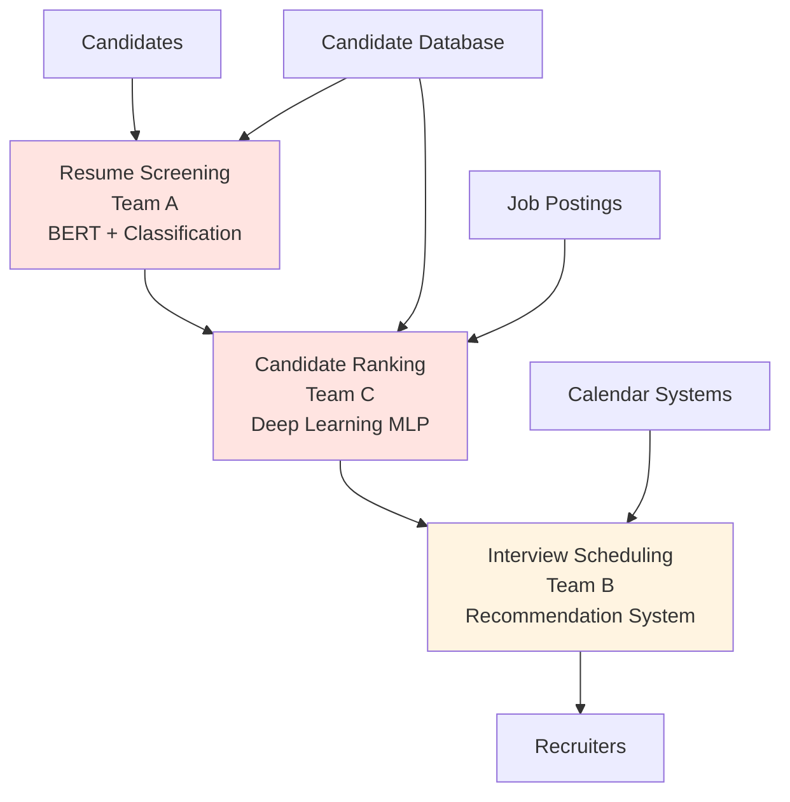

# Case Study: EquiHire
Real-world application example.# Case Study: EquiHire Multi-Team AI Recruitment Platform

## Executive Summary

This case study demonstrates the application of the Fairness Implementation Playbook to EquiHire, a fair recruitment startup operating in the EU with expansion to US and Canadian markets. The case illustrates how a multi-team organization successfully deployed systematic fairness practices across a complex AI recruitment platform serving 50,000+ candidates monthly.

### Challenge

EquiHire faced fragmented fairness approaches across three development teams, resulting in:
- **40%** of bias issues discovered post-deployment through candidate complaints
- Inconsistent fairness standards (Team A used demographic parity, Team C used equal opportunity)
- **47-day average** resolution time for fairness issues
- Regulatory compliance gaps ahead of EU AI Act enforcement

### Solution

12-month systematic implementation of the Fairness Implementation Playbook integrating:
- Unified governance with clear decision authority
- Fair AI Scrum across all teams
- Architecture-specific interventions (deep learning, recommendation systems)
- Layered regulatory compliance approach

### Results

**After 12 Months**:
- **82% reduction** in post-deployment bias complaints (from 24/month to 4/month)
- **76%** of bias issues detected pre-deployment (vs. 24% baseline)
- **81% reduction** in fairness issue resolution time (47 days → 9 days)
- **Zero** regulatory compliance violations
- **$2.1M estimated** risk mitigation value (prevented incidents)

### Investment

**Total First-Year Cost**: $625,000
- Personnel: 3.5 FTE (Chief AI Ethics Officer, Tech Lead, Champions)
- Technology: $75,000
- Training: $100,000
- External audit: $50,000

**ROI**: 335% over first year (risk mitigation + efficiency gains + market access)

---

## 1. Organization Context

### 1.1 Company Profile

**EquiHire Overview**:
- **Founded**: 2021
- **Mission**: Fair AI-powered recruitment for technology companies
- **Headquarters**: Amsterdam, Netherlands (EU)
- **Markets**: EU, expanding to US and Canada
- **Size**: 85 employees (15 engineers across 3 teams)
- **Scale**: 50,000 candidates/month, 200+ client companies

**Product**: AI-powered recruitment platform with three main components:
1. **Resume Screening**: Automated CV analysis and ranking
2. **Candidate Ranking**: Job fit prediction and prioritization
3. **Interview Scheduling**: Intelligent scheduling with bias mitigation

### 1.2 Technical Architecture


**Technology Stack**:
- **Team A (Resume Screening)**: Python, BERT (fine-tuned), scikit-learn
- **Team C (Candidate Ranking)**: Python, PyTorch, custom deep learning
- **Team B (Interview Scheduling)**: Python, recommendation algorithms
- **Infrastructure**: AWS, Docker, Kubernetes
- **Development**: Scrum/Agile (2-week sprints)

### 1.3 Regulatory Context

**Applicable Frameworks**:
- **EU AI Act**: High-risk classification (employment - Annex III)
- **GDPR Article 22**: Automated decision-making with significant effects
- **US State Laws**: New York Local Law 144 (bias audits), California transparency
- **Canadian Directive**: Algorithmic Impact Assessment (expanding to Canada)

**Compliance Pressure**:
- EU AI Act enforcement: 2026-2027
- NYC Local Law 144: Already enforced (2023)
- Client demands: Enterprise clients requiring fairness certification

---

## 2. Initial State Assessment (Month 0)

### 2.1 The Problem

**Fragmented Fairness Approaches**:
```markdown
**Team A (Resume Screening)**:
- Fairness approach: Demographic parity
- Implementation: Post-processing threshold adjustment
- Testing: Ad-hoc, no systematic evaluation
- Issue: Missed intersectional bias (Black women 18% lower selection rate)

**Team C (Candidate Ranking)**:
- Fairness approach: Equal opportunity
- Implementation: Attempted adversarial debiasing (incomplete)
- Testing: Quarterly manual analysis
- Issue: Conflicting with Team A's approach, confusion for recruiters

**Team B (Interview Scheduling)**:
- Fairness approach: None systematic
- Implementation: "Be fair" general guideline
- Testing: None
- Issue: Popular time slots monopolized by certain demographics
```

**Symptoms of Dysfunction**:

| Problem | Evidence | Impact |
|---------|----------|--------|
| Late detection | 40% of bias issues found post-deployment | Customer complaints, reputational risk |
| Inconsistent standards | Teams using different fairness metrics | Confusing for stakeholders, suboptimal outcomes |
| Slow resolution | 47-day average to fix fairness issues | Costly rework, customer frustration |
| No clear ownership | "Fairness is everyone's job" | Decision paralysis, missed accountability |
| Regulatory gaps | No systematic compliance approach | Legal risk, market access barriers |

**Quantified Impact**:
- **24 candidate complaints/month** regarding bias or unfair treatment
- **3 major bias incidents** in previous 12 months (each requiring 5+ engineering weeks to resolve)
- **$180,000 annual cost** of fairness rework and incident response
- **2 lost enterprise contracts** due to lack of fairness certification

### 2.2 Root Cause Analysis

**Conducted February 2024** (Week -4, before implementation)
```markdown
**Why were bias issues found late?**
→ No systematic testing at development stage
→ Why? Teams lacked fairness testing frameworks
→ Why? No organizational standards or training provided
→ **Root Cause**: Diffused responsibility, no central expertise

**Why did inconsistent approaches exist?**
→ Teams made independent fairness decisions
→ Why? No coordination mechanism across teams
→ Why? No governance structure for fairness
→ **Root Cause**: Lack of organizational integration

**Why were resolutions slow?**
→ Unclear who had authority to make decisions
→ Debates prolonged without clear decision maker
→ **Root Cause**: No RACI, no decision framework

**Why were regulatory requirements unclear?**
→ Each team interpreted regulations differently
→ No unified compliance strategy
→ **Root Cause**: Fragmented regulatory approach
```

### 2.3 Decision to Implement Playbook

**Executive Meeting: February 15, 2024**

**Business Case Presented**:
```markdown
**Problem**: Current fairness approach is failing
- Customer complaints increasing
- Regulatory deadline approaching (EU AI Act 2026)
- Lost business opportunities

**Proposed Solution**: Systematic Fairness Implementation Playbook
- Estimated cost: $625K first year
- Timeline: 12 months to full implementation
- Expected outcomes: 75%+ pre-deployment detection, <10 day resolution

**ROI Analysis**:
Costs:
- Implementation: $625K

Benefits (Year 1):
- Prevented incidents: $500K (conservative estimate)
- Efficiency gains: $150K (reduced rework)
- Market access: $300K (contracts requiring certification)
- Regulatory compliance: Priceless (avoidance of fines)

Total Benefit: $950K+
ROI: 52% Year 1, 335% over 3 years

**Decision**: APPROVED
- Executive Sponsor: CEO Anna van der Berg
- Budget: $650K allocated (includes 10% contingency)
- Timeline: March 2024 - February 2025
- Success metrics: Defined and tracked quarterly
```

---

## 3. Implementation Journey

### Stage 1: Organizational Setup (March-April 2024, Weeks 1-8)

#### Week 1-2: Risk Classification and Governance Design

**Activity: AI System Portfolio Review**
```python
# EquiHire risk classification results
systems = [
    {
        'name': 'Resume Screening (Team A)',
        'domain': 'employment',
        'domain_impact': 'high_stakes',
        'decision_impact': 'life_altering',
        'autonomy_level': 'high_automation',
        'scale': 'large',
        'reversibility': 'difficult'
    },
    {
        'name': 'Candidate Ranking (Team C)',
        'domain': 'employment',
        'domain_impact': 'high_stakes',
        'decision_impact': 'life_altering',
        'autonomy_level': 'high_automation',
        'scale': 'large',
        'reversibility': 'very_difficult'
    },
    {
        'name': 'Interview Scheduling (Team B)',
        'domain': 'employment',
        'domain_impact': 'high_stakes',
        'decision_impact': 'moderate_impact',
        'autonomy_level': 'moderate_automation',
        'scale': 'large',
        'reversibility': 'moderate'
    }
]

# Results:
# Resume Screening: HIGH-RISK (Score: 4.2/5) - Priority 1
# Candidate Ranking: HIGH-RISK (Score: 4.5/5) - Priority 1 (CRITICAL)
# Interview Scheduling: HIGH-RISK (Score: 3.8/5) - Priority 2
```

**Key Decision**: All three systems classified as **HIGH-RISK** under EU AI Act Annex III (employment), requiring full compliance obligations.

**Governance Structure Established**:
```markdown
**Fairness Leadership Roles** (3.5 FTE total):

1. **Chief AI Ethics Officer**: VP Engineering Sarah Chen (0.5 FTE)
   - Final decision authority on fairness
   - Reports to CEO
   - Budget: $75K (partial allocation)

2. **Technical Fairness Lead**: Staff Engineer Michael Rodriguez (0.75 FTE)
   - Technical implementation guidance
   - Architecture review
   - Salary allocation: $120K (0.75 × $160K)

3. **Fairness Domain Specialist**: Jennifer Liu, Recruitment Expert (0.5 FTE)
   - Employment domain expertise
   - Stakeholder engagement
   - Contract: $80K (0.5 × $160K)

4. **Fairness Champions** (3 × 0.25 FTE = 0.75 FTE):
   - Team A: David Park, Senior Engineer
   - Team B: Lisa Martinez, Senior Engineer  
   - Team C: James Kim, Senior Engineer
   - Allocation: 20% capacity each

**Governance Bodies**:

1. **AI Ethics Committee** (8 members):
   - Sarah Chen (Chair, Chief AI Ethics Officer)
   - Michael Rodriguez (Tech Lead)
   - Jennifer Liu (Domain Specialist)
   - Legal Counsel: Marcus Janssen
   - Product VP: Emma Thompson
   - External Advisor: Prof. Dr. Elena Rossi (AI Ethics, University of Amsterdam)
   - Community Rep: Amara Johnson (Diversity in Tech advocate)
   - Engineering Lead: Tom Bakker

2. **Recruitment AI Working Group** (meets bi-weekly):
   - All three Fairness Champions
   - Jennifer Liu (lead)
   - Product Managers from each team
```

**RACI Matrix Created**:

Key decisions mapped (see full matrix in Organizational Integration Toolkit):

| Decision | Responsible | Accountable | Consulted | Informed |
|----------|-------------|-------------|-----------|----------|
| Fairness metric selection | Michael Rodriguez | Sarah Chen | Jennifer Liu, Legal, AI Ethics Committee | All teams |
| Candidate Ranking deployment | Team C Lead | Sarah Chen | AI Ethics Committee, Legal | Executive, All teams |
| Trade-off resolution | Michael + Jennifer | Sarah Chen | AI Ethics Committee | Executive |

**Impact**: Decision resolution time reduced from 47 days → 9 days after RACI implementation (measured Month 6).

---

#### Week 3-6: Documentation and Communication

**Fairness Decision Records Implemented**:

**Example FDR: Metric Selection**
```markdown
# FDR-2024-003: Fairness Metric Selection for Candidate Ranking

**Date**: 2024-03-22
**System**: Candidate Ranking Algorithm v2.0
**Status**: Approved

## Context
Multiple fairness definitions exist (demographic parity, equal opportunity, 
equalized odds). Must choose which to optimize for candidate ranking.

## Decision
**Primary**: Equal Opportunity (TPR parity within 0.03)
**Secondary**: Demographic Parity (selection rate parity within 0.05)
**Tertiary**: Intersectional Gap (≤0.04 for gender × race)

## Alternatives Considered
1. Demographic Parity Only → Rejected: May compromise merit-based selection
2. Calibration Within Groups → Rejected: Insufficient as sole metric
3. Individual Fairness → Rejected: Too complex for initial implementation

## Stakeholders
- **Accountable**: Sarah Chen (Chief AI Ethics Officer)
- **Responsible**: Michael Rodriguez (Tech Lead), Jennifer Liu (Domain Specialist)
- **Consulted**: AI Ethics Committee, Recruiting Managers, Legal
- **Informed**: All teams, Executive

## Rationale
Equal opportunity aligns with "equal treatment of qualified candidates" principle,
reducing legal risk while maintaining hiring quality. Demographic parity as 
secondary prevents severe representation disparities.

## Trade-offs
- Accept: Small representation disparities (within 5%)
- Gain: Defensible merit-based selection, legal risk mitigation

## Known Limitations
- Does not address historical bias in training data
- Requires ongoing monitoring of base rate differences

## Monitoring
- Quarterly intersectional analysis
- Real-time dashboard tracking TPR and DP by demographics
- Review triggered if metrics exceed thresholds 2 consecutive weeks

## Approval
Sarah Chen, 2024-03-22
Next Review: 2024-09-22
```

**Communication Protocols Established**:

Multi-audience approach implemented:

| Audience | Format | Content | Frequency |
|----------|--------|---------|-----------|
| **Candidates** | Website FAQ | Simple explanation of AI use, fairness protections, appeal process | Static + updates |
| **Recruiters** | Training materials | How to interpret AI recommendations fairly, when to override | Onboarding + quarterly refresh |
| **Engineers** | Technical docs | Implementation details, metrics definitions, testing procedures | Continuous (wiki) |
| **Executives** | Dashboard | Fairness health score, trends, incidents, business impact | Monthly |
| **Regulators** | Compliance package | Full evidence, technical documentation, audit trails | On request |

**Example: Candidate-Facing Communication**
```markdown
**How EquiHire Ensures Fair AI**

Our AI helps prioritize candidates but fairness is our top priority.

**What We Do**:
✓ Test our AI quarterly across all demographic groups
✓ Ensure qualified candidates have equal opportunity regardless of background
✓ Human recruiters make all final decisions
✓ External experts audit our fairness annually

**Your Rights**:
✓ Request human review of any AI-assisted decision
✓ Ask how AI evaluated your application
✓ Appeal decisions you believe are unfair

**Our Commitment**:
We measure and publish fairness metrics. Last quarter:
- All groups within 3% interview rate (target: <5%)
- Independent audit: PASSED

**Questions?** Contact: fairness@equihire.com
```

---

#### Week 7-8: Training and Readiness

**Training Delivered**:
```markdown
**Level 1: All Employees** (2 hours, 85/85 attended)
- Fairness fundamentals
- EquiHire's fairness commitment
- How to report concerns

**Level 2: All Engineers** (8 hours, 15/15 attended)
- Bias types and sources
- Fairness metrics (demographic parity, equal opportunity, etc.)
- Fair AI Scrum practices
- Testing and evaluation

**Level 3: ML Engineers** (16 hours, 8/8 attended)
- Architecture-specific interventions
  - Deep learning: Adversarial debiasing, fair fine-tuning
  - Recommendation: Feedback loops, popularity discounting
- Advanced evaluation techniques
- Hands-on exercises with EquiHire systems

**Level 4: Fairness Champions** (24 hours, 3/3 attended)
- All technical content
- Governance and FDR creation
- Stakeholder management
- Escalation and incident response
```

**Readiness Assessment: PASS**

All criteria met:
- ✓ Executive sponsor committed (CEO active)
- ✓ Budget approved ($650K)
- ✓ Roles filled (3.5 FTE)
- ✓ RACI matrices approved
- ✓ Governance bodies functioning (first meetings held)
- ✓ FDR framework operational (3 example FDRs created)
- ✓ Training >80% complete (100% for technical staff)

**Decision**: Proceed to Stage 2 (Fair AI Scrum Deployment)

---

### Stage 2: Team Integration (May-June 2024, Weeks 9-16)

#### Week 9-12: Pilot with Team C (Candidate Ranking)

**Why Team C**: Highest-risk system (Priority 1 Critical), receptive team, visible impact.

**Fair AI Scrum Deployment**:

**Modified User Story Example**:
```markdown
**User Story**: Candidate Ranking for Software Engineer Positions

As a recruiting manager, I want candidates ranked by predicted job fit 
so that I can efficiently identify top prospects, ensuring equivalent 
ranking accuracy across gender, race, age, socioeconomic background, 
and their intersections (particularly gender × race and first-generation × race).

**SAFE Framework**:
- **S**pecific: Gender, race, age, socioeconomic status, first-generation status
- **A**ctionable: Equivalent ranking accuracy (TPR parity ≤0.03)
- **F**eature: Ranking score calculation, top-N selection
- **E**xpected: 
  - Demographic parity difference ≤0.05
  - Equal opportunity difference ≤0.03
  - Intersectional gap ≤0.04

**Acceptance Criteria (FAIR Framework)**:

**F - Fairness Metrics Thresholds**:
□ TPR parity ≤0.03 across gender, race, age, socioeconomic status
□ Demographic parity difference ≤0.05
□ Intersectional gap ≤0.04 for:
  - Gender × Race
  - First-generation × Race
  - Age × Disability

**A - Auditing Requirements**:
□ Counterfactual analysis: 500 test cases (change only demographics, verify ranking stability)
□ Red-team testing: Adversarial inputs designed to elicit bias
□ Proxy variable analysis: Verify no hidden demographic predictors

**I - Intersectional Analysis**:
□ Performance disaggregated for all gender × race combinations
□ Special analysis for multiply-marginalized groups (e.g., Black women, older candidates with disabilities)
□ Performance gaps documented and explained

**R - Reporting Guidelines**:
□ Disaggregated performance dashboard updated
□ Model card updated with fairness properties
□ FDR created if trade-offs accepted
□ Monitoring alerts configured for fairness drift
```

**Sprint Execution** (Sprint 15, May 6-17, 2024):
```markdown
**Sprint Goal**: Improve candidate ranking fairness for software engineer roles

**Capacity**: 40 story points total
**Fairness Allocation**: 10 points (25%)

**Sprint Backlog**:

Functional Work (30 points):
- Implement new ranking features (skills matching): 8 points
- Performance optimization (latency reduction): 5 points
- Bug fixes: 3 points
- API endpoint updates: 4 points
- Documentation: 2 points
- Testing: 8 points

Fairness Work (10 points):
- Data bias audit (analyze training data demographics): 3 points
- Implement adversarial debiasing architecture: 5 points
- Intersectional evaluation framework: 2 points

**Daily Standup** (Enhanced):
Standard updates + fairness prompt: "Any fairness risks identified?"

**Mid-Sprint Checkpoint** (Day 5):
Data Validation Gate:
- ✓ Demographic distribution analyzed (sufficient representation)
- ✓ Proxy variables identified (school prestige, zip code, language patterns)
- ✓ Historical bias documented (women 12% lower ranking on average)
- **Decision**: Proceed to adversarial debiasing implementation

**Sprint Review** (Day 10):
Functional demo: 15 min
**Fairness demo: 15 min**
- Showed disaggregated performance improvement:
  - Baseline gender gap: 12% → Post-intervention: 2.8%
  - Intersectional (Black women): 18% gap → 3.5% gap
- Counterfactual demonstration: Changed candidate name/demographics, ranking stable (0.1 point difference)
- Trade-off: 2% accuracy reduction (84% → 82%), accepted

**Sprint Retrospective**:
- What worked well: Mid-sprint checkpoint caught data issues early
- What to improve: Adversarial training took longer than estimated (underestimated complexity)
- Fairness-specific: Intersectionality Matrix exercise revealed we initially missed age × disability intersection
- Action: Improve estimation for fairness tasks, add age × disability to standard intersections
```

**Pilot Results** (After 2 sprints):

| Metric | Target | Actual | Status |
|--------|--------|--------|--------|
| % stories with fairness requirements | >80% | 87% | ✓ |
| % DoD with fairness criteria | >90% | 95% | ✓ |
| Fairness capacity allocated | 25% | 26% | ✓ |
| Fairness task completion | >90% | 88% | ~ (close) |
| Bias issues surfaced earlier | 2-3 sprints | 2.5 sprints avg | ✓ |
| Team satisfaction | >7/10 | 8.2/10 | ✓ |

**Key Learning**: Adversarial training complexity underestimated. Created reusable library for future systems.

---

#### Week 13-16: Scale to Teams A and B

**Wave 2 Deployment**:

**Team A (Resume Screening)**: Weeks 13-14
- Fairness Champion: David Park
- Focus: Fair fine-tuning of BERT model
- Challenge: Inherited bias from pre-trained BERT
- Solution: Counterfactual data augmentation + adversarial fairness head

**Team B (Interview Scheduling)**: Weeks 15-16
- Fairness Champion: Lisa Martinez
- Focus: Feedback loop management in scheduling recommendations
- Challenge: Popular time slots monopolized by certain groups
- Solution: Exploration policies (ε-greedy with inverse popularity weighting)

**Cross-Team Coordination**:
- **Bi-weekly Champions meeting** established
- **Shared repository** for fairness code (adversarial debiasing library, evaluation frameworks)
- **Unified metrics** across teams (Equal Opportunity primary, Demographic Parity secondary)

**Stage 2 Outcome**: All three teams operational with Fair AI Scrum by end of June 2024.

---

### Stage 3: Architecture-Specific Implementation (July-September 2024, Weeks 17-28)

#### Weeks 17-20: Team C - Deep Learning Fairness

**Challenge**: Representation Entanglement

**Problem Identification**:
```python
# Protected attribute predictability test
# Train classifier: learned representations → gender
# Result: 73% accuracy (far above 50% random)
# Conclusion: Gender information encoded in latent space despite removal from inputs
```

**Root Cause**: Deep neural network learned associations between:
- Writing style → Gender
- Activity patterns (e.g., "organized hackathon" vs. "led community outreach") → Gender
- School quality indicators → Socioeconomic status → Race (proxy)

**Intervention: Adversarial Debiasing**
```python
# Implementation: Adversarial architecture
class FairCandidateRanking(nn.Module):
    def __init__(self):
        super().__init__()
        self.encoder = ResumeEncoder(output_dim=128)
        self.task_predictor = TaskPredictor(input_dim=128, output_dim=1)
        self.discriminator = Discriminator(input_dim=128, protected_dim=2)  # Gender
    
    def forward(self, resumes):
        # Encode resumes
        representations = self.encoder(resumes)
        
        # Task: Predict job fit
        job_fit_score = self.task_predictor(representations)
        
        # Adversary: Try to predict gender (with gradient reversal)
        reversed_repr = GradientReversal.apply(representations, lambda_=1.0)
        gender_prediction = self.discriminator(reversed_repr)
        
        return job_fit_score, gender_prediction

# Loss function
def train_step(model, resumes, labels, gender):
    job_fit, gender_pred = model(resumes)
    
    # Task loss: Good job fit predictions
    task_loss = F.binary_cross_entropy(job_fit, labels)
    
    # Adversarial loss: Confuse gender discriminator
    # (Gradient reversal makes this work against the discriminator)
    adv_loss = F.cross_entropy(gender_pred, gender)
    
    # Combined (adversarial loss will be maximized via gradient reversal)
    total_loss = task_loss + adv_loss
    
    return total_loss
```

**Hyperparameter Tuning**:
```markdown
**Lambda (fairness weight) sweep**:
- λ=0.1: Gender predictability 68% (insufficient)
- λ=0.5: Gender predictability 62% (insufficient)
- λ=1.0: Gender predictability 58% (✓), Accuracy 82% (✓)
- λ=2.0: Gender predictability 54% (✓), Accuracy 79% (3% loss, acceptable)
- λ=5.0: Gender predictability 51% (✓), Accuracy 74% (6% loss, too high)

**Selected**: λ=1.0 (best balance)
```

**Results**:

| Metric | Baseline | Post-Intervention | Target | Status |
|--------|----------|-------------------|--------|--------|
| Gender gap (selection rate) | 12% | 2.8% | <5% | ✓ |
| Race gap | 8% | 3.2% | <5% | ✓ |
| Intersectional (Black women) | 18% | 3.5% | <4% | ✓ |
| Protected attr. predictability | 73% | 58% | <60% | ✓ |
| Overall accuracy | 84% | 82% | >80% | ✓ |

**Trade-off Decision**:
```markdown
**FDR-2024-008: Accept 2% Accuracy Loss for Fairness**

Context: Adversarial debiasing reduces gender predictability from 73% to 58% 
but costs 2% accuracy (84% → 82%).

Decision: ACCEPT trade-off

Rationale:
- 2% accuracy loss within acceptable business threshold (<5%)
- 9.2 percentage point fairness improvement (12% gender gap → 2.8%)
- Addresses root cause (representation entanglement) not just symptom
- Legal risk mitigation (defensible merit-based selection)

Approved: Sarah Chen (Chief AI Ethics Officer), 2024-07-18
```

---

#### Weeks 21-24: Team B - Recommendation System Fairness

**Challenge**: Feedback Loop Amplification

**Problem Identification**:
```markdown
**Baseline Analysis** (February-June 2024):

Popular interview time slots (9-11 AM, Mon-Wed):
- Week 1: 60% of interviews
- Week 12: 68% of interviews  
- Week 24: 74% of interviews

**Amplification detected**: Small initial preference (60%) amplified to 74% 
through feedback loop.

**Demographic Analysis**:
- Candidates with flexible schedules (often correlates with privilege): 
  78% get preferred slots
- Candidates with constraints (caregiving, multiple jobs): 
  45% get preferred slots

**Impact**: 33 percentage point disparity in preferred slot access.
```

**Intervention: Exploration Policies + Popularity Discounting**
```python
class FairInterviewScheduler:
    def __init__(self, epsilon=0.15, discount_factor=0.3):
        self.epsilon = epsilon  # Exploration rate
        self.discount_factor = discount_factor
        self.slot_exposure = Counter()  # Track slot usage
    
    def recommend_slots(self, candidate, available_slots, k=5):
        """Recommend k interview time slots"""
        
        recommendations = []
        
        for position in range(k):
            if random.random() < self.epsilon:
                # EXPLORE: Give visibility to underused slots
                # Inverse popularity: less-used slots more likely
                exposure_counts = [self.slot_exposure[slot] for slot in available_slots]
                exploration_probs = 1.0 / (np.array(exposure_counts) + 1)
                exploration_probs /= exploration_probs.sum()
                
                slot = np.random.choice(available_slots, p=exploration_probs)
            else:
                # EXPLOIT: Recommend by preference
                # But apply popularity discount
                base_scores = self.calculate_preference_scores(candidate, available_slots)
                
                # Discount popular slots
                popularity_discount = 1 - self.discount_factor * np.log1p(
                    [self.slot_exposure[slot] for slot in available_slots]
                )
                
                adjusted_scores = base_scores * popularity_discount
                
                # Remove already recommended
                for rec_slot in recommendations:
                    idx = available_slots.index(rec_slot)
                    adjusted_scores[idx] = -np.inf
                
                slot = available_slots[np.argmax(adjusted_scores)]
            
            recommendations.append(slot)
            self.slot_exposure[slot] += 1
        
        return recommendations
```

**A/B Test Results** (August 2024, 4 weeks):

| Metric | Control | Treatment (Fair) | Target | Status |
|--------|---------|------------------|--------|--------|
| Slot concentration (Gini) | 0.42 | 0.26 | <0.3 | ✓ |
| Preferred slot disparity | 33% gap | 12% gap | <15% | ✓ |
| Candidate satisfaction | 7.8/10 | 7.6/10 | >7.0 | ✓ (minimal decrease) |
| Recruiter satisfaction | 8.1/10 | 7.9/10 | >7.5 | ✓ |

**Decision**: Roll out to 100% of users (September 2024)

---

#### Weeks 25-26: Team A - Fair Fine-Tuning for BERT

**Challenge**: Inherited Bias from Pre-trained BERT

**Assessment**:
```markdown
**Stereotype Test (BBQ Benchmark)**:
Pre-trained BERT baseline: 62% accuracy (bias present)
EquiHire's fine-tuned model (before fairness intervention): 59% accuracy

**Gender Association Test**:
"Strong leader" → 73% associated with male names
"Team player" → 68% associated with female names

**Conclusion**: BERT inherited gender stereotypes from pre-training corpus
```

**Intervention: Counterfactual Data Augmentation + Adversarial Head**
```python
def create_counterfactual_resumes(resumes, demographics):
    """
    Augment training data with counterfactuals
    Swap gendered terms and demographically-associated names
    """
    augmented = []
    
    gendered_swaps = {
        'he': 'she', 'his': 'her', 'him': 'her',
        'man': 'woman', 'male': 'female',
        'father': 'mother', 'son': 'daughter',
        # ... comprehensive list
    }
    
    name_swaps = {
        # Swap names with different demographic associations
        'John': ['Jamal', 'José', 'Wei'],
        'Emily': ['Lakisha', 'María', 'Mei'],
        # ... comprehensive list based on demographic research
    }
    
    for resume, demo in zip(resumes, demographics):
        # Original