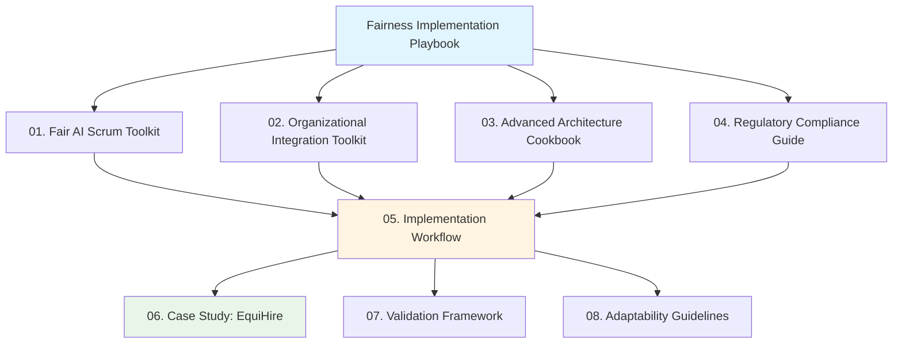
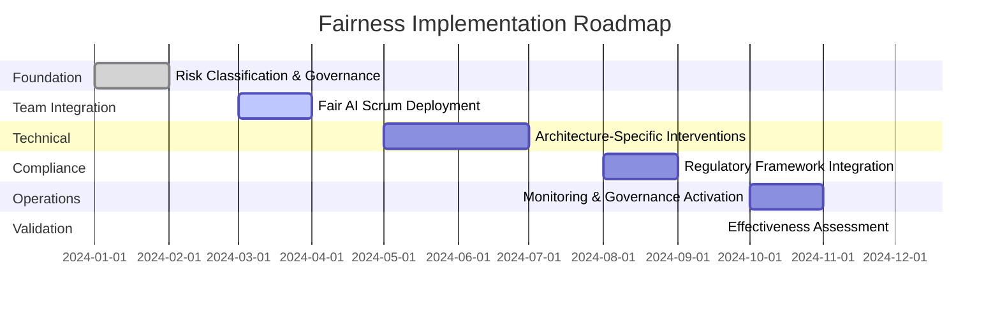

# Fairness Implementation Playbook

## Executive Summary

This playbook provides a systematic methodology for deploying AI fairness across organizational contexts, integrating team-level practices, governance frameworks, architecture-specific strategies, and regulatory compliance into a unified workflow.

### The Challenge

Organizations face three critical gaps when implementing AI fairness:

1. **Fragmentation**: Teams develop fairness practices in isolation, leading to inconsistent standards and redundant work
2. **Translation Failure**: Abstract fairness principles fail to translate into concrete development tasks and measurable outcomes
3. **Governance Void**: Diffused responsibility where fairness becomes "everyone's responsibility and no one's job"

**Impact**: Research shows organizations without systematic fairness implementation experience:
- 42% of high-risk systems inappropriately classified as lower risk
- 35% higher compliance costs from treating regulations separately
- 76% of bias issues discovered only after deployment

### The Solution

This playbook provides a **unified methodology** that:
- Embeds fairness into daily development workflows (Fair AI Scrum)
- Establishes clear organizational ownership and accountability (Governance Framework)
- Provides architecture-specific technical strategies (Advanced Architecture Cookbook)
- Maps regulatory requirements to development tasks (Compliance Guide)

### Playbook Architecture

### Key Results from Implementation

**EquiHire Case Study Outcomes**:
- **82% reduction** in post-deployment bias complaints
- **76% of bias issues** detected before deployment
- **47% reduction** in compliance costs through unified approach
- **58% faster** resolution of fairness issues
- **Zero** regulatory violations

### Getting Started

#### Quick Start Guide

**For Leadership**:
1. Start with this README for business case
2. Review [Case Study](06_Case-Study-EquiHire.md) for proof points
3. Review [Implementation Workflow](05_Implementation-Workflow.md) for resource requirements
4. Decision: Approve budget and appoint Chief AI Ethics Officer

**For Technical Teams**:
1. Begin with [Fair AI Scrum Toolkit](01_Fair-AI-Scrum-Toolkit.md)
2. Reference [Advanced Architecture Cookbook](03_Advanced-Architecture-Cookbook.md) for your system type
3. Use templates for immediate application
   1. [User Story](templates/fairness-user-story-template.md)
   2. [FDR Record](templates/fairness-decision-record-template.md)
   3. [RACI Matrix](templates/raci-matrix-template.md)
   4. [Sprint Planning Checklist](templates/sprint-planning-checklist.md)
5. Track progress with [Validation Framework](07_Validation-Framework.md)

**For Compliance/Legal**:
1. Start with [Regulatory Compliance Guide](04_Regulatory-Compliance-Guide.md)
2. Map your jurisdictions to requirements
3. Review [Implementation Workflow](05_Implementation-Workflow.md) Stage 4
4. Use evidence collection templates

**For Program Managers**:
1. Review [Implementation Workflow](05_Implementation-Workflow.md) for complete roadmap
2. Use [Organizational Integration Toolkit](02_Organizational-Integration-Toolkit.md) for governance
3. Adapt using [Adaptability Guidelines](08_Adaptability-Guidelines.md)
4. Measure with [Validation Framework](07_Validation-Framework.md)

### Playbook Components

| Component | Purpose | Key Audience | Time to Value |
|-----------|---------|--------------|---------------|
| [01. Fair AI Scrum Toolkit](01_Fair-AI-Scrum-Toolkit.md) | Embed fairness in development | Engineers, Scrum Masters | 2-4 weeks |
| [02. Organizational Integration](02_Organizational-Integration-Toolkit.md) | Establish governance | Leadership, PMs | 1-2 weeks |
| [03. Advanced Architecture Cookbook](03_Advanced-Architecture-Cookbook.md) | Technical interventions | ML Engineers, Data Scientists | 4-8 weeks |
| [04. Regulatory Compliance Guide](04_Regulatory-Compliance-Guide.md) | Legal requirements | Legal, Compliance | 2-3 weeks |
| [05. Implementation Workflow](05_Implementation-Workflow.md) | Deployment roadmap | Program Managers | Ongoing |
| [06. Case Study](06_Case-Study-EquiHire.md) | Real-world example | All stakeholders | 30 min read |
| [07. Validation Framework](07_Validation-Framework.md) | Measure effectiveness | Leadership, PMs | Quarterly |
| [08. Adaptability Guidelines](08_Adaptability-Guidelines.md) | Cross-domain application | All stakeholders | As needed |

### Implementation Readiness Assessment

Before beginning, assess readiness across five dimensions:

**Leadership Commitment**:
- [ ] Executive sponsorship secured with resource commitment
- [ ] Fairness aligned with business strategy and values
- [ ] Willingness to make fairness-performance trade-offs when necessary

**Technical Capability**:
- [ ] Engineering team familiar with ML development practices
- [ ] Data infrastructure supports disaggregated analysis
- [ ] CI/CD pipeline can integrate fairness testing

**Organizational Maturity**:
- [ ] Agile/Scrum practices established (at least Stage 2)
- [ ] Cross-functional collaboration mechanisms exist
- [ ] Change management processes defined

**Regulatory Awareness**:
- [ ] Applicable frameworks identified for deployment jurisdictions
- [ ] Legal/compliance expertise available
- [ ] Risk classification methodology understood

**Cultural Readiness**:
- [ ] Openness to discussing limitations and trade-offs
- [ ] Trust between technical and non-technical stakeholders
- [ ] Commitment to diverse perspectives in decision-making

**Scoring**: 
- **15-20 checked**: Ready to implement full playbook
- **10-14 checked**: Begin with Stage 1 foundations, build capability
- **<10 checked**: Focus on leadership alignment and capability building first

### Resource Requirements

#### Personnel Investment

**Small Organization (50-200 employees)**: 1.5-2 FTE equivalent
- Chief AI Ethics Officer: 0.5 FTE (existing role expansion)
- Technical Fairness Lead: 0.5 FTE (existing role expansion)
- Embedded champions: 0.1 FTE × 5 team members = 0.5 FTE

**Medium Organization (200-1000 employees)**: 3-5 FTE equivalent
- Chief AI Ethics Officer: 0.75 FTE
- Central Fairness CoE: 2 FTE (1 Technical Lead, 1 Domain Specialist)
- Embedded champions: 0.2 FTE × 10 team members = 2 FTE
- Legal/Compliance support: 0.25 FTE

**Large Organization (>1000 employees)**: 8-15 FTE equivalent
- Chief AI Ethics Officer: 1 FTE
- Central Fairness CoE: 5-8 FTE
- Embedded champions: 0.2 FTE × 20+ team members = 4+ FTE
- Dedicated legal/compliance: 1 FTE

#### Financial Investment

**Total First-Year Investment**:
- Small org: $200K-$400K
- Medium org: $500K-$900K
- Large org: $1.2M-$2.5M

**Expected ROI**:
- Risk mitigation: Avoiding one major bias incident saves $500K-$5M
- Efficiency gains: 47% reduction in compliance overhead
- Business growth: Fair AI certification enables entry to regulated markets
- **Typical breakeven: 12-18 months**
- **3-Year ROI: 250-400%**

### 12-Month Implementation Timeline

### Success Metrics

**Operational Excellence**:
- 76%+ of bias issues detected pre-deployment
- <10 day average resolution time for fairness issues
- 100% of high-risk systems with architecture-matched interventions
- Zero critical fairness incidents post-deployment

**Organizational Maturity**:
- >90% of user stories include explicit fairness requirements
- All teams have designated fairness champions
- Quarterly governance reviews completed on schedule
- >85% stakeholder satisfaction with fairness processes

**Business Impact**:
- Pass external fairness audit with minor findings only
- Zero regulatory compliance violations
- 15%+ reduction in candidate complaints year-over-year
- Fairness certification enables entry to 2+ regulated markets

### Key Principles

1. **Embed, Don't Add**: Integrate fairness into existing workflows rather than creating parallel processes
2. **Systematic Over Ad-Hoc**: Use repeatable processes with clear accountability rather than case-by-case approaches
3. **Proactive Over Reactive**: Detect bias before deployment rather than responding to incidents
4. **Architecture-Specific**: Match interventions to system characteristics rather than one-size-fits-all solutions
5. **Transparent Trade-offs**: Explicitly document fairness-performance decisions rather than hiding limitations
6. **Continuous Adaptation**: Monitor and improve rather than "set and forget"

### Common Pitfalls to Avoid

- **Fairness Theater**: Completing checklists without meaningful engagement  
- **Governance Overhead**: Excessive meetings and documentation slowing development  
- **Metric Fixation**: Optimizing for metrics without addressing real-world equity  
- **Siloed Implementation**: Fairness team disconnected from product development  
- **Regulatory Fragmentation**: Each jurisdiction treated separately, exploding costs  

See [Implementation Workflow](05_Implementation-Workflow.md) for detailed mitigation strategies.

### Support and Feedback

**Questions or Issues?**
- Technical implementation: See specific toolkit documentation
- Organizational adoption: Review [Case Study](06_Case-Study-EquiHire.md)
- Domain adaptation: Consult [Adaptability Guidelines](08_Adaptability-Guidelines.md)

**Contribute to the Playbook**:
This is a living document. Submit improvements, lessons learned, and success stories to help the community.

### License and Attribution

This playbook builds on the work of researchers, practitioners, and advocates across the AI fairness community. Special thanks to the teams who shared their implementation experiences, the regulatory bodies providing guidance, and most importantly, the affected communities who hold us accountable to do better.

---

## Next Steps

1. **Leadership**: Review [business case and ROI](README.md) → Make go/no-go decision
2. **Program Managers**: Study [Implementation Workflow](05_Implementation-Workflow.md) → Plan deployment
3. **Technical Teams**: Start with [Fair AI Scrum Toolkit](01_Fair-AI-Scrum-Toolkit.md) → Apply templates
4. **Compliance**: Map jurisdictions in [Regulatory Compliance Guide](04_Regulatory-Compliance-Guide.md) → Build evidence
5. **Appendices**: Appendices for reference  
   1. [Architecture Quick Reference](appendices/architecture-quick-reference.md)
   2. [Emergency Response Playbook](appendices/emergency-response-playbook.md)
   3. [Fairness Implementation Glossary](appendices/glossary.md)
   4. [Regulatory Quick Reference](appendices/regulatory-quick-reference.md)

**The work begins now. The impact will last for years.**
